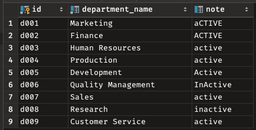
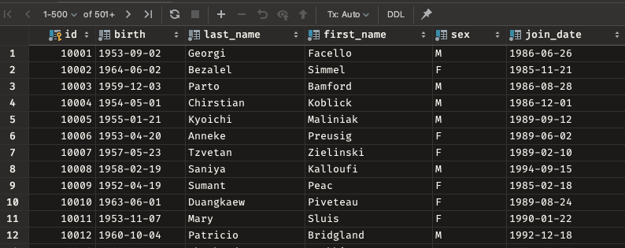
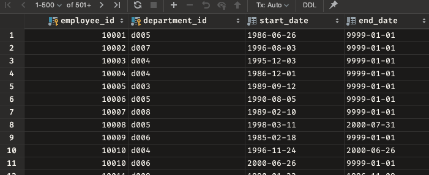
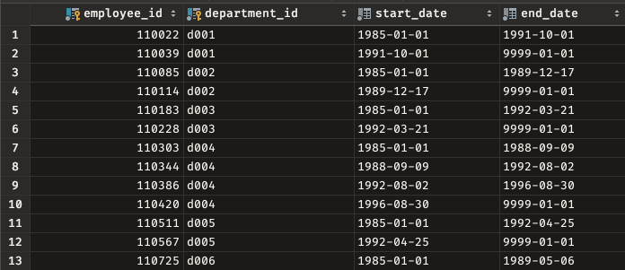
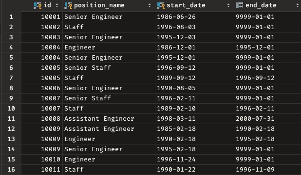
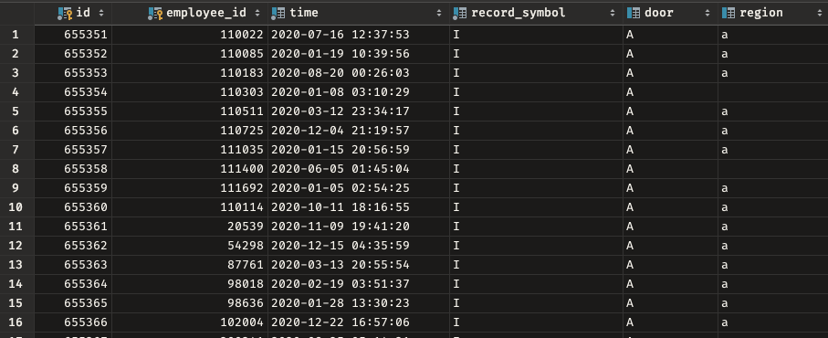
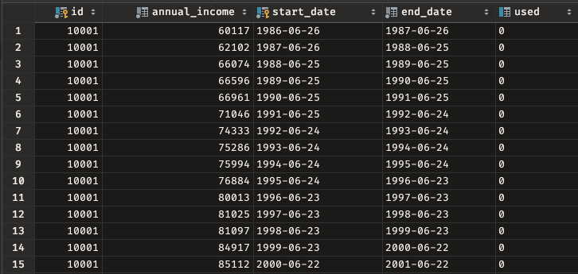

**department**

| Field           | Type    |
|:----------------|:--------|
| id              | CHAR    |
| department_name | VARCHAR |
| note            | VARCHAR |

* 전체 레코드 수 : 9

**employee**

| Field      | Type    |
|:-----------|:--------|
| id         | INT     |
| birth      | DATE    |
| first_name | VARCHAR |
| last_name  | VARCHAR |
| sex        | ENUM    |
| join_date  | DATE    |

* 전체 레코드 수 : 30만

**employee_department**

| Field         | Type |
|:--------------|:-----|
| employee_id   | INT  |
| department_id | CHAR |
| start_date    | DATE |
| end_date      | DATE |

* 전체 레코드 수 : 33만

**manager**

| Field         | Type |
|:--------------|:-----|
| employee_id   | INT  |
| department_id | CHAR |
| start_date    | DATE |
| end_date      | DATE |

* 전체 레코드 수 : 33만

**position**

| Field         | Type    |
|:--------------|:--------|
| id            | INT     |
| position_name | VARCHAR |
| start_date    | DATE    |
| end_date      | DATE    |

* 전체 레코드 수 : 44만

**record**

| Field         | Type      |
|:--------------|:----------|
| id            | INT       |
| employee_id   | INT       |
| time          | TIMESTAMP |
| record_symbol | CHAR      |
| door          | CHAR      |
| region        | CHAR      |

* 전체 레코드 수 : 66만

**salary**

| Field         | Type |
|:--------------|:-----|
| id            | INT  |
| annual_income | INT  |
| start_date    | DATE |
| end_date      | DATE |
| used          | CHAR |

* 전체 레코드 수 : 284만

