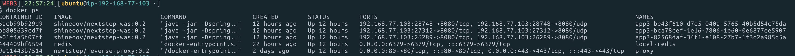
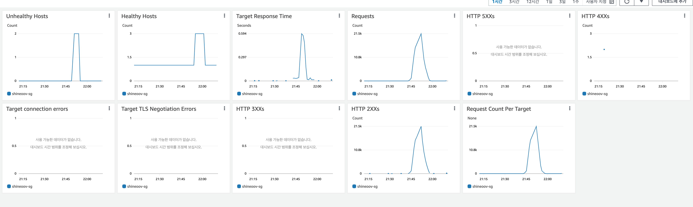

<p align="center">
    
</p>
<p align="center">
  
  
  <a href="https://edu.nextstep.camp/c/R89PYi5H" alt="nextstep atdd">
    
  </a>
  
</p>

<br>

# 인프라공방 샘플 서비스 - 지하철 노선도

<br>

## 🚀 Getting Started

### Install
#### npm 설치
```
cd frontend
npm install
```
> `frontend` 디렉토리에서 수행해야 합니다.

### Usage
#### webpack server 구동
```
npm run dev
```
#### application 구동
```
./gradlew clean build
```
<br>

## 미션

* 미션 진행 후에 아래 질문의 답을 작성하여 PR을 보내주세요.


### 1단계 - 화면 응답 개선하기
1. 성능 개선 결과를 공유해주세요 (Smoke, Load, Stress 테스트 결과)

#### Smoke Test

**데이터를 조회하는데 여러 데이터를 참조하는 페이지 - ( 경로검색 )**  

```
$ k6 run --out influxdb=http://localhost:8086/myk6db smoke_path.js

          /\      |‾‾| /‾‾/   /‾‾/
     /\  /  \     |  |/  /   /  /
    /  \/    \    |     (   /   ‾‾\
   /          \   |  |\  \ |  (‾)  |
  / __________ \  |__| \__\ \_____/ .io

  execution: local
     script: smoke_path.js
     output: InfluxDBv1 (http://localhost:8086)

  scenarios: (100.00%) 1 scenario, 1 max VUs, 15m30s max duration (incl. graceful stop):
           * default: 1 looping VUs for 15m0s (gracefulStop: 30s)


running (15m00.5s), 0/1 VUs, 818 complete and 0 interrupted iterations
default ↓ [======================================] 1 VUs  15m0s

     ✓ http status code 200
     ✓ stations is json path exist

     checks.........................: 100.00% ✓ 1636     ✗ 0
     data_received..................: 4.3 MB  4.7 kB/s
     data_sent......................: 97 kB   107 B/s
     http_req_blocked...............: avg=22.97µs min=257ns   med=312ns   max=23.47ms  p(90)=482ns    p(95)=564ns
     http_req_connecting............: avg=459ns   min=0s      med=0s      max=436.24µs p(90)=0s       p(95)=0s
   ✗ http_req_duration..............: avg=49.84ms min=1.23ms  med=5ms     max=171.16ms p(90)=105.48ms p(95)=115.37ms
       { expected_response:true }...: avg=49.84ms min=1.23ms  med=5ms     max=171.16ms p(90)=105.48ms p(95)=115.37ms
     http_req_failed................: 0.00%   ✓ 0        ✗ 1636
     http_req_receiving.............: avg=91.9µs  min=23.12µs med=59.65µs max=4.73ms   p(90)=155.17µs p(95)=282.52µs
     http_req_sending...............: avg=67.74µs min=29.7µs  med=63.58µs max=3.93ms   p(90)=79.94µs  p(95)=89.02µs
     http_req_tls_handshaking.......: avg=9.23µs  min=0s      med=0s      max=12.7ms   p(90)=0s       p(95)=0s
     http_req_waiting...............: avg=49.68ms min=1.17ms  med=4.9ms   max=166.35ms p(90)=105.28ms p(95)=115.23ms
     http_reqs......................: 1636    1.816792/s
     iteration_duration.............: avg=1.1s    min=1s      med=1.09s   max=1.19s    p(90)=1.11s    p(95)=1.12s
     iterations.....................: 818     0.908396/s
     vus............................: 1       min=1      max=1
     vus_max........................: 1       min=1      max=1
   ✓ waitingTimeOnCachedData........: avg=1.79ms  min=1.17ms  med=1.53ms  max=12.3ms   p(90)=2.33ms   p(95)=3.18ms
```

**접속 빈도가 높은 페이지 ( 메인 페이지 )**

```
$ k6 run --out influxdb=http://localhost:8086/myk6db smoke_main.js

          /\      |‾‾| /‾‾/   /‾‾/
     /\  /  \     |  |/  /   /  /
    /  \/    \    |     (   /   ‾‾\
   /          \   |  |\  \ |  (‾)  |
  / __________ \  |__| \__\ \_____/ .io

  execution: local
     script: smoke_main.js
     output: InfluxDBv1 (http://localhost:8086)

  scenarios: (100.00%) 1 scenario, 1 max VUs, 15m30s max duration (incl. graceful stop):
           * default: 1 looping VUs for 15m0s (gracefulStop: 30s)


running (15m00.9s), 0/1 VUs, 886 complete and 0 interrupted iterations
default ✓ [======================================] 1 VUs  15m0s

     ✓ logged in successfully
     ✓ retrieved member

     checks.....................: 100.00% ✓ 1772     ✗ 0
     data_received..............: 490 kB  543 B/s
     data_sent..................: 155 kB  172 B/s
     http_req_blocked...........: avg=22.45µs min=234ns   med=302ns   max=23.42ms  p(90)=473ns   p(95)=527ns
     http_req_connecting........: avg=322ns   min=0s      med=0s      max=307.53µs p(90)=0s      p(95)=0s
   ✓ http_req_duration..........: avg=7.87ms  min=4.55ms  med=9.07ms  max=18.44ms  p(90)=9.87ms  p(95)=10.25ms
     http_req_failed............: 100.00% ✓ 1772     ✗ 0
     http_req_receiving.........: avg=49.66µs min=21.62µs med=47.78µs max=268.14µs p(90)=64.63µs p(95)=70.9µs
     http_req_sending...........: avg=60.89µs min=25.63µs med=60.94µs max=462.51µs p(90)=81.56µs p(95)=91.66µs
     http_req_tls_handshaking...: avg=8.04µs  min=0s      med=0s      max=11.98ms  p(90)=0s      p(95)=0s
     http_req_waiting...........: avg=7.76ms  min=4.48ms  med=8.94ms  max=18.31ms  p(90)=9.74ms  p(95)=10.12ms
     http_reqs..................: 1772    1.966959/s
     iteration_duration.........: avg=1.01s   min=1.01s   med=1.01s   max=1.04s    p(90)=1.01s   p(95)=1.01s
     iterations.................: 886     0.983479/s
     vus........................: 1       min=1      max=1
     vus_max....................: 1       min=1      max=1

```

**데이터를 갱신 하는 페이지 ( 지하철역 등록 )**  

```
$ k6 run --out influxdb=http://localhost:8086/myk6db smoke_station.js

          /\      |‾‾| /‾‾/   /‾‾/
     /\  /  \     |  |/  /   /  /
    /  \/    \    |     (   /   ‾‾\
   /          \   |  |\  \ |  (‾)  |
  / __________ \  |__| \__\ \_____/ .io

  execution: local
     script: smoke_station.js
     output: InfluxDBv1 (http://localhost:8086)

  scenarios: (100.00%) 1 scenario, 1 max VUs, 15m30s max duration (incl. graceful stop):
           * default: 1 looping VUs for 15m0s (gracefulStop: 30s)


running (15m00.8s), 0/1 VUs, 885 complete and 0 interrupted iterations
default ↓ [======================================] 1 VUs  15m0s

   ✓ Content Created................: 100.00% ✓ 885      ✗ 0
     data_received..................: 284 kB  316 B/s
     data_sent......................: 100 kB  111 B/s
     http_req_blocked...............: avg=31.34µs min=258ns   med=297ns   max=27.42ms  p(90)=383ns   p(95)=423ns
     http_req_connecting............: avg=298ns   min=0s      med=0s      max=264.22µs p(90)=0s      p(95)=0s
   ✓ http_req_duration..............: avg=17ms    min=12.49ms med=15.14ms max=699.07ms p(90)=18.81ms p(95)=21.1ms
       { expected_response:true }...: avg=17ms    min=12.49ms med=15.14ms max=699.07ms p(90)=18.81ms p(95)=21.1ms
   ✓ http_req_failed................: 0.00%   ✓ 0        ✗ 885
     http_req_receiving.............: avg=59.02µs min=36.58µs med=57.8µs  max=254.61µs p(90)=69.92µs p(95)=75.08µs
     http_req_sending...............: avg=75.71µs min=50.52µs med=71.14µs max=236.59µs p(90)=90.56µs p(95)=100.34µs
     http_req_tls_handshaking.......: avg=14.72µs min=0s      med=0s      max=13.03ms  p(90)=0s      p(95)=0s
     http_req_waiting...............: avg=16.87ms min=12.36ms med=15.01ms max=698.92ms p(90)=18.67ms p(95)=20.97ms
     http_reqs......................: 885     0.982457/s
     iteration_duration.............: avg=1.01s   min=1.01s   med=1.01s   max=1.69s    p(90)=1.01s   p(95)=1.02s
     iterations.....................: 885     0.982457/s
     vus............................: 1       min=1      max=1
     vus_max........................: 1       min=1      max=1
```

#### Load Test

**데이터를 조회하는데 여러 데이터를 참조하는 페이지 - ( 경로검색 )**  
```
$ k6 run --out influxdb=http://localhost:8086/myk6db load_path.js

          /\      |‾‾| /‾‾/   /‾‾/
     /\  /  \     |  |/  /   /  /
    /  \/    \    |     (   /   ‾‾\
   /          \   |  |\  \ |  (‾)  |
  / __________ \  |__| \__\ \_____/ .io

  execution: local
     script: load_path.js
     output: InfluxDBv1 (http://localhost:8086)

  scenarios: (100.00%) 1 scenario, 110 max VUs, 15m30s max duration (incl. graceful stop):
           * default: Up to 110 looping VUs for 15m0s over 5 stages (gracefulRampDown: 30s, gracefulStop: 30s)


running (15m00.9s), 000/110 VUs, 49487 complete and 0 interrupted iterations
default ✓ [======================================] 000/110 VUs  15m0s

     ✓ http status code 200
     ✓ stations is json path exist

     checks.........................: 100.00% ✓ 98974     ✗ 0
     data_received..................: 221 MB  245 kB/s
     data_sent......................: 4.3 MB  4.8 kB/s
     http_req_blocked...............: avg=10.37µs min=150ns   med=312ns    max=36.4ms  p(90)=560ns   p(95)=608ns
     http_req_connecting............: avg=1µs     min=0s      med=0s       max=6.18ms  p(90)=0s      p(95)=0s
   ✓ http_req_duration..............: avg=4.09ms  min=1.3ms   med=3.06ms   max=2.16s   p(90)=6.9ms   p(95)=9.53ms
       { expected_response:true }...: avg=4.09ms  min=1.3ms   med=3.06ms   max=2.16s   p(90)=6.9ms   p(95)=9.53ms
     http_req_failed................: 0.00%   ✓ 0         ✗ 49487
     http_req_receiving.............: avg=866µs   min=29.19µs med=636.16µs max=45.76ms p(90)=1.48ms  p(95)=2.09ms
     http_req_sending...............: avg=55.96µs min=16.69µs med=47.67µs  max=20.18ms p(90)=78.21µs p(95)=91.69µs
     http_req_tls_handshaking.......: avg=7.39µs  min=0s      med=0s       max=24.33ms p(90)=0s      p(95)=0s
     http_req_waiting...............: avg=3.17ms  min=84.3µs  med=2.24ms   max=2.15s   p(90)=5.43ms  p(95)=7.95ms
     http_reqs......................: 49487   54.928995/s
     iteration_duration.............: avg=1s      min=1s      med=1s       max=3.19s   p(90)=1s      p(95)=1.01s
     iterations.....................: 49487   54.928995/s
     vus............................: 110     min=1       max=110
     vus_max........................: 110     min=110     max=110
```

**접속 빈도가 높은 페이지 ( 메인 페이지 )**  

```
$ k6 run --out influxdb=http://localhost:8086/myk6db load_main.js

          /\      |‾‾| /‾‾/   /‾‾/
     /\  /  \     |  |/  /   /  /
    /  \/    \    |     (   /   ‾‾\
   /          \   |  |\  \ |  (‾)  |
  / __________ \  |__| \__\ \_____/ .io

  execution: local
     script: load_main.js
     output: InfluxDBv1 (http://localhost:8086)

  scenarios: (100.00%) 1 scenario, 110 max VUs, 15m30s max duration (incl. graceful stop):
           * default: Up to 110 looping VUs for 15m0s over 5 stages (gracefulRampDown: 30s, gracefulStop: 30s)


running (15m01.0s), 000/110 VUs, 48602 complete and 0 interrupted iterations
default ✓ [======================================] 000/110 VUs  15m0s

     ✓ logged in successfully
     ✓ retrieved member

     checks.....................: 100.00% ✓ 97204      ✗ 0
     data_received..............: 27 MB   30 kB/s
     data_sent..................: 8.5 MB  9.4 kB/s
     http_req_blocked...........: avg=6.78µs  min=161ns   med=334ns   max=25.5ms   p(90)=495ns   p(95)=558ns
     http_req_connecting........: avg=690ns   min=0s      med=0s      max=17.06ms  p(90)=0s      p(95)=0s
   ✓ http_req_duration..........: avg=11.18ms min=4.57ms  med=9.45ms  max=203.56ms p(90)=18.36ms p(95)=23.55ms
     http_req_failed............: 100.00% ✓ 97204      ✗ 0
     http_req_receiving.........: avg=46.75µs min=11.9µs  med=34.41µs max=44.22ms  p(90)=59.11µs p(95)=73.8µs
     http_req_sending...........: avg=51.82µs min=17.65µs med=43.55µs max=18.85ms  p(90)=71.55µs p(95)=83.96µs
     http_req_tls_handshaking...: avg=5.04µs  min=0s      med=0s      max=18.56ms  p(90)=0s      p(95)=0s
     http_req_waiting...........: avg=11.08ms min=1.43ms  med=9.34ms  max=203.44ms p(90)=18.24ms p(95)=23.42ms
     http_reqs..................: 97204   107.881292/s
     iteration_duration.........: avg=1.02s   min=1.01s   med=1.02s   max=1.23s    p(90)=1.03s   p(95)=1.04s
     iterations.................: 48602   53.940646/s
     vus........................: 4       min=1        max=110
     vus_max....................: 110     min=110      max=110
```

**데이터를 갱신 하는 페이지 ( 지하철역 등록 )**  

```
$ k6 run --out influxdb=http://localhost:8086/myk6db load_station.js

          /\      |‾‾| /‾‾/   /‾‾/
     /\  /  \     |  |/  /   /  /
    /  \/    \    |     (   /   ‾‾\
   /          \   |  |\  \ |  (‾)  |
  / __________ \  |__| \__\ \_____/ .io

  execution: local
     script: load_station.js
     output: InfluxDBv1 (http://localhost:8086)

  scenarios: (100.00%) 1 scenario, 110 max VUs, 15m30s max duration (incl. graceful stop):
           * default: Up to 110 looping VUs for 15m0s over 5 stages (gracefulRampDown: 30s, gracefulStop: 30s)

running (15m01.0s), 000/110 VUs, 49166 complete and 0 interrupted iterations
default ✓ [======================================] 000/110 VUs  15m0s

   ✓ Content Created................: 100.00% ✓ 49166     ✗ 0
     data_received..................: 16 MB   18 kB/s
     data_sent......................: 5.8 MB  6.4 kB/s
     http_req_blocked...............: avg=9.39µs  min=152ns   med=295ns   max=27.98ms p(90)=442ns   p(95)=552ns
     http_req_connecting............: avg=1.44µs  min=0s      med=0s      max=13.23ms p(90)=0s      p(95)=0s
   ✓ http_req_duration..............: avg=10.82ms min=6.63ms  med=10.26ms max=47.75ms p(90)=13.43ms p(95)=15.12ms
       { expected_response:true }...: avg=10.82ms min=6.63ms  med=10.26ms max=47.75ms p(90)=13.43ms p(95)=15.12ms
   ✓ http_req_failed................: 0.00%   ✓ 0         ✗ 49166
     http_req_receiving.............: avg=45.96µs min=11.94µs med=34.2µs  max=15.02ms p(90)=65.33µs p(95)=82.2µs
     http_req_sending...............: avg=63.27µs min=19.27µs med=53.38µs max=12.35ms p(90)=98.18µs p(95)=121.95µs
     http_req_tls_handshaking.......: avg=6.3µs   min=0s      med=0s      max=12.92ms p(90)=0s      p(95)=0s
     http_req_waiting...............: avg=10.71ms min=6.55ms  med=10.15ms max=47.65ms p(90)=13.3ms  p(95)=15.01ms
     http_reqs......................: 49166   54.567879/s
     iteration_duration.............: avg=1.01s   min=1s      med=1.01s   max=1.06s   p(90)=1.01s   p(95)=1.01s
     iterations.....................: 49166   54.567879/s
     vus............................: 3       min=1       max=110
     vus_max........................: 110     min=110     max=110

```


#### Stress Test

**데이터를 조회하는데 여러 데이터를 참조하는 페이지 - ( 경로검색 )**  

```
$ k6 run --out influxdb=http://localhost:8086/myk6db stress_path.js

          /\      |‾‾| /‾‾/   /‾‾/
     /\  /  \     |  |/  /   /  /
    /  \/    \    |     (   /   ‾‾\
   /          \   |  |\  \ |  (‾)  |
  / __________ \  |__| \__\ \_____/ .io

  execution: local
     script: stress_path.js
     output: InfluxDBv1 (http://localhost:8086)

  scenarios: (100.00%) 1 scenario, 330 max VUs, 15m30s max duration (incl. graceful stop):
           * default: Up to 330 looping VUs for 15m0s over 8 stages (gracefulRampDown: 30s, gracefulStop: 30s)


running (15m00.5s), 000/330 VUs, 113229 complete and 0 interrupted iterations
default ↓ [======================================] 001/330 VUs  15m0s

     ✓ http status code 200
     ✓ stations is json path exist

     checks.........................: 100.00% ✓ 226458     ✗ 0
     data_received..................: 506 MB  562 kB/s
     data_sent......................: 9.9 MB  11 kB/s
     http_req_blocked...............: avg=11.4µs  min=153ns   med=299ns   max=33.78ms  p(90)=466ns   p(95)=561ns
     http_req_connecting............: avg=1.19µs  min=0s      med=0s      max=13.94ms  p(90)=0s      p(95)=0s
   ✓ http_req_duration..............: avg=5.48ms  min=1.29ms  med=3.42ms  max=355.51ms p(90)=9.74ms  p(95)=14.62ms
       { expected_response:true }...: avg=5.48ms  min=1.29ms  med=3.42ms  max=355.51ms p(90)=9.74ms  p(95)=14.62ms
     http_req_failed................: 0.00%   ✓ 0          ✗ 113229
     http_req_receiving.............: avg=1.11ms  min=24.18µs med=666µs   max=96.75ms  p(90)=1.98ms  p(95)=2.91ms
     http_req_sending...............: avg=60.37µs min=14.97µs med=36.67µs max=55.22ms  p(90)=74.71µs p(95)=115.99µs
     http_req_tls_handshaking.......: avg=8.96µs  min=0s      med=0s      max=17.16ms  p(90)=0s      p(95)=0s
     http_req_waiting...............: avg=4.3ms   min=0s      med=2.49ms  max=316.72ms p(90)=7.87ms  p(95)=12.17ms
     http_reqs......................: 113229  125.740318/s
     iteration_duration.............: avg=1s      min=1s      med=1s      max=1.35s    p(90)=1.01s   p(95)=1.01s
     iterations.....................: 113229  125.740318/s
     vus............................: 1       min=1        max=330
     vus_max........................: 330     min=330      max=330
```

**접속 빈도가 높은 페이지 ( 메인 페이지 )**

```
$ k6 run --out influxdb=http://localhost:8086/myk6db stress_main.js

          /\      |‾‾| /‾‾/   /‾‾/
     /\  /  \     |  |/  /   /  /
    /  \/    \    |     (   /   ‾‾\
   /          \   |  |\  \ |  (‾)  |
  / __________ \  |__| \__\ \_____/ .io

  execution: local
     script: stress_main.js
     output: InfluxDBv1 (http://localhost:8086)

  scenarios: (100.00%) 1 scenario, 330 max VUs, 15m30s max duration (incl. graceful stop):
           * default: Up to 330 looping VUs for 15m0s over 8 stages (gracefulRampDown: 30s, gracefulStop: 30s)


running (15m00.8s), 000/330 VUs, 111796 complete and 0 interrupted iterations
default ↓ [======================================] 001/330 VUs  15m0s

     ✓ logged in successfully
     ✓ retrieved member

     checks.....................: 100.00% ✓ 223592     ✗ 0
     data_received..............: 62 MB   69 kB/s
     data_sent..................: 20 MB   22 kB/s
     http_req_blocked...........: avg=6.92µs  min=152ns    med=272ns   max=25.16ms  p(90)=388ns   p(95)=434ns
     http_req_connecting........: avg=747ns   min=0s       med=0s      max=16ms     p(90)=0s      p(95)=0s
   ✓ http_req_duration..........: avg=9.25ms  min=4.06ms   med=7.84ms  max=423.42ms p(90)=14.09ms p(95)=19.01ms
     http_req_failed............: 100.00% ✓ 223592     ✗ 0
     http_req_receiving.........: avg=53.01µs min=10.76µs  med=24.62µs max=31.64ms  p(90)=58.71µs p(95)=133.54µs
     http_req_sending...........: avg=47.98µs min=14.71µs  med=33.33µs max=26.81ms  p(90)=64.46µs p(95)=97.78µs
     http_req_tls_handshaking...: avg=5.41µs  min=0s       med=0s      max=13.91ms  p(90)=0s      p(95)=0s
     http_req_waiting...........: avg=9.15ms  min=253.96µs med=7.75ms  max=423.15ms p(90)=13.93ms p(95)=18.75ms
     http_reqs..................: 223592  248.226398/s
     iteration_duration.........: avg=1.01s   min=1.01s    med=1.01s   max=1.45s    p(90)=1.02s   p(95)=1.03s
     iterations.................: 111796  124.113199/s
     vus........................: 1       min=1        max=330
     vus_max....................: 330     min=330      max=330

```

**데이터를 갱신 하는 페이지 ( 지하철역 등록 )**

```
running (15m00.8s), 000/750 VUs, 153612 complete and 0 interrupted iterations
default ✓ [======================================] 000/750 VUs  15m0s

   ✗ Content Created................: 76.39% ✓ 117355     ✗ 36257
     data_received..................: 693 MB 769 kB/s
     data_sent......................: 109 MB 121 kB/s
     http_req_blocked...............: avg=174.3ms  min=0s    med=17.03ms  max=1.41s    p(90)=594.45ms p(95)=697.06ms
     http_req_connecting............: avg=2.53ms   min=0s    med=195.11µs max=189.18ms p(90)=4.14ms   p(95)=14.02ms
   ✗ http_req_duration..............: avg=569.55ms min=0s    med=106.03ms max=10.42s   p(90)=1.76s    p(95)=2.42s
       { expected_response:true }...: avg=698.58ms min=7.6ms med=281.95ms max=10.42s   p(90)=1.98s    p(95)=2.65s
   ✗ http_req_failed................: 23.60% ✓ 36257      ✗ 117355
     http_req_receiving.............: avg=518.45µs min=0s    med=36.96µs  max=171.02ms p(90)=304.51µs p(95)=1.18ms
     http_req_sending...............: avg=131.84ms min=0s    med=75.85µs  max=10.05s   p(90)=472.35ms p(95)=970.57ms
     http_req_tls_handshaking.......: avg=184.59ms min=0s    med=29.72ms  max=1.41s    p(90)=593.53ms p(95)=702.52ms
     http_req_waiting...............: avg=437.18ms min=0s    med=98.87ms  max=8.82s    p(90)=1.28s    p(95)=1.78s
     http_reqs......................: 153612 170.527678/s
     iteration_duration.............: avg=1.77s    min=1s    med=1.23s    max=11.91s   p(90)=3.2s     p(95)=3.88s
     iterations.....................: 153612 170.527678/s
     vus............................: 1      min=1        max=750
     vus_max........................: 750    min=750      max=750
```


2. 어떤 부분을 개선해보셨나요? 과정을 설명해주세요

`HTTP/2` 를 적용해보았고,  
`Gzip` 으로 콘텐츠 압축을 하여 전송되는 데이터양을 줄였습니다.    
정적인 파일 들을 `Cache` 설정하였습니다.  

위 설정은 정적인 파일 대상으로 효과가 있겠지만 API 테스트 에서는 `http_req_duration` 은 거의 줄지 않았고   
전송되는 미세하게 데이터양만 줄었습니다.  

애플리케이션 에서는  
경로검색 결과를 얻을 때 많을 리소스를 사용하고 변경이 많지 않아  
`Redis` 에 캐싱을 적용했습니다.  
경로 검색 로드 테스트는 http_req_duration max 가 572ms 에서  5.48ms 로 크게 효과를 보았습니다.   

`Nomad` 를 활용해 WAS 를 3대 추가로 띄워보긴 했는데
인스턴스 하나에 올려서 그런지 효과가 거의 없었습니다.


#### HTTP2 
```
server {  
    listen 443 ssl http2;
...
```

#### gzip
```
server {
  ...
  gzip on; 
  gzip_comp_level 9;
  gzip_vary on;
  gzip_types text/plain text/css application/json application/x-javascript application/javascript text/xml application/xml application/rss+xml text/javascript image/svg+xml application/vnd.ms-fontobject application/x-font-ttf font/opentype;
}

```
#### Static File Cache

```
http{
  ...
  proxy_cache_path /tmp/nginx keys_zone=CACHE:60m levels=1:2 inactive=24h max_size=1g;
  proxy_cache_key "$scheme$host$request_uri"; 
  ...
  server {
      ...
      location ~* \.(?:css|js|gif|png|jpg|jpeg)$ {
       add_header Cache-Control "public";
       add_header X-Proxy-Cache $upstream_cache_status;
       proxy_pass http://app;
       proxy_cache_valid 200 60m;
       proxy_cache CACHE;
       expires 1w;
       access_log off;
      ...
  }
}
  
```
#### Spring Data Cache
```java
    @Cacheable(value = "path", key = "{#source, #target}" )
    public PathResponse findPath(Long source, Long target) {
        List<Line> lines = lineService.findLines();
        Station sourceStation = stationService.findById(source);
        Station targetStation = stationService.findById(target);
        SubwayPath subwayPath = pathService.findPath(lines, sourceStation, targetStation);
        return PathResponseAssembler.assemble(subwayPath);
    }
```

#### Nomad Scale Out?



---

### 2단계 - 스케일 아웃

1. Launch Template 링크를 공유해주세요.  
[Launch Template](https://ap-northeast-2.console.aws.amazon.com/ec2/v2/home?region=ap-northeast-2#LaunchTemplates:launch-template-name=shineoov-template)

2. cpu 부하 실행 후 EC2 추가생성 결과를 공유해주세요. (Cloudwatch 캡쳐)  


```sh
$ stress -c 2
```

3. 성능 개선 결과를 공유해주세요 (Smoke, Load, Stress 테스트 결과)  

**Load Test**  
경로 검색 max 응답시간  
2.16s -> 220 ms  

메인 페이지 max 응답시간  
203 ms -> 93 ms  

지하철역 등록 max 응답시간  
699ms -> 55ms  

**Stress Test**
지하철역 등록 시나리오는  
정상적인 등록 처리가 76% 였는데 99.99%로 개선 되었고
메인 페이지 시니라오는  
max 응답시간이 423ms 에서 225ms 으로 개선 되었습니다.  

#### Smoke Test

**데이터를 조회하는데 여러 데이터를 참조하는 페이지 - ( 경로검색 )**
```
running (15m01.0s), 0/1 VUs, 849 complete and 0 interrupted iterations
default ↓ [======================================] 1 VUs  15m0s

     ✓ http status code 200
     ✓ stations is json path exist

     checks.........................: 100.00% ✓ 1698     ✗ 0
     data_received..................: 4.3 MB  4.8 kB/s
     data_sent......................: 99 kB   110 B/s
     http_req_blocked...............: avg=28.85µs min=248ns   med=307ns   max=48.36ms  p(90)=461ns   p(95)=552ns
     http_req_connecting............: avg=149ns   min=0s      med=0s      max=253.5µs  p(90)=0s      p(95)=0s
   ✓ http_req_duration..............: avg=30.07ms min=1.15ms  med=4.61ms  max=132.53ms p(90)=60.12ms p(95)=61.87ms
       { expected_response:true }...: avg=30.07ms min=1.15ms  med=4.61ms  max=132.53ms p(90)=60.12ms p(95)=61.87ms
     http_req_failed................: 0.00%   ✓ 0        ✗ 1698
     http_req_receiving.............: avg=68.94µs min=22.49µs med=58.55µs max=4.59ms   p(90)=86.21µs p(95)=107.58µs
     http_req_sending...............: avg=63.83µs min=24.17µs med=62.67µs max=1.73ms   p(90)=79.76µs p(95)=89.76µs
     http_req_tls_handshaking.......: avg=10.6µs  min=0s      med=0s      max=18ms     p(90)=0s      p(95)=0s
     http_req_waiting...............: avg=29.94ms min=0s      med=3.34ms  max=131.72ms p(90)=59.99ms p(95)=61.74ms
     http_reqs......................: 1698    1.88449/s
     iteration_duration.............: avg=1.06s   min=1s      med=1.06s   max=1.18s    p(90)=1.06s   p(95)=1.06s
     iterations.....................: 849     0.942245/s
     vus............................: 1       min=1      max=1
     vus_max........................: 1       min=1      max=1
   ✓ waitingTimeOnCachedData........: avg=1.43ms  min=0s      med=1.37ms  max=8.82ms   p(90)=1.64ms  p(95)=1.81ms
```

**접속 빈도가 높은 페이지 ( 메인 페이지 )**
```
running (15m00.5s), 0/1 VUs, 877 complete and 0 interrupted iterations
default ↓ [======================================] 1 VUs  15m0s

     ✓ logged in successfully
     ✓ retrieved member

     checks.........................: 100.00% ✓ 1754     ✗ 0
     data_received..................: 434 kB  481 B/s
     data_sent......................: 263 kB  292 B/s
     http_req_blocked...............: avg=35.04µs min=229ns   med=304ns   max=60.83ms  p(90)=494ns   p(95)=564ns
     http_req_connecting............: avg=638ns   min=0s      med=0s      max=1.12ms   p(90)=0s      p(95)=0s
   ✓ http_req_duration..............: avg=12.82ms min=10.36ms med=12.98ms max=75.06ms  p(90)=14.81ms p(95)=15.05ms
       { expected_response:true }...: avg=12.82ms min=10.36ms med=12.98ms max=75.06ms  p(90)=14.81ms p(95)=15.05ms
     http_req_failed................: 0.00%   ✓ 0        ✗ 1754
     http_req_receiving.............: avg=96.82µs min=40.88µs med=59.22µs max=42.36ms  p(90)=82.35µs p(95)=115.49µs
     http_req_sending...............: avg=66.89µs min=35.39µs med=67.67µs max=876.11µs p(90)=83.78µs p(95)=92.92µs
     http_req_tls_handshaking.......: avg=11.88µs min=0s      med=0s      max=20.84ms  p(90)=0s      p(95)=0s
     http_req_waiting...............: avg=12.66ms min=10.25ms med=12.85ms max=74.92ms  p(90)=14.68ms p(95)=14.9ms
     http_reqs......................: 1754    1.947894/s
     iteration_duration.............: avg=1.02s   min=1.02s   med=1.02s   max=1.09s    p(90)=1.02s   p(95)=1.02s
     iterations.....................: 877     0.973947/s
     vus............................: 1       min=1      max=1
     vus_max........................: 1       min=1      max=1
```

**데이터를 갱신 하는 페이지 ( 지하철역 등록 )**
```
running (15m00.0s), 0/1 VUs, 888 complete and 0 interrupted iterations
default ↓ [======================================] 1 VUs  15m0s

   ✓ Content Created................: 100.00% ✓ 888      ✗ 0
     data_received..................: 265 kB  294 B/s
     data_sent......................: 100 kB  111 B/s
     http_req_blocked...............: avg=42.98µs min=256ns   med=297ns   max=37.88ms  p(90)=378ns   p(95)=524ns
     http_req_connecting............: avg=1.28µs  min=0s      med=0s      max=1.14ms   p(90)=0s      p(95)=0s
   ✓ http_req_duration..............: avg=12.67ms min=11.19ms med=12.49ms max=40.61ms  p(90)=13.08ms p(95)=13.43ms
       { expected_response:true }...: avg=12.67ms min=11.19ms med=12.49ms max=40.61ms  p(90)=13.08ms p(95)=13.43ms
   ✓ http_req_failed................: 0.00%   ✓ 0        ✗ 888
     http_req_receiving.............: avg=65.49µs min=43.46µs med=59.98µs max=575.7µs  p(90)=76.98µs p(95)=88.69µs
     http_req_sending...............: avg=80.33µs min=52.51µs med=72.37µs max=878.13µs p(90)=96.23µs p(95)=119.67µs
     http_req_tls_handshaking.......: avg=25.12µs min=0s      med=0s      max=22.31ms  p(90)=0s      p(95)=0s
     http_req_waiting...............: avg=12.52ms min=11.07ms med=12.34ms max=40.45ms  p(90)=12.92ms p(95)=13.29ms
     http_reqs......................: 888     0.986663/s
     iteration_duration.............: avg=1.01s   min=1.01s   med=1.01s   max=1.05s    p(90)=1.01s   p(95)=1.01s
     iterations.....................: 888     0.986663/s
     vus............................: 1       min=1      max=1
     vus_max........................: 1       min=1      max=1
```

#### Load Test

**데이터를 조회하는데 여러 데이터를 참조하는 페이지 - ( 경로검색 )**
```
running (15m01.0s), 000/110 VUs, 46957 complete and 0 interrupted iterations
default ✗ [======================================] 000/110 VUs  15m0s

     ✓ http status code 200
     ✓ stations is json path exist

     checks.........................: 100.00% ✓ 93914      ✗ 0
     data_received..................: 237 MB  263 kB/s
     data_sent......................: 5.5 MB  6.2 kB/s
     http_req_blocked...............: avg=13.36µs  min=159ns   med=299ns   max=52.84ms  p(90)=441ns    p(95)=532ns
     http_req_connecting............: avg=977ns    min=0s      med=0s      max=5.2ms    p(90)=0s       p(95)=0s
   ✗ http_req_duration..............: avg=29.02ms  min=776.3µs med=3.27ms  max=220.65ms p(90)=74.14ms  p(95)=84.19ms
       { expected_response:true }...: avg=29.02ms  min=776.3µs med=3.27ms  max=220.65ms p(90)=74.14ms  p(95)=84.19ms
     http_req_failed................: 0.00%   ✓ 0          ✗ 93914
     http_req_receiving.............: avg=129.91µs min=12.7µs  med=57.92µs max=53.09ms  p(90)=209.55µs p(95)=331.63µs
     http_req_sending...............: avg=59.88µs  min=14.8µs  med=48.38µs max=9.56ms   p(90)=83.25µs  p(95)=113.45µs
     http_req_tls_handshaking.......: avg=11.3µs   min=0s      med=0s      max=36.74ms  p(90)=0s       p(95)=0s
     http_req_waiting...............: avg=28.83ms  min=35.68µs med=3.13ms  max=220.54ms p(90)=73.83ms  p(95)=83.72ms
     http_reqs......................: 93914   104.228084/s
     iteration_duration.............: avg=1.05s    min=1s      med=1.06s   max=1.22s    p(90)=1.08s    p(95)=1.09s
     iterations.....................: 46957   52.114042/s
     vus............................: 7       min=1        max=110
     vus_max........................: 110     min=110      max=110
   ✓ waitingTimeOnCachedData........: avg=2.38ms   min=35.68µs med=2.72ms  max=46.22ms  p(90)=3.32ms   p(95)=3.92ms
```

**접속 빈도가 높은 페이지 ( 메인 페이지 )**
```
running (15m01.0s), 000/110 VUs, 48679 complete and 0 interrupted iterations
default ✗ [======================================] 000/110 VUs  15m0s

     ✓ logged in successfully
     ✓ retrieved member

     checks.........................: 100.00% ✓ 97358      ✗ 0
     data_received..................: 24 MB   27 kB/s
     data_sent......................: 15 MB   16 kB/s
     http_req_blocked...............: avg=13.13µs  min=149ns   med=299ns   max=50.64ms p(90)=448ns    p(95)=553ns
     http_req_connecting............: avg=910ns    min=0s      med=0s      max=5.17ms  p(90)=0s       p(95)=0s
   ✓ http_req_duration..............: avg=10.35ms  min=6.18ms  med=10.55ms max=93.44ms p(90)=13.16ms  p(95)=13.59ms
       { expected_response:true }...: avg=10.35ms  min=6.18ms  med=10.55ms max=93.44ms p(90)=13.16ms  p(95)=13.59ms
     http_req_failed................: 0.00%   ✓ 0          ✗ 97358
     http_req_receiving.............: avg=141.64µs min=12.65µs med=58.5µs  max=45.14ms p(90)=239.87µs p(95)=359.6µs
     http_req_sending...............: avg=71.96µs  min=16.78µs med=48.19µs max=55.88ms p(90)=121.87µs p(95)=165.69µs
     http_req_tls_handshaking.......: avg=10.7µs   min=0s      med=0s      max=25.58ms p(90)=0s       p(95)=0s
     http_req_waiting...............: avg=10.14ms  min=3.24ms  med=10.41ms max=93.34ms p(90)=13ms     p(95)=13.4ms
     http_reqs......................: 97358   108.056434/s
     iteration_duration.............: avg=1.02s    min=1.01s   med=1.02s   max=1.1s    p(90)=1.02s    p(95)=1.02s
     iterations.....................: 48679   54.028217/s
     vus............................: 0       min=0        max=110
     vus_max........................: 110     min=110      max=110
```

**데이터를 갱신 하는 페이지 ( 지하철역 등록 )**
```
running (15m01.0s), 000/110 VUs, 49179 complete and 0 interrupted iterations
default ↓ [======================================] 110/110 VUs  15m0s

   ✓ Content Created................: 99.99% ✓ 49178     ✗ 1
     data_received..................: 15 MB  17 kB/s
     data_sent......................: 5.8 MB 6.5 kB/s
     http_req_blocked...............: avg=25.29µs min=157ns   med=304ns   max=49.15ms p(90)=479ns    p(95)=579ns
     http_req_connecting............: avg=1.74µs  min=0s      med=0s      max=3.2ms   p(90)=0s       p(95)=0s
   ✓ http_req_duration..............: avg=10.39ms min=6.77ms  med=10.41ms max=55.79ms p(90)=11.87ms  p(95)=12.79ms
       { expected_response:true }...: avg=10.39ms min=6.77ms  med=10.41ms max=55.79ms p(90)=11.87ms  p(95)=12.79ms
   ✓ http_req_failed................: 0.00%  ✓ 1         ✗ 49178
     http_req_receiving.............: avg=89.95µs min=12.07µs med=59.64µs max=22.21ms p(90)=159.07µs p(95)=241.45µs
     http_req_sending...............: avg=87.67µs min=18.87µs med=69.29µs max=13.6ms  p(90)=142.51µs p(95)=203.8µs
     http_req_tls_handshaking.......: avg=21.16µs min=0s      med=0s      max=34.34ms p(90)=0s       p(95)=0s
     http_req_waiting...............: avg=10.21ms min=5.65ms  med=10.25ms max=55.67ms p(90)=11.68ms  p(95)=12.57ms
     http_reqs......................: 49179  54.582249/s
     iteration_duration.............: avg=1.01s   min=1s      med=1.01s   max=1.07s   p(90)=1.01s    p(95)=1.01s
     iterations.....................: 49179  54.582249/s
     vus............................: 1      min=1       max=110
     vus_max........................: 110    min=110     max=110
```

#### Stress Test

**데이터를 조회하는데 여러 데이터를 참조하는 페이지 - ( 경로검색 )**
```
running (15m00.5s), 000/330 VUs, 74054 complete and 0 interrupted iterations
default ↓ [======================================] 001/330 VUs  15m0s

     ✓ http status code 200
     ✓ stations is json path exist

     checks.........................: 100.00% ✓ 148108     ✗ 0
     data_received..................: 375 MB  416 kB/s
     data_sent......................: 8.9 MB  9.8 kB/s
     http_req_blocked...............: avg=24.09µs  min=146ns    med=288ns  max=120.61ms p(90)=406ns    p(95)=484ns
     http_req_connecting............: avg=1.75µs   min=0s       med=0s     max=15.54ms  p(90)=0s       p(95)=0s
   ✗ http_req_duration..............: avg=269.15ms min=703.5µs  med=3.49ms max=3.39s    p(90)=1.44s    p(95)=1.58s
       { expected_response:true }...: avg=269.15ms min=703.5µs  med=3.49ms max=3.39s    p(90)=1.44s    p(95)=1.58s
     http_req_failed................: 0.00%   ✓ 0          ✗ 148108
     http_req_receiving.............: avg=310.38µs min=12.42µs  med=59.8µs max=62.05ms  p(90)=434.82µs p(95)=1.1ms
     http_req_sending...............: avg=54.7µs   min=15.78µs  med=40.3µs max=58.99ms  p(90)=75.06µs  p(95)=106.55µs
     http_req_tls_handshaking.......: avg=21.04µs  min=0s       med=0s     max=87.85ms  p(90)=0s       p(95)=0s
     http_req_waiting...............: avg=268.79ms min=0s       med=3.35ms max=3.39s    p(90)=1.44s    p(95)=1.58s
     http_reqs......................: 148108  164.469153/s
     iteration_duration.............: avg=1.53s    min=1s       med=1.08s  max=4.39s    p(90)=2.58s    p(95)=2.63s
     iterations.....................: 74054   82.234577/s
     vus............................: 1       min=1        max=330
     vus_max........................: 330     min=330      max=330
   ✓ waitingTimeOnCachedData........: avg=3.36ms   min=393.67µs med=2.73ms max=1.5s     p(90)=4.33ms   p(95)=5.86ms
```

**접속 빈도가 높은 페이지 ( 메인 페이지 )**
```
running (15m00.2s), 000/330 VUs, 111568 complete and 0 interrupted iterations
default ↓ [======================================] 001/330 VUs  15m0s

     ✓ logged in successfully
     ✓ retrie†
     checks.........................: 100.00% ✓ 223136     ✗ 0
     data_received..................: 56 MB   62 kB/s
     data_sent......................: 34 MB   37 kB/s
     http_req_blocked...............: avg=15.92µs  min=146ns   med=286ns   max=59.88ms  p(90)=409ns    p(95)=480ns
     http_req_connecting............: avg=1.26µs   min=0s      med=0s      max=17.03ms  p(90)=0s       p(95)=0s
   ✓ http_req_duration..............: avg=10.23ms  min=6.07ms  med=10.49ms max=225.61ms p(90)=13ms     p(95)=13.59ms
       { expected_response:true }...: avg=10.23ms  min=6.07ms  med=10.49ms max=225.61ms p(90)=13ms     p(95)=13.59ms
     http_req_failed................: 0.00%   ✓ 0          ✗ 223136
     http_req_receiving.............: avg=137.66µs min=12.96µs med=43.52µs max=56.01ms  p(90)=187.59µs p(95)=267.67µs
     http_req_sending...............: avg=60.94µs  min=17.57µs med=39.79µs max=21.56ms  p(90)=102.28µs p(95)=140.06µs
     http_req_tls_handshaking.......: avg=13.72µs  min=0s      med=0s      max=19.86ms  p(90)=0s       p(95)=0s
     http_req_waiting...............: avg=10.04ms  min=1.03ms  med=10.38ms max=215.72ms p(90)=12.86ms  p(95)=13.39ms
     http_reqs......................: 223136  247.860667/s
     iteration_duration.............: avg=1.02s    min=1.01s   med=1.02s   max=1.38s    p(90)=1.02s    p(95)=1.02s
     iterations.....................: 111568  123.930334/s
     vus............................: 1       min=1        max=330
     vus_max........................: 330     min=330      max=330

```

**데이터를 갱신 하는 페이지 ( 지하철역 등록 )**
```
running (15m00.8s), 000/750 VUs, 269644 complete and 0 interrupted iterations
default ↓ [======================================] 001/750 VUs  15m0s

   ✓ Content Created................: 99.99% ✓ 269642     ✗ 2
     data_received..................: 84 MB  93 kB/s
     data_sent......................: 32 MB  36 kB/s
     http_req_blocked...............: avg=28.54µs  min=144ns   med=282ns   max=56.76ms  p(90)=398ns    p(95)=462ns
     http_req_connecting............: avg=1.97µs   min=0s      med=0s      max=16.08ms  p(90)=0s       p(95)=0s
   ✓ http_req_duration..............: avg=10.17ms  min=6.53ms  med=9.78ms  max=184.43ms p(90)=12.22ms  p(95)=14.01ms
       { expected_response:true }...: avg=10.17ms  min=6.53ms  med=9.78ms  max=184.43ms p(90)=12.22ms  p(95)=14.01ms
   ✓ http_req_failed................: 0.00%  ✓ 2          ✗ 269642
     http_req_receiving.............: avg=157.46µs min=12.2µs  med=42.02µs max=38.37ms  p(90)=214.68µs p(95)=356.85µs
     http_req_sending...............: avg=73.44µs  min=19.64µs med=40.1µs  max=41.97ms  p(90)=127.16µs p(95)=216.9µs
     http_req_tls_handshaking.......: avg=25.47µs  min=0s      med=0s      max=24.2ms   p(90)=0s       p(95)=0s
     http_req_waiting...............: avg=9.94ms   min=3.03ms  med=9.61ms  max=184.15ms p(90)=11.91ms  p(95)=13.41ms
     http_reqs......................: 269644 299.326451/s
     iteration_duration.............: avg=1.01s    min=1s      med=1.01s   max=1.24s    p(90)=1.01s    p(95)=1.01s
     iterations.....................: 269644 299.326451/s
     vus............................: 1      min=1        max=750
     vus_max........................: 750    min=750      max=750
```

---

### 3단계 - 쿼리 최적화

1. 인덱스 설정을 추가하지 않고 아래 요구사항에 대해 1s 이하(M1의 경우 2s)로 반환하도록 쿼리를 작성하세요.

- 활동중인(Active) 부서의 현재 부서관리자 중 연봉 상위 5위안에 드는 사람들이 최근에 각 지역별로 언제 퇴실했는지 조회해보세요. (사원번호, 이름, 연봉, 직급명, 지역, 입출입구분, 입출입시간)

```sql
SELECT e.id AS '사원번호', e.last_name AS '이름', s.annual_income AS '연봉',  'Manager' AS '직급명', r.`time` AS '입출입시간', r.region AS '지역', r.record_symbol AS '입출입구분' 
FROM employee AS e INNER JOIN (
	SELECT employee_id FROM manager AS m 
	INNER JOIN department AS d ON m.department_id = d.id AND d.note = 'ACTIVE'
	INNER JOIN salary AS s ON m.employee_id = s.id AND s.end_date > NOW()
	WHERE m.end_date > NOW()
	ORDER BY s.annual_income DESC
	LIMIT 5
) b  ON e.id = b.employee_id
INNER JOIN record AS r ON r.employee_id = e.id AND r.record_symbol = 'O'
INNER JOIN salary AS s ON s.id = e.id AND s.end_date > NOW()

```


**position table 조인 추가(추가 수정)**

```sql
SELECT e.id AS '사원번호', e.last_name AS '이름', s.annual_income AS '연봉',  p.position_name AS '직급명', r.`time` AS '입출입시간', r.region AS '지역', r.record_symbol AS '입출입구분' 
FROM employee AS e INNER JOIN (
	SELECT employee_id FROM manager AS m 
	INNER JOIN department AS d ON m.department_id = d.id AND d.note = 'ACTIVE'
	INNER JOIN salary AS s ON m.employee_id = s.id AND s.end_date > NOW()
	WHERE m.end_date > NOW()
	ORDER BY s.annual_income DESC
	LIMIT 5
) b  ON e.id = b.employee_id
INNER JOIN record AS r ON r.employee_id = e.id AND r.record_symbol = 'O'
INNER JOIN salary AS s ON s.id = e.id AND s.end_date > NOW()
INNER JOIN `position` AS p ON p.id = e.id AND p.end_date > NOW()

```

---

### 4단계 - 인덱스 설계

1. 인덱스 적용해보기 실습을 진행해본 과정을 공유해주세요

#### 1-1) Coding as a Hobby 와 같은 결과를 반환하세요  

##### 쿼리
```sql
SELECT hobby, CONCAT(ROUND(( COUNT(hobby)  / (SELECT COUNT(*) FROm programmer) * 100 ), 1), '%') AS total_cnt
FROM programmer
GROUP BY hobby
ORDER BY hobby DESC
```

##### 인덱스 추가
```sql
CREATE INDEX ix_hobby ON programmer (hobby);
```

##### 쿼리 실행 시간 (m1)
| 인덱스 적용전 | 인덱스 적용 후 |
|---------|----------|
| 4.094 s | 370ms    |

#### 1-2) 프로그래머별로 해당하는 병원 이름을 반환하세요. (covid.id, hospital.name)

##### 쿼리
```sql
SELECT c.id, h.name from programmer AS p
INNER JOIN covid AS c ON c.programmer_id = p.id
INNER JOIN hospital AS h ON h.id = c.hospital_id
LIMIT 0, 1000
```

##### 인덱스 추가
```sql
CREATE UNIQUE INDEX ux_programmer_id ON covid (programmer_id)
CREATE UNIQUE INDEX ux_id ON hospital (id)
```

##### 쿼리 실행 시간 (m1) 
| 인덱스 적용전 | 인덱스 적용 후 |
|---------|----------|
| 3.469 s | 55 ms    |


#### 1-3) 프로그래밍이 취미인 학생 혹은 주니어(0-2년)들이 다닌 병원 이름을 반환하고 user.id 기준으로 정렬하세요. (covid.id, hospital.name, user.Hobby, user.DevType, user.YearsCoding)  

##### 쿼리
```sql
SELECT c.id, h.`name`, p.hobby, p.dev_type, p.years_coding  FROM (
	SELECT id FROM programmer USE INDEX ( ix_hobby_student_id )  WHERE hobby = 'YES' AND student LIKE 'Yes%'
	UNION ALL
	SELECT id FROm programmer WHERE years_coding = '0-2 years' 
) a  
INNER JOIN covid AS c ON c.programmer_id =  a.id
INNER JOIN hospital AS h ON h.id = c.hospital_id
INNER JOIN programmer AS p ON p.id = a.id
LIMIT 0, 1000
```
##### 인덱스 추가
```sql
CREATE INDEX ix_hobby_student_id ON programmer ( hobby, student, id) 
CREATE INDEX ix_years_conding_id ON programmer(years_coding, id)
CREATE UNIQUE INDEX ux_id ON programmer (id)
```
##### 쿼리 실행 시간 (m1)
| 인덱스 적용전 | 인덱스 적용 후 |
|---------|----------|
| -       | 376 ms   |

#### 1-4) 서울대병원에 다닌 20대 India 환자들을 병원에 머문 기간별로 집계하세요. (covid.Stay)

##### 쿼리
```sql
SELECT c.stay, COUNT(c.id) AS cnt FROM covid  AS c
INNER JOIN (
	SELECT m.id 
	FROM member AS m 
	INNER JOIN programmer AS p ON p.member_id = m.id 
	WHERE m.age BETWEEN 20 AND 29 AND p.country = 'India'
) AS m ON m.id = c.member_id
INNER JOIN hospital AS h ON h.id = c.hospital_id
WHERE h.id  IN (
	SELECT id FROM hospital WHERE `name` = '서울대병원'
)
GROUP BY c.stay
```

##### 인덱스 추가
```sql
CREATE INDEX ix_age_id ON member (age, id)
CREATE INDEX ix_member_id_country ON programmer ( member_id, country )
CREATE INDEX ix_member_id ON covid ( member_id )
```

##### 쿼리 실행 시간 (m1)
| 인덱스 적용전 | 인덱스 적용 후 |
|---------|----------|
| -       | 312 ms   |

#### 1-5) 서울대병원에 다닌 30대 환자들을 운동 횟수별로 집계하세요. (user.Exercise)

##### 쿼리
```sql
SELECT p.exercise, COUNT(p.id) FROM programmer AS p 
INNER JOIN (
	SELECT programmer_id 
	FROM covid  AS c
	INNER JOIN `member` AS m ON m.id = c.member_id 
	WHERE c.hospital_id IN (
		SELECT id FROM hospital WHERE `name` = '서울대병원'
	)  AND m.age BETWEEN 30 AND 39 
) m ON m.programmer_id = p.id
GROUP BY p.exercise
```

##### 인덱스 추가
```sql
CREATE INDEX ix_age_id ON member (age, id)
CREATE INDEX ix_member_id ON covid (member_id)
CREATE UNIQUE INDEX uk_name ON hospital ( `name` )
CREATE UNIQUE INDEX uk_id ON programmer (id)
```

##### 쿼리 실행 시간 (m1)
| 인덱스 적용전 | 인덱스 적용 후 |
|---------|----------|
| -       | 305 ms   |

---

### 추가 미션

1. 페이징 쿼리를 적용한 API endpoint를 알려주세요
