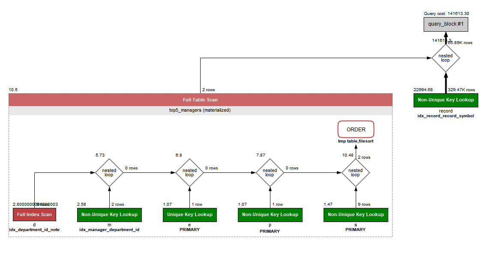

<p align="center">
    
</p>
<p align="center">
  
  
  <a href="https://edu.nextstep.camp/c/R89PYi5H" alt="nextstep atdd">
    
  </a>
  
</p>

<br>

# 인프라공방 샘플 서비스 - 지하철 노선도

<br>

## 🚀 Getting Started

### Install
#### npm 설치
```
cd frontend
npm install
```
> `frontend` 디렉토리에서 수행해야 합니다.

### Usage
#### webpack server 구동
```
npm run dev
```
#### application 구동
```
./gradlew clean build
```
<br>

## 미션

* 미션 진행 후에 아래 질문의 답을 작성하여 PR을 보내주세요.


### 1단계 - 화면 응답 개선하기
1. 성능 개선 결과를 공유해주세요 (Smoke, Load, Stres 테스트 결과)
- Smoke Test : http_req_duration (p95) 355ms → 15ms 개선
- Load Test : http_req_duration (p95) 11s → 8ms 개선
- Stress Test : ttp_req_duration (p95) 6s → 7ms 개선
  - Stress Test Fail건수 43196건 (전체 47833건) → 0건 개선
- PageSpeed Test : 데스크톱 버전 성능점수 68점 → 95점 개선

2. 어떤 부분을 개선해보셨나요? 과정을 설명해주세요
- WebServer
  - gzip 압축 적용, 정적 파일 캐시 적용, HTTP 2.0 적용하였습니다.
  - PageSpeed Test 점수가 크게 개선되었습니다.
- WAS
  - 경로탐색에 대해 Redis Cache  적용하였습니다.
  - K6 Test 결과가 크게 개선되었습니다.

---

### 2단계 - 스케일 아웃

#### Step2 미션 내용
- [X] 미션1: 모든 정적 자원에 대해 no-cache, private 설정을 하고 테스트 코드를 통해 검증합니다.
- [X] 미션2: 확장자는 css인 경우는 max-age를 1년, js인 경우는 no-cache, private 설정을 합니다.
- [X] 미션3: 모든 정적 자원에 대해 no-cache, no-store 설정을 한다. 가능한가요? 

→ 가능합니다. 모든 정적 자원에 대해 캐싱하고 싶지 않을때, 즉 캐시 무효화를 위한 설정입니다.
  > no-cache: 데이터는 캐시해도 되지만, 항상 원(origin) 서버에 검증하고 사용<br>
   no-store: 데이터에 민감한 정보가 있으므로 저장하면 안됨. 메모리에서 사용하고 최대한 빨리 삭제.

no-store 만으로도 충분할 것 같지만, 여러가지 모호한 Case에 대해 더 확실한 무효화를 제공하기 위해, 주요 사이트에서는 Cache Controle 정책으로 no-cache, no-store, must-revalidate를 함께 가져갑니다. <br>
(참고: https://www.inflearn.com/questions/112647)

#### 요구사항
- [X] springboot에 HTTP Cache, gzip 설정하기
- [X] Launch Template 작성하기
- [X] Auto Scaling Group 생성하기
- [X] Smoke, Load, Stress 테스트 후 결과를 기록

1. Launch Template 링크를 공유해주세요.
-  [Launch Template 링크](https://ap-northeast-2.console.aws.amazon.com/ec2/v2/home?region=ap-northeast-2#LaunchTemplateDetails:launchTemplateId=lt-09e692a207f9f6542)

2. cpu 부하 실행 후 EC2 추가생성 결과를 공유해주세요. (Cloudwatch 캡쳐)
- Auto Scaling 결과
  


- EC2 Monitoring 결과
  

```sh
$ stress -c 2
```

3. 성능 개선 결과를 공유해주세요 (Smoke, Load, Stress 테스트 결과)
- smoke : http_req_duration (p95) [15ms](step1/03.%20after%20(was)/3-1.%20smoke_k6_after2.PNG) 
                                → [7ms](step2/test%20result/1.%20smoke%20test.PNG) 개선
- load : http_req_duration (max) [65ms](step1/03.%20after%20(was)/3-2.%20load_k6_after2.PNG) 
                                → [43ms](step2/test%20result/2.%20load%20test.PNG) 개선
- stress : Vuser 1000으로 테스트시 [Fail 발생](step1/03.%20after%20(was)/4.%20stress_test_fail%20(VUser%201000).PNG) 
                                → [성공](step2/test%20result/3.%20stress%20test%20(VUser%201000).PNG) 개선
- 테스트 결과 캡쳐는 step2/test result에 첨부하였습니다.
---

### 1단계 - 쿼리 최적화

1. 인덱스 설정을 추가하지 않고 아래 요구사항에 대해 1s 이하(M1의 경우 2s)로 반환하도록 쿼리를 작성하세요.

- 활동중인(Active) 부서의 현재 부서관리자 중 연봉 상위 5위안에 드는 사람들이 최근에 각 지역별로 언제 퇴실했는지 조회해보세요. (사원번호, 이름, 연봉, 직급명, 지역, 입출입구분, 입출입시간)

#### Query
```roomsql
select 
	top5_managers.id as '사원번호', 
	top5_managers.last_name as '이름', 
	top5_managers.annual_income as '연봉',
	top5_managers.position_name as '직급명',
	record.region as '지역', 
	record.record_symbol as '입출입 구분',
	record.time as '입출입 시간'
from record
inner join (
	select 
		e.id, 
		e.last_name, 
		s.annual_income, 
		p.position_name
	from employee e
		inner join manager m on e.id = m.employee_id and m.end_date > now()
		inner join department d on m.department_id = d.id and note = 'active'
		inner join position p on e.id = p.id and position_name = 'manager'
		inner join salary s on e.id = s.id and s.end_date > now()
	order by s.annual_income desc
	limit 5
) top5_managers
on top5_managers.id = record.employee_id and record.record_symbol = 'O';
```

#### Result
``` 
14 row(s) returned	0.140 sec / 0.000 sec
```

#### 실행계획


---

### 2단계 - 인덱스 설계

1. 인덱스 적용해보기 실습을 진행해본 과정을 공유해주세요

#### 요구사항
- [ ] 주어진 데이터셋을 활용하여 아래 조회 결과를 100ms 이하로 반환
    - [X] Coding as a Hobby 와 같은 결과를 반환하세요.
    - [ ] 프로그래머별로 해당하는 병원 이름을 반환하세요. (covid.id, hospital.name)
    - [ ] 프로그래밍이 취미인 학생 혹은 주니어(0-2년)들이 다닌 병원 이름을 반환하고 user.id 기준으로 정렬하세요. (covid.id, hospital.name, user.Hobby, user.DevType, user.YearsCoding)
    - [ ] 서울대병원에 다닌 20대 India 환자들을 병원에 머문 기간별로 집계하세요. (covid.Stay)
    - [ ] 서울대병원에 다닌 30대 환자들을 운동 횟수별로 집계하세요. (user.Exercise)


----------
1. Coding as a Hobby 와 같은 결과를 반환하세요.

   #### Create Index
    ```roomsql
   alter table programmer add primary key (id);
    create index idx_programmer_hobby on programmer (hobby);
    ```
   #### Query
   ```roomsql
   select hobby, count(*) / (select count(*) from programmer) * 100 as percent
    from programmer
    group by hobby;
   ```
   #### Result
    - Duration Time: 0.313 sec → 0.250 sec (PK 생성) → 0.047 sec (Index 생성)
    - [실행계획(Before)](step4/Q1/1-1.%20Visual_Explain_Before.PNG) →[실행계획(After)](step4/Q1/1-2.%20Visual_ExplainAfter_.PNG)

---

### 추가 미션

1. 페이징 쿼리를 적용한 API endpoint를 알려주세요
