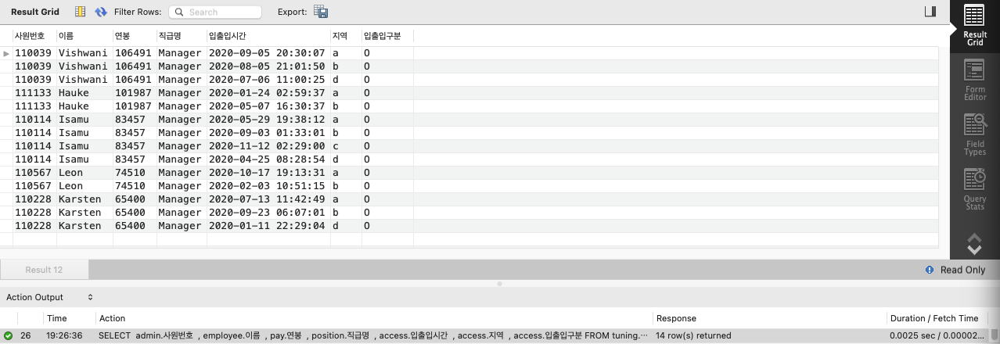

<p align="center">
    
</p>
<p align="center">
  
  
  <a href="https://edu.nextstep.camp/c/R89PYi5H" alt="nextstep atdd">
    
  </a>
  
</p>

<br>

# 인프라공방 샘플 서비스 - 지하철 노선도

<br>

## 🚀 Getting Started

### Install
#### npm 설치
```
cd frontend
npm install
```
> `frontend` 디렉토리에서 수행해야 합니다.

### Usage
#### webpack server 구동
```
npm run dev
```
#### application 구동
```
./gradlew clean build
```
<br>

## 미션

* 미션 진행 후에 아래 질문의 답을 작성하여 PR을 보내주세요.

### 1단계 - 화면 응답 개선하기
1. 성능 개선 결과를 공유해주세요 (Smoke, Load, Stress 테스트 결과)

2. 어떤 부분을 개선해보셨나요? 과정을 설명해주세요

---

### 2단계 - 조회 성능 개선하기
1. 인덱스 적용해보기 실습을 진행해본 과정을 공유해주세요

    * 쿼리 최적화
    
        - [x] 활동중인(Active) 부서의 현재 부서관리자 중 연봉 상위 5위안에 드는 사람들이 최근에 각 지역별로 언제 퇴실했는지 조회해보세요.
              (사원번호, 이름, 연봉, 직급명, 지역, 입출입구분, 입출입시간)

            * 쿼리 작성만으로 1s 이하로 반환한다.

                > 실행 결과: 973ms
                > * 조인 대상이 적은 순부터 `INNER JOIN`

                ```sql
                SELECT
                    admin.사원번호
                    , employee.이름
                    , pay.연봉
                    , position.직급명
                    , access.입출입시간
                    , access.지역
                    , access.입출입구분
                FROM 부서 dept
                INNER JOIN 부서관리자 as admin
                    ON admin.부서번호 = dept.부서번호
                    AND admin.종료일자 = '9999-01-01'
                INNER JOIN 사원 as employee 
                    ON employee.사원번호 = admin.사원번호
                INNER JOIN 직급 as position 
                    ON position.사원번호 = admin.사원번호
                    AND position.종료일자 = '9999-01-01'
                INNER JOIN 사원출입기록 as access 
                    ON access.사원번호 = admin.사원번호
                    AND access.입출입구분 = 'O'
                INNER JOIN 급여 as pay 
                    ON pay.사원번호 = admin.사원번호
                    AND pay.종료일자 = '9999-01-01'
                WHERE dept.비고 = 'active'
                ORDER BY pay.연봉 desc, access.지역;
                ```
                

            * 인덱스 설정을 추가하여 50ms 이하로 반환한다.
                > 실행 결과: 2.5ms
                > * `사원입출입기록` 테이블이 Full Table Scan을 타는 것을 확인
                > * `사원입출입기록` INNER JOIN 조건인 `사원입출입기록.사원번호`, `사원입출입기록.입출입구분` 복합 인덱스 추가

                

    * 인덱스 설계

        - [ ] 주어진 데이터셋을 활용하여 아래 조회 결과를 100ms 이하로 반환
        
            - [ ] Coding as a Hobby 와 같은 결과를 반환하세요.
        
            - [ ] 프로그래머별로 해당하는 병원 이름을 반환하세요. (covid.id, hospital.name)
        
            - [ ] 프로그래밍이 취미인 학생 혹은 주니어(0-2년)들이 다닌 병원 이름을 반환하고 user.id 기준으로 정렬하세요. (covid.id, hospital.name, user.Hobby, user.DevType, user.YearsCoding)
        
            - [ ] 서울대병원에 다닌 20대 India 환자들을 병원에 머문 기간별로 집계하세요. (covid.Stay)
        
            - [ ] 서울대병원에 다닌 30대 환자들을 운동 횟수별로 집계하세요. (user.Exercise)

2. 페이징 쿼리를 적용한 API endpoint를 알려주세요

