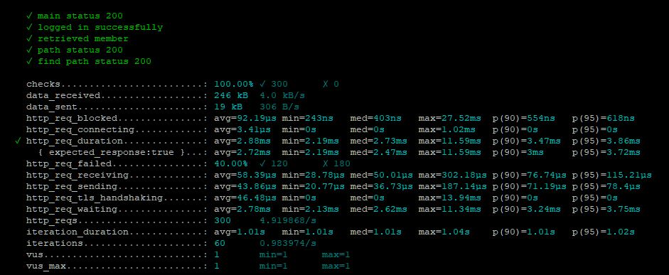
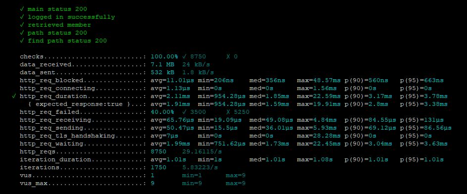
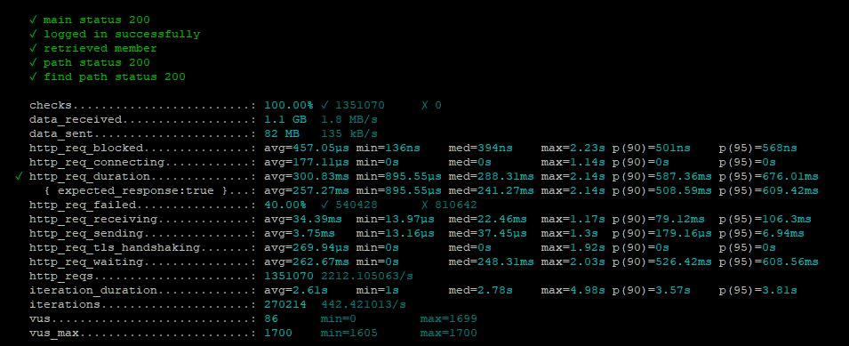

<p align="center">
    
</p>
<p align="center">
  
  
  <a href="https://edu.nextstep.camp/c/R89PYi5H" alt="nextstep atdd">
    
  </a>
  
</p>

<br>

# 인프라공방 샘플 서비스 - 지하철 노선도

<br>

## 🚀 Getting Started

### Install
#### npm 설치
```
cd frontend
npm install
```
> `frontend` 디렉토리에서 수행해야 합니다.

### Usage
#### webpack server 구동
```
npm run dev
```
#### application 구동
```
./gradlew clean build
```
<br>

## 미션

* 미션 진행 후에 아래 질문의 답을 작성하여 PR을 보내주세요.
    - 미션 수행 url: https://www.aws-nextstep-deokmoo.kro.kr/
    
### 1단계 - 화면 응답 개선하기
1. 성능 개선 결과를 공유해주세요 (Smoke, Load, Stress 테스트 결과)
#### 개선전후 측정

---
- Smoke : `k6/smoke/*`
    - 개선 전
      
      
    - 개선 후
            
      
---
- Load : `k6/load/*`
    - 개선 전
      
      
    - 개선 후
            
      
---
- Stress : `k6/stress/*`
    - 개선 전
      
      
    - 개선 후
            
      

---    
2. 어떤 부분을 개선해보셨나요? 과정을 설명해주세요 
    - 개선 전 먼저 측정한다. 
    - 아래 nginx 설정을 통해 Revers Proxy 개선한다.
        - gzip 압축
        - cache 설정
        - TLS, HTTP/2 설정
    - WAS 성능은 `Spring Data Cache`를 이용하여 개선
---

### 2단계 - 스케일 아웃
#### 요구사항

- # springboot에 HTTP Cache, gzip 설정하기
    - 모든 정적 자원에 대해 no-cache, private 설정을 하고 테스트 코드를 통해 검증
    - 확장자는 css인 경우는 max-age를 1년, js인 경우는 no-cache, private 설정
    - 모든 정적 자원에 대해 no-cache, no-store 설정이 가능한가?

  ```text
  가능한 것으로 확인 됩니다.
  HTTP의 스펙이 모든 상황을 완벽하게 대응하고 있지 못하기 때문에 
  no-cache 또는 no-store만으로는 캐시 무효화를 만족하지 못하는 상황이 있을 수 있습니다.
  그래서 이러한 옵션들을 같이 설정할 수 있는 것으로 알고 있습니다.
  실제 트래픽이 많이 발생하는 서비스에서 정적 리소스 호출에 대한 response header를 보면,
  no-cache와 no-store 를 같이 사용하는 것을 확인할 수 있습니다.
  ```
- Launch Template 작성하기
- Auto Scaling Group 생성하기
- Smoke, Load, Stress 테스트 후 결과를 기록

1. Launch Template 링크를 공유해주세요.
- [바로가기](https://ap-northeast-2.console.aws.amazon.com/ec2/home?region=ap-northeast-2#LaunchTemplateDetails:launchTemplateId=lt-0a5259d3742fa9297)
2. cpu 부하 실행 후 EC2 추가생성 결과를 공유해주세요. (Cloudwatch 캡쳐)
   

아래 명령어로 타임아웃 주어 수행하였습니다.
```sh
$ stress -c 2 --timeout 1200
```

3. 성능 개선 결과를 공유해주세요 (Smoke, Load, Stress 테스트 결과)
   
   
    
---

### 3단계 - 쿼리 최적화
#### 요구사항
~~~
- 활동중인(Active) 부서의 현재 부서관리자(manager) 중 연봉 상위 5위안에 드는 사람들이 최근에 각 지역별로 언제 퇴실(O)했는지 조회해보세요.
(사원번호, 이름, 연봉, 직급명, 지역, 입출입구분, 입출입시간)

- 인덱스 설정을 추가하지 않고 200ms 이하로 반환합니다.
M1의 경우엔 시간 제약사항을 달성하기 어렵습니다. 2s를 기준으로 해보시고 어렵다면, 일단 리뷰요청 부탁드려요
~~~

1. 인덱스 설정을 추가하지 않고 아래 요구사항에 대해 1s 이하(M1의 경우 2s)로 반환하도록 쿼리를 작성하세요.

- 활동중인(Active) 부서의 현재 부서관리자 중 연봉 상위 5위안에 드는 사람들이 최근에 각 지역별로 언제 퇴실했는지 조회해보세요. (사원번호, 이름, 연봉, 직급명, 지역, 입출입구분, 입출입시간)

.png)
~~~sql
1. 인덱스 설정을 추가하지 않고 아래 요구사항에 대해 200ms 이하(M1의 경우 2s)로 반환하도록 쿼리를 작성하세요.
```sql
SELECT r.employee_id   AS 사원번호,
       e.first_name    AS 이름,
       e.income        AS 연봉,
       e.position_name AS 직급명,
       r.region        AS 지역,
       r.record_symbol AS 입출입구분
       r.time          AS 입출입시간
FROM record r
         INNER JOIN (SELECT e.id            AS id,
                            e.first_name    AS first_name,
                            s.annual_income AS income,
                            p.position_name AS position_name
                     FROM employee e
                              INNER JOIN manager m ON e.id = m.employee_id AND m.end_date = '9999-01-01'
                              INNER JOIN department d ON d.id = m.department_id AND d.note = 'active'
                              INNER JOIN position p ON e.id = p.id AND position_name = 'Manager'
                              INNER JOIN salary s ON s.id = e.id AND s.end_date = '9999-01-01'
                     ORDER BY s.annual_income DESC
                     LIMIT 5) AS e
                    ON r.employee_id = e.id
WHERE r.record_symbol = 'O';
~~~

---

### 4단계 - 인덱스 설계
#### 요구사항

1. 주어진 데이터셋을 활용하여 아래 조회 결과를 `100ms` 이하로 반환
  - `M1`의 경우엔 시간 제약사항을 달성하기 어려우므로 `100ms`의 `2배`를 기준으로 해보시고 어렵다면, 일단 리뷰요청
2. Coding as a Hobby 와 같은 결과를 반환
3. 프로그래머별로 해당하는 병원 이름을 반환 (covid.id, hospital.name)
4. 프로그래밍이 취미인 학생 혹은 주니어(0-2년)들이 다닌 병원 이름을 반환하고 user.id 기준으로 정렬 (covid.id, hospital.name, user.Hobby, user.DevType, user.YearsCoding)
5. 서울대병원에 다닌 20대 India 환자들을 병원에 머문 기간별로 집계 (covid.Stay)
6. 서울대병원에 다닌 30대 환자들을 운동 횟수별로 집계하세요. (user.Exercise)
----
1. 인덱스 적용해보기 실습을 진행해본 과정을 공유해주세요
- 요구사항의 쿼리를 요구사항 숫자대로 넘버링하여 명명 
#### 인덱스 적용 전
- 1, 2 는 5초 이내 수행
- 3, 4, 5는 30초 이상이 소요

#### 인덱스 적용 후

- Coding as Hobby
```sql
ALTER TABLE programmer
  ADD CONSTRAINT programmer_pk PRIMARY KEY (id);

CREATE INDEX programmer_hobby_index ON programmer (hobby);

SELECT hobby,
       count(*) / (SELECT count(*)
                   FROM   programmer) * 100 AS rate
FROM   programmer
GROUP  BY hobby
ORDER  BY hobby DESC; 
```

- 프로그래머별로 해당하는 병원 이름을 반환하세요. (covid.id, hospital.name)

```sql
-- pk 추가
ALTER TABLE hospital
  ADD CONSTRAINT hospital_pk PRIMARY KEY (id);

-- pk 추가
ALTER TABLE covid
  ADD CONSTRAINT covid_pk PRIMARY KEY (id);

-- index 생성
CREATE INDEX covid_programmer_id_index ON covid (programmer_id);

-- index 생성
CREATE INDEX covid_hospital_id_index ON covid (hospital_id); 

-- query
SELECT covid.id,
       hospital.name
FROM   covid
       INNER JOIN programmer
               ON covid.programmer_id = programmer.id
       INNER JOIN hospital
               ON covid.hospital_id = hospital.id; 
```

- 프로그래밍이 취미인 학생 혹은 주니어(0-2년)들이 다닌 병원 이름을 반환하고 user.id 기준으로 정렬하세요. (covid.id, hospital.name, user.Hobby, user.DevType, user.YearsCoding)

```sql
-- query
SELECT covid.id,
       hospital.NAME,
       USER.hobby,
       USER.dev_type,
       USER.years_coding
FROM   covid
       INNER JOIN hospital
               ON covid.hospital_id = hospital.id
       INNER JOIN (SELECT id,
                          years_coding,
                          hobby,
                          dev_type
                   FROM   programmer
                   WHERE  hobby = 'Yes'
                          AND ( years_coding = '0-2 years'
                                 OR student IN ( 'Yes, full-time',
                                                 'Yes, part-time' ) )) USER
               ON covid.programmer_id = USER.id
ORDER  BY USER.id; 
```

- 서울대병원에 다닌 20대 India 환자들을 병원에 머문 기간별로 집계하세요. (covid.Stay)

```sql
-- pk 추가
ALTER TABLE member
  ADD CONSTRAINT member_pk PRIMARY KEY (id); 

-- query
SELECT covid.stay,
       count(*)
FROM   covid
       INNER JOIN hospital
               ON covid.hospital_id = hospital.id
                  AND hospital.NAME = '서울대병원'
       INNER JOIN member
               ON covid.member_id = member.id
                  AND member.age BETWEEN 20 AND 29
       INNER JOIN programmer
               ON covid.programmer_id = programmer.id
                  AND programmer.country = 'india'
GROUP  BY covid.stay; 
```

- 서울대병원에 다닌 30대 환자들을 운동 횟수별로 집계하세요. (user.Exercise)

```sql
-- index 생성
CREATE INDEX covid_member_id_index ON covid (member_id);

-- query
SELECT exercise,
       count(*)
FROM   programmer
       INNER JOIN covid
               ON programmer.id = covid.programmer_id
       INNER JOIN hospital
               ON covid.hospital_id = hospital.id
                  AND hospital.NAME = '서울대병원'
       INNER JOIN member
               ON covid.member_id = member.id
                  AND member.age BETWEEN 30 AND 39
GROUP  BY exercise;
```
---

### 추가 미션

1. 페이징 쿼리를 적용한 API endpoint를 알려주세요
