<p align="center">
    
</p>
<p align="center">
  
  
  <a href="https://edu.nextstep.camp/c/R89PYi5H" alt="nextstep atdd">
    
  </a>
  
</p>

<br>

# 인프라공방 샘플 서비스 - 지하철 노선도

<br>

## 🚀 Getting Started

### Install
#### npm 설치
```
cd frontend
npm install
```
> `frontend` 디렉토리에서 수행해야 합니다.

### Usage
#### webpack server 구동
```
npm run dev
```
#### application 구동
```
./gradlew clean build
```
<br>

## 미션

* 미션 진행 후에 아래 질문의 답을 작성하여 PR을 보내주세요.


### 1단계 - 화면 응답 개선하기
1. 성능 개선 결과를 공유해주세요 (Smoke, Load, Stress 테스트 결과)
#### Smoke
- before  
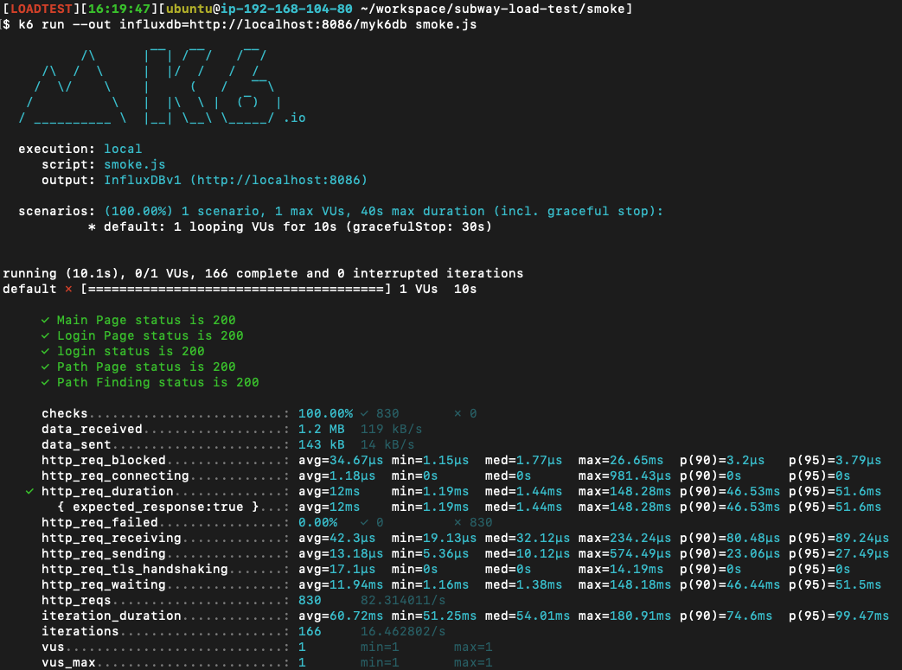
- after  
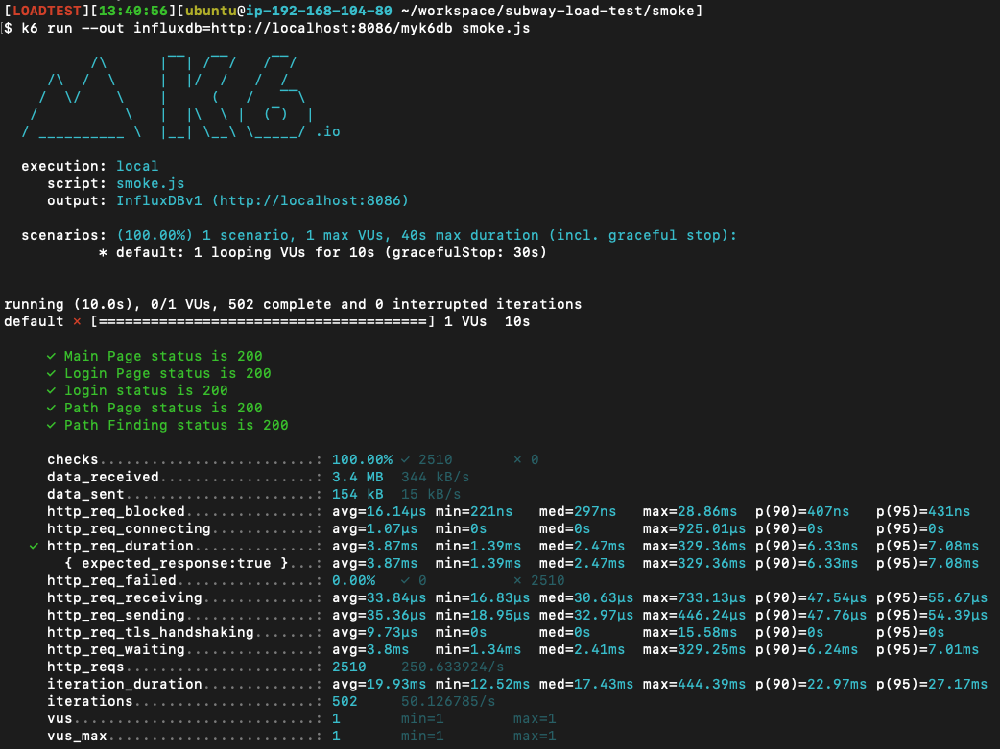
#### Load
http_req_waiting avg 148.9ms -> 21.15ms
- before  

- after  
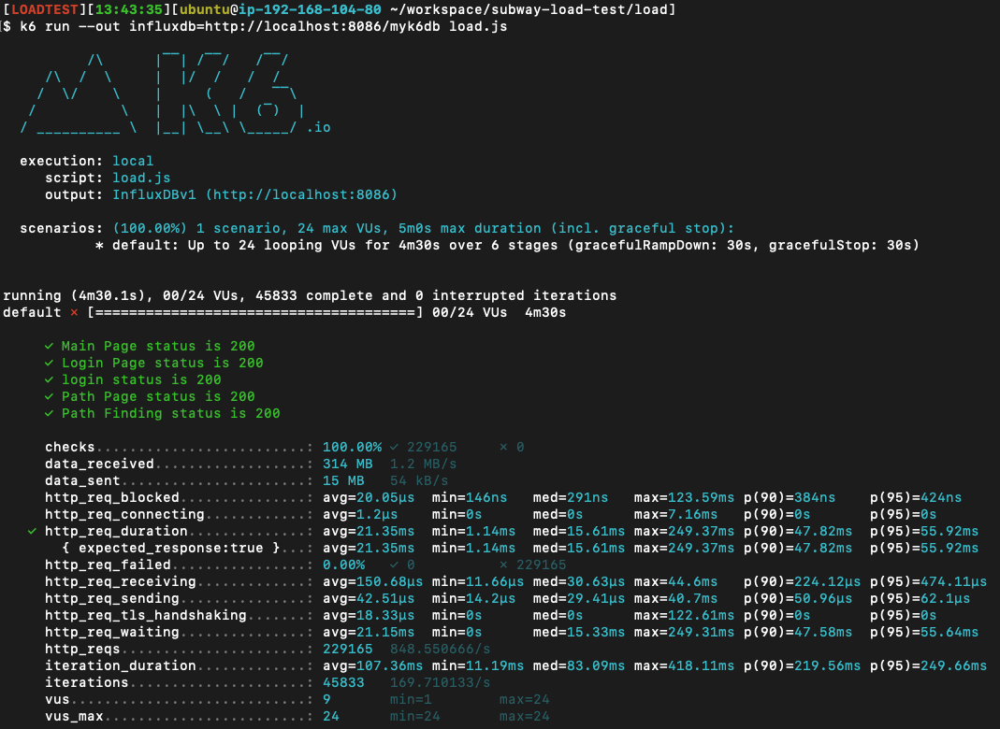
#### Stress
에러가 나는 지점 vsu 238 -> 272
- before  
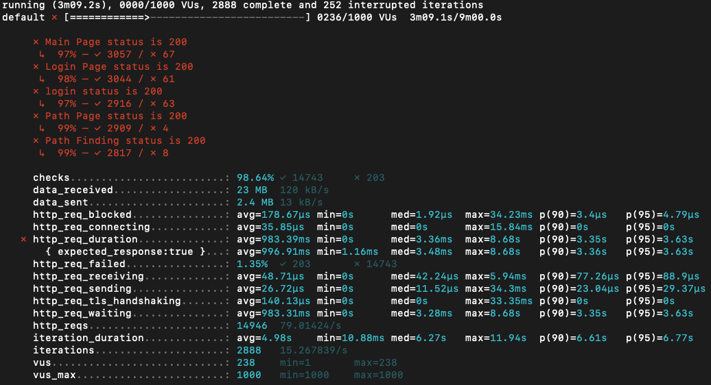
- after  
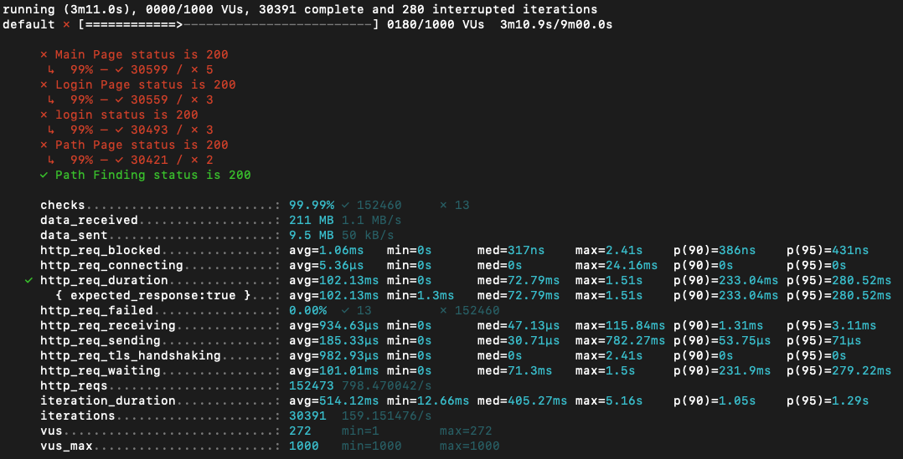
2. 어떤 부분을 개선해보셨나요? 과정을 설명해주세요
- Reverse Proxy 개선
  - gzip 압축 types: text/plain text/css application/json application/x-javascript application/javascript text/xml application/xml application/rss+xml text/javascript image/svg+xml application/vnd.ms-fontobject application/x-font-ttf font/opentype
  - cache: css | js | gif | png | jpg | jpeg
  - http2
- WAS 성능 개선
  - Redis cache 사용: 역 목록, 노선 목록, 경로 검색
---

### 2단계 - 스케일 아웃
- [x] springboot에 HTTP Cache, gzip 설정하기
- [x] Launch Template 작성하기
- [x] Auto Scaling Group 생성하기
  - [x] 로드밸런서 생성
  - [x] 타겟 대상 생성
  - [x] 임계값 설정
  - [x] 종료 정책 구성
- [x] DNS, TLS 설정
1. Launch Template 링크를 공유해주세요.  
https://ap-northeast-2.console.aws.amazon.com/ec2/v2/home?region=ap-northeast-2#LaunchTemplateDetails:launchTemplateId=lt-0c761492b2914af82
2. cpu 부하 실행 후 EC2 추가생성 결과를 공유해주세요. (Cloudwatch 캡쳐)

```sh
$ stress -c 2
```

3. 성능 개선 결과를 공유해주세요 (Smoke, Load, Stress 테스트 결과)
#### smoke
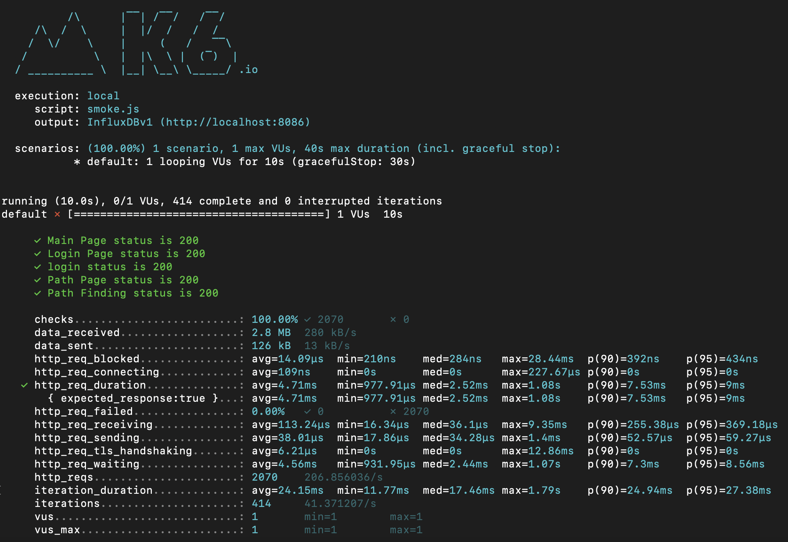
#### load
- http_req_duration avg 기준 `21.35ms` -> `5.28ms`
- http_req_waiting avg 기준 `21.15ms` -> `4.34ms`
- iteration_duration avg 기준 `187.36ms` -> `24.15ms`
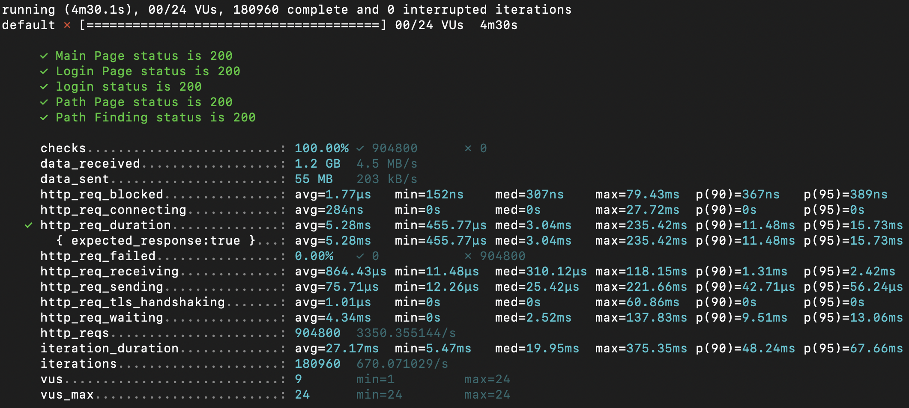
#### stress
- 에러가 나는 지점 vsu `272` -> `1,050`
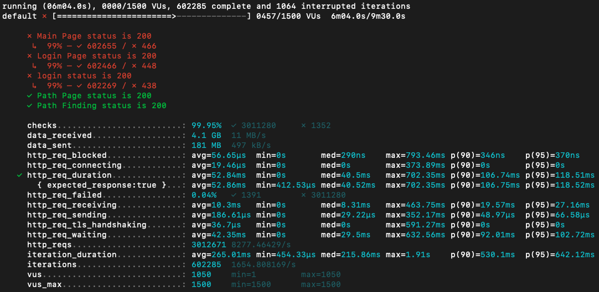
---

### 1단계 - 쿼리 최적화

1. 인덱스 설정을 추가하지 않고 아래 요구사항에 대해 1s 이하(M1의 경우 2s)로 반환하도록 쿼리를 작성하세요.

- 활동중인(Active) 부서의 현재 부서관리자 중 연봉 상위 5위안에 드는 사람들이 최근에 각 지역별로 언제 퇴실했는지 조회해보세요. (사원번호, 이름, 연봉, 직급명, 지역, 입출입구분, 입출입시간)
#### SQL
```sql
SELECT 
    manager_salary_top5.사원번호,
    manager_salary_top5.이름,
    manager_salary_top5.연봉,
    manager_salary_top5.직급명,
    r.time AS 입출입시간,
    r.region AS 지역,
    r.record_symbol AS 입출입구분
FROM
    (SELECT 
        m.employee_id AS 사원번호,
            e.last_name AS 이름,
            s.annual_income AS 연봉,
            p.position_name AS 직급명
    FROM
        manager AS m
    JOIN department AS d ON d.id = m.department_id
    JOIN position AS p ON p.id = m.employee_id
    JOIN employee AS e ON e.id = m.employee_id
    JOIN salary AS s ON s.id = e.id
    WHERE
        d.note = 'active'
            AND p.position_name = 'Manager'
            AND NOW() BETWEEN m.start_date AND m.end_date
            AND NOW() BETWEEN s.start_date AND s.end_date
    ORDER BY s.annual_income DESC
    LIMIT 5) AS manager_salary_top5
JOIN record AS r ON r.employee_id = manager_salary_top5.사원번호
WHERE r.record_symbol = 'O'
ORDER BY manager_salary_top5.연봉 DESC;
```
#### Result
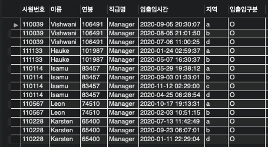
#### Duration / Fetch Time
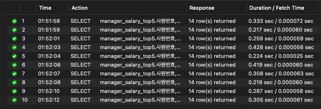
#### Execution Plan
- Visual
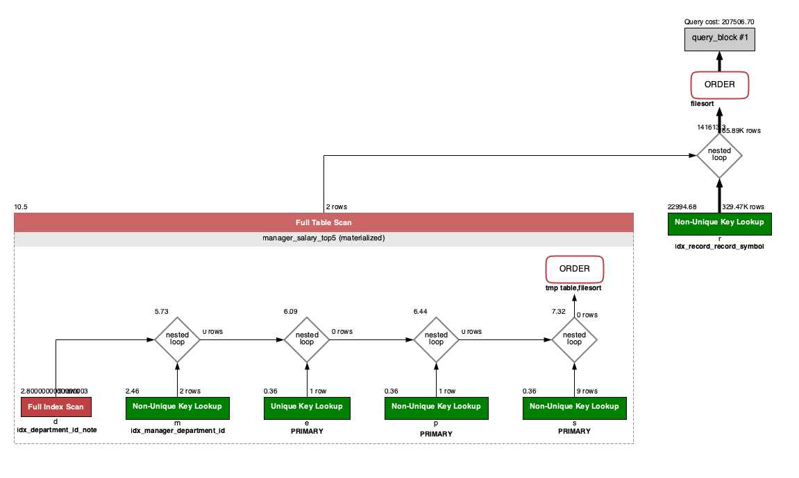
- Tabular
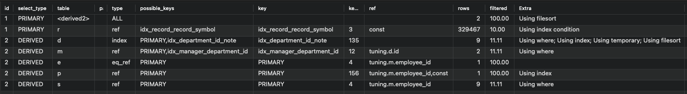
---

### 2단계 - 인덱스 설계

1. 인덱스 적용해보기 실습을 진행해본 과정을 공유해주세요
- [x] 주어진 데이터셋을 활용하여 아래 조회 결과를 100ms 이하로 반환
  - [x] [Coding as a Hobby](https://insights.stackoverflow.com/survey/2018#developer-profile-_-coding-as-a-hobby) 와 같은 결과를 반환하세요.
    - Index
    ```sql
    CREATE INDEX `idx_programmer_hobby` ON `subway`.`programmer` (hobby) COMMENT '' ALGORITHM DEFAULT LOCK DEFAULT
    ```
    - Query
    ```sql
    SELECT
      hobby,
      ROUND(COUNT(*) / (SELECT COUNT(*) FROM programmer) * 100, 1) AS percentage
    FROM programmer
    GROUP BY hobby
    ORDER BY hobby DESC;
    ```
    - Result Grid  
    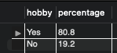
    - Duration / Fetch Time
      - 인덱스 사용 전 `0.585sec`  
      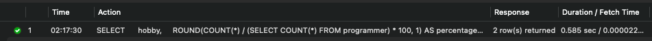
      - 인덱스 사용 후 `0.053sec`  
      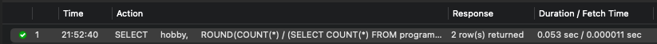
    - Explain
      - 인덱스 사용 전  
      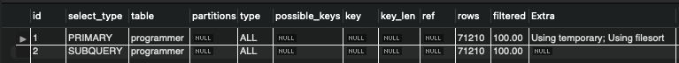
      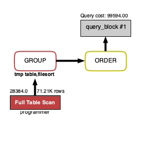
      - 인덱스 사용 후  
      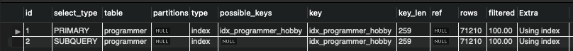
      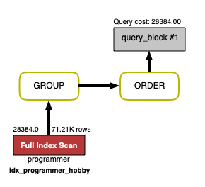
  - [x] 프로그래머별로 해당하는 병원 이름을 반환하세요. (covid.id, hospital.name)
    - Index
    ```sql
    ALTER TABLE `subway`.`hospital`
    CHANGE COLUMN `id` `id` INT (11) NOT NULL,
    ADD PRIMARY KEY (`id`),
    ADD UNIQUE INDEX `id_UNIQUE` (`id` ASC);
    ;
    
    ALTER TABLE `subway`.`programmer`
    CHANGE COLUMN `id` `id` INT (11) NOT NULL,
    ADD PRIMARY KEY (`id`),
    ADD UNIQUE INDEX `id_UNIQUE` (`id` ASC);
    ;
    
    ALTER TABLE `subway`.`covid`
    CHANGE COLUMN `id` `id` INT (11) NOT NULL,
    ADD PRIMARY KEY (`id`),
    ADD UNIQUE INDEX `id_UNIQUE` (`id` ASC);
    ;
    
    CREATE INDEX `idx_covid_hospital_id` ON `subway`.`covid` (hospital_id) COMMENT '' ALGORITHM DEFAULT LOCK DEFAULT
    CREATE INDEX `idx_covid_programmer_id` ON `subway`.`covid` (programmer_id) COMMENT '' ALGORITHM DEFAULT LOCK DEFAULT
    ```
    - Query
    ```sql
    SELECT
      p.id AS programmer_id,
      h.name AS hospital_name
    FROM programmer AS p
    JOIN covid AS c
      ON c.programmer_id = p.id
    JOIN hospital AS h
      ON h.id = c.hospital_id
    ```
    - Result Grid  
    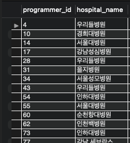
    - Duration / Fetch Time
      - 인덱스 사용 전 `0.589sec`  
      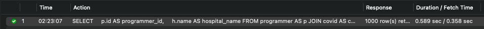
      - 인덱스 사용 후 `0.025sec` 
      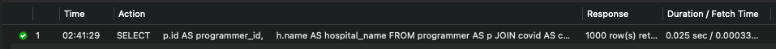
    - Explain
      - 인덱스 사용 전  
      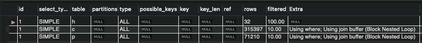
      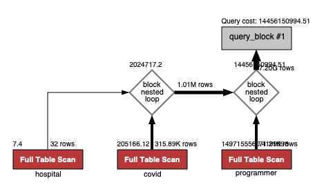
      - 인덱스 사용 후  
      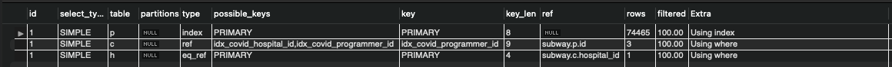
      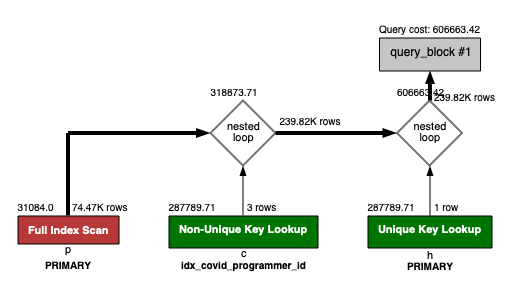
  - [x] 프로그래밍이 취미인 학생 혹은 주니어(0-2년)들이 다닌 병원 이름을 반환하고 user.id 기준으로 정렬하세요. (covid.id, hospital.name, user.Hobby, user.DevType, user.YearsCoding)
    - **Index**  
    ```sql
    ALTER TABLE `subway`.`hospital`
    CHANGE COLUMN `id` `id` INT (11) NOT NULL,
    ADD PRIMARY KEY (`id`),
    ADD UNIQUE INDEX `id_UNIQUE` (`id` ASC);
    ;
    
    ALTER TABLE `subway`.`programmer`
    CHANGE COLUMN `id` `id` INT (11) NOT NULL,
    ADD PRIMARY KEY (`id`),
    ADD UNIQUE INDEX `id_UNIQUE` (`id` ASC);
    ;
    
    CREATE INDEX `idx_covid_hospital_id` ON `subway`.`covid` (hospital_id) COMMENT '' ALGORITHM DEFAULT LOCK DEFAULT
    CREATE INDEX `idx_covid_programmer_id` ON `subway`.`covid` (programmer_id) COMMENT '' ALGORITHM DEFAULT LOCK DEFAULT
    
    CREATE INDEX `idx_programmer_hobby`  ON `subway`.`programmer` (hobby) COMMENT '' ALGORITHM DEFAULT LOCK DEFAULT
    ```
    - **Query**
    ```sql
    SELECT
      programmer.id,
      hospital.name
    FROM programmer
    JOIN covid
      ON covid.programmer_id = programmer.id
    JOIN hospital
      ON hospital.id = covid.hospital_id
    WHERE programmer.hobby = 'Yes'
      AND (programmer.student <> 'No' OR programmer.years_coding = '0-2 years')
    ORDER BY programmer.id;
    ```
    - **Result Grid**  
    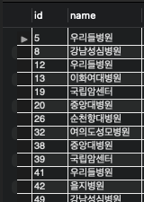
    - **Duration / Fetch Time**  
    아래 두 경우 극적인 차이는 없음.
      - JOIN 연결 key들만 인덱스 사용  
      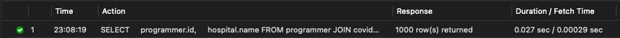
      - hobby까지 인덱스 사용  
      
    - **Explain**
      - JOIN 연결 key들만 인덱스 사용  
      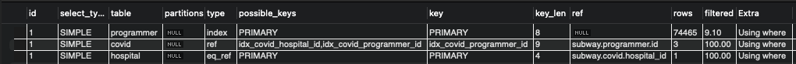
      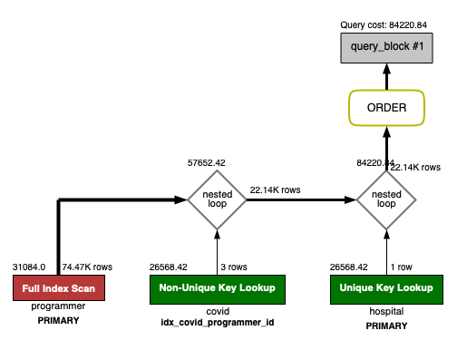
      - hobby까지 인덱스 사용  
      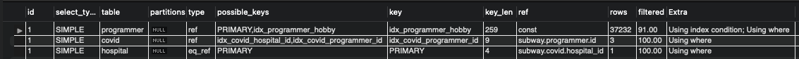
      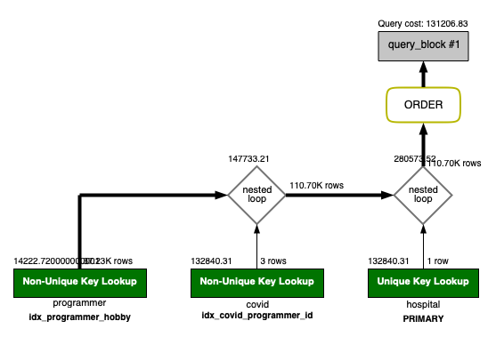
  - [x] 서울대병원에 다닌 20대 India 환자들을 병원에 머문 기간별로 집계하세요. (covid.Stay)
    - **Index**  
    ```sql
    ALTER TABLE `subway`.`hospital`
    CHANGE COLUMN `id` `id` INT (11) NOT NULL,
    ADD PRIMARY KEY (`id`),
    ADD UNIQUE INDEX `id_UNIQUE` (`id` ASC);
    ;
    
    ALTER TABLE `subway`.`member`
    CHANGE COLUMN `id` `id` BIGINT(20) NOT NULL,
    ADD PRIMARY KEY (`id`),
    ADD UNIQUE INDEX `id_UNIQUE` (`id` ASC);
    ;
    
    ALTER TABLE `subway`.`programmer`
    CHANGE COLUMN `id` `id` BIGINT(20) NOT NULL,
    ADD PRIMARY KEY (`id`),
    ADD UNIQUE INDEX `id_UNIQUE` (`id` ASC);
    ;
    
    CREATE INDEX `idx_covid_member_id` ON `subway`.`covid` (hospital_id) COMMENT '' ALGORITHM DEFAULT LOCK DEFAULT
    CREATE INDEX `idx_covid_member_id` ON `subway`.`covid` (member_id) COMMENT '' ALGORITHM DEFAULT LOCK DEFAULT
    CREATE INDEX `idx_covid_member_id` ON `subway`.`covid` (programmer_id) COMMENT '' ALGORITHM DEFAULT LOCK DEFAULT
    
    CREATE UNIQUE INDEX `idx_hospital_name`  ON `subway`.`hospital` (name) COMMENT '' ALGORITHM DEFAULT LOCK DEFAULT
    ```
    - **Query**  
    ```sql
    SELECT
      c.stay,
      COUNT(*) as count
    FROM (SELECT id, hospital_id, member_id, programmer_id, stay FROM covid) AS c
    JOIN (SELECT id FROM hospital WHERE name = '서울대병원') AS h
      ON c.hospital_id = h.id
    JOIN (SELECT id FROM programmer WHERE country = 'India') AS p
      ON p.id = c.programmer_id
    JOIN (SELECT id FROM member WHERE age BETWEEN 21 AND 29) AS m
      ON m.id = c.member_id
    GROUP BY c.stay
    ```
    - **Result Grid**  
    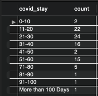
    - **Duration / Fetch Time**
      - JOIN 연결 key들만 인덱스 사용  
      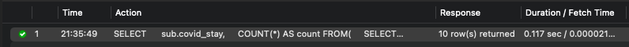
      - hospital name도 인덱스 사용  
      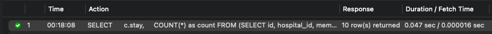
    - **Explain**
      - JOIN 연결 key들만 인덱스 사용  
      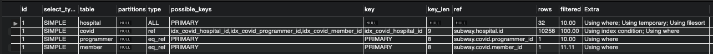
      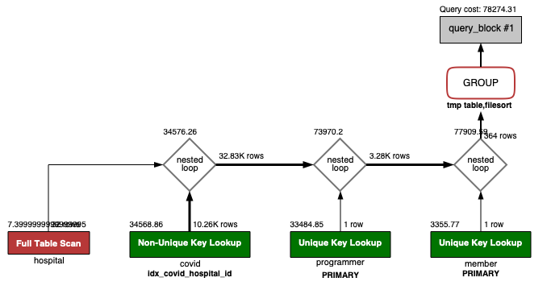
      - hospital name도 인덱스 사용  
      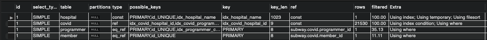
      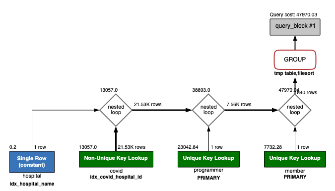
  - [x] 서울대병원에 다닌 30대 환자들을 운동 횟수별로 집계하세요. (user.Exercise)
    - **Index**
    ```sql
    ALTER TABLE `subway`.`hospital`
    CHANGE COLUMN `id` `id` INT (11) NOT NULL,
    ADD PRIMARY KEY (`id`),
    ADD UNIQUE INDEX `id_UNIQUE` (`id` ASC);
    ;
    
    ALTER TABLE `subway`.`member`
    CHANGE COLUMN `id` `id` BIGINT(20) NOT NULL,
    ADD PRIMARY KEY (`id`),
    ADD UNIQUE INDEX `id_UNIQUE` (`id` ASC);
    ;
    
    ALTER TABLE `subway`.`programmer`
    CHANGE COLUMN `id` `id` BIGINT(20) NOT NULL,
    ADD PRIMARY KEY (`id`),
    ADD UNIQUE INDEX `id_UNIQUE` (`id` ASC);
    ;
    
    CREATE INDEX `idx_covid_member_id` ON `subway`.`covid` (hospital_id) COMMENT '' ALGORITHM DEFAULT LOCK DEFAULT
    CREATE INDEX `idx_covid_member_id` ON `subway`.`covid` (member_id) COMMENT '' ALGORITHM DEFAULT LOCK DEFAULT
    CREATE INDEX `idx_covid_member_id` ON `subway`.`covid` (programmer_id) COMMENT '' ALGORITHM DEFAULT LOCK DEFAULT
    
    CREATE UNIQUE INDEX `idx_hospital_name`  ON `subway`.`hospital` (name) COMMENT '' ALGORITHM DEFAULT LOCK DEFAULT
    ```
    - **Query**
    ```sql
    SELECT
      p.exercise,
      COUNT(*) as count
    FROM (SELECT id, hospital_id, member_id, programmer_id, stay FROM covid) AS c
    JOIN (SELECT id FROM hospital WHERE name = '서울대병원') AS h
      ON c.hospital_id = h.id
    JOIN (SELECT id, exercise FROM programmer) AS p
      ON p.id = c.programmer_id
    JOIN (SELECT id FROM member WHERE age BETWEEN 31 AND 39) AS m
      ON m.id = c.member_id
    GROUP BY p.exercise
    ```
    - **Result Grid**  
    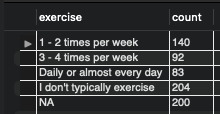
    - **Duration / Fetch Time**
      - JOIN 연결 key들만 인덱스 사용  
      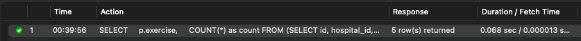
      - hospital name도 인덱스 사용  
      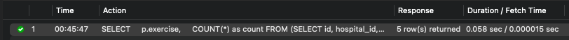
    - **Explain**
      - JOIN 연결 key들만 인덱스 사용  
      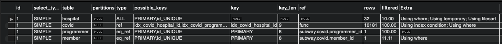
      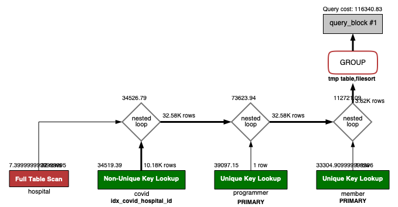
      - hospital name도 인덱스 사용  
      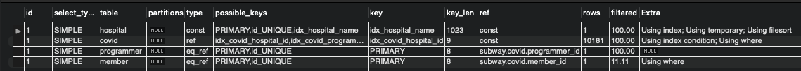
      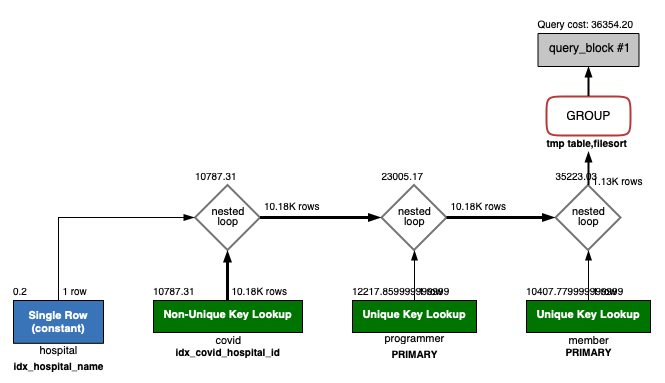
---

### 추가 미션

1. 페이징 쿼리를 적용한 API endpoint를 알려주세요
