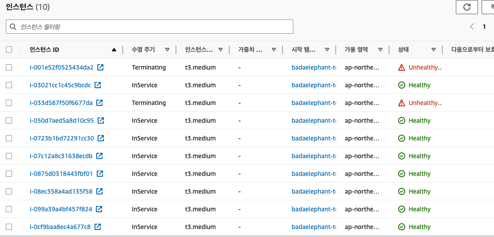
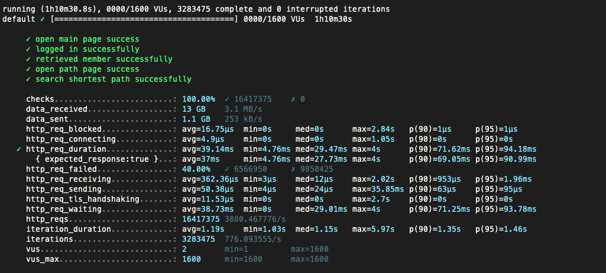
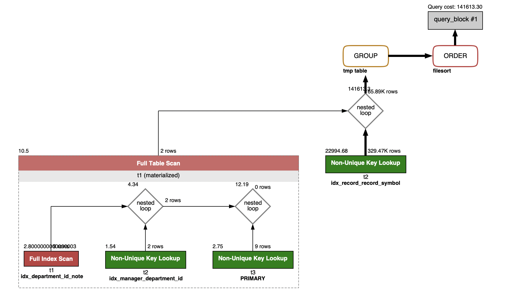

# 안정적인 서비스 만들기

## Step1. 화면 응답 개선하기

### 요구사항

- [x] 부하테스트 각 시나리오의 요청시간을 목표값 이하로 개선
  - [x] Reverse Proxy 개선하기
    - [x] gzip 압축
    - [x] cache
    - [x] TLS, HTTP/2 설정
  - [x] WAS 성능 개선하기
    - [x] Spring Data Cache
      - [x] StationService 캐시적용
      - [x] LineService 캐시적용
      - [x] MapService 캐시적용
      - 캐시 적용시, 추가보다는 evict 부분에 좀 더 신경쓰기
    - [-] 비동기 처리 : 외부 API 를 사용하지 않으므로 현재 서비스에선 미적용.
- [x] 개선 전 / 후를 직접 계측하여 확인
  - [x] 개선 전 k6 확인
    - [x] 스크립트 작성 및 결과값 추가
  - [x] 개선 후 k6 확인
    - [x] Reverse Proxy 개선하기 적용 후 결과
    - [x] 캐시 적용 후 결과
      - [x] 캐시 적용 후 결과 (MAX 727)
      - [x] 캐시 적용 후 결과 (MAX 50) - task.js의 STATION_MAX_COUNT 값을 변경

### 결과 정리
- 목표 : p(99) <200

- 개선 전 -> 1차개선(리버스프록시) -> 2차개선 (캐시적용) -> 3차개선 (캐시적용 - 경로제한)
- 검증 항목 : http-req-duration p(95)
  - smoke
    - 30ms -> 22ms -> 17ms
  - load
    - 25ms -> 15ms -> 15ms
  - stress
    - 350ms -> 21ms -> 49ms -> 17ms
- 결론
  - 가장 큰 결과 변화는, 리버스프록시 개선 (gzip 압축)에서 이루어졌다. 
  - 캐시 적용의 경우, 727개의 항목 경로조회에서는 cash-hit가 많지 않을 것같아 유의미한 변화가 없었음.
    - 오히려 캐시 저장하는 프로세스가 추가되어서인지 스트레스 테스트에서는 오히려 응답시간이 지연됨
  - 그리하여, 경로조회 대상 역을 50개로 줄였을때는 cache-hit가 많이 올라가서인지 결과 개선이 많이 되었음


## Step2. 스케일 아웃

## 요구사항
- [x] 실습
  - [x] WebMvcConfig 캐시컨트롤, Etag 설정
  - [x] Etag 동작 Test코드를 통해 확인
- [x] springboot에 HTTP Cache, gzip 설정하기
- [x] 배포 스크립트 업로드
- [x] Launch Template 작성하기
  - [x] Ubuntu 이미지 선택
  - [x] EC2 설정
  - [x] IAM 권한 설정
  - [x] 배포 명령어 설정
- [x] Auto Scaling Group 생성하기
  - [x] Launch Template 설정
  - [x] 네트워크 설정
  - [x] 로드밸런서 생성
  - [x] 타겟 대상 생성
  - [x] 그룹 크기 설정
  - [x] 임계값 설정
- [x] DNS 설정
- [x] TLS 설정
- [x] Smoke, Load, Stress 테스트 후 결과를 기록
  - smoke
    - 
  - load
    - 
  - stress
    - 
    - 
  
  
## 결과 정리

- ASG 전(캐싱) <> 후
  - smoke : 18ms <> 21ms
  - load : 15ms <> 21ms
  - stress : 17ms <> 25ms

- ASG 적용 이후, 전반적으로 속도는 증가하였다. 
  - 예상 이유
    - 인스턴스 타입을 줄임 -> t4g ->t3m
    - 캐시와 프록시 설정으로 이미 stress 테스트 350(~550)에서는 부하문제가 없었어서 인스턴스 추가생성 없었음
  - 추가 테스트
    - 부하테스트의 VUSER를 1600까지 늘리고 테스트 하였음. 
      - 피크상태의 네트워크 입력이 7천만 바이트 까지 올라가는 것을 확인
      - ASG의 인스턴스 추적기준을 네트워크 입력 1천만으로 주고, 최대 8개까지 인스턴스를 증가시키도록 함
      - 
      - CPU 사용률은 요청이 많아서 fail이 되도 30%를 넘지 않으므로, 해당 서비스의 추적기준으론 부적합 하다고 판단하였음.
      - 

  
## Step3. 쿼리최적화

### 요구사항
- [x] 활동중인(Active) 부서의 현재 부서관리자(manager) 중 연봉 상위 5위안에 드는 사람들이 최근에 각 지역별로 언제 퇴실(O)했는지 조회해보세요.
  - (사원번호, 이름, 연봉, 직급명, 지역, 입출입구분, 입출입시간)
  - 인덱스 설정을 추가하지 않고 200ms 이하로 반환합니다.
  - M1의 경우엔 시간 제약사항을 달성하기 어렵습니다. 2s를 기준으로 해보시고 어렵다면, 일단 리뷰요청 부탁드려요
  - 급여 테이블의 사용여부 필드는 사용하지 않습니다. 현재 근무중인지 여부는 종료일자 필드로 판단해주세요.

- 쿼리
```sql

select
  employee.id as "사원번호",
  employee.last_name as "이름",
  FILTERED.annual_income as "연봉",
  FILTERED.position_name as "직급",
  record.time as "입출입시간",
  record.region as "지역",
  record.record_symbol as "입출입구분"
from employee
       right join (
  select manager.employee_id, position.position_name, salary.annual_income
  from manager
         join department on manager.department_id = department.id
         join salary on manager.employee_id = salary.id
         join position on manager.employee_id = position.id
  where position.position_name = 'manager'
    and salary.end_date = '9999-01-01'
    and department.note = 'active'
    and position.end_date = '9999-01-01'
  order by salary.annual_income desc limit 5) as FILTERED
                  on employee.id = FILTERED.employee_id
       left outer join record on employee.id = record.employee_id
where record.record_symbol = 'O'


```

- 결과
  - 수행 결과 : M1Pro -> 평균 1.6초
  - 
  - 쿼리 플랜
  - 

  
## Step4. 인덱스 설계

### 요구사항
- [x] 주어진 데이터셋을 활용하여 아래 조회 결과를 100ms 이하로 반환
  - M1의 경우엔 시간 제약사항을 달성하기 어렵습니다. 2배를 기준으로 해보시고 어렵다면, 일단 리뷰요청 부탁드려요
  - [x] query_1. Coding as a Hobby 와 같은 결과를 반환하세요.
  - [x] query_2. 프로그래머별로 해당하는 병원 이름을 반환하세요. (covid.id, hospital.name)
  - [x] query_3. 프로그래밍이 취미인 학생 혹은 주니어(0-2년)들이 다닌 병원 이름을 반환하고 user.id 기준으로 정렬하세요. (covid.id, hospital.name, user.Hobby, user.DevType, user.YearsCoding)
  - [x] query_4. 서울대병원에 다닌 20대 India 환자들을 병원에 머문 기간별로 집계하세요. (covid.Stay)
  - [x] query_5. 서울대병원에 다닌 30대 환자들을 운동 횟수별로 집계하세요. (user.Exercise)


### 결과

- query_1. Coding as a Hobby 와 같은 결과를 반환하세요. 
- 결과
  - 제약조건 추가 전 : 5041 ms
  - 제약조건 추가 후 : 300 ms
    - Order by 없을 경우 : 265 ms
    - 100% index를 타고 있어서, 이 이상 성능향상이 힘들것 같습니다.

```sql 조회 쿼리
SELECT hobby,
       Concat(Round(Count(*) / (SELECT Count(*)
                                FROM   programmer) * 100, 1), '%') AS "result"
FROM   programmer
GROUP  BY hobby
ORDER  BY hobby DESC; 
```
```sql 제약조건
ALTER TABLE programmer
  ADD CONSTRAINT pk_programmer PRIMARY KEY (id);

CREATE INDEX ix_programmer_hobby ON programmer (hobby); 
```


- query_2. 프로그래머별로 해당하는 병원 이름을 반환하세요. (covid.id, hospital.name)
- 결과
  - 제약조건 추가 전 : 143 ms
  - 제약조건 추가 후 : 33 ms

```sql 조회 쿼리
SELECT covid.id,
       hospital.name
FROM   covid
         INNER JOIN hospital
                    ON covid.hospital_id = hospital.id
         INNER JOIN programmer
                    ON covid.programmer_id = programmer.id; 
```
```sql 제약조건
ALTER TABLE hospital
  ADD CONSTRAINT pk_hospital PRIMARY KEY (id);

ALTER TABLE covid
  ADD CONSTRAINT pk_covid PRIMARY KEY (id);

CREATE INDEX ix_covid_programmer_id_and_hospital_id ON covid(programmer_id, hospital_id);
```


- query_3. 프로그래밍이 취미인 학생 혹은 주니어(0-2년)들이 다닌 병원 이름을 반환하고 user.id 기준으로 정렬하세요. (covid.id, hospital.name, user.Hobby, user.DevType, user.YearsCoding)
- 결과
  - 제약조건 추가 전 : 38 ms
    - 현재 explain에서 인덱스를 잘 타고 있어서 제약조건 추가하지 않음.
```sql 조회 쿼리
SELECT covid.id,
       hospital.name,
       programmer.hobby,
       programmer.dev_type,
       programmer.years_coding
FROM   programmer
         INNER JOIN covid
              ON covid.programmer_id = programmer.id
         INNER JOIN hospital
              ON hospital.id = covid.hospital_id
WHERE  programmer.hobby = 'yes'
  AND ( programmer.student LIKE 'Yes%'
  OR programmer.years_coding = '0-2 years' )
ORDER  BY programmer.id;


```

- query_4. 서울대병원에 다닌 20대 India 환자들을 병원에 머문 기간별로 집계하세요. (covid.Stay)
- 결과
  - 제약조건 추가 전 : 3011 ms
  - 제약조건 추가 후 : 144 ms
    - explain에서 복합인덱스를 통해 filtered 100 
    - 카디널리티가 높은(1 : 32) hospital.name에 인덱스 추가
```sql 조회 쿼리
SELECT covid.stay,
       Count(*)
FROM   covid
         INNER JOIN hospital
                    ON covid.hospital_id = hospital.id
                      AND hospital.name = '서울대병원'
         INNER JOIN member
                    ON covid.member_id = member.id
                      AND member.age BETWEEN 20 AND 29
         INNER JOIN programmer
                    ON covid.programmer_id = programmer.id
                      AND programmer.country = 'india'
GROUP  BY covid.stay; 
```
```sql 제약조건

ALTER TABLE member
  ADD CONSTRAINT pk_member PRIMARY KEY (id);

CREATE INDEX ix_hospital_name ON hospital(name);
CREATE INDEX ix_covid_hospital_id_and_programmer_id_and_member_id ON covid(hospital_id, programmer_id, member_id);
```


- query_5. 서울대병원에 다닌 30대 환자들을 운동 횟수별로 집계하세요. (user.Exercise)
- 제약조건 추가 전 : 27 ms
  - 현재 explain에서 인덱스를 잘 타고 있어서 제약조건 추가하지 않음.
```sql 조회 쿼리
SELECT exercise,
       Count(*)
FROM   programmer
         INNER JOIN covid
                    ON programmer.id = covid.programmer_id
         INNER JOIN hospital
                    ON covid.hospital_id = hospital.id
                      AND hospital.name = '서울대병원'
         INNER JOIN member
                    ON covid.member_id = member.id
                      AND member.age BETWEEN 30 AND 39
GROUP  BY exercise; 
```
