<p align="center">
    
</p>
<p align="center">
  
  
  <a href="https://edu.nextstep.camp/c/R89PYi5H" alt="nextstep atdd">
    
  </a>
  
</p>

<br>

# 인프라공방 샘플 서비스 - 지하철 노선도

<br>

## 🚀 Getting Started

### Install
#### npm 설치
```
cd frontend
npm install
```
> `frontend` 디렉토리에서 수행해야 합니다.

### Usage
#### webpack server 구동
```
npm run dev
```
#### application 구동
```
./gradlew clean build
```
<br>

## 미션

* 미션 진행 후에 아래 질문의 답을 작성하여 PR을 보내주세요.


### 1단계 - 화면 응답 개선하기
1. 성능 개선 결과를 공유해주세요 (Smoke, Load, Stress 테스트 결과)

* 목표값 설정
    * throughput
        * 1일 평균 접속자 100만명 (서울시 하루 평균 지하철 이용자 600만명)
        * 1명당 1일 평균 접속 수 : 2번
        * 1일 총 접속 수 : 200만 (100만 * 2)
        * 피크 시간대 집중률 : 오전 (7 ~ 9), 오후 (6 ~ 8) 평소 트래픽에 6배 예상
        * 1일 평균 rps : 23.1 (200만 / 86400)
        * 1일 최대 rps : 138.6 (23.1 * 6)
    * latency
        * 목표 응답 시간 = 0.5s
        * VUser = 69 (138.6 * 0.5 / 1)
    * 부하 유지 기간
        * smoke test : 1분
        * load test : 30분
        * stress test : 7분
* 스크립트 시나리오
  * 로그인 하기 
  * 나의 정보 수정하기 
  * 경로 검색하기 
    
### Smoke Test 결과 비교 (http_req_duration)
|http_req_duration  | avg  | min  | med   | max  | p(90)  |   p(95)  |  
   |------|------|------|------|------|-------|-------|
| 개선 전  | 96.37ms | 4.35ms | 5.14ms | 568.98ms | 282.37ms |  308.67ms  | 
| 개선 후  | 36.85ms | 6.92ms | 9.35ms | 176.21ms | 98.87ms |  104.3ms  | 

### Load Test 결과 비교 (http_req_duration)
|http_req_duration  | avg  | min  | med   | max  | p(90)  |   p(95)  |  
   |------|------|------|------|------|-------|-------|
| 개선 전  | 4.08s | 3.94s | 3.5s | 18.29s | 9.39s |  10.82s  | 
| 개선 후  | 1.14s | 4.01ms | 830.97ms | 24.72s | 1.89s |  4.5s  | 

### Stress Test 결과 비교 (http_req_duration)
|http_req_duration  | avg  | min  | med   | max  | p(90)  |   p(95)  |  
   |------|------|------|------|------|-------|-------|
| 개선 전  | 13.96s | 0s | 12.23s | 39.82s | 28.98s |  32.41s  | 
| 개선 후  | 2.8s | 0s | 2.21s | 30.83s | 5.18s |  6.33s  | 

### 개선 결과
* Smoke test만 목표 응답 시간인 0.5s 만족
* Load test 평균 응답 시간 4.08s -> 1.14s, 목표치와 근사하게 접근
* Stress test 성능 개선이 가장 많이 됨 13.96s -> 2.8s
* 평균 응답 시간 3 ~ 5배 개선


## 성능 비교 : PageSpeed에서 측정
### 내 사이트 (성능 개선 전) : minzzang-subway.kro.kr

| 디바이스 | FCP  | TTI  | SI   | TBT  | LCP  |   CLS  | Score |
   |------|------|------|------|------|-------|-------|  -----   |
| MOBILE  | 14.7s | 15.3s | 14.7s | 560ms | 15.3s |  0.042  | 32 |
| PC  | 2.6s | 2.7s | 2.6s | 50ms | 2.7s |  0.004  | 68 |

### 내 사이트 (성능 개선 후) : minzzang-subway.kro.kr

| 디바이스 | FCP  | TTI  | SI   | TBT  | LCP  |   CLS  | Score |
   |------|------|------|------|------|-------|-------|  -----   |
| MOBILE  | 5.1s | 5.6s | 5.1s | 400ms | 5.6s |  0.047  | 54 |
| PC  | 1.1s | 1.2s | 1.3s | 20ms | 1.2s |  0.004  | 94 |

### 경쟁사 사이트 : 서울 교통 공사, 네이버 지도, 카카오 맵

1. 서울 교통 공사

| 디바이스 | FCP  | TTI  | SI   | TBT  | LCP  |   CLS  | Score |
   |------|------|------|------|------|-------|-------|  -----   |
| MOBILE  | 7.2s | 8.6s | 8.3s | 180ms | 8.7s |  0  | 49 |
| PC  | 1.6s | 2.0s | 2.3s | 50ms | 3.5s |  0.014  | 71 |

2. 네이버 지도

| 디바이스 | FCP  | TTI  | SI   | TBT  | LCP  |   CLS  | Score |
   |------|------|------|------|------|-------|-------|  -----   |
| MOBILE  | 2.1s | 6.6s | 5.7s | 240ms | 7.9s |  0.03  | 60 |
| PC  | 0.5s | 0.5s | 2.3s | 0ms | 1.6s |  0.006  | 90 |

3. 카카오 맵

| 디바이스 | FCP  | TTI  | SI   | TBT  | LCP  |   CLS  | Score |
   |------|------|------|------|------|-------|-------|  -----   |
| MOBILE  | 1.7s | 4.5s | 6.7s | 80ms | 6.3s |  0.005  | 68 |
| PC  | 0.5s | 1.0s | 2.6s | 0ms | 1.3s |  0.003  | 91 |

### 개선 결과
#### mobile 약 168% 성능 개선
* mobile은 아직 경쟁사 대비 점수가 낮은 상태라 추가 개선할 점이 남아 있음
#### pc 약 138% 성능 개선
* 경쟁사 중 가장 높은 점수로 개선

2. 어떤 부분을 개선해보셨나요? 과정을 설명해주세요
* Reverse Proxy 개선
    * gzip 압축
      * nginx.conf 파일에서 gzip압축 설정을 추가했습니다.
    * 정적파일 캐시
      * css파일, js파일, image 파일(gif,png,jpg,jpeg)을 캐시 처리했습니다.
    * http/2 설정
      * nginx.conf 파일에서 http2 설정을 추가했습니다.
* was 성능 개선
    * redis를 이용한 캐시
        * 데이터의 변경보다 조회가 많은 노선 조회와 경로 탐색을 캐시 처리하여 db 요청 수를 최소화했습니다.
    
    
---

### 2단계 - 스케일 아웃

1. Launch Template 링크를 공유해주세요.
   * [minzzang-launch-template](https://ap-northeast-2.console.aws.amazon.com/ec2/v2/home?region=ap-northeast-2#LaunchTemplateDetails:launchTemplateId=lt-0a43fc27120fedd72)
2. cpu 부하 실행 후 EC2 추가생성 결과를 공유해주세요. (Cloudwatch 캡쳐)
 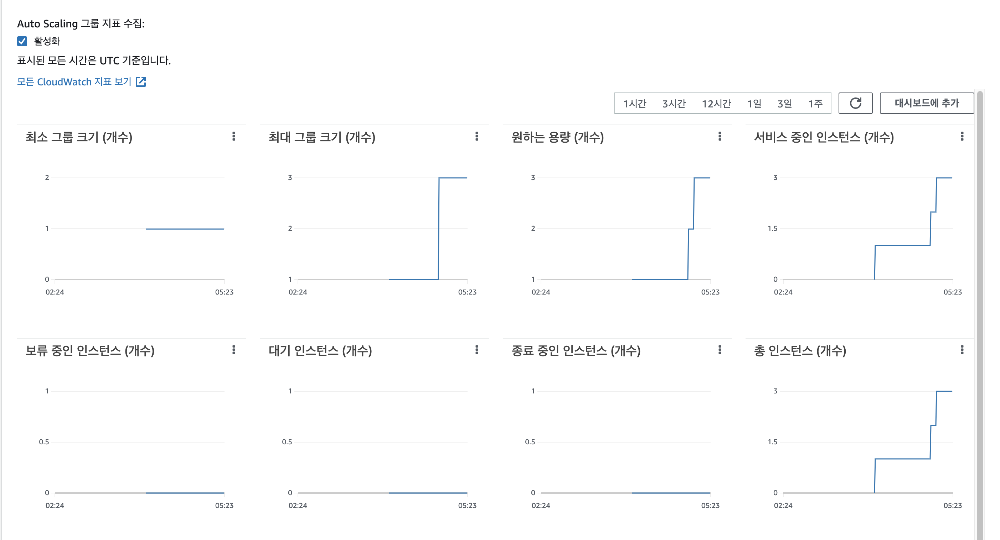
```sh
$ stress -c 2
```

3. 성능 개선 결과를 공유해주세요 (Smoke, Load, Stress 테스트 결과)

* 목표값 설정
    * Stress 테스트를 제외한 테스트는 vUser를 이전 테스트와 동일하게 설정하였고 Stress 테스트는 점진적으로 늘려가면서 테스트를 진행했습니다.
        * smoke : vUser 1
        * load : vUser 70
        * stress : vUser 3000
    * vUser 3000이상으로 설정 시 메모리 부족으로 멈춤현상이 발생하여 max vUser 3000으로 설정해서 진행했습니다.

### Smoke Test 결과 비교 (http_req_duration)
|http_req_duration  | avg  | min  | med   | max  | p(90)  |   p(95)  |  
   |------|------|------|------|------|-------|-------|
| 개선 전  | 36.85ms | 6.92ms | 9.35ms | 176.21ms | 98.87ms |  104.3ms  | 
| 개선 후  | 6.35ms | 1.67ms | 6.91ms | 107.59ms | 8.08ms |  8.38ms  | 

### Load Test 결과 비교 (http_req_duration)
|http_req_duration  | avg  | min  | med   | max  | p(90)  |   p(95)  |  
   |------|------|------|------|------|-------|-------|
| 개선 전  | 1.14s | 4.01ms | 830.97ms | 24.72s | 1.89s |  4.5s  |  
| 개선 후  | 4.31ms | 662.26us | 4.98ms | 529.1ms | 6.31ms |  7.06ms  | 

### Stress Test 결과 비교 (http_req_duration)
|http_req_duration  | avg  | min  | med   | max  | p(90)  |   p(95)  |  
   |------|------|------|------|------|-------|-------|
| 개선 전  | 2.8s | 0s | 2.21s | 30.83s | 5.18s |  6.33s  |  
| 개선 후  | 272.94ms | 1.22ms | 167.9ms | 4.03s | 700.85ms |  849.43ms  | 
 
### 개선 결과
* Smoke test 목표 응답 시간인 0.5s 만족
* load test에서 목표 응답 시간인 0.5s를 만족했기 때문에 평소 우리 서비스의 트래픽을 안정적으로 처리할 수 있다는 결론이 도출됨.
* 우리 서비스의 한계치를 파악해서 앞으로 서비스가 성장할 경우 발생할 트래픽에 대한 성능을 어느정도 예측할 수 있음.
* 한계치를 바탕으로 미리 대비를 해서 장애 발생 시 빠른 대처 가능
---

### 1단계 - 쿼리 최적화

1. 인덱스 설정을 추가하지 않고 아래 요구사항에 대해 1s 이하(M1의 경우 2s)로 반환하도록 쿼리를 작성하세요.

- 활동중인(Active) 부서의 현재 부서관리자 중 연봉 상위 5위안에 드는 사람들이 최근에 각 지역별로 언제 퇴실했는지 조회해보세요. (사원번호, 이름, 연봉, 직급명, 지역, 입출입구분, 입출입시간)
```
SELECT
        top5.id AS '사원번호',
        top5.first_name AS '이름',
        top5.annual_income AS '연봉',
        top5. position_name AS '직급명',
        r.region AS '지역',
        r.record_symbol AS '입출입구분',
        r.time AS '입출입시간'
FROM (
         SELECT e.id, e.first_name, s.annual_income, p.position_name
         FROM employee e
                  INNER JOIN (SELECT m.employee_id, m.department_id
                              FROM manager m
                              WHERE m.end_date >= now()) m
                      ON e.id = m.employee_id
                  INNER JOIN (SELECT d.id
                              FROM department d
                              WHERE d.note = 'active') d
                      ON d.id = m.department_id
                  INNER JOIN (SELECT p.id, p.position_name
                              FROM position p
                              WHERE p.position_name = 'manager') p
                      ON p.id = e.id
                  INNER JOIN (SELECT s.id, s.annual_income
                              FROM salary s
                              WHERE s.end_date >= now()) s
                     ON s.id = e.id
         ORDER BY s.annual_income DESC
         LIMIT 5
 ) top5 INNER JOIN record r
     ON r.employee_id = top5.id
    AND r.record_symbol = 'O'
```
### 실행 시간
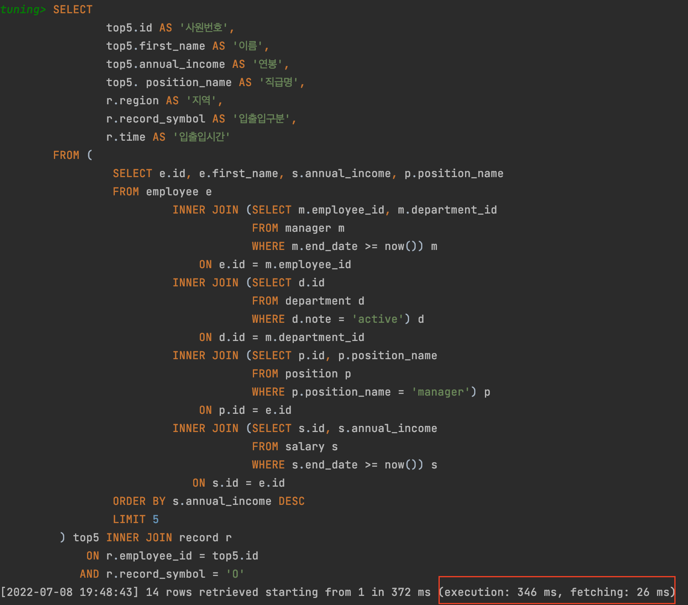
### 쿼리 결과
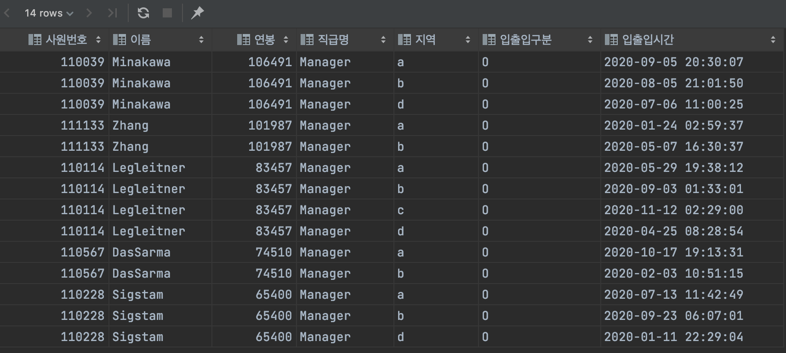
### 실행 계획
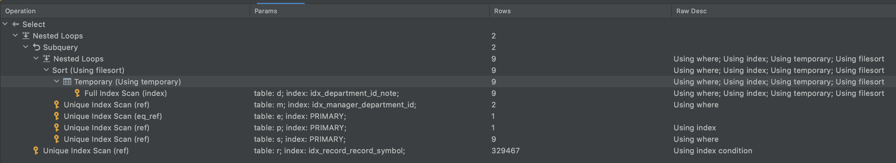
---

### 2단계 - 인덱스 설계

지* 인덱스 적용해보기 실습을 진행해본 과정을 공유해주세요
    
### 1. Coding as a Hobby 와 같은 결과를 반환하세요.
```
select hobby, count(*) / (select count(*) from programmer p) * 100 AS PERCENT
from programmer
group by hobby;
```

* 인덱스
```
create index programmer_hobby_index
    on programmer (hobby);
```

### 실행 시간
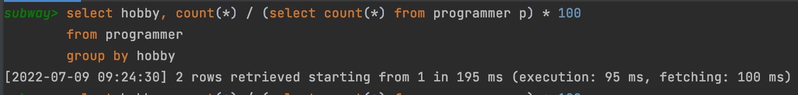
### 실행 계획
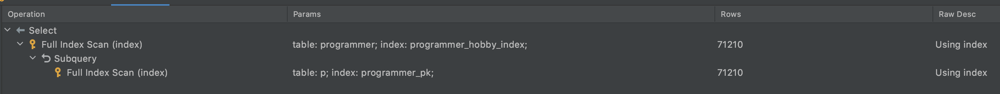

### 2. 프로그래머별로 해당하는 병원 이름을 반환하세요. (covid.id, hospital.name)
```
select c.id, h.name
from covid c
         inner join hospital h on c.hospital_id = h.id
         inner join programmer p on c.programmer_id = p.id
```

* 인덱스
```
constraint covid_pk
     unique (id)
     
constraint hospital_pk
     unique (id)

constraint programmer_pk
     unique (id)

create index covid_hospital_id_index
     on covid (hospital_id);

create index covid_programmer_id_index
     on covid (programmer_id);
```

### 실행 시간
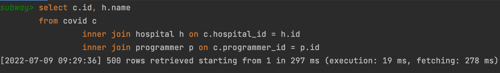
### 실행 계획
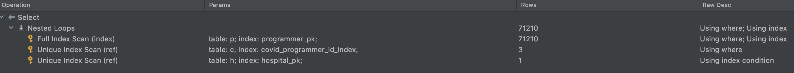

### 3. 프로그래밍이 취미인 학생 혹은 주니어(0-2년)들이 다닌 병원 이름을 반환하고 user.id 기준으로 정렬하세요.
### (covid.id, hospital.name, user.Hobby, user.DevType, user.YearsCoding)
```
select c.id, h.name, p.hobby, p.dev_type, p.Years_coding
from covid c
    inner join hospital h on c.hospital_id = h.id
    inner join
        (
            select p.id, p.hobby, p.dev_type, p.Years_coding
            from programmer p
            where p.hobby = 'Yes'
              and (p.student like 'Yes%' or p.years_coding = '0-2 years')
        ) p on c.programmer_id = p.id
order by p.id;
```

* 인덱스
```  
constraint hospital_pk
     unique (id)
     
create index programmer_hobby_index
    on programmer (hobby);

create index covid_programmer_id_index
     on covid (programmer_id);
```

### 실행 시간
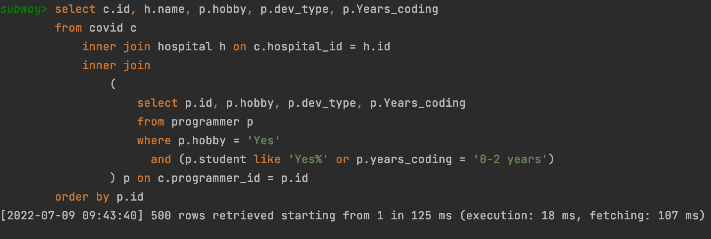
### 실행 계획
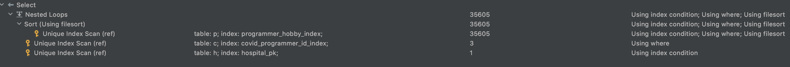

### 4. 서울대병원에 다닌 20대 India 환자들을 병원에 머문 기간별로 집계하세요. (covid.Stay)
```
select c.stay, count(*)
from covid c
         inner join hospital h on c.hospital_id = h.id
         inner join programmer p on c.programmer_id = p.id
         inner join member m on c.member_id = m.id
where
    m.age between 20 and 29
    and h.name = '서울대병원'
    and p.country = 'India'
group by c.stay;
```

* 인덱스
```
constraint programmer_pk
     unique (id)
     
create index member_age_id_index
	on member (age, id);
     
create index covid_hospital_id_index
     on covid (hospital_id);
     
create index hospital_name_index
    on hospital (name);
     
```

### 실행 시간
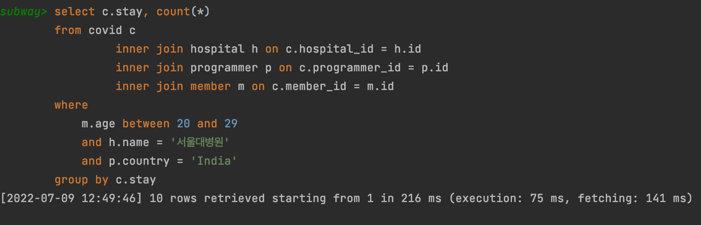
### 실행 계획
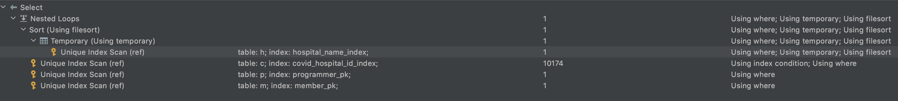

### 5. 서울대병원에 다닌 30대 환자들을 운동 횟수별로 집계하세요. (user.Exercise)

```
select p.exercise, count(*)
from hospital h
         inner join covid c on c.hospital_id = h.id
         inner join programmer
             p on c.programmer_id = p.id
         inner join member m on m.id = c.member_id
where
   m.age between 30 and 39
   and h.name = '서울대병원'
group by p.exercise;

```

* 인덱스
```
constraint programmer_pk
     unique (id)
     
create index member_age_id_index
	on member (age, id);
     
create index covid_hospital_id_index
     on covid (hospital_id);
     
create index hospital_name_index
    on hospital (name);
     
```

### 실행 시간
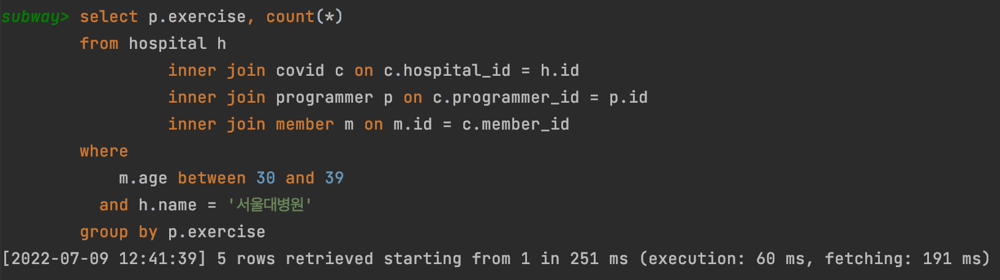
### 실행 계획
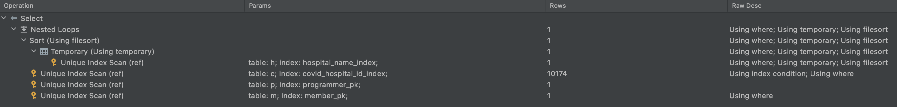

---

### 추가 미션

1. 페이징 쿼리를 적용한 API endpoint를 알려주세요
