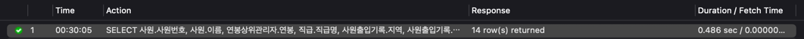
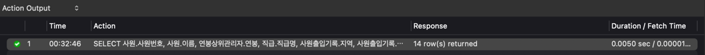
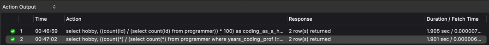
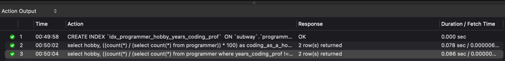
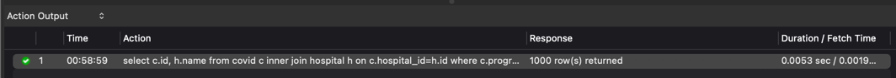
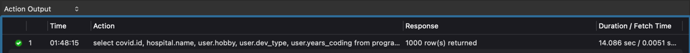
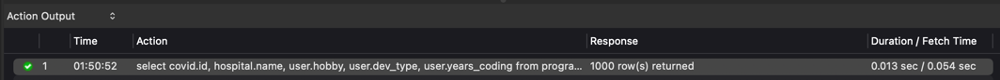
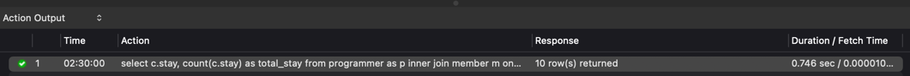
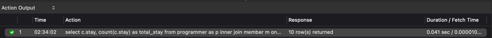

<p align="center">
    
</p>
<p align="center">
  
  
  <a href="https://edu.nextstep.camp/c/R89PYi5H" alt="nextstep atdd">
    
  </a>
  
</p>

<br>

# 인프라공방 샘플 서비스 - 지하철 노선도

<br>

## 🚀 Getting Started

### Install
#### npm 설치
```
cd frontend
npm install
```
> `frontend` 디렉토리에서 수행해야 합니다.

### Usage
#### webpack server 구동
```
npm run dev
```
#### application 구동
```
./gradlew clean build
```
<br>

## 미션

* 미션 진행 후에 아래 질문의 답을 작성하여 PR을 보내주세요.

### 1단계 - 화면 응답 개선하기
1. 성능 개선 결과를 공유해주세요 (Smoke, Load, Stress 테스트 결과)

2. 어떤 부분을 개선해보셨나요? 과정을 설명해주세요

---

### 2단계 - 조회 성능 개선하기
1. 인덱스 적용해보기 실습을 진행해본 과정을 공유해주세요
#### A. 쿼리 최적화
- [X] 활동중인(Active) 부서의 현재 부서관리자 중 연봉 상위 5위안에 드는 사람들이 최근에 각 지역별로 언제 퇴실했는지 조회해보세요.(사원번호, 이름, 연봉, 직급명, 지역, 입출입구분, 입출입시간)
  - 
```sql
SELECT 사원.사원번호, 사원.이름, 연봉상위관리자.연봉, 직급.직급명, 사원출입기록.지역, 사원출입기록.입출입구분, 사원출입기록.입출입시간
FROM 사원출입기록
    JOIN (
        SELECT 급여.사원번호, 급여.연봉
        FROM 급여
            JOIN 부서관리자 on 급여.사원번호 = 부서관리자.사원번호
            JOIN 부서 ON 부서.부서번호 = 부서관리자.부서번호
            WHERE lower(부서.비고) = lower('active')
              AND now() BETWEEN 급여.시작일자 and 급여.종료일자
              AND now() BETWEEN 부서관리자.시작일자 and 부서관리자.종료일자
            ORDER BY 급여.연봉
            DESC LIMIT 5
        ) AS 연봉상위관리자
    ON 사원출입기록.사원번호 = 연봉상위관리자.사원번호
    JOIN 직급 ON 직급.사원번호 = 연봉상위관리자.사원번호 AND now() BETWEEN 직급.시작일자 AND 직급.종료일자
    JOIN 사원 ON 사원.사원번호 = 연봉상위관리자.사원번호
    WHERE 사원출입기록.입출입구분 = 'O'
    ORDER BY 연봉상위관리자.연봉 DESC, 사원출입기록.지역; 
```

- [X] 인덱스 설정을 추가하여 50 ms 이하로 반환한다.
  - 사원출입기록 테이블을 Full-Scan 하여 사원출입기록 테이블과 조인시 사용하는 사원번호와 입출입구분을 인덱스로 설정
  - 
```sql
CREATE INDEX `idx_사원출입기록_사원번호_입출입구분`  ON `tuning`.`사원출입기록` (사원번호, 입출입구분) COMMENT '' ALGORITHM DEFAULT LOCK DEFAULT;
```

#### B. 인덱스 설계
- [X] Coding as a Hobby 와 같은 결과를 반환하세요.
  - 인덱스 적용 전
    - 
  - 인덱스 적용 후
    - group by와 where에 사용되는 hobby와 years_coding_prof를 인덱스로 설정
    - 
```sql
CREATE INDEX `idx_programmer_hobby_years_coding_prof`  ON `subway`.`programmer` (hobby, years_coding_prof) COMMENT '' ALGORITHM DEFAULT LOCK DEFAULT;

/* 전체 응답자 */
select hobby, ((count(*) / (select count(*) from programmer)) * 100) as coding_as_a_hobby
from programmer
group by hobby;

/* 개발자 */
select hobby, ((count(*) / (select count(*) from programmer where years_coding_prof != 'NA')) * 100) as coding_as_a_hobby
from programmer
where years_coding_prof != 'NA'
group by hobby;
```

- [X] 프로그래머별로 해당하는 병원 이름을 반환하세요. (covid.id, hospital.name)
  - 인덱스 적용 전
    - 
  - 인덱스 적용 후
    - 인덱스 적용 전에도 속도가 빨라서 그런지 hospital 테이블의 id를 PK를 적용하고 covid 테이블에 hospital_id와 programmer_id를 인덱스 설정을 해줘도 속도가 큰 차이가 나지는 않았습니다.
    - 
```sql
CREATE INDEX `idx_covid_hospital_id_programmer_id`  ON `subway`.`covid` (hospital_id, programmer_id) COMMENT '' ALGORITHM DEFAULT LOCK DEFAULT;

select c.id, h.name
from covid c inner join hospital h on c.hospital_id=h.id
where c.programmer_id is not null;
```

- [X] 프로그래밍이 취미인 학생 혹은 주니어(0-2년)들이 다닌 병원 이름을 반환하고 user.id 기준으로 정렬하세요. (covid.id, hospital.name, user.Hobby, user.DevType, user.YearsCoding)
  - 인덱스 적용 전
    - 
  - 인덱스 적용 후
    - programmer 테이블의 id를 PK로 지정하였으며, covid 테이블의 programmer_id를 인덱스 설정
    - 
```sql
CREATE INDEX `idx_covid_programmer_id`  ON `subway`.`covid` (programmer_id) COMMENT '' ALGORITHM DEFAULT LOCK DEFAULT;

select covid.id, hospital.name, user.hobby, user.dev_type, user.years_coding
from programmer user 
    inner join covid covid on user.id = covid.programmer_id
    inner join hospital hospital on covid.hospital_id = hospital.id
where (lower(user.hobby) = 'yes' or lower(user.student) = 'yes') or user.years_coding_prof ='0-2 years'
order by user.id;
```

- [x] 서울대병원에 다닌 20대 India 환자들을 병원에 머문 기간별로 집계하세요. (covid.Stay)
  - 인덱스 적용 전
    - 
  - 인덱스 적용 후
    - hospital 테이블의 name 컬럼의 데이터타입이 text라서 인덱스 적용이 안되어 varchar(255)로 변경 
    - 
```sql
CREATE INDEX `idx_programmer_member_id`  ON `subway`.`programmer` (member_id) COMMENT '' ALGORITHM DEFAULT LOCK DEFAULT
CREATE INDEX `idx_programmer_country`  ON `subway`.`programmer` (country) COMMENT '' ALGORITHM DEFAULT LOCK DEFAULT
CREATE INDEX `idx_member_age`  ON `subway`.`member` (age) COMMENT '' ALGORITHM DEFAULT LOCK DEFAULT
CREATE INDEX `idx_hospital_name`  ON `subway`.`hospital` (name) COMMENT '' ALGORITHM DEFAULT LOCK DEFAULT

select c.stay, count(c.stay) as total_stay
from programmer as p inner join member m on p.member_id = m.id
                     inner join covid c on p.id = c.programmer_id
                     inner join hospital h on c.hospital_id = h.id
where country = 'India' and m.age between 20 and 29 and h.name = '서울대병원'
group by c.stay;
```
- 서울대병원에 다닌 30대 환자들을 운동 횟수별로 집계하세요. (user.Exercise)
  - 위에서 적용했던 인덱스들이 사용되어 인덱스를 적용할 필요가 없었습니다. 
  - 
```sql
select p.exercise, count(p.exercise) as total_exercise
from programmer as p inner join member m on p.member_id = m.id
inner join covid c on p.id = c.programmer_id
inner join hospital h on c.hospital_id = h.id
where m.age between 30 and 39 and h.name = '서울대병원'
group by p.exercise;
```

3. 페이징 쿼리를 적용한 API endpoint를 알려주세요

