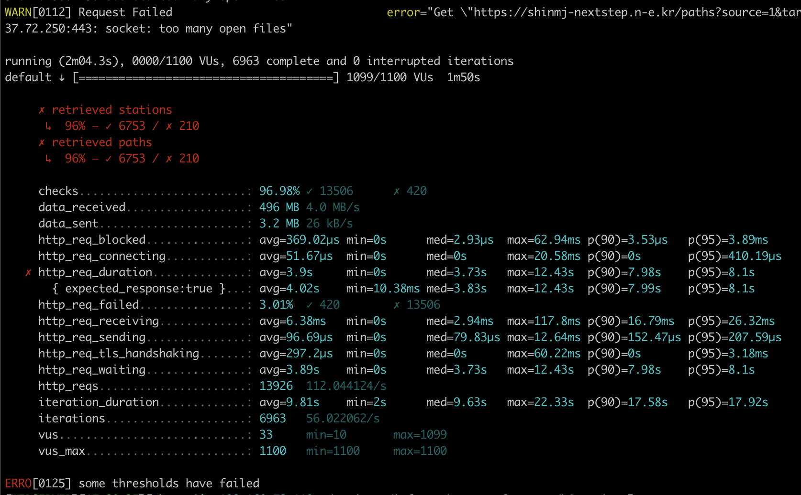
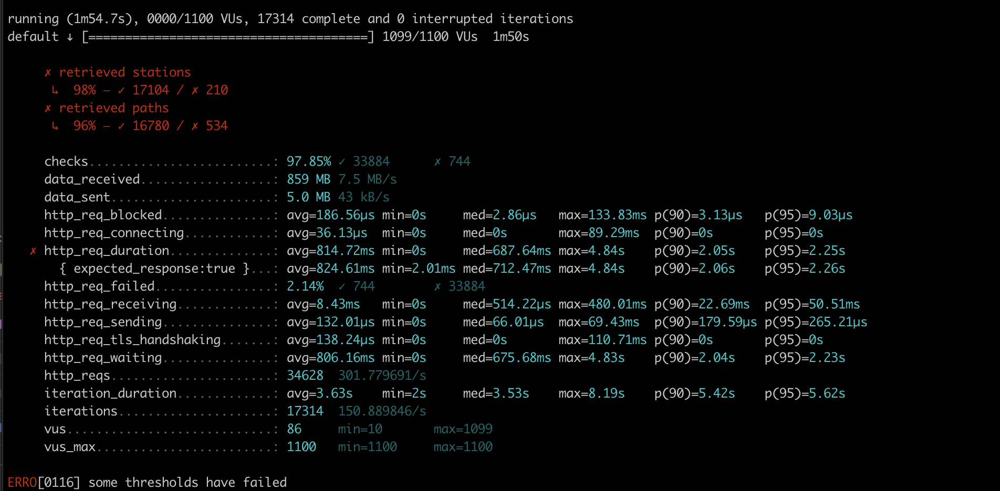

<p align="center">
    
</p>
<p align="center">
  
  
  <a href="https://edu.nextstep.camp/c/R89PYi5H" alt="nextstep atdd">
    
  </a>
  
</p>

<br>

# 인프라공방 샘플 서비스 - 지하철 노선도

<br>

## 🚀 Getting Started

### Install
#### npm 설치
```
cd frontend
npm install
```
> `frontend` 디렉토리에서 수행해야 합니다.

### Usage
#### webpack server 구동
```
npm run dev
```
#### application 구동
```
./gradlew clean build
```
<br>

## 미션

* 미션 진행 후에 아래 질문의 답을 작성하여 PR을 보내주세요.

### 1단계 - 화면 응답 개선하기
1. 성능 개선 결과를 공유해주세요 (Smoke, Load, Stress 테스트 결과)
### before stress


### after stress

2. 어떤 부분을 개선해보셨나요? 과정을 설명해주세요
### WAS 성능 개선하기 -> 경로 조회 
1. redis cache 적용 
   - 경로 조회 서비스에 spring data cache를 설정했습니다. 
2. 비동기 처리
   - 경로 조회 서비스에 `@Async` 어노테이션을 통해 비동기로 처리되도록 해보았습니다!!
    
### 결과
http_req_duration : 3.9s -> 814.72ms 
http_reqs : 13926 -> 34628

---

### 2단계 - 조회 성능 개선하기
1. 인덱스 적용해보기 실습을 진행해본 과정을 공유해주세요

#### 쿼리 최적화
활동중인(Active) 부서의 현재 부서관리자 중 연봉 상위 5위안에 드는 사람들이 최근에 각 지역별로 언제 퇴실했는지 조회해보세요.
(사원번호, 이름, 연봉, 직급명, 지역, 입출입구분, 입출입시간)
- [ ] 쿼리 작성만으로 1s 이하로 반환한다.
   * 총 시간 : 대락 0.6s
```sql
SELECT A1.사원번호, A4.지역
	, MAX(A2.이름) as 이름 
	, MAX(A1.연봉) as 연봉 
	, MAX(A3.직급명) as 직급명 
	, MAX(A4.입출입구분) as 입출입구분 
	, MAX(A4.입출입시간) as 입출입시간 
FROM (
		SELECT u.사원번호, p.연봉 
		 FROM ( 
			SELECT 사원번호
			 FROM 부서관리자 
			WHERE 부서번호 IN (
			  SELECT 부서번호 
					  FROM 부서
					 WHERE UPPER(비고) = 'ACTIVE'
				) 
			AND 종료일자 > NOW()
			) u
		    LEFT JOIN 급여 p
		   ON u.사원번호 = p.사원번호 
	      AND  p.종료일자 > NOW()
	    ORDER BY 연봉 DESC 
	    LIMIT 5
	     ) A1
   LEFT JOIN 사원 A2
	  ON A1.사원번호 = A2.사원번호 
   LEFT JOIN 직급 A3
	  ON A1.사원번호 = A3.사원번호 
LEFT JOIN 사원출입기록 A4
 ON A1.사원번호 = A4.사원번호
 WHERE A3.종료일자 > now()
 and A4.입출입구분 = 'O'
 GROUP BY 사원번호, 지역;
```
- [ ] 인덱스 설정 추가하여 50ms 이하로 반환한다.
- **부서.비고**에 **full text index**를 설정한다.
   부서 full table scan -> full text index search
- **사원출입기록.사원번호** 컬럼에 **index** 설정
   * 대략 10ms

```sql

SELECT A1.사원번호, A4.지역
	, MAX(A2.이름) as 이름 
	, MAX(A1.연봉) as 연봉 
	, MAX(A3.직급명) as 직급명 
	, MAX(A4.입출입구분) as 입출입구분 
	, MAX(A4.입출입시간) as 입출입시간 
FROM (
		SELECT u.사원번호, p.연봉 
		 FROM ( 
			SELECT 사원번호
			 FROM 부서관리자 
			WHERE 부서번호 IN (
			  SELECT 부서번호 
				FROM 부서
			WHERE MATCH (비고) AGAINST ('active' IN NATURAL LANGUAGE MODE)
				) 
			AND 종료일자 > NOW()
			) u
		    LEFT JOIN 급여 p
		   ON u.사원번호 = p.사원번호 
	      AND  p.종료일자 > NOW()
	    LIMIT 5
	     ) A1
   LEFT JOIN 사원 A2
	  ON A1.사원번호 = A2.사원번호 
   LEFT JOIN 직급 A3
	  ON A1.사원번호 = A3.사원번호 
LEFT JOIN 사원출입기록 A4
 ON A1.사원번호 = A4.사원번호
 WHERE A3.종료일자 > now()
 AND A4.입출입구분 = 'O'
 GROUP BY 사원번호, 지역;
```

### 인덱스 설계
* 주어진 데이터셋을 활용하여 아래 조회 결과를 100ms 이하로 반환
    - [ ] [Coding as a Hobby](https://insights.stackoverflow.com/survey/2018#developer-profile-_-coding-as-a-hobby)  와 같은 결과를 반환하세요.
        - programmer.id pk, not null 추가
        - programmer.hobby index 추가

```sql
ALTER TABLE `subway`.`programmer` 
CHANGE COLUMN `id` `id` BIGINT(20) NOT NULL ,
ADD PRIMARY KEY (`id`);

ALTER TABLE `subway`.`programmer` 
ADD INDEX `I_hobby` (`hobby` ASC);;

select (select count(id) from programmer where hobby = 'YES')/count(id) *100 as y_percent,
(select count(id) from programmer where hobby = 'NO')/count(id) *100 as n_percent
 from programmer;
```

- [ ]  프로그래머별로 해당하는 병원 이름을 반환하세요. (covid.id, hospital.name)
    * covid, hospital pk, not null 추가
    * covid.programmer_id index 추가
```sql
ALTER TABLE `subway`.`covid` 
CHANGE COLUMN `id` `id` BIGINT(20) NOT NULL ,
ADD PRIMARY KEY (`id`);

ALTER TABLE `subway`.`covid` 
ADD INDEX `I_programmer` (`programmer_id` ASC);
;

ALTER TABLE `subway`.`hospital` 
CHANGE COLUMN `id` `id` INT(11) NOT NULL ,
ADD PRIMARY KEY (`id`);
;

select a2.id, a3.name
from programmer a1
left join covid a2
 on a1.id = a2.programmer_id
left join hospital a3
  on a2.hospital_id = a3.id
where a2.id is not null;

```

- [ ] 프로그래밍이 취미인 학생 혹은 주니어(0-2년)들이 다닌 병원 이름을 반환하고 user.id 기준으로 정렬하세요. (covid.id, hospital.name, user.Hobby, user.DevType, user.YearsCoding)
    - programmer.hobby index 추가
```sql
ALTER TABLE `subway`.`programmer` 
ADD INDEX `I_hobby` (`hobby` ASC);
;

select b1.id, b2.id as covid_id, b3.name
  from (
select a1.id
 from programmer a1
 where a1.hobby = 'YES'
   and (a1.dev_type = 'Student' or a1.years_coding = '0-2 years')
   ) b1
left join covid b2
on b1.id = b2.programmer_id
left join hospital b3
on b2.hospital_id = b3.id
order by b1.id
;
```
- [ ] 서울대병원에 다닌 20대 India 환자들을 병원에 머문 기간별로 집계하세요. (covid.Stay)
  * hospital.name 에 유니크 인덱스 추가하기 위해 text -> varchar 타입 변경
  * covid.hospital_id index 추가
  * programmer.country index 추가
  * member.age index 추가 
```sql
ALTER TABLE `subway`.`hospital` 
CHANGE COLUMN `name` `name` VARCHAR(255) NULL DEFAULT NULL ,
ADD UNIQUE INDEX `name_UNIQUE` (`name` ASC);
;

ALTER TABLE `subway`.`covid` 
ADD INDEX `I_hospital` (`hospital_id` ASC);
;

ALTER TABLE `subway`.`programmer` 
ADD INDEX `I_country` (`country` ASC);
;

ALTER TABLE `subway`.`member` 
ADD INDEX `I_age` (`age` ASC);
;

select a2.stay, count(a2.id) as cnt
 from hospital a1
 left join covid a2
   on a1.id = a2.hospital_id
 left join programmer a3
   on a2.programmer_id = a3.id
 left join member a4
  on a2.member_id = a4.id
where a1.name = '서울대병원'
  and a3.country = 'India'
  and a4.age >= 20 and a4.age < 30
group by a2.stay
;

```
- [ ] 서울대병원에 다닌 30대 환자들을 운동 횟수별로 집계하세요. (user.Exercise)
    * 기존 추가된 인덱스만으로도 요구사항 만족
```sql
select a3.exercise, count(a2.id)
 from hospital a1
 left join covid a2
   on a1.id = a2.hospital_id
 left join programmer a3
   on a2.programmer_id = a3.id
 left join member a4
  on a2.member_id = a4.id
where a1.name = '서울대병원'
  and a4.age >= 30 and a4.age < 40
group by a3.exercise
;
```

2. 페이징 쿼리를 적용한 API endpoint를 알려주세요
 -  https://shinmj-nextstep.n-e.kr/stations?page=1&size=2
 - **지하철역 목록을 조회해 오는 API에 페이징 쿼리를 적용함.**
```json
{
    "content": [
        {
            "id": 3,
            "name": "선릉역",
            "createdDate": "20211226",
            "modifiedDate": "20211226"
        }
    ],
    "pageable": {
        "sort": {
            "unsorted": false,
            "sorted": true,
            "empty": false
        },
        "pageNumber": 1,
        "pageSize": 2,
        "offset": 2,
        "paged": true,
        "unpaged": false
    },
    "sort": {
        "unsorted": false,
        "sorted": true,
        "empty": false
    },
    "first": false,
    "last": true,
    "numberOfElements": 1,
    "number": 1,
    "size": 2,
    "empty": false
}
```