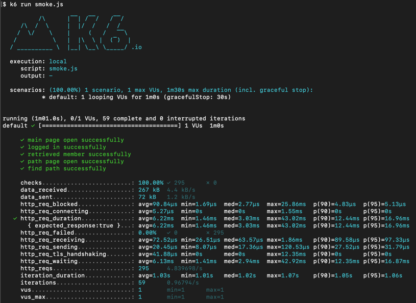
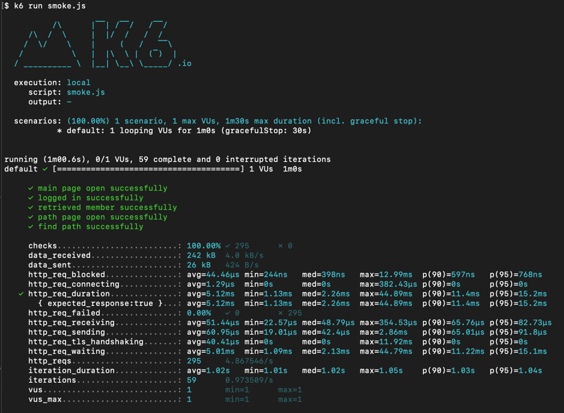
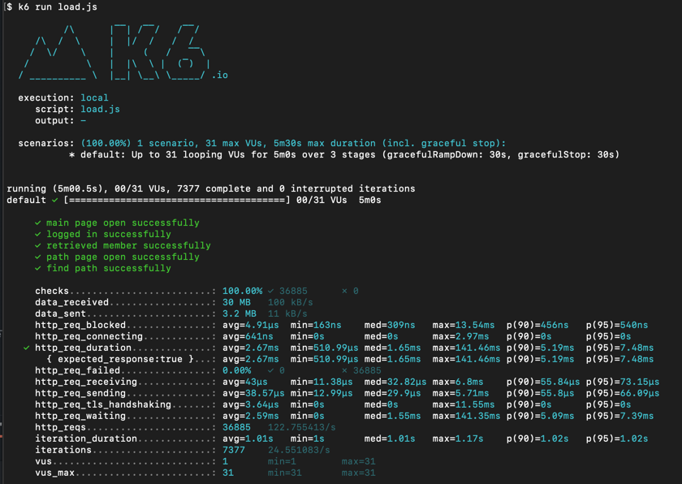
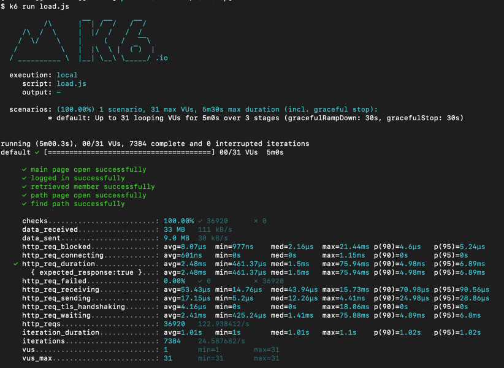
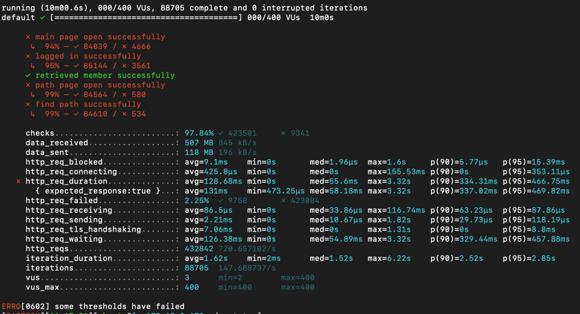
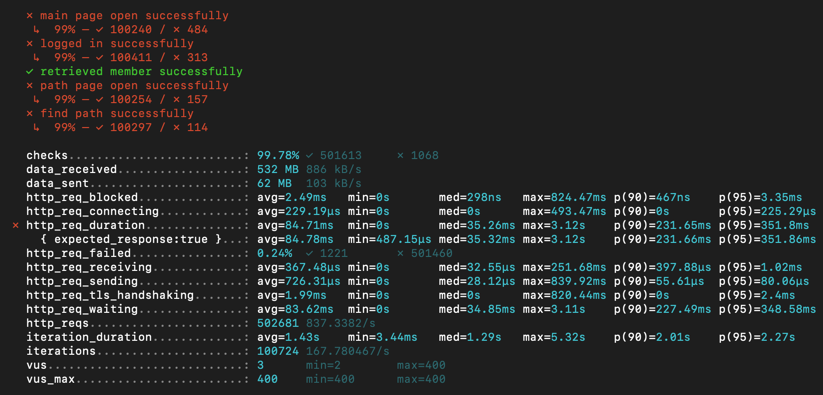

<p align="center">
    
</p>
<p align="center">
  
  
  <a href="https://edu.nextstep.camp/c/R89PYi5H" alt="nextstep atdd">
    
  </a>
  
</p>

<br>

# 인프라공방 샘플 서비스 - 지하철 노선도

<br>

## 🚀 Getting Started

### Install

#### npm 설치

```
cd frontend
npm install
```

> `frontend` 디렉토리에서 수행해야 합니다.

### Usage

#### webpack server 구동

```
npm run dev
```

#### application 구동

```
./gradlew clean build
```

<br>

## 미션

* 미션 진행 후에 아래 질문의 답을 작성하여 PR을 보내주세요.

### 1단계 - 화면 응답 개선하기

1. 성능 개선 결과를 공유해주세요 (Smoke, Load, Stress 테스트 결과)

- smoke
    - before
        - 
    - after
        - 
- load
    - before
        - 
    - after
        - 
- stress
    - before
        - 
    - after
        - 

2. 어떤 부분을 개선해보셨나요? 과정을 설명해주세요

- 처음엔 생각했던 것만큼 개선 효과를 크게 확인할 수 없어서 기존 메모리 db 를 외장 db 로 교체한 후 테스트를 다시 진행하니 조금은 더 개선효과를 확인할 수 있었습니다

- web(리버스 프록시)
    - gzip 압축
    - 정적자원 cache
    - TLS, HTTP/2
- was(tomcat)
    - redis cache 도입
        - 주요 조회(경로조회, 노선조회)에 적용

---

### 2단계 - 스케일 아웃

1. Launch Template 링크를 공유해주세요.

2. cpu 부하 실행 후 EC2 추가생성 결과를 공유해주세요. (Cloudwatch 캡쳐)

```sh
$ stress -c 2
```

3. 성능 개선 결과를 공유해주세요 (Smoke, Load, Stress 테스트 결과)

---

### 3단계 - 쿼리 최적화

1. 인덱스 설정을 추가하지 않고 아래 요구사항에 대해 1s 이하(M1의 경우 2s)로 반환하도록 쿼리를 작성하세요.

- 활동중인(Active) 부서의 현재 부서관리자 중 연봉 상위 5위안에 드는 사람들이 최근에 각 지역별로 언제 퇴실했는지 조회해보세요. (사원번호, 이름, 연봉, 직급명, 지역, 입출입구분, 입출입시간)

---

### 4단계 - 인덱스 설계

1. 인덱스 적용해보기 실습을 진행해본 과정을 공유해주세요

---

### 추가 미션

1. 페이징 쿼리를 적용한 API endpoint를 알려주세요

### Step 요구사항

## step1

-[x] 부하테스트 각 시나리오의 요청시간을 목푯값 이하로 개선
    -[x] 개선 전/후를 직접 계측하여 확인
        -[x] 리버스 프록시 개선
        -[x] was 성능 개선

## step2

-[x] springboot에 HTTP Cache, gzip 설정하기
    -[x] test code
-[ ] Launch Template 작성하기
-[ ] Auto Scaling Group 생성하기
-[ ] Smoke, Load, Stress 테스트 후 결과를 기록
