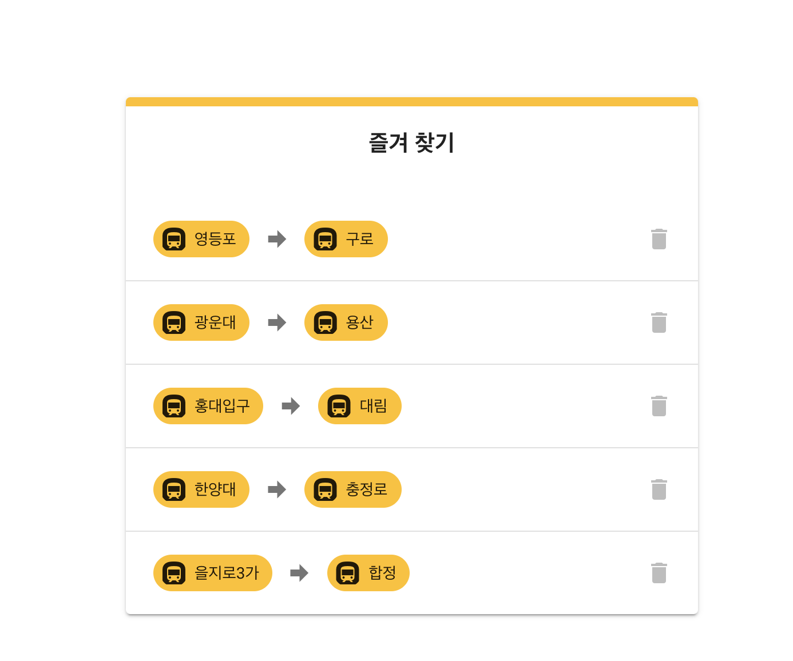

<p align="center">
    
</p>
<p align="center">
  
  
  <a href="https://edu.nextstep.camp/c/R89PYi5H" alt="nextstep atdd">
    
  </a>
  
</p>

<br>

# 인프라공방 샘플 서비스 - 지하철 노선도

<br>

## 🚀 Getting Started

### Install
#### npm 설치
```
cd frontend
npm install
```
> `frontend` 디렉토리에서 수행해야 합니다.

### Usage
#### webpack server 구동
```
npm run dev
```
#### application 구동
```
./gradlew clean build
```
<br>

## 미션

* 미션 진행 후에 아래 질문의 답을 작성하여 PR을 보내주세요.

### 1단계 - 화면 응답 개선하기
1. 성능 개선 결과를 공유해주세요 (Smoke, Load, Stress 테스트 결과)
- asset 파일에 성능 테스트 전후 결과 추가하였습니다.
- 각 시나리오의 요청시간을 50ms 이하로 개선

2. 어떤 부분을 개선해보셨나요? 과정을 설명해주세요
#### Front
- 번들 크기 줄이기 : 웹팩 설정에서 용량이 작은 라이브러리로 교체하여 성능을 개선하였습니다.
- 프론트 라이브러리 비동기로 변경: LightHouse에서 제안하는 초반 지연 로딩 개선
#### Nginx
- 서버 이중화로 트래픽 분산 환경으로 개선.
- gzip 압축 활성
- css|js|gif|png|jpg|jpeg 의 캐싱  
- HTTP 2.0 지원

    
#### WAS
- Redis 적용
    - 자주 사용되는 조회 기능에 redis 캐시를 적용.
    - 내부망 레디스를 통해서 캐시된 내용 로드
- 서버에서 압축을 지원하도록 수정
- 정적 자원 캐싱

---

### 2단계 - 조회 성능 개선하기
1. 인덱스 적용해보기 실습을 진행해본 과정을 공유해주세요 
    1. Coding as a Hobby 와 같은 결과를 반환하세요.
    - asset 폴더 sql, problem1의 조회 결과 첨부하였습니다.
    - Programmer의 테이블의 PK를 설정하고, hobby column에 index를 걸었습니다.
    2. 프로그래머별로 해당하는 병원 이름을 반환하세요. 
    - Covid, Hospital, Programmer 테이블의 id에 PK를 설정했습니다.
    - Covid의 programmer column에 인덱스를 설정했습니다. 
    - Hospital의 데이터가 32개라서 불필요한 인덱스는 설정하지 않았습니다.
    3. 프로그래밍이 취미인 학생 혹은 주니어(0-2년)들이 다닌 병원 이름을 반환하고 programmer.id 기준으로 정렬하세요.
    - Programmer 테이블의 hobby, student, years_coding 항목에 인덱스 설정.
    4. 서울대병원에 다닌 20대 India 환자들을 병원에 머문 기간별로 집계하세요.
    - Hospital, Covid, Programmer, Member의 id에 PK 설정
    - Programmer의 country에 index 설정
    - Covid의 stay에 인덱스 설정
    5. 서울대병원에 다닌 30대 환자들을 운동 횟수별로 집계하세요.
    - Hospital, Covid, Programmer, Member의 id에 PK 설정
    - Programmer의 excercise의 인덱스 설정
    - Covid의 programmer_id 인덱스 설정. hospital_id에 인덱스 설정

2. 페이징 쿼리를 적용한 API endpoint를 알려주세요
- https://happy-subway.p-e.kr/favorites
- id: user@test.com pw: 1234



- 로그인한 사용자는 최근에 추가한 즐겨찾기만 관심이 있기에 한번에 5개의 즐겨찾기만 보고 싶다.

3. 데이터베이스 이중화
- master - slave 이중화
