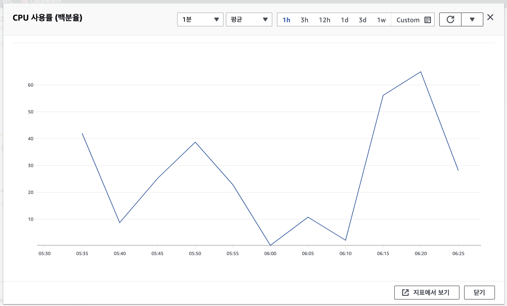
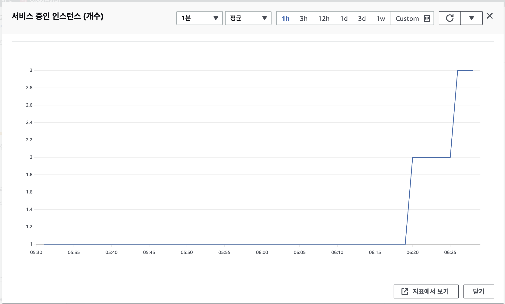
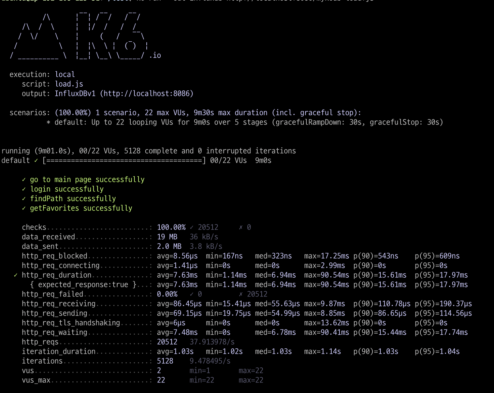
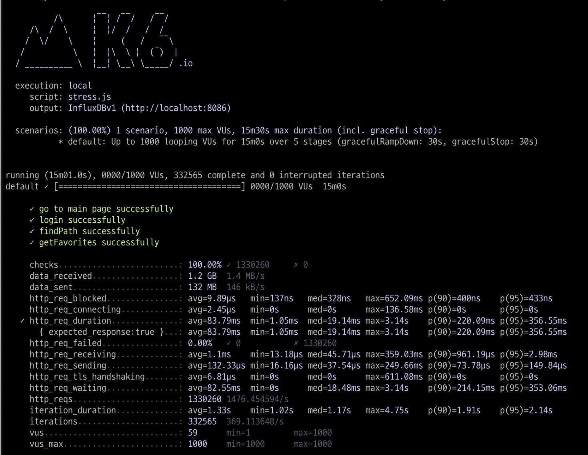
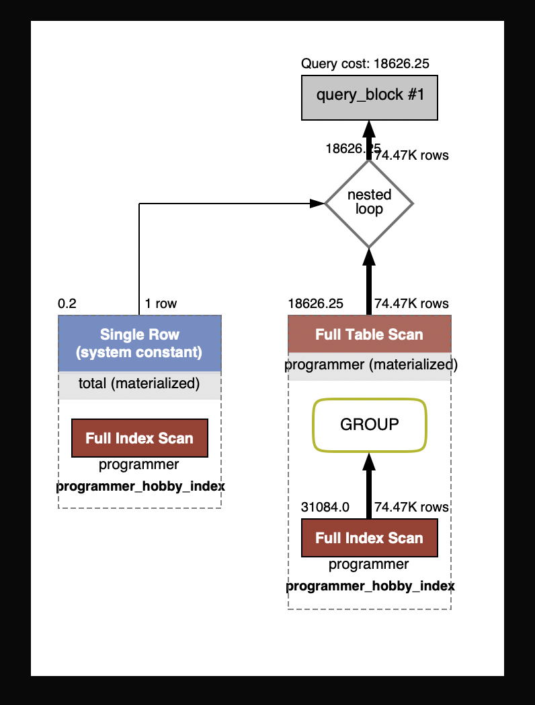
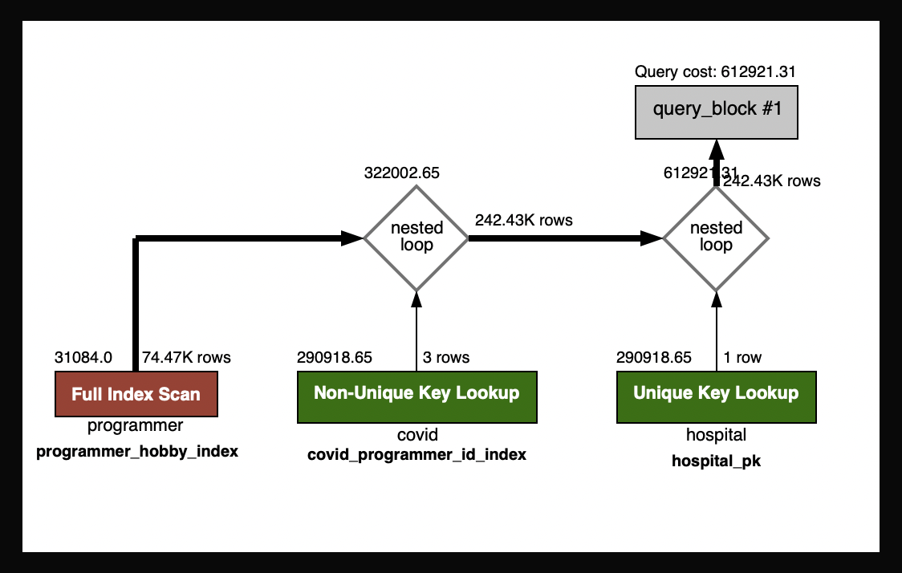
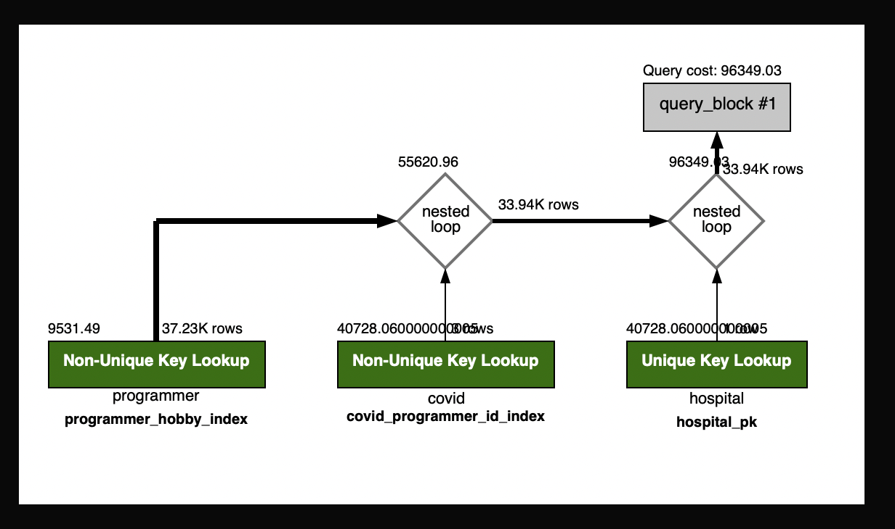
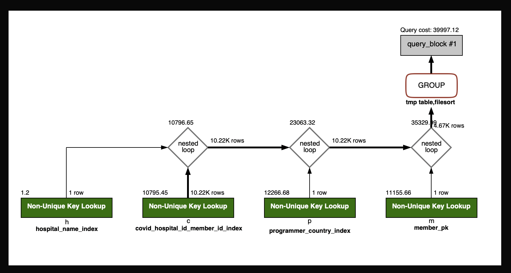
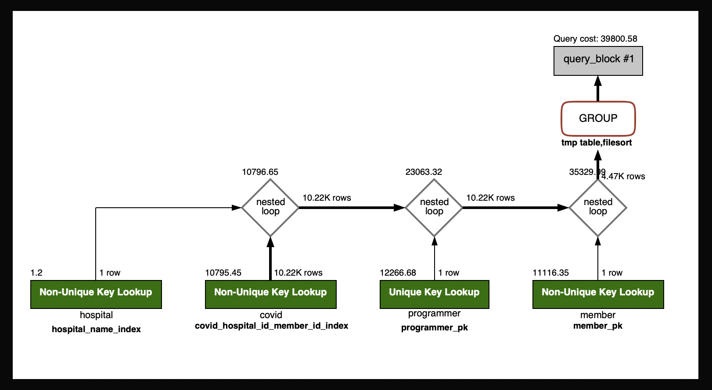
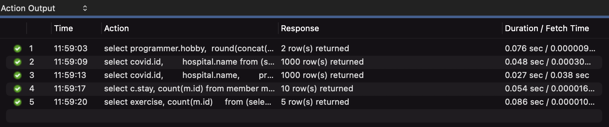

<p align="center">
    
</p>
<p align="center">
  
  
  <a href="https://edu.nextstep.camp/c/R89PYi5H" alt="nextstep atdd">
    
  </a>
  
</p>

<br>

# 인프라공방 샘플 서비스 - 지하철 노선도

<br>

## 🚀 Getting Started

### Install

#### npm 설치

```
cd frontend
npm install
```

> `frontend` 디렉토리에서 수행해야 합니다.

### Usage

#### webpack server 구동

```
npm run dev
```

#### application 구동

```
./gradlew clean build
```

<br>

## 미션

* 미션 진행 후에 아래 질문의 답을 작성하여 PR을 보내주세요.

### 1단계 - 화면 응답 개선하기

1. 성능 개선 결과를 공유해주세요 (Smoke, Load, Stress 테스트 결과)

* 
* 
* 

* 개선 전 / 후 계측 비교

| 구분         | FCP   | TTI   | SP    | TBT   | LCP  | CLS   |
|------------|-------|-------|-------|-------|------|-------|
| 서울교통공사     | 6.5s  | 9.2s  | 11.9s | 0.187s | 6.7s | 0     |
| 네이버 지도     | 2.2s  | 6.5s  | 5.4s  | 0.34s | 8.1s | 0.03  |
| 카카오맵       | 1.7s  | 4.2s  | 7.1s  | 0.05s | 6.4s | 0.005 |
| 내 사이트 개선 전 | 14.3s | 14.9s | 14.3s | 0.48s | 15s  | 0.042 |
| 내 사이트 개선 후 | 2.5s  | 5.6s  | 4.7s  | 0.62s | 5.7s | 0.041 |

2. 어떤 부분을 개선해보셨나요? 과정을 설명해주세요

* @Trancsactional(readOnly=true) 읽기전용 트랜잭션 처리
* nginx Reverse Proxy 개선
* gzip 압축,
* 캐시적용
* TLS, HTTP/2 설정

---

### 2단계 - 스케일 아웃

1. Launch Template 링크를 공유해주세요.

* [x] springboot에 HTTP Cache, gzip 설정하기
    * [x] 모든 정적 자원에 대해 no-cache, private 설정을 하고 테스트 코드를 통해 검증합니다.
    * [x] 확장자는 css인 경우는 max-age를 1년, js인 경우는 no-cache, private 설정을 합니다.
    * [x] 모든 정적 자원에 대해 no-cache, no-store 설정을 한다. 가능한가요? => 가능하다.
        * 정적자원 root 경로로 setCacheControl(CacheControl.noStore().mustRevalidate()) 설정추가
        * no-cache 값은 대부분의 브라우저에서 max-age=0 과 동일한 뜻을 가집니다. 즉, 캐시는 저장하지만 사용하려고 할 때마다 서버에 재검증 요청을 보내야 합니다.
        * no-store 값은 캐시를 절대로 해서는 안 되는 리소스일 때 사용합니다. 캐시를 만들어서 저장조차 하지 말라는 가장 강력한 Cache-Control 값입니다. no-store를 사용하면
          브라우저는 어떤 경우에도 캐시 저장소에 해당 리소스를 저장하지 않습니다.
* [x] Launch Template 작성하기
* [x] Auto Scaling Group 생성하기
* [x] DNS 설정  
  [Launch Template 링크](https://ap-northeast-2.console.aws.amazon.com/ec2/v2/home?region=ap-northeast-2#LaunchTemplateDetails:launchTemplateId=lt-02f3ad26f57232498)


2. cpu 부하 실행 후 EC2 추가생성 결과를 공유해주세요. (Cloudwatch 캡쳐)
   
   

3. 성능 개선 결과를 공유해주세요 (Smoke, Load, Stress 테스트 결과)
   
   
   

```sh
$ stress -c 2
```

---

### 1단계 - 쿼리 최적화

1. 인덱스 설정을 추가하지 않고 아래 요구사항에 대해 1s 이하(M1의 경우 2s)로 반환하도록 쿼리를 작성하세요.

- [x] 활동중인(Active) 부서의 현재 부서관리자 중 연봉 상위 5위안에 드는 사람들이 최근에 각 지역별로 언제 퇴실했는지 조회해보세요. (사원번호, 이름, 연봉, 직급명, 지역, 입출입구분, 입출입시간)
- [x] 인덱스 설정을 추가하지 않고 1s 이하로 반환합니다. => 0.279 sec 소요

```mysql

select e.id            as '사원번호',
       e.last_name     as '이름',
       s.annual_income as '연봉',
       p.position_name as '직책명',
       r.region        as '지역명',
       r.record_symbol as '입출입구분',
       r.time          as '입출입시간'
from employee e
         inner join (
    select id, annual_income
    from salary
    where id in (
        select employee_id
        from manager
        where department_id in (
            select id
            from department
            where note = 'Active')
          and start_date <= now()
          and end_date >= now()
    )
      and start_date <= now()
      and end_date >= now()
    order by annual_income desc
    limit 5
) s on e.id = s.id
         inner join position p on e.id = p.id and p.start_date <= now() and p.end_date >= now()
         inner join record r on e.id = r.employee_id and r.record_symbol = 'O';

```

---

### 2단계 - 인덱스 설계

1. 인덱스 적용해보기 실습을 진행해본 과정을 공유해주세요

#### 테이블 별 PK, Index 설정 정보

|Table       | Key_name                          | Column_name |
|------------|-----------------------------------|---------------
| covid      | PRIMARY                           | id
| covid      | covid_hospital_id_member_id_index | hospital_id, member_id
| covid      | idx_covid_programmer_id           | programmer_id

|Table       | Key_name                 | Column_name |
|------------|--------------------------|---------------
| hospital   | PRIMARY                  | id
| hospital   | hospital_name_index      | name

|Table       | Key_name                 | Column_name |
|------------|--------------------------|---------------
| member     | PRIMARY                  | id
| member     | member_age_index         | age

|Table       | Key_name                  | Column_name |
|------------|---------------------------|---------------
| programmer | PRIMARY                   | id
| programmer | programmer_country_index  | country
| programmer | programmer_exercise_index | exercise
| programmer | programmer_hobby_index    | hobby

---

#### Q1. Coding as a Hobby 와 같은 결과를 반환하세요.

```mysql
select programmer.hobby,
       round(concat((programmer.cnt / total.cnt) * 100, "%"), 2) as percentage
from (
         select hobby,
                count(id) as cnt
         from programmer
         group by hobby
     ) as programmer
         inner join (
    select count(id) as cnt
    from programmer
) as total on 1 = 1;
```



---

#### Q2. 프로그래머별로 해당하는 병원 이름을 반환하세요. (covid.id, hospital.name)

```mysql
select covid.id,
       hospital.name
from (select id from subway.programmer) as programmer
         inner join (select id, hospital_id, programmer_id from covid) as covid on covid.programmer_id = programmer.id
         inner join (select id, name from hospital) as hospital on covid.hospital_id = hospital.id;
```



---

#### Q3. 프로그래밍이 취미인 학생 혹은 주니어(0-2년)들이 다닌 병원 이름을 반환하고 user.id 기준으로 정렬하세요. (covid.id, hospital.name, user.Hobby, user.DevType, user.YearsCoding)

```mysql
select covid.id,
       hospital.name,
       programmer.hobby,
       programmer.dev_type,
       programmer.years_coding
from (
         select id, hobby, dev_type, years_coding
         from programmer
         where hobby = 'Yes'
           and (
                     student in ('Yes, part-time', 'Yes, full-time')
                 or years_coding = '0-2 years'
             )
     ) programmer
         inner join (select id, hospital_id, programmer_id from covid) as covid on covid.programmer_id = programmer.id
         inner join (select id, name from hospital) as hospital on covid.hospital_id = hospital.id;
```



---

#### Q4. 서울대병원에 다닌 20대 India 환자들을 병원에 머문 기간별로 집계하세요. (covid.Stay)

```mysql
select c.stay, count(m.id)
from member m
         inner join programmer p on m.id = p.id and p.country = 'india'
         inner join covid c on c.programmer_id = p.id
         inner join hospital h on h.id = c.hospital_id and name = '서울대병원'
where age between 20 and 29
group by stay;
```



---

#### Q5. 서울대병원에 다닌 30대 환자들을 운동 횟수별로 집계하세요. (user.Exercise)

```mysql
select exercise, count(m.id)
from (select id from member where age between 30 and 39) m
         inner join (select id, exercise from programmer) p on m.id = p.id
         inner join (select hospital_id, programmer_id, stay from covid) c on c.programmer_id = p.id
         inner join (select id from hospital where name = '서울대병원') h on h.id = c.hospital_id
group by exercise;
```



---

#### 실행시간



---

### 추가 미션

1. 페이징 쿼리를 적용한 API endpoint를 알려주세요
