<p align="center">
    
</p>
<p align="center">
  
  
  <a href="https://edu.nextstep.camp/c/R89PYi5H" alt="nextstep atdd">
    
  </a>
  
</p>

<br>

# 인프라공방 샘플 서비스 - 지하철 노선도

<br>

## 🚀 Getting Started

### Install
#### npm 설치
```
cd frontend
npm install
```
> `frontend` 디렉토리에서 수행해야 합니다.

### Usage
#### webpack server 구동
```
npm run dev
```
#### application 구동
```
./gradlew clean build
```
<br>

## 미션

* 미션 진행 후에 아래 질문의 답을 작성하여 PR을 보내주세요.


### 1단계 - 화면 응답 개선하기
1. 성능 개선 결과를 공유해주세요 (Smoke, Load, Stress 테스트 결과)

#### load

- before
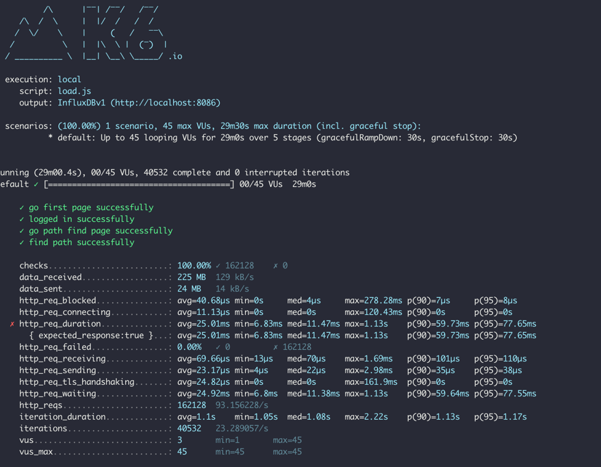

- after
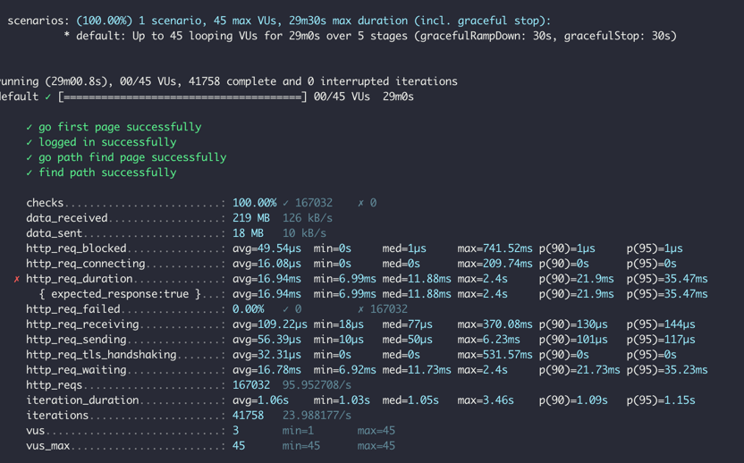

#### smoke

- bofore
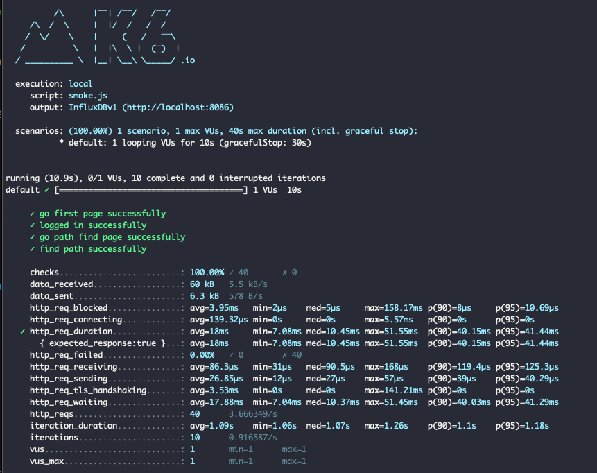

- after
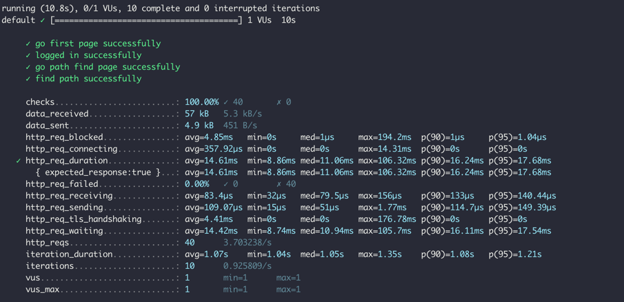
#### stress

- before
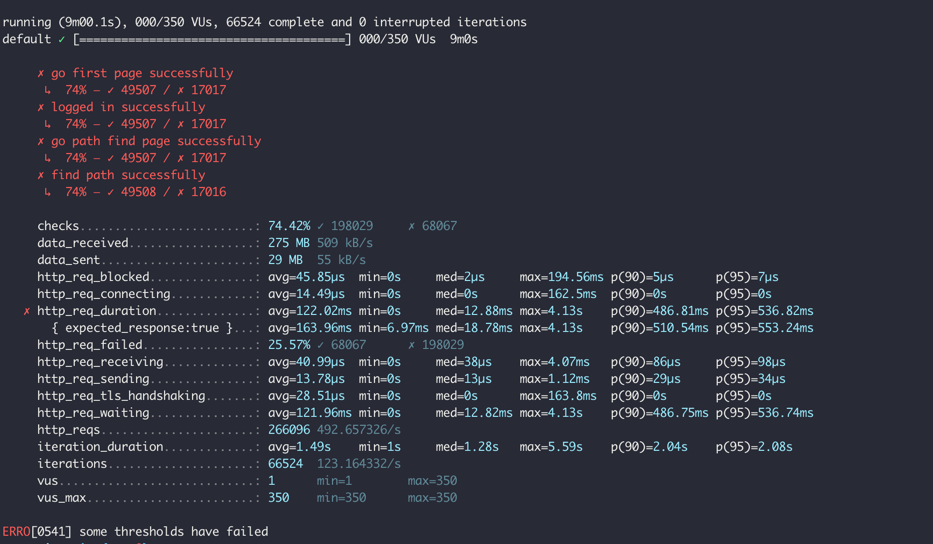
- after
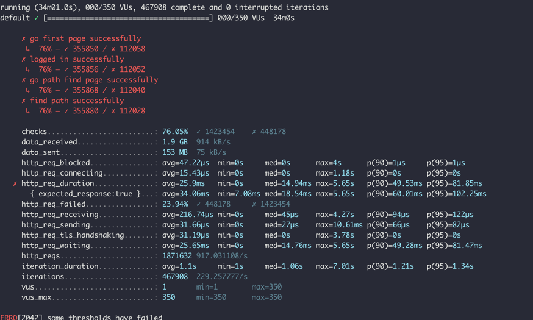


2. 어떤 부분을 개선해보셨나요? 과정을 설명해주세요
#### proxy server
- gzip 압축 설정
- cache 설정
- http2 설정

#### was
- redis cache 적용

---

### 2단계 - 스케일 아웃

#### 요구사항

- [x] springboot에 HTTP Cache, gzip 설정하기
  - [x] 모든 정적 자원에 대해 no-cache, private 설정을 하고 테스트 코드를 통해 검증합니다.
  - [x] 확장자는 css인 경우는 max-age를 1년, js인 경우는 no-cache, private 설정을 합니다.
  - [x] 모든 정적 자원에 대해 no-cache, no-store 설정을 한다. 가능한가요?
    - no-cache, no-store를 동시에 적용할 수 있는가? 가 질문이라면, 두 개의 내용이 상반되기 때문에 불가능 합니다.
- [x] Launch Template 작성하기
- [x] Auto Scaling Group 생성하기
- [x] Smoke, Load, Stress 테스트 후 결과를 기록

1. Launch Template 링크를 공유해주세요.
   https://ap-northeast-2.console.aws.amazon.com/ec2/home?region=ap-northeast-2#LaunchTemplateDetails:launchTemplateId=lt-0c26235b6417afc54

2. cpu 부하 실행 후 EC2 추가생성 결과를 공유해주세요. (Cloudwatch 캡쳐)

```sh
$ stress -c 2
```
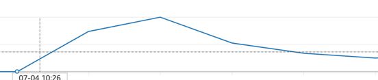

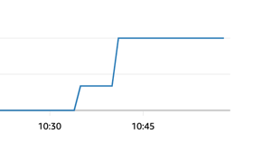

3. 성능 개선 결과를 공유해주세요 (Smoke, Load, Stress 테스트 결과)

- 성능 개선을 위해, 네트워크 입력 크기를 이용해, 인스턴스의 양을 조절하도록 했습니다.

#### smoke

#### load
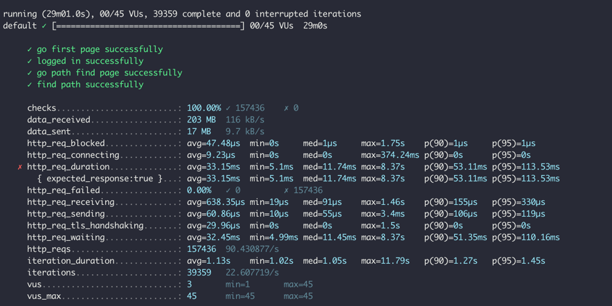

#### stress

- 지난 코멘트를 참고 해 동시 요청자가 250명이 넘어가게 되면 실패가 되는 것을 확인했습니다.
- 실패 지점을 찾은 후에, 해당 부하의 강도로 지속시킨 후, 부하를 낮추는 방식으로 스트레스 테스트 진행했습니다.


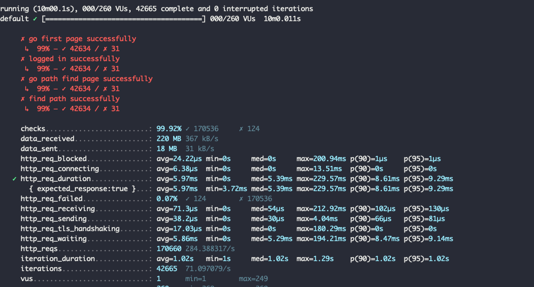
---

### 1단계 - 쿼리 최적화

1. 인덱스 설정을 추가하지 않고 아래 요구사항에 대해 1s 이하(M1의 경우 2s)로 반환하도록 쿼리를 작성하세요.

- 활동중인(Active) 부서의 현재 부서관리자 중 연봉 상위 5위안에 드는 사람들이 최근에 각 지역별로 언제 퇴실했는지 조회해보세요. (사원번호, 이름, 연봉, 직급명, 지역, 입출입구분, 입출입시간)
- 인덱스 설정을 추가하지 않고 1s 이하로 반환합니다.

```
select e.id '사원번호', e.last_name '이름', top_five_salary.annual_income '연봉', p.position_name '직급명', r.time '입출입시간', r.region '지역', r.record_symbol '입출입구분'
from employee e
	    inner join (
	            select s.id, s.annual_income
	            from salary s
	            where s.id in (
	                select employee_id
	                from manager m
	                where m.department_id in (
	                    select d.id
	                    from department d
	                    where d.note = 'active'
	                ) and m.end_date > now()
	            ) and s.end_date > now()
	            order by s.annual_income desc 
	            limit 5
	    ) top_five_salary on top_five_salary.id = e.id
inner join position p on p.id = e.id and p.end_date > now()
inner join record r on r.employee_id = e.id and r.record_symbol = 'O';
```

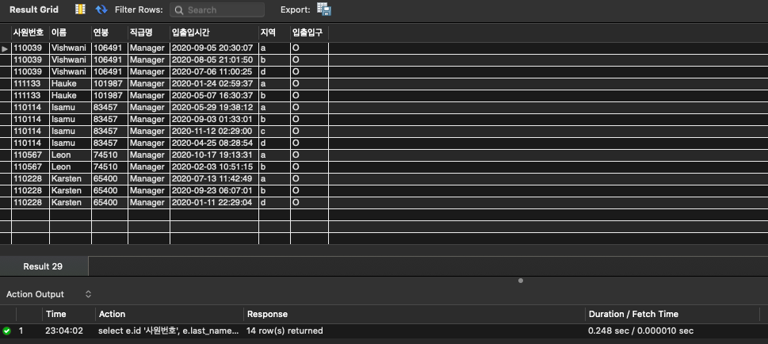


---

### 2단계 - 인덱스 설계

1. 인덱스 적용해보기 실습을 진행해본 과정을 공유해주세요

- [ ] Coding as a Hobby 와 같은 결과를 반환하세요.

sql
```roomsql
select  p.hobby, count(hobby) / (select count(hobby) from programmer) * 100 percent
from  programmer p
group by hobby;
```
index
```roomsql
ALTER TABLE `subway`.`programmer` 
ADD INDEX `idx_hobby` (`hobby` ASC);
```

#### before
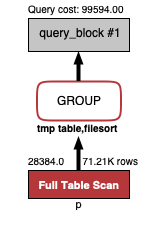

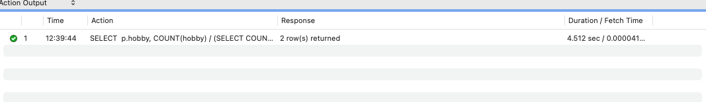
#### after
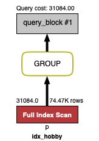

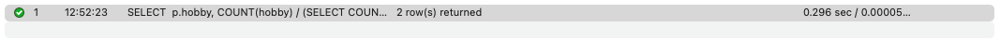

- [x] 프로그래머별로 해당하는 병원 이름을 반환하세요. (covid.id, hospital.name)
sql
```roomsql
select c.id, h.name 
from hospital h
	inner join covid c on c.hospital_id = h.id
    inner join programmer p on p.id = c.programmer_id;
```
index
```roomsql
ALTER TABLE `subway`.`programmer` 
CHANGE COLUMN `id` `id` BIGINT(20) NOT NULL ,
ADD PRIMARY KEY (`id`);

ALTER TABLE `subway`.`covid` 
CHANGE COLUMN `id` `id` BIGINT(20) NOT NULL ,
ADD PRIMARY KEY (`id`);

ALTER TABLE `subway`.`hospital` 
CHANGE COLUMN `id` `id` INT(11) NOT NULL ,
ADD PRIMARY KEY (`id`);

ALTER TABLE `subway`.`covid` 
ADD INDEX `idx_covid_programmer_id` (`programmer_id` ASC);

ALTER TABLE `subway`.`covid` 
ADD INDEX `idx_covid_hospital_id` (`hospital_id` ASC);
```

#### before
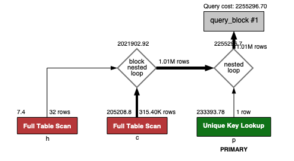

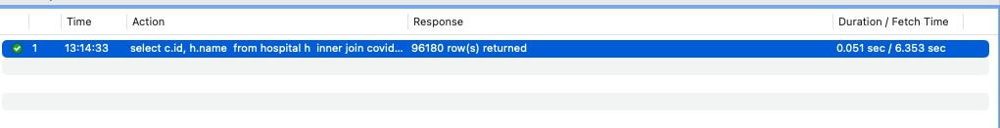
#### after
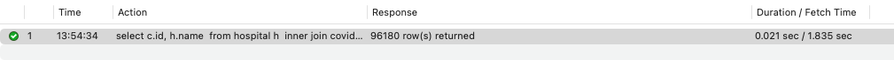

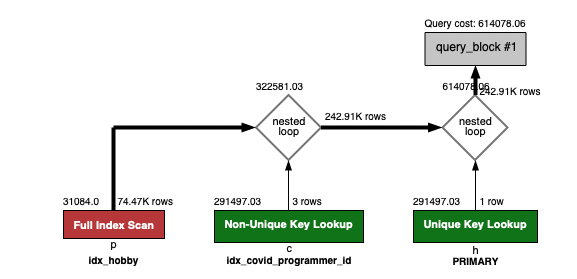

- [x] 프로그래밍이 취미인 학생 혹은 주니어(0-2년)들이 다닌 병원 이름을 반환하고 user.id 기준으로 정렬하세요. (covid.id, hospital.name, user.Hobby, user.DevType, user.YearsCoding)

```roomsql
select c.id, c.hospital_name, p.hobby, p.dev_type, p.years_coding
 from (
	select c.id, c.programmer_id, h.name hospital_name
 	from hospital h
 	inner join covid c 
     on c.hospital_id = h.id
 ) c
 inner join (
 	select id, hobby, student, dev_type, years_coding
     from programmer p
     where p.hobby = 'Yes' and (p.student <> 'No' or p.years_coding = '0-2 years'
 ) p
 on p.id = c.programmer_id
 order by p.id;
```
index 변화 없음

#### result

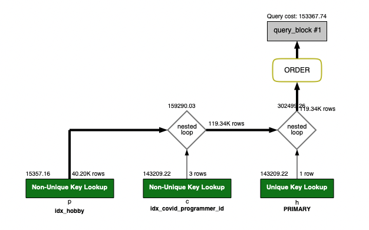

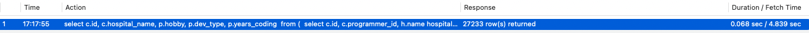

- [x] 서울대병원에 다닌 20대 India 환자들을 병원에 머문 기간별로 집계하세요. (covid.Stay)

```roomsql
select c.stay, count(c.stay) count
from covid c
where c.hospital_id in 
			(select id from hospital where name = '서울대병원') 
			and c.programmer_id in (
                            select id
                            from programmer
                            where id in (select id from member where age >= 20 AND age < 30) and country = 'India')
group by c.stay;
```

index
```roomsql
ALTER TABLE `subway`.`member` 
CHANGE COLUMN `id` `id` BIGINT(20) NOT NULL ,
ADD PRIMARY KEY (`id`);

ALTER TABLE `subway`.`programmer` 
ADD INDEX `idx_member_id_country` (`member_id` ASC, `country` ASC

ALTER TABLE `subway`.`hospital` 
ADD INDEX `idx_name` (`name` ASC);

ALTER TABLE `subway`.`member` 
ADD INDEX `idx_age` (`age` ASC);
```

#### before
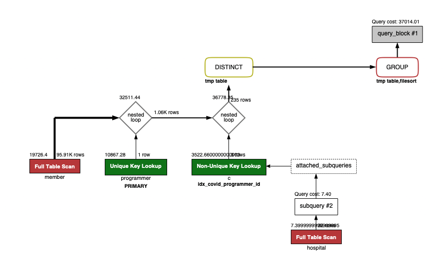

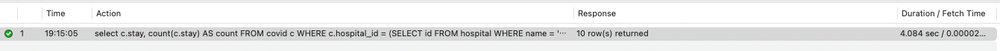
#### after
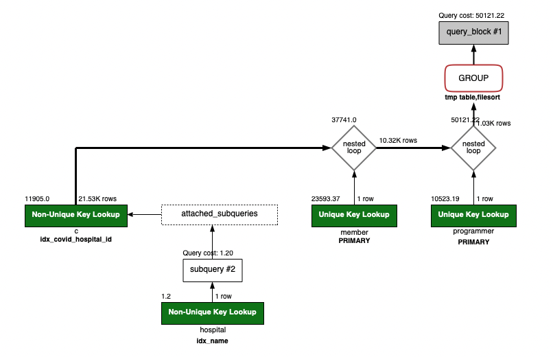

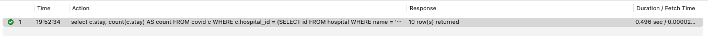

- [x] 서울대병원에 다닌 30대 환자들을 운동 횟수별로 집계하세요. (user.Exercise)

sql
```roomsql
select p.exercise, count(p.exercise) 
from covid c
inner join ( select id from hospital where name = '서울대병원' ) h on h.id = c.hospital_id
inner join (
 		select p.member_id, p.exercise
 		from programmer p
        inner join (select m.id from member m where m.age >= 30 and m.age < 40 ) m on m.id = p.member_id
 ) p
on p.member_id = c.member_id
group by p.exercise;
```
index 변화 없음

#### result
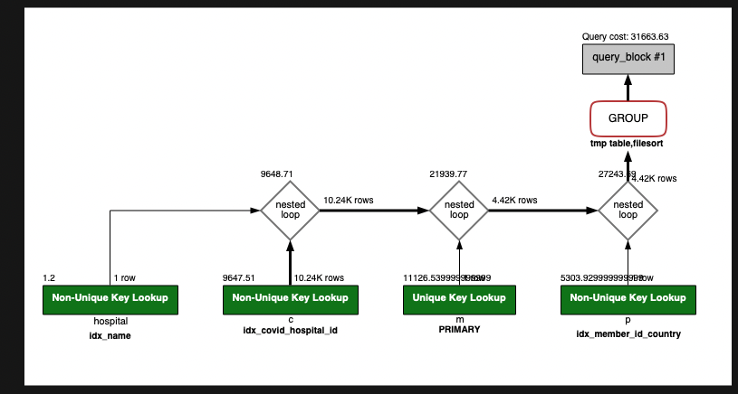
---

### 추가 미션

- [x] master, slave db 구성
#### master
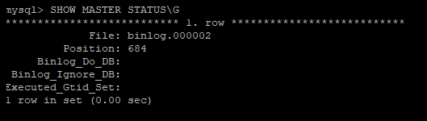
#### slave
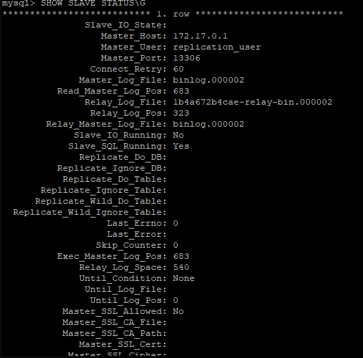
- [x] app db properties 설정
- [ ] 페이징 적용

1. 페이징 쿼리를 적용한 API endpoint를 알려주세요
