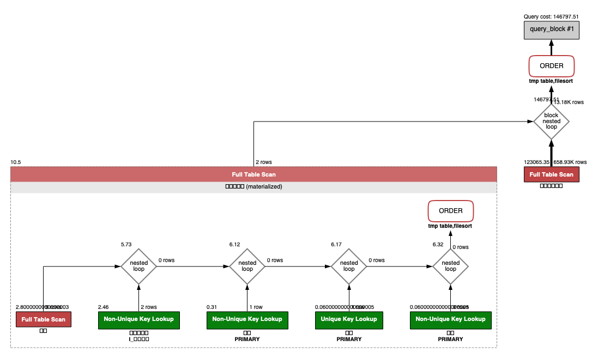
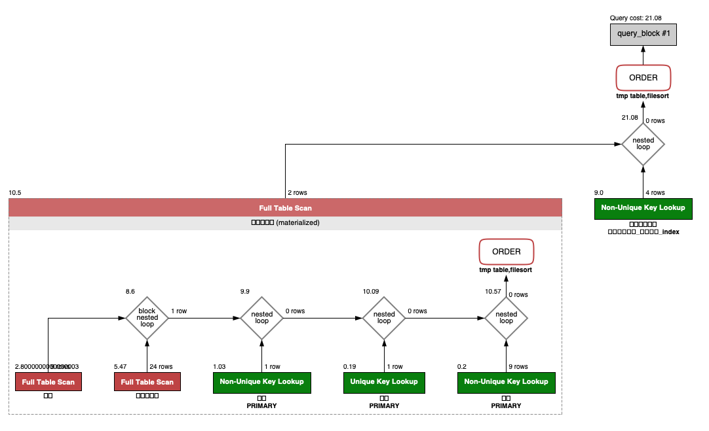
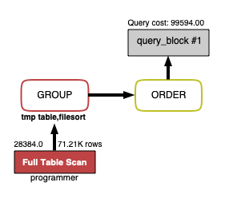
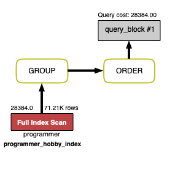
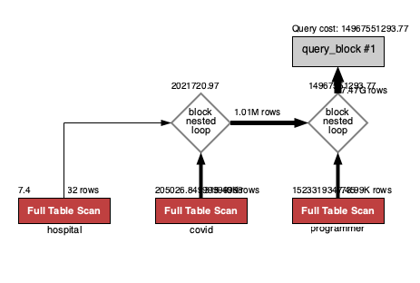
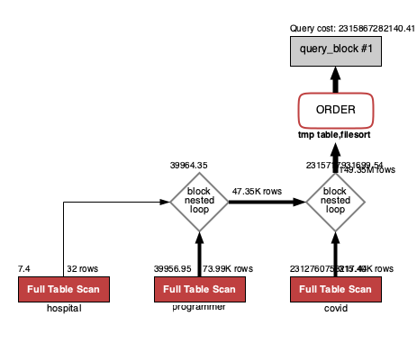
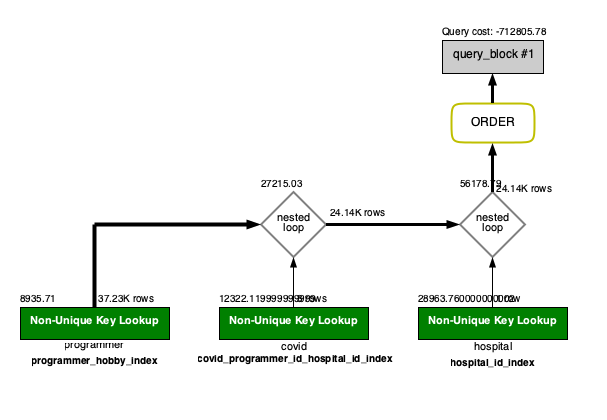

<p align="center">
    
</p>
<p align="center">
  
  
  <a href="https://edu.nextstep.camp/c/R89PYi5H" alt="nextstep atdd">
    
  </a>
  
</p>

<br>

# 인프라공방 샘플 서비스 - 지하철 노선도

<br>

## 🚀 Getting Started

### Install
#### npm 설치
```
cd frontend
npm install
```
> `frontend` 디렉토리에서 수행해야 합니다.

### Usage
#### webpack server 구동
```
npm run dev
```
#### application 구동
```
./gradlew clean build
```
<br>

## 미션

* 미션 진행 후에 아래 질문의 답을 작성하여 PR을 보내주세요.

### 1단계 - 화면 응답 개선하기
1. 성능 개선 결과를 공유해주세요 (Smoke, Load, Stress 테스트 결과)

2. 어떤 부분을 개선해보셨나요? 과정을 설명해주세요

---

### 2단계 - 조회 성능 개선하기
##### 1. 인덱스 적용해보기 실습을 진행해본 과정을 공유해주세요
* 테스트 환경
  * 2018 MacBook Pro
    * cpu - i7 2.6G 6코어
    * memory - 16GB
    * Mac OS 12.0.1 (Monterey)
    * docker desktop 4.3.0
   
A. 쿼리 최적화
   - [x] 활동중인(Active) 부서의 현재 부서관리자 중 연봉 상위 5위안에 드는 사람들이 최근에 각 지역별로 언제 퇴실했는지 조회해보세요.
   (사원번호, 이름, 연봉, 직급명, 지역, 입출입구분, 입출입시간)
  ``` sql
  SELECT 대상관리자.사원번호, 대상관리자.이름, 대상관리자.연봉, 대상관리자.직급명, 사원출입기록.입출입시간, 사원출입기록.지역, 사원출입기록.입출입구분
  FROM (
      SELECT 사원.사원번호, 사원.이름, 급여.연봉, 직급.직급명
      FROM 사원, 부서관리자, 급여, 직급, 부서
      WHERE 부서관리자.사원번호 = 사원.사원번호
      AND CURRENT_DATE BETWEEN 부서관리자.시작일자 AND 부서관리자.종료일자
      AND 부서관리자.부서번호 = 부서.부서번호
      AND 부서.비고 = 'ACTIVE'
      AND 직급.사원번호 = 사원.사원번호
      AND CURRENT_DATE BETWEEN 직급.시작일자 AND 직급.종료일자
      AND 급여.사원번호 = 사원.사원번호
      AND CURRENT_DATE BETWEEN 급여.시작일자 AND 급여.종료일자
      ORDER BY 급여.연봉 DESC
      LIMIT 5
  ) 대상관리자, 사원출입기록
  WHERE 사원출입기록.사원번호 = 대상관리자.사원번호
  AND 사원출입기록.입출입구분 = 'O'
  ORDER BY 대상관리자.연봉 DESC, 사원출입기록.지역;
  ```
* 인덱스 설정 이전 (0.434 sec, 434 ms)
  * 

* 인덱스 설정 이후 (0.0022 sec, 2 ms)
  ``` sql
  create index 사원출입기록_사원번호_index on 사원출입기록 (사원번호);
  ```
  

B. 인덱스 설계
* 아래의 조회 결과를 100 ms 이하로 반환 
- [x] Coding as a Hobby
  ``` sql
  SELECT hobby, ROUND(COUNT(hobby) / (SELECT COUNT(hobby) from programmer) * 100, 1) as percentage
  from programmer
  group by hobby
  order by hobby desc;
  ```
  * 인덱스 설정 이전 (0.517 sec, 517 ms)
  * 
  * 인덱스 설정 이후 (0.093 sec, 93 ms)
  ``` sql
  create index programmer_hobby_index on programmer (hobby);
  ```
  * 

- [x] 프로그래머 별로 해당하는 병원 이름을 반환하세요
  ```sql
  SELECT covid.id, hospital.name
  FROM covid, hospital, programmer
  WHERE covid.programmer_id = programmer.id
  AND covid.hospital_id = hospital.id;
  ```
  * 인덱스 설정 이전 (1.271 sec, 1271 ms)
  * 
  * 인덱스 설정 이후 (0.0062 sec, 6 ms)
  ```sql
  create index covid_programmer_id_index on covid (programmer_id);
  create index hospital_id_index on hospital (id);
  create index programmer_id_index on programmer (id);
  ```
  * 

- [x] 프로그래밍이 취미인 학생 혹은 주니어(0-2년)들이 다닌 병원 이름을 반환하고 user.id 기준으로 정렬
  ``` sql
  SELECT programmer.id, hospital.name, programmer.hobby, programmer.dev_type, programmer.years_coding
  FROM covid, hospital, programmer
  WHERE programmer.id = covid.programmer_id
  AND hospital.id = covid.hospital_id
  AND programmer.hobby = 'Yes'
  AND (programmer.student like 'Yes%' OR programmer.years_coding = '0-2 years')
  ORDER BY programmer.id;
  ```
  * 인덱스 설정 이전 (모든 인덱스 제거시 쿼리로 확인 불가능한 수준)
  * 
  * 인덱스 설정 이후 (0.0063 sec, 6 ms)
  ```
  create index programmer_hobby_index on programmer (hobby);
  create index hospital_id_index on hospital (id);
  create index covid_programmer_id_hospital_id_index on covid (programmer_id, hospital_id);
  
  # programmer.id를 primary key로 설정
  alter table programmer add constraint programmer_pk primary key (id)
  ```
  * 
  
##### 2. 페이징 쿼리를 적용한 API endpoint를 알려주세요

