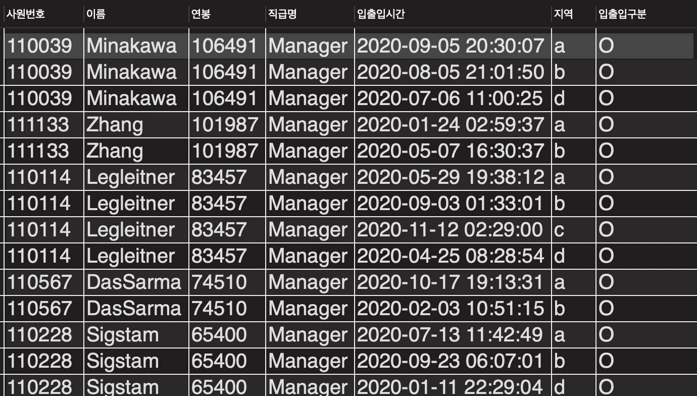
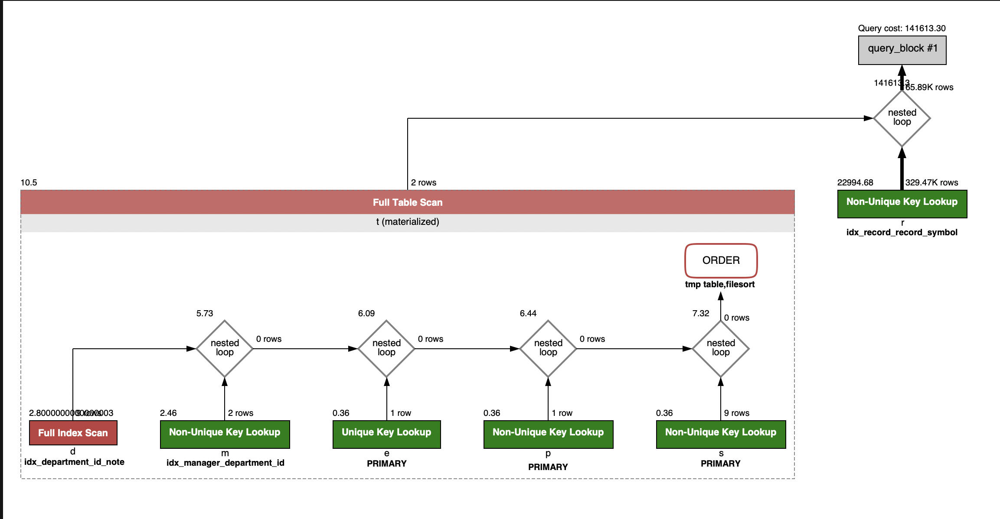

<p align="center">
    
</p>
<p align="center">
  
  
  <a href="https://edu.nextstep.camp/c/R89PYi5H" alt="nextstep atdd">
    
  </a>
  
</p>

<br>

# 인프라공방 샘플 서비스 - 지하철 노선도

<br>

## 🚀 Getting Started

### Install
#### npm 설치
```
cd frontend
npm install
```
> `frontend` 디렉토리에서 수행해야 합니다.

### Usage
#### webpack server 구동
```
npm run dev
```
#### application 구동
```
./gradlew clean build
```
<br>

## 미션

* 미션 진행 후에 아래 질문의 답을 작성하여 PR을 보내주세요.


### 1단계 - 화면 응답 개선하기
1. 성능 개선 결과를 공유해주세요 (Smoke, Load, Stress 테스트 결과)
- ./monitoring 디렉토리 내 before & after 테스트 결과 업로드 하였습니다.

2. 어떤 부분을 개선해보셨나요? 과정을 설명해주세요
- Reverse Proxy 개선
  - gzip 압축
  - cache 적용
  - TLS, HTTP/2 설정
- Was 성능 개선
  - cache 적용
    - 지하철 노선 조회
    - 지하철 역 조회
    - 경로 조회
---

### 2단계 - 스케일 아웃
[X] springboot에 HTTP Cache, gzip 설정하기
[X] Launch Template 작성하기
[X] Auto Scaling Group 생성하기
[X] Smoke, Load, Stress 테스트 후 결과를 기록

1. Launch Template 링크를 공유해주세요.
  - https://ap-northeast-2.console.aws.amazon.com/ec2/v2/home?region=ap-northeast-2#LaunchTemplateDetails:launchTemplateId=lt-0f39af934127fa5c9

2. cpu 부하 실행 후 EC2 추가생성 결과를 공유해주세요. (Cloudwatch 캡쳐)
  - 아래 경로 참고 부탁드립니다.
    - ./monitoring/stress/step2/step2_stress_bulk_asg_ec2
    - ./monitoring/stress/step2/step2_stress_bulk_AutoScaling
```sh
$ stress -c 2
```

3. 성능 개선 결과를 공유해주세요 (Smoke, Load, Stress 테스트 결과)
  - 아래 경로 참고 부탁드립니다.
    - ./monitoring/smoke/step2
    - ./monitoring/load/step2
    - ./monitoring/stress/step2
---

### 3단계 - 쿼리 최적화

1. 인덱스 설정을 추가하지 않고 아래 요구사항에 대해 1s 이하(M1의 경우 2s)로 반환하도록 쿼리를 작성하세요.

- 활동중인(Active) 부서의 현재 부서관리자 중 연봉 상위 5위안에 드는 사람들이 최근에 각 지역별로 언제 퇴실했는지 조회해보세요. (사원번호, 이름, 연봉, 직급명, 지역, 입출입구분, 입출입시간)


- Query
  - 쿼리 소요 시간 : 1.645 sec
```mysql
-- (MySQL) chracter set이 'utf8mb4', 'utf8mb4_0900_ai_ci'이면 문자열 검색시 대소문자 비교하지 않음??
-- https://dev.mysql.com/doc/refman/8.0/en/case-sensitivity.html
    
-- The default character set and collation are utf8mb4 and utf8mb4_0900_ai_ci, so nonbinary string comparisons are case-insensitive by default. 
-- This means that if you search with col_name LIKE 'a%', you get all column values that start with A or a.
-- To make this search case-sensitive, make sure that one of the operands has a case-sensitive or binary collation. 
-- For example, if you are comparing a column and a string that both have the utf8mb4 character set, you can use the COLLATE operator to cause either operand to have the utf8mb4_0900_as_cs or utf8mb4_bin collation:

SELECT t.id AS 사원번호,
       t.last_name AS 이름,
       t.annual_income AS 연봉,
       t.position_name AS 직급명,
       r.time AS 입출입시간,
       r.region AS 지역,
       r.record_symbol AS 입출입구분
FROM (SELECT e.id, e.last_name, s.annual_income, p.position_name
      FROM department AS d
      INNER JOIN manager m ON m.department_id = d.id AND m.start_date < now() AND m.end_date > now()
      INNER JOIN employee e ON e.id = m.employee_id
      INNER JOIN position p ON p.id = m.employee_id AND LOWER(p.position_name) = 'manager'
      INNER JOIN salary s ON s.id = m.employee_id AND s.start_date < now() AND s.end_date > now()
      WHERE d.note = 'active'
      ORDER BY s.annual_income DESC LIMIT 5) AS t
INNER JOIN record r ON t.id = r.employee_id AND r.record_symbol = 'O'
;
```

- 쿼리 결과



- 실행 계획


---

### 4단계 - 인덱스 설계

1. 인덱스 적용해보기 실습을 진행해본 과정을 공유해주세요

---

### 추가 미션

1. 페이징 쿼리를 적용한 API endpoint를 알려주세요
