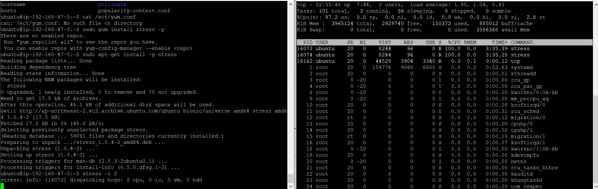
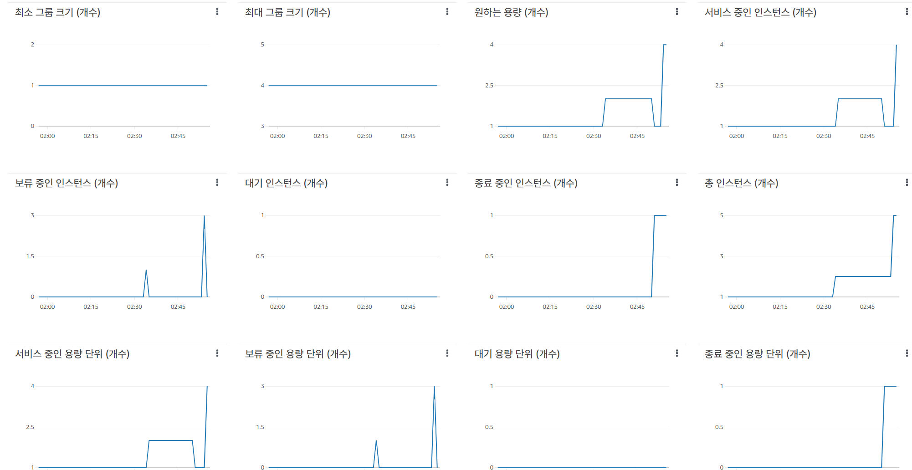
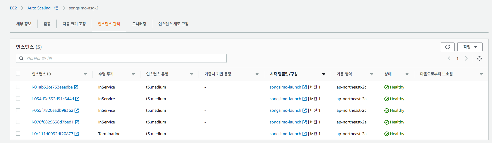
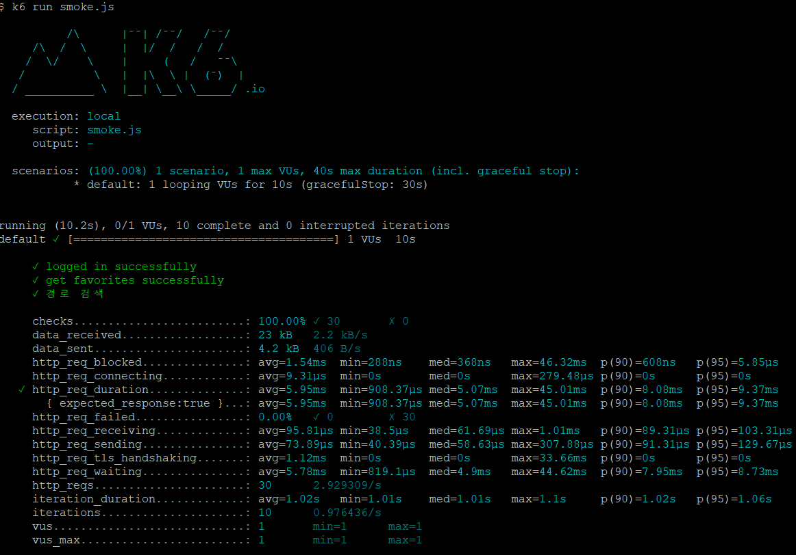
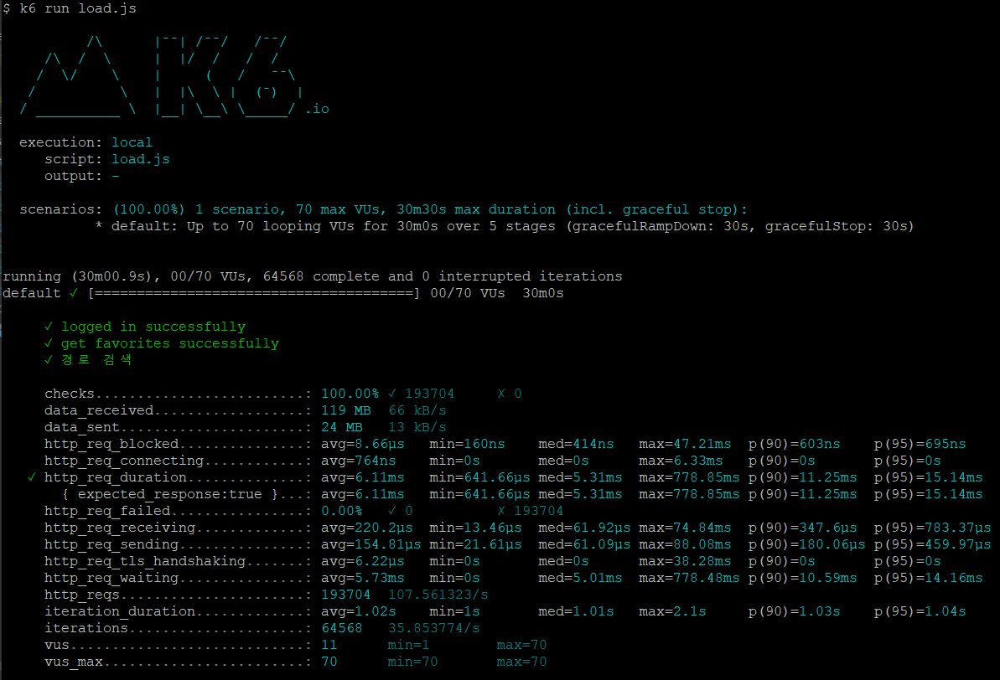
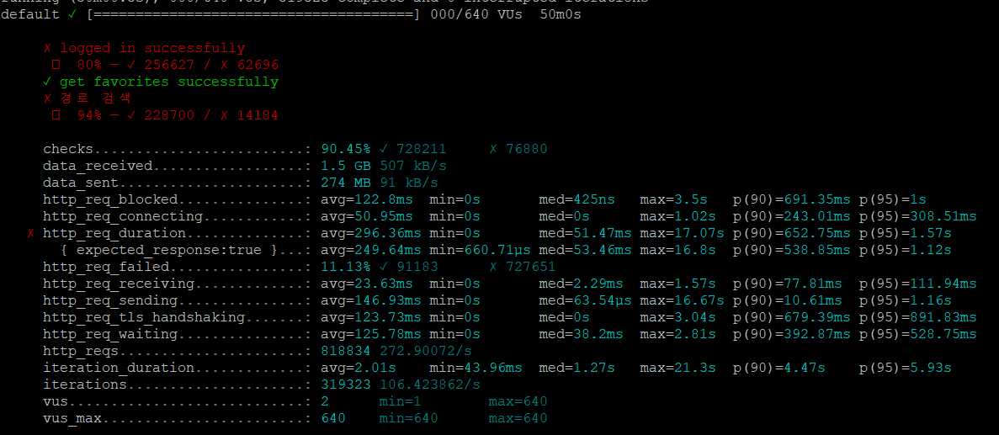

<p align="center">
    
</p>
<p align="center">
  
  
  <a href="https://edu.nextstep.camp/c/R89PYi5H" alt="nextstep atdd">
    
  </a>
  
</p>

<br>

# 인프라공방 샘플 서비스 - 지하철 노선도

<br>

## 🚀 Getting Started

### Install
#### npm 설치
```
cd frontend
npm install
```
> `frontend` 디렉토리에서 수행해야 합니다.

### Usage
#### webpack server 구동
```
npm run dev
```
#### application 구동
```
./gradlew clean build
```
<br>

## 미션

* 미션 진행 후에 아래 질문의 답을 작성하여 PR을 보내주세요.

<details>
<summary>1단계 - 화면 응답 개선한기</summary>
<div markdown="1">

### 1단계 - 화면 응답 개선하기
1. 성능 개선 결과를 공유해주세요 (Smoke, Load, Stress 테스트 결과)

2. 어떤 부분을 개선해보셨나요? 과정을 설명해주세요

* Reverse Proxy 개선
  - [x] gzip 압축
  - [x] 캐싱
  - [x] TLS, HTTP/2 설정

* WAS 성능 개선
  * Redis Spring Data Cache 적용
  - [x] 지하철역 조회
  - [x] 경로 검색
---

</div>
</details>

<details>
<summary>2단계 - 스케일 아웃</summary>
<div markdown="2">

### 2단계 - 스케일 아웃

- [x] springboot에 HTTP Cache, gzip 설정하기
- [x] Launch Template 작성하기
- [x] Auto Scaling Group 생성하기
- [x] Smoke, Load, Stress 테스트 후 결과를 기록

- [x] 모든 정적 자원에 대해 no-cache, no-store 설정을 한다. 가능한가?

가능한 것 같습니다.

[참고링크 1](https://stackoverflow.com/questions/49547/how-do-we-control-web-page-caching-across-all-browsers)
[참고링크 2](https://stackoverflow.com/questions/24164014/how-to-enable-http-response-caching-in-spring-boot)

Spring을 이용한다면
```text
# application.properties

spring.web.resources.cache.cachecontrol.no-cache=true
spring.web.resources.cache.cachecontrol.no-store=true
```

브라우저 호환이나 버그 등의 이유로 이 두개를 같이 이용한다는 글이 있네요.

[참고링크 3](https://www.inflearn.com/questions/112647)

1. Launch Template 링크를 공유해주세요.

[launch Template 보기](https://ap-northeast-2.console.aws.amazon.com/ec2/v2/home?region=ap-northeast-2#LaunchTemplateDetails:launchTemplateId=lt-0c70e6dedf56c521a)

2. cpu 부하 실행 후 EC2 추가생성 결과를 공유해주세요. (Cloudwatch 캡쳐)

```sh
$ stress -c 2
```

* cpu_stress



* cloudWatch



* cloudWatch_instance



3. 성능 개선 결과를 공유해주세요 (Smoke, Load, Stress 테스트 결과)

* scale_out_smoke_test



* scale_out_load_test



* scale_out_stress_test



</div>
</details>

---

### 3단계 - 쿼리 최적화

1. 인덱스 설정을 추가하지 않고 아래 요구사항에 대해 1s 이하(M1의 경우 2s)로 반환하도록 쿼리를 작성하세요.

- 활동중인(Active) 부서의 현재 부서관리자 중 연봉 상위 5위안에 드는 사람들이 최근에 각 지역별로 언제 퇴실했는지 조회해보세요. (사원번호, 이름, 연봉, 직급명, 지역, 입출입구분, 입출입시간)

---

### 4단계 - 인덱스 설계

1. 인덱스 적용해보기 실습을 진행해본 과정을 공유해주세요

---

### 추가 미션

1. 페이징 쿼리를 적용한 API endpoint를 알려주세요
