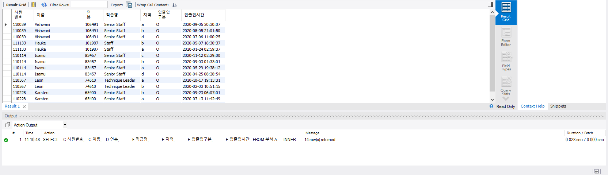
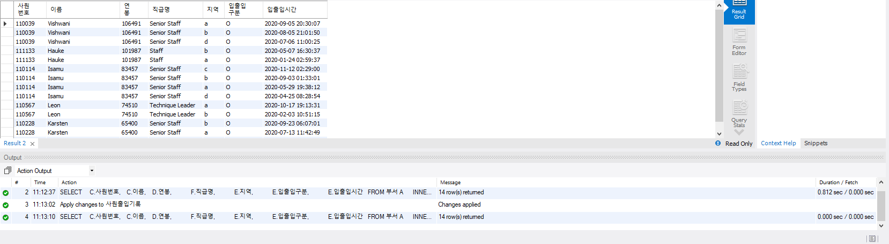
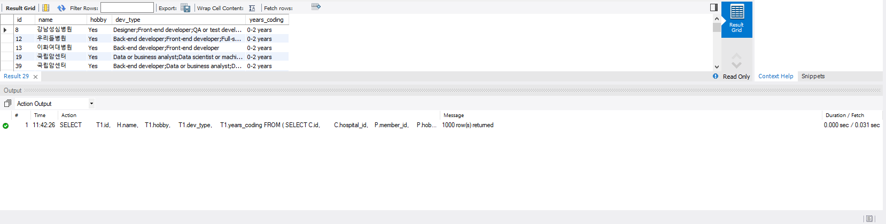
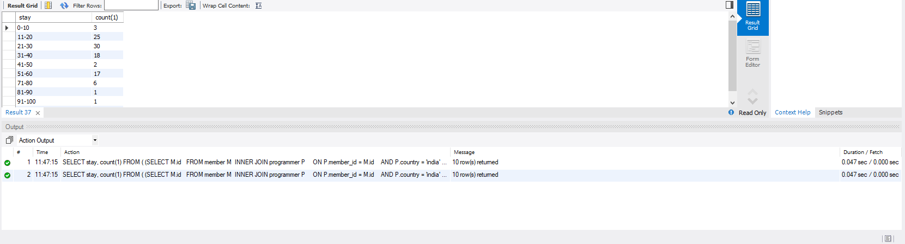
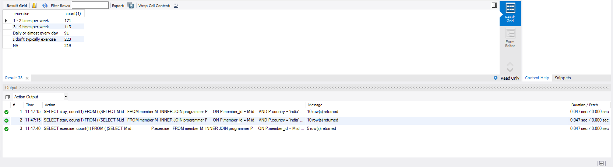

<p align="center">
    
</p>
<p align="center">
  
  
  <a href="https://edu.nextstep.camp/c/R89PYi5H" alt="nextstep atdd">
    
  </a>
  
</p>

<br>

# 인프라공방 샘플 서비스 - 지하철 노선도

<br>

## 🚀 Getting Started

### Install
#### npm 설치
```
cd frontend
npm install
```
> `frontend` 디렉토리에서 수행해야 합니다.

### Usage
#### webpack server 구동
```
npm run dev
```
#### application 구동
```
./gradlew clean build
```
<br>

## 미션

* 미션 진행 후에 아래 질문의 답을 작성하여 PR을 보내주세요.

### 1단계 - 화면 응답 개선하기
1. 성능 개선 결과를 공유해주세요 (Smoke, Load, Stress 테스트 결과)

2. 어떤 부분을 개선해보셨나요? 과정을 설명해주세요

---

### 2단계 - 조회 성능 개선하기
1. 인덱스 적용해보기 실습을 진행해본 과정을 공유해주세요


- [x] 활동중인(Active) 부서의 현재 부서관리자 중 연봉 상위 5위안에 드는 사람들이 최근에 각 지역별로 언제 퇴실했는지 조회해보세요.

   1. 쿼리 작성만으로 1s 이하로 반환한다.
```sql
    SELECT 
           C.사원번호,
           C.이름,
           D.연봉,
           F.직급명,
           E.지역,
           E.입출입구분,
           E.입출입시간
      FROM 부서 A   
      INNER JOIN 부서관리자 B    
         ON A.부서번호 = B.부서번호    
        AND B.종료일자 = '9999-01-01'    
        AND A.비고 = 'ACTIVE'   
      INNER JOIN 사원 C
         ON B.사원번호 = C.사원번호
      INNER JOIN 급여 D
         ON D.사원번호 = C.사원번호
        AND D.종료일자 = '9999-01-01'
      INNER JOIN  사원출입기록 E    
         ON E.사원번호 = C.사원번호
        AND E.입출입구분 = 'O'
      INNER JOIN 직급 F 
         ON F.사원번호 = C.사원번호 
        AND F.시작일자 = C.입사일자
      ORDER BY D.연봉 DESC, E.입출입시간 DESC;
```


2. 인덱스 설정을 추가하여 50 ms 이하로 반환한다.
- 인덱스 추가
  - 플랜을 보면서 실제 풀스캔이 일어나는 부분을 인덱스로 묶어서 처리했습니다.
  - 사원출입기록 테이블에 사원번호, 입출입구분에 묶어서 인덱스 설정 




## 프로그래머별로 해당하는 병원 이름을 반환하세요. (covid.id, hospital.name)

- 가장 적은 데이터를 기준으로 조인을 해서 처리했습니다. 
- 인덱스 설정이 필요하지 않았습니다. 
```sql
    SELECT
        C.id,
        H.name
    FROM hospital H
   INNER JOIN covid C
      ON H.id = C.hospital_id
   INNER JOIN programmer P
      ON P.id = C.programmer_id ;
```


## 프로그래밍이 취미인 학생 혹은 주니어(0-2년)들이 다닌 병원 이름을 반환하고 user.id 기준으로 정렬하세요.

속도가 나오지 않은 문제를 해결 하기 위해서 join중에 
full-scan이 진행되는 곳을 찾아서 index를 추가해줬습니다. 
전체를 추가하는 것은 낭비라 생각되어서
program_id 를 pk로 변경과 함께 index를 추가해주고 
member_id도 Index를 추가해주었습니다.
```sql
SELECT 
       T1.id,
       H.name,
       T1.hobby, 
       T1.dev_type, 
       T1.years_coding
FROM (
        SELECT C.id, 
               C.hospital_id,
               P.member_id, 
               P.hobby, 
               P.dev_type, 
               P.years_coding
        FROM covid C
        INNER JOIN programmer P
           ON P.id = C.programmer_id
          AND P.member_id = C.id  
        INNER JOIN member M
           ON M.id = P.member_id
        WHERE (P.hobby ='YES' AND P.years_coding = '0-2 years')  
           OR (P.hobby = 'YES' AND P.student ='YES')
     ORDER BY M.id 
    ) AS T1
    
INNER JOIN hospital H
   ON H.id = T1.hospital_id;


```


--------------

## 서울대병원에 다닌 20대 India 환자들을 병원에 머문 기간별로 집계하세요. (covid.Stay)
-- covide 테이블에 `hospital 인덱스` 추가

hospital name도 index를 설정가능하지만 현재는 불필요해 보여서 하지 않았습니다. 
추후 `자료형 변경` 후에 인덱스 추가를 고려해볼 수 있을 것 같습니다.

```sql
SELECT stay, count(1)
FROM (
        (SELECT M.id
          FROM member M
         INNER JOIN programmer P
            ON P.member_id = M.id
           AND P.country = 'india'
           AND M.age BETWEEN 20 AND 29 
          ) T1
    INNER JOIN   
        (SELECT
               C.member_id,
               C.stay
        FROM covid C
        INNER JOIN hospital H
           ON H.id = C.hospital_id
        WHERE name = '서울대병원'
        ) T2
ON T1.id = T2.member_id )
GROUP BY stay;
```



---
## 서울대병원에 다닌 30대 환자들을 운동 횟수별로 집계하세요. (user.Exercise)

```sql
SELECT exercise, count(1)
FROM (
        (SELECT M.id,
                P.exercise
          FROM member M
         INNER JOIN programmer P
            ON P.member_id = M.id
           AND  M.age BETWEEN 30 AND 39 
          ) T1
    INNER JOIN   
        (SELECT
               C.member_id,
               C.stay
        FROM covid C
        INNER JOIN hospital H
           ON H.id = C.hospital_id
        WHERE name = '서울대병원'
        ) T2
ON T1.id = T2.member_id )
GROUP BY exercise;


```



2. 페이징 쿼리를 적용한 API endpoint를 알려주세요

