<p align="center">
    
</p>
<p align="center">
  
  
  <a href="https://edu.nextstep.camp/c/R89PYi5H" alt="nextstep atdd">
    
  </a>
  
</p>

<br>

# 인프라공방 샘플 서비스 - 지하철 노선도

<br>

## 🚀 Getting Started

### Install
#### npm 설치
```
cd frontend
npm install
```
> `frontend` 디렉토리에서 수행해야 합니다.

### Usage
#### webpack server 구동
```
npm run dev
```
#### application 구동
```
./gradlew clean build
```
<br>

## 미션

* 미션 진행 후에 아래 질문의 답을 작성하여 PR을 보내주세요.


### 1단계 - 화면 응답 개선하기
1. 성능 개선 결과를 공유해주세요 (Smoke, Load, Stress 테스트 결과)

- load.js, smoke.js, stress.js는 step1에 링크되어 있습니다.
- **성능 개선 전 (load, smoke, stress)**

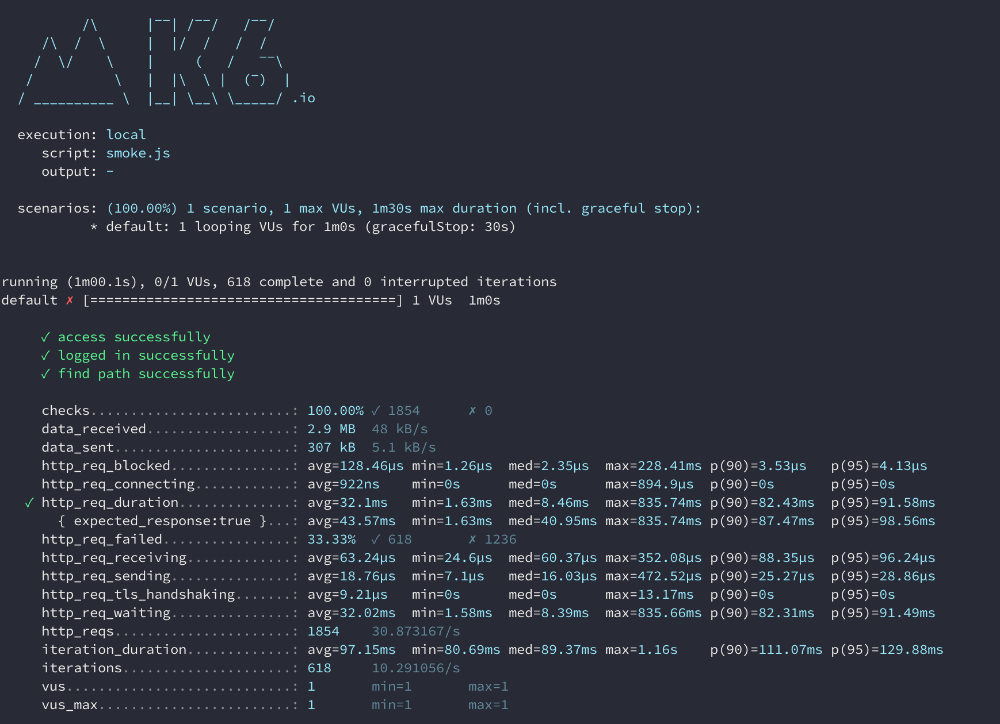
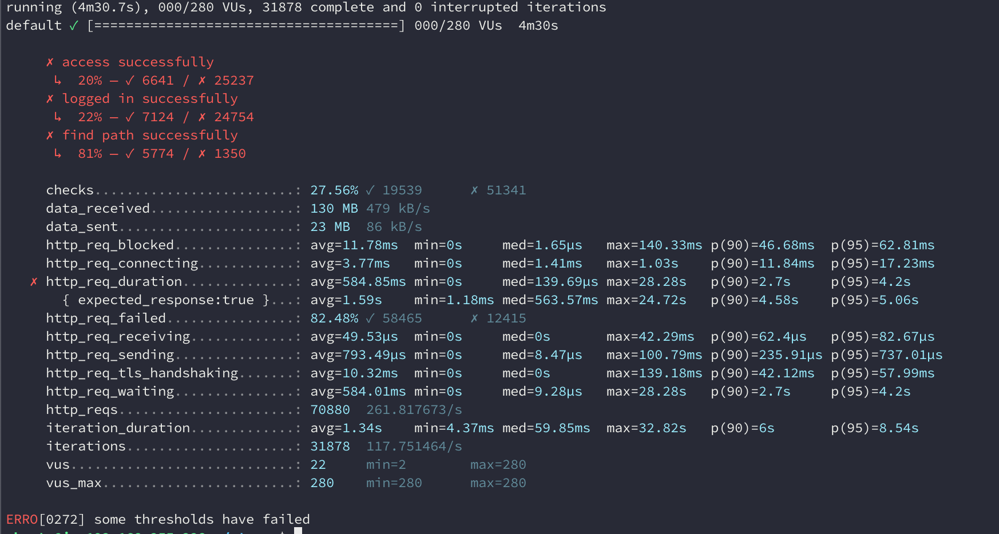
- **성능 개선 후 (load, smoke, stress)**
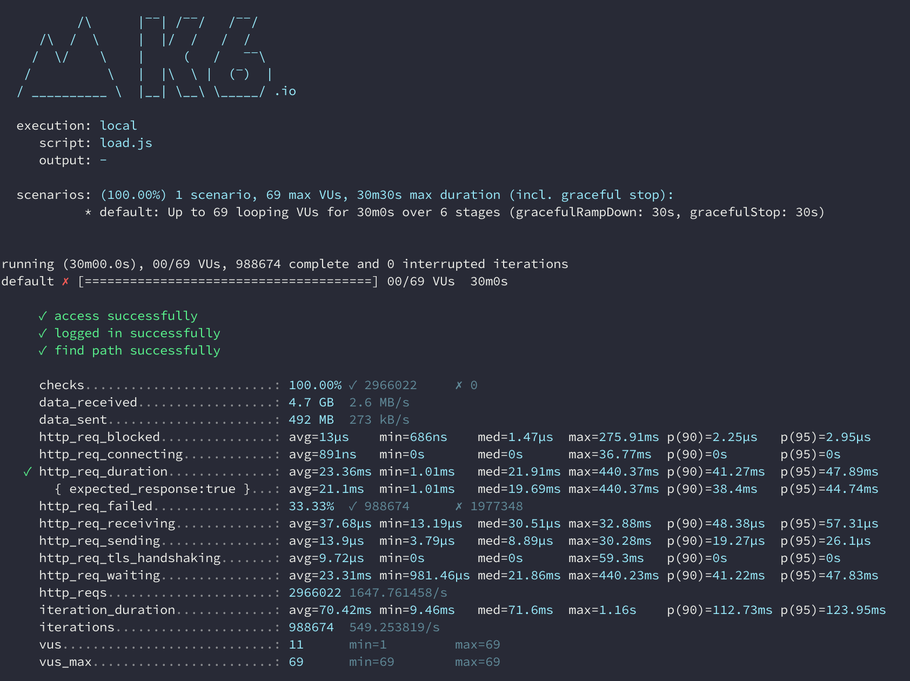
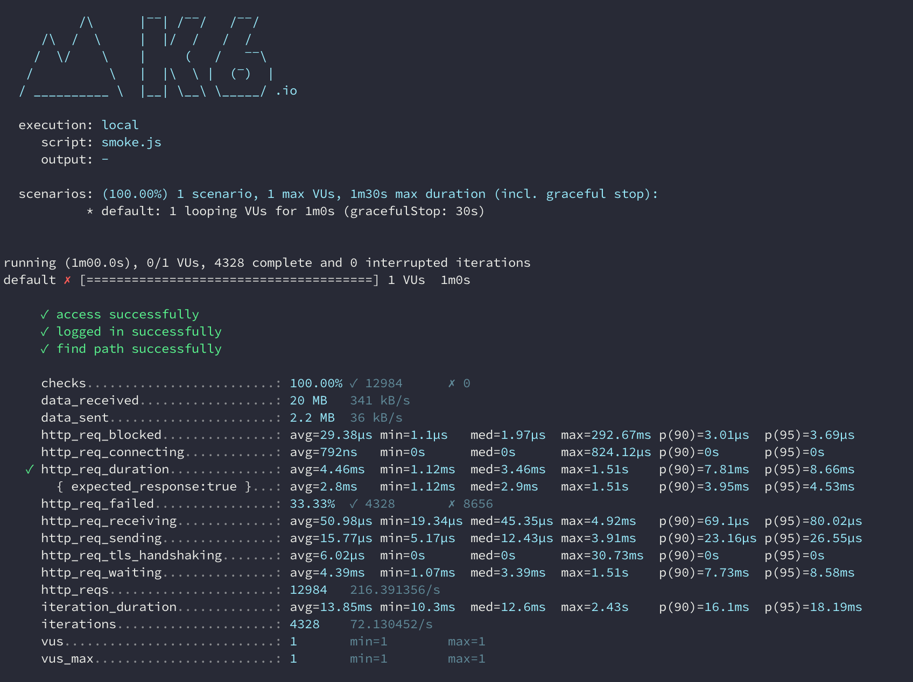

- http_req_duration p(95) 결과보기 
  - load : 5.96s -> 47.89ms
  - smoke : 91.58ms -> 8.66ms
  - stress : 4.2s -> 222.64ms

2. 어떤 부분을 개선해보셨나요? 과정을 설명해주세요
- nginx에 9단계로 gzip 압축 진행하였습니다.
- nging에 cache를 두었습니다.
- redis를 통해 경로조회, 지하철역 조회, 노선조회에 cache 처리하였습니다. 

---

### 2단계 - 스케일 아웃

1. Launch Template 링크를 공유해주세요.
[mond-page_template](https://ap-northeast-2.console.aws.amazon.com/ec2/v2/home?region=ap-northeast-2#LaunchTemplateDetails:launchTemplateId=lt-0ee1831f0ea025fce)

2. cpu 부하 실행 후 EC2 추가생성 결과를 공유해주세요. (Cloudwatch 캡쳐)
3. 성능 개선 결과를 공유해주세요 (Smoke, Load, Stress 테스트 결과)
**Smoke**
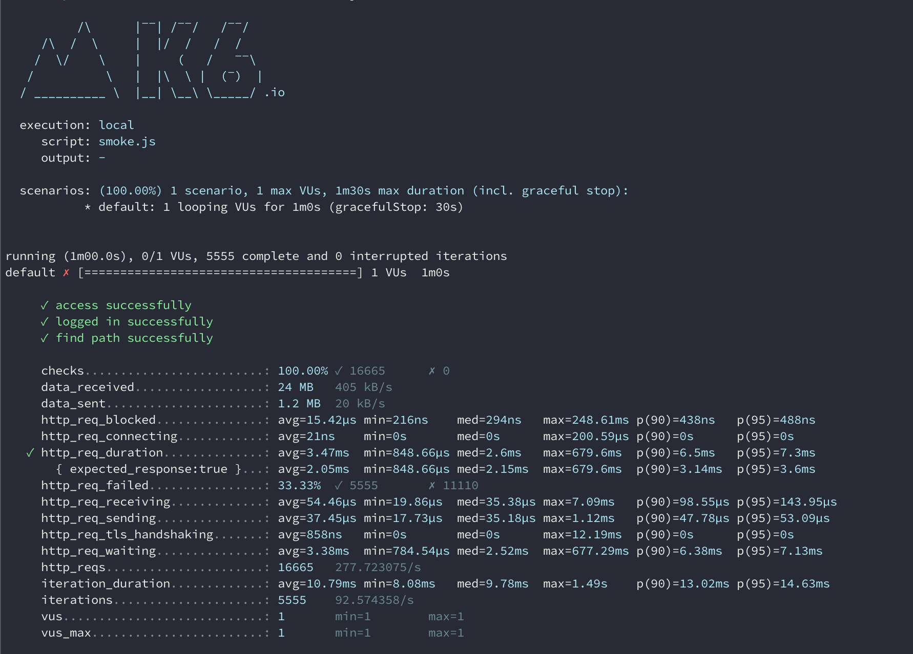


**load**
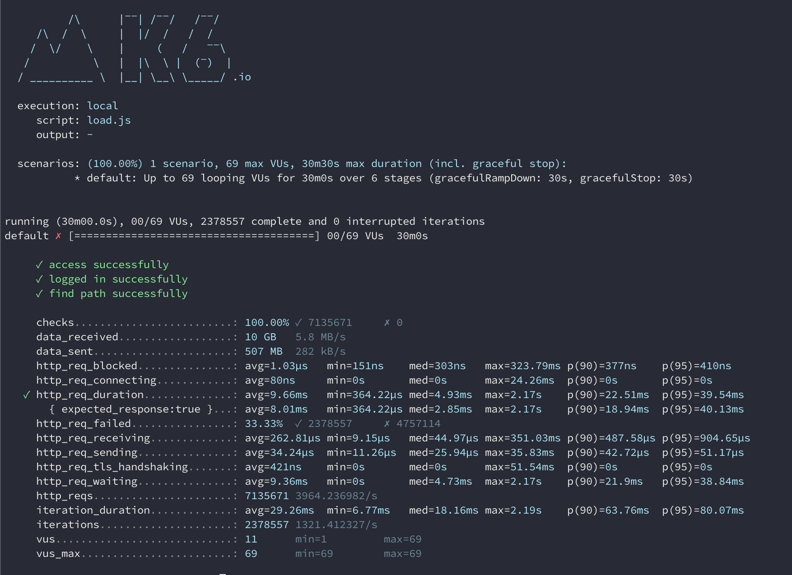
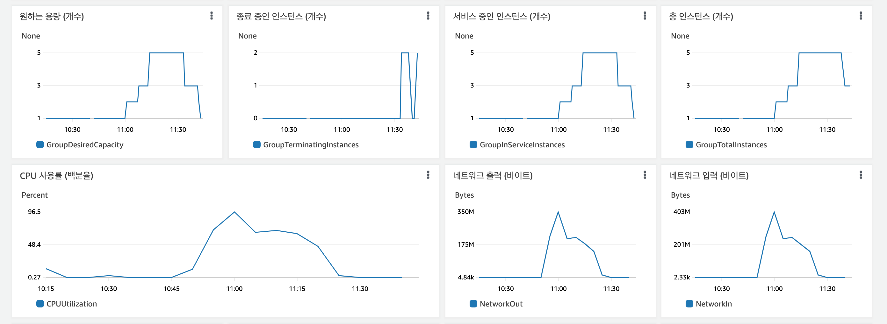

**stress**
VUser : 440
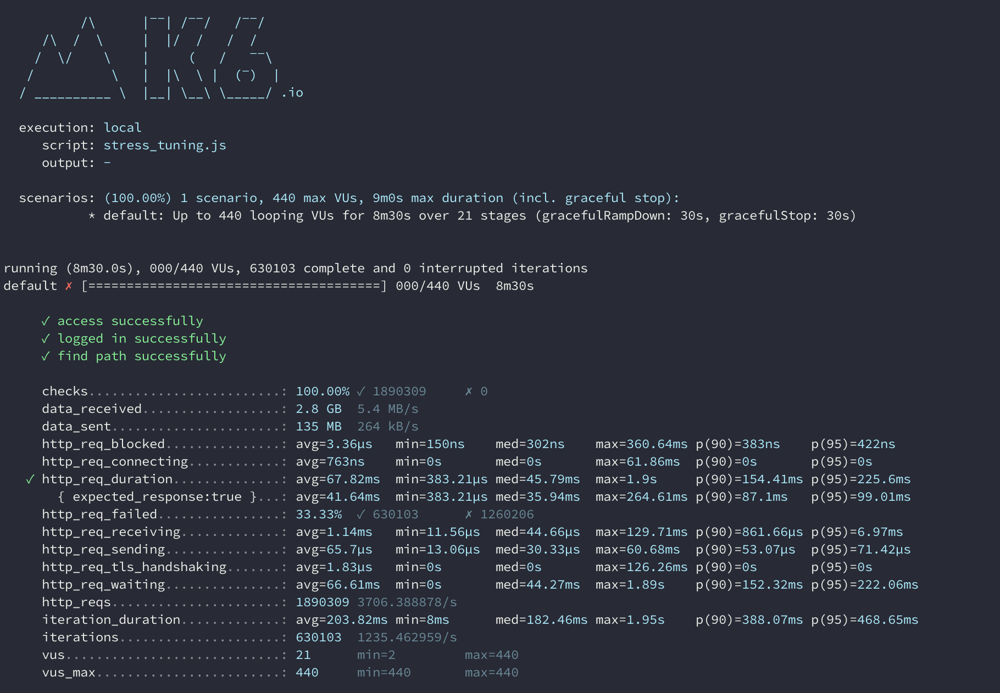


VUser : 880
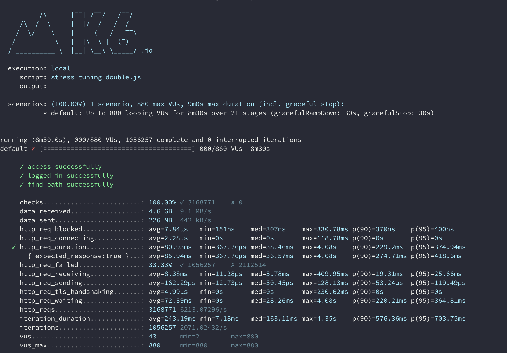
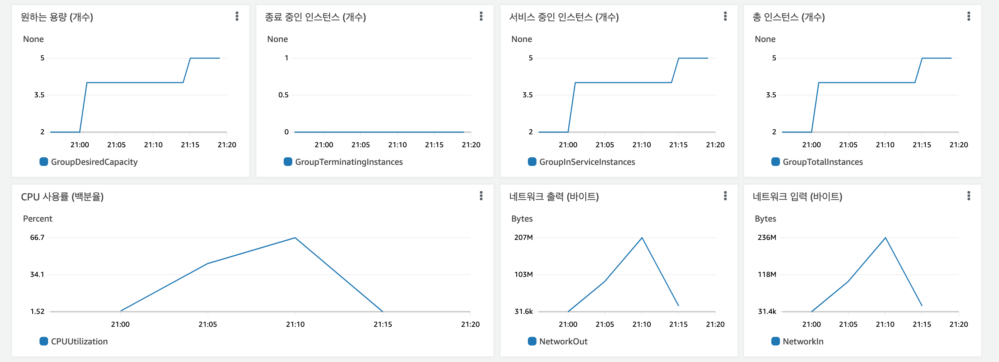

VUser : 1400
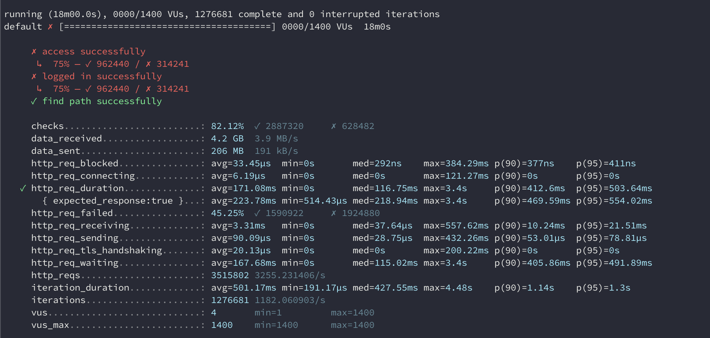
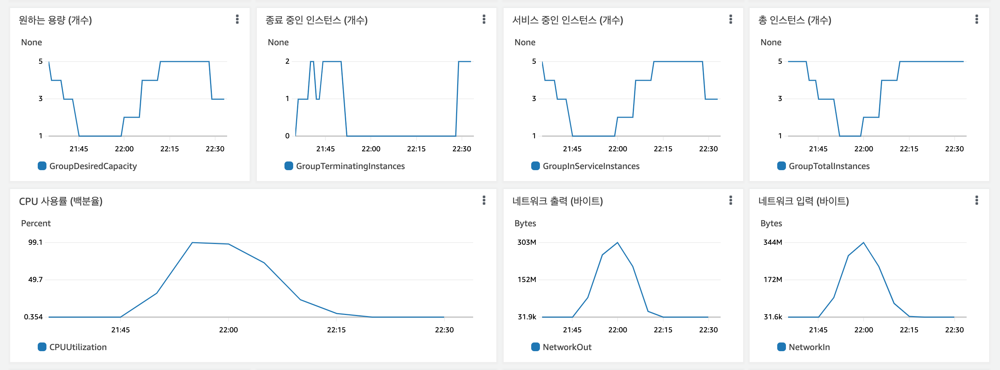

---

### 1단계 - 쿼리 최적화

1. 인덱스 설정을 추가하지 않고 아래 요구사항에 대해 1s 이하(M1의 경우 2s)로 반환하도록 쿼리를 작성하세요.
- 활동중인(Active) 부서의 현재 부서관리자 중 연봉 상위 5위안에 드는 사람들이 최근에 각 지역별로 언제 퇴실했는지 조회해보세요. (사원번호, 이름, 연봉, 직급명, 지역, 입출입구분, 입출입시간)
```sql
SELECT employee_id AS '사원번호',
       last_name AS '이름',
       annual_income AS '연봉',
       position_name AS '직급명',
       region AS '지역', 
       record_symbol AS '입출입구분',
       time AS '입출입시간'
  FROM record
       INNER JOIN ( SELECT e.id, e.last_name, p.position_name, s.annual_income, d.department_name
                      FROM employee e
                           INNER JOIN employee_department ed
                           ON         e.id = ed.employee_id
                           AND        ed.end_date = '9999-01-01'
                           INNER JOIN department d
                           ON          ed.department_id = d.id
                           AND         d.note = 'active'
                           INNER JOIN manager m
                           ON         m.employee_id = e.id
                           AND        m.department_id = d.id
                           AND        m.end_date = '9999-01-01'
                           INNER JOIN salary s
                           ON         m.employee_id = s.id
                           AND        s.end_date = '9999-01-01'
                           INNER JOIN position p
                           ON         e.id = p.id
                           AND        p.position_name = 'Manager'
                           AND        p.end_date = '9999-01-01'
                     ORDER BY s.annual_income DESC
                     LIMIT 5 ) filter_table
       ON filter_table.id = record.employee_id
 WHERE record_symbol = 'O';
```
- 실행시간 결과
> 0.242sec / 0.000011sec (Duration / Fetch Time)

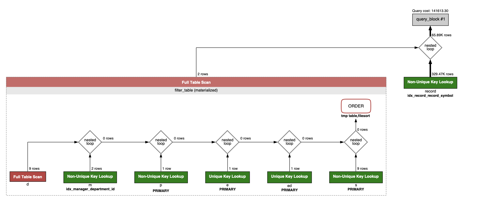
---

### 2단계 - 인덱스 설계

1. 인덱스 적용해보기 실습을 진행해본 과정을 공유해주세요

---

### 추가 미션

1. 페이징 쿼리를 적용한 API endpoint를 알려주세요
