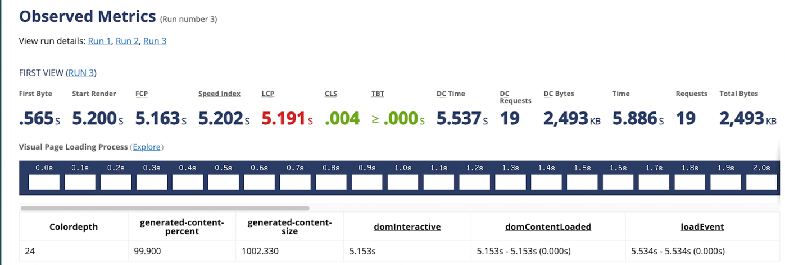
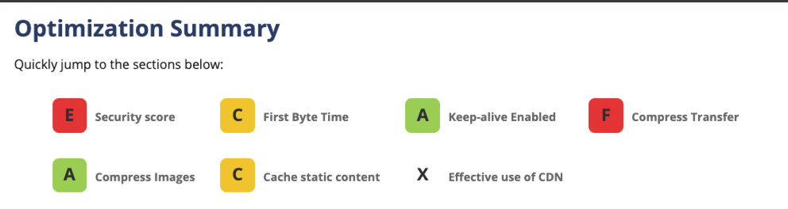
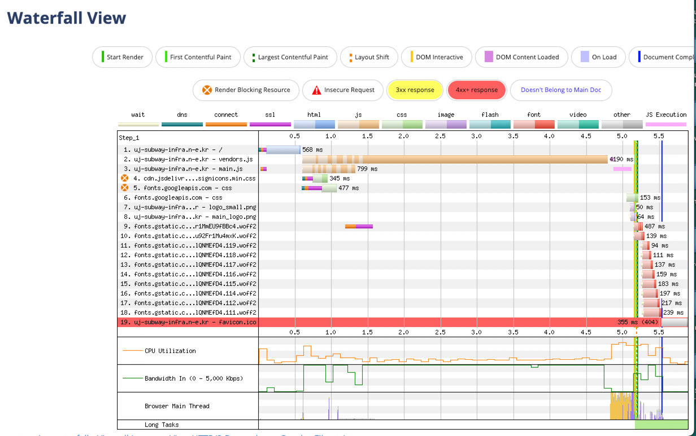
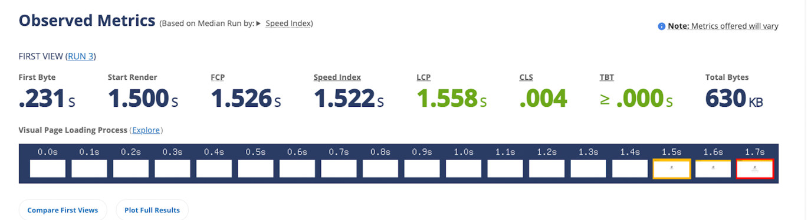
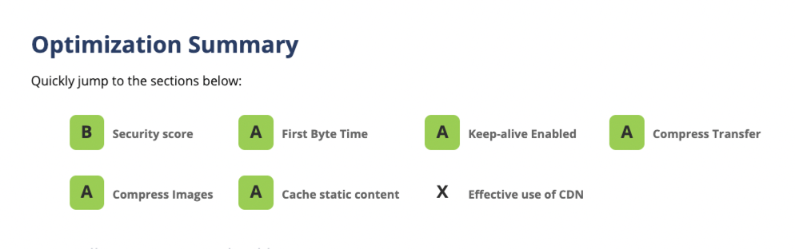
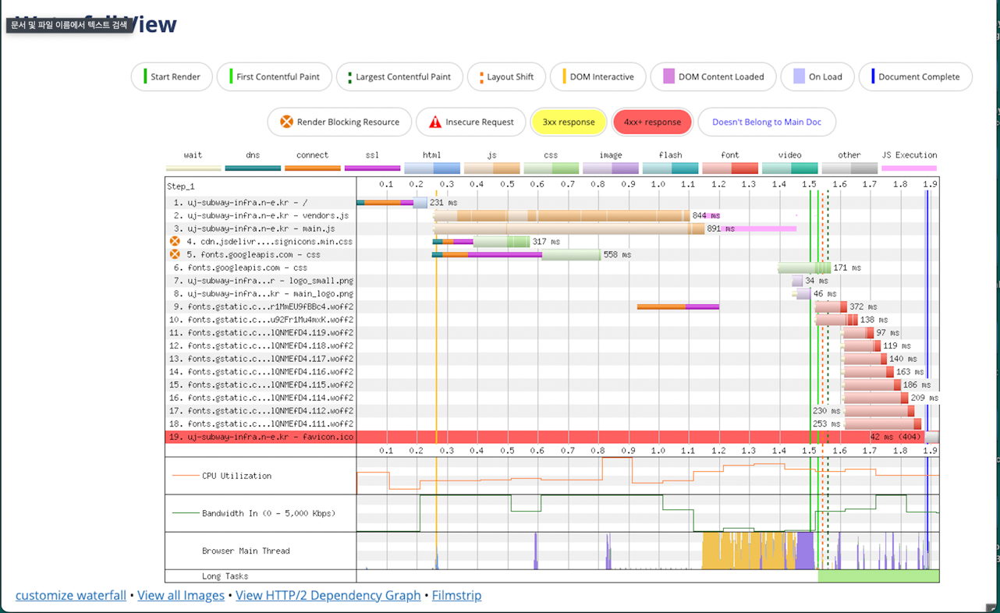
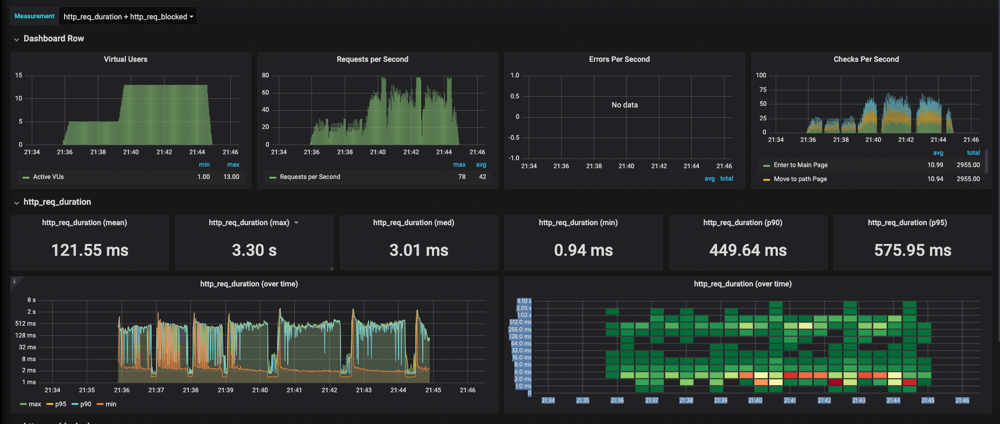
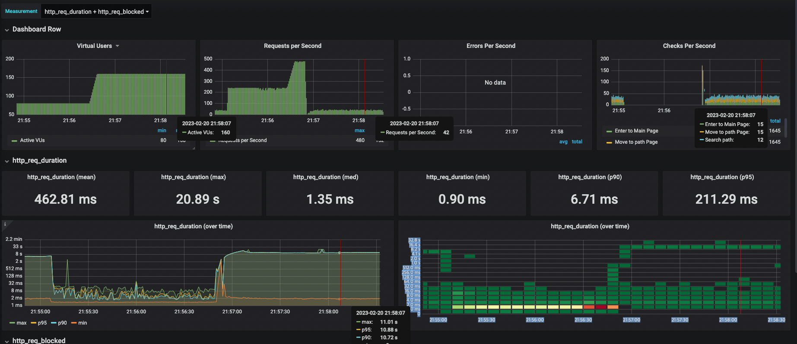

<p align="center">
    
</p>
<p align="center">
  
  
  <a href="https://edu.nextstep.camp/c/R89PYi5H" alt="nextstep atdd">
    
  </a>
  
</p>

<br>

# 인프라공방 샘플 서비스 - 지하철 노선도

<br>

## 🚀 Getting Started

### Install
#### npm 설치
```
cd frontend
npm install
```
> `frontend` 디렉토리에서 수행해야 합니다.

### Usage
#### webpack server 구동
```
npm run dev
```
#### application 구동
```
./gradlew clean build
```
<br>

## 미션

* 미션 진행 후에 아래 질문의 답을 작성하여 PR을 보내주세요.


### 1단계 - 화면 응답 개선하기
1. 성능 개선 결과를 공유해주세요 (webpagetest 테스트 결과)

### 개선전



### 개선후




3. 어떤 부분을 개선해보셨나요? 과정을 설명해주세요
### Reverse Proxy
- 강의 내용과 힌트를 토대로 gzip 압축 설정을 추가했습니다. -> Compress Transfer 향상 확인
- 캐시 설정을 추가했습니다. -> Cache static content 성능 향상 확인
- Http2 설정 추가했습니다.
- 성능 개선 후 Security score가 낮게 나와 추가적으로 보안관련 설정을 몇가지 추가했습니다.

### 정적 파일 경량화
- 번들크기 줄이기 vue.config.js 파일 생성후 스크립트 추가
- async 추가
- Dynamic import 설정은 어딜 건드려야할지 찾아봐도 자세히 이해가 가지않아서 추가하지 않았습니다.

---

### 2단계 - 스케일 아웃

1. Launch Template 링크를 공유해주세요.

https://ap-northeast-2.console.aws.amazon.com/ec2/v2/home?region=ap-northeast-2#LaunchTemplateDetails:launchTemplateId=lt-05ec927128312a6dc

3. cpu 부하 실행 후 EC2 추가생성 결과를 공유해주세요. (Cloudwatch 캡쳐)


```sh
$ stress -c 2
```

3. Scale out 후 성능 개선 결과를 공유해주세요 (Load, Stress 테스트 결과)

Load


Stress

---

### 3단계 - WAS 개선하기

1. springboot에 HTTP Cache, gzip 설정하기

2. Data Cache 설정하기

3. Scale out 후 성능 개선 결과를 공유해주세요 (Load, Stress 테스트 결과)
