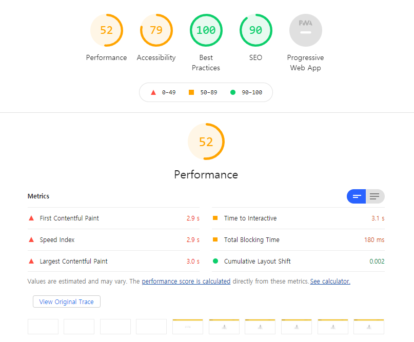
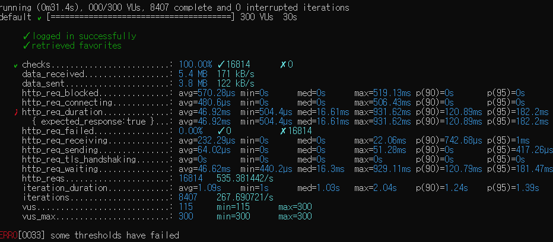
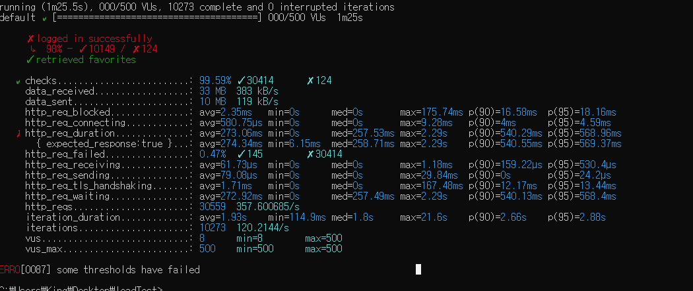
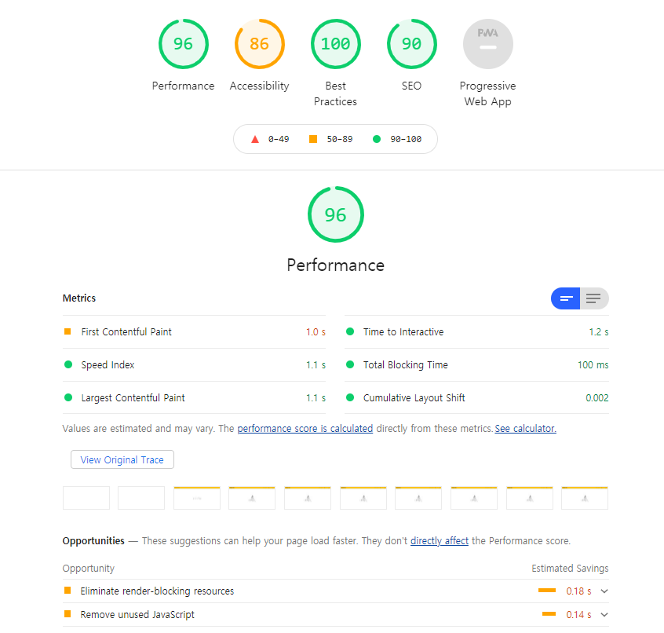
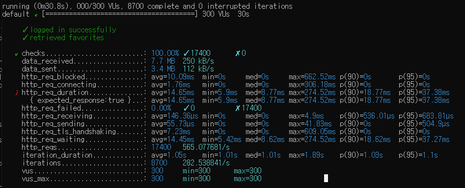
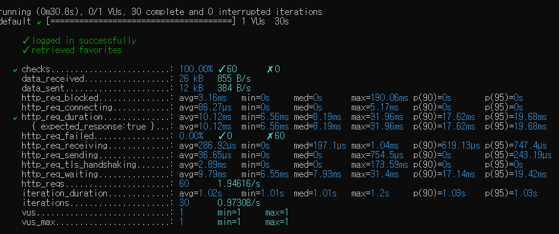

<p align="center">
    
</p>
<p align="center">
  
  
  <a href="https://edu.nextstep.camp/c/R89PYi5H" alt="nextstep atdd">
    
  </a>
  
</p>

<br>

# 인프라공방 샘플 서비스 - 지하철 노선도

<br>

## 🚀 Getting Started

### Install
#### npm 설치
```
cd frontend
npm install
```
> `frontend` 디렉토리에서 수행해야 합니다.

### Usage
#### webpack server 구동
```
npm run dev
```
#### application 구동
```
./gradlew clean build
```
<br>

## 미션

* 미션 진행 후에 아래 질문의 답을 작성하여 PR을 보내주세요.

### 1단계 - 화면 응답 개선하기
#### 타겟 : https://performance.honbabzone.com/

 ### 목표 - PageSpeed : 총점 70점 이상 
 #### First Contentful Paint (FCP) : 1초 미만
 #### Time to Interactive (TTI) : 2초 미만
 #### Speed Index : 3초 미만
 #### Total Blocking Time : 150ms 미만
 #### Large Contentful Paint (LCP) : 3초 미만
 
1. 성능 개선 결과를 공유해주세요 (Smoke, Load, Stress 테스트 결과)
 ### 전
 
 
 
 
 
 ### 후
 
 
 
 

2. 어떤 부분을 개선해보셨나요? 과정을 설명해주세요
 - 리버스 프록시 개선 :  강의에서 다룬 내용을 위주로 Reverse Proxy 설정 중 gzip 설정을 통해 패킷의 양을 줄였으며 css,js이미지 파일 등에 대해 캐쉬를 
 설정하여 반복된 요청에 대한 효율적인 응답을 가지도록 하였습니다. 또한 HTTP 2.0 병렬화를 통해 1.0의 문제인  HOL 블로킹을 해결하여 TCP 
 사용 효율을 높였습니다. 

 - WAS 개선 : Redis를 통해 매서드에 대한 재 사용성을 높였습니다.

---

### 2단계 - 조회 성능 개선하기
#### 1. 인덱스 적용해보기 실습을 진행해본 과정을 공유해주세요
 - Coding as a Hobby 와 같은 결과를 반환하세요.

```
SELECT (COUNT(*) / (SELECT COUNT(*) FROM subway.programmer) * 100) as 'HobbyCount' 
FROM subway.programmer
GROUP BY hobby;

i) 속도 : 0.469 sec
ii) 문제 : FULL TABLE SCAN
ii) 해결 : pk 생성 및 pk 유니크로 변경, 인덱스 생성 

ALTER TABLE subway.programmer ADD CONSTRAINT programmer_pk PRIMARY KEY (id);
ALTER TABLE subway.programmer ADD UNIQUE id_unique (id);
CREATE INDEX idx_programmer_hoddy ON subway.programmer (hobby);

i) 개선 후 속도 0.031 sec

```
 - 프로그래머별로 해당하는 병원 이름을 반환하세요. (covid.id, hospital.name)
```
SELECT covid.id , hospital.name
FROM subway.programmer programmer
JOIN subway.covid covid ON covid.programmer_id = programmer.id
JOIN subway.hospital hospital ON covid.hospital_id = hospital.id;

i) 속도 : 0.016 sec ( 이상없음 )
ii) 문제 : FULL TABLE SCAN
ii) 해결 : pk 생성 및 pk 유니크로 변경 

ALTER TABLE subway.covid ADD CONSTRAINT covid_pk PRIMARY KEY (id);
ALTER TABLE subway.covid ADD UNIQUE covid_id_unique (id);

ALTER TABLE subway.hospital ADD CONSTRAINT hospital_pk PRIMARY KEY (id);
ALTER TABLE subway.hospital ADD UNIQUE hospital_id_unique (id);

CREATE INDEX idx_covid_all ON subway.covid(programmer_id, hospital_id);

i) 개선 후 속도 : 0.016 sec

```
 - 프로그래밍이 취미인 학생 혹은 주니어(0-2년)들이 다닌 병원 이름을 반환하고 user.id 기준으로 정렬하세요. (covid.id, hospital.name, user.Hobby, user.DevType, user.YearsCoding)

```
SELECT hospital.name
FROM subway.programmer programmer
JOIN subway.covid covid
ON covid.programmer_id = programmer.id
JOIN  subway.hospital hospital
ON covid.hospital_id = hospital.id
WHERE ( hobby = 'Yes' AND student LIKE 'Yes%' ) OR  years_coding = '0-2 years'
ORDER BY programmer.id;

i) 속도 : 0.016 sec ( 이상없음 )
ii) 문제 : 큰 이슈 없음
```

 - 서울대병원에 다닌 20대 India 환자들을 병원에 머문 기간별로 집계하세요. (covid.Stay)

```
SELECT stay, count(programmer.id)
FROM subway.hospital hospital
JOIN subway.covid covid ON covid.hospital_id = hospital.id 
JOIN subway.programmer programmer ON covid.programmer_id = programmer.id 
JOIN subway.member member ON covid.member_id = member.id
WHERE ( age BETWEEN 20 AND 29 ) AND country = "India" AND hospital.id=9
GROUP BY stay;

i) 속도 : 0.188 sec
ii) 문제 : FULL TABLE SCAN
ii) 해결 : covid index 순서 변경

DROP INDEX idx_covid_all ON subway.covid;
CREATE INDEX idx_covid_all ON subway.covid(hospital_id, programmer_id, member_id);

i) 속도 : 0.015 sec

```

 - 서울대병원에 다닌 30대 환자들을 운동 횟수별로 집계하세요. (user.Exercise)

```
SELECT exercise, count(programmer.id)
FROM subway.hospital hospital
JOIN subway.covid covid ON covid.hospital_id = hospital.id
JOIN subway.programmer programmer ON covid.programmer_id = programmer.id 
JOIN subway.member member ON covid.member_id = member.id
WHERE ( age BETWEEN 30 AND 39 ) AND hospital.id=9
GROUP BY exercise;

i) 속도 : 0.031 sec
ii) 문제 : 이슈 없음 

```

2. 페이징 쿼리를 적용한 API endpoint를 알려주세요
 - https://performance.honbabzone.com/favorites
 - 1@1.com / 1
