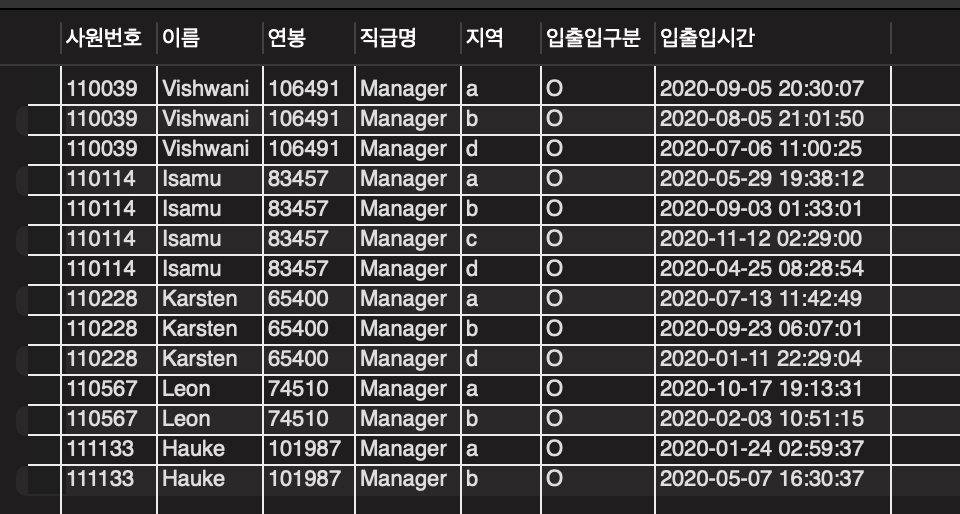
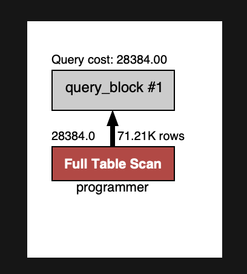
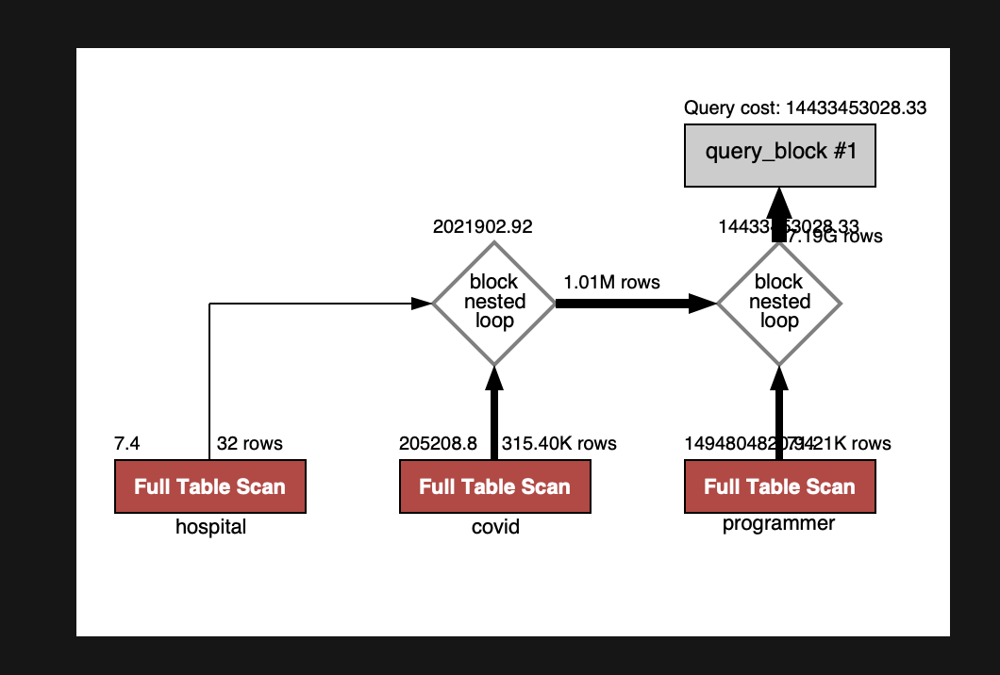
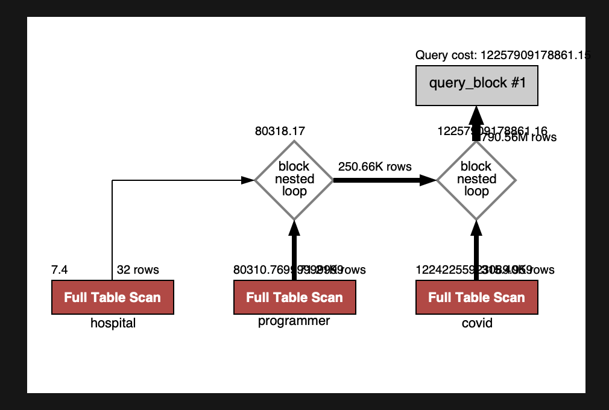
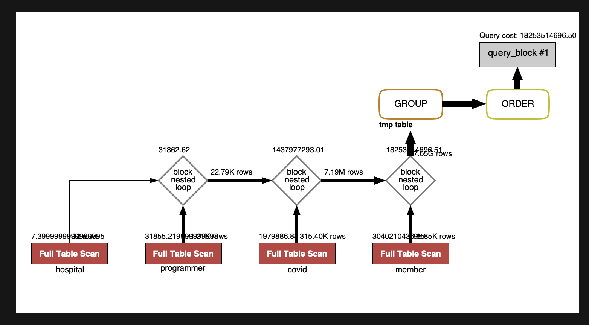
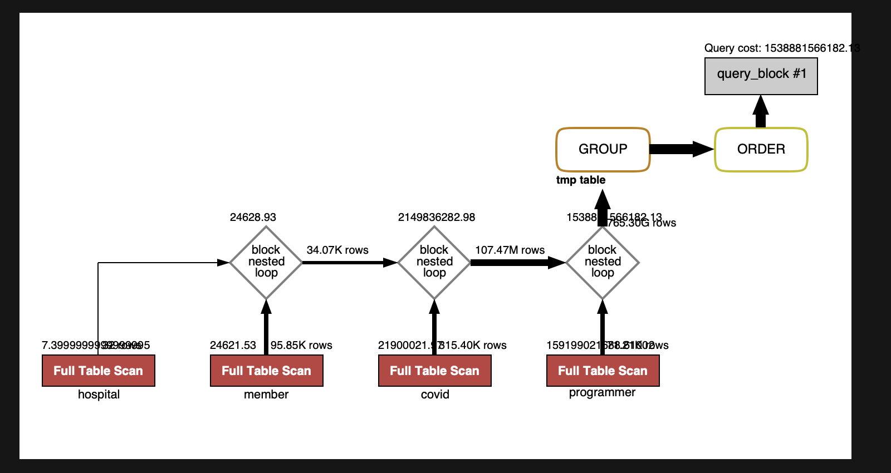
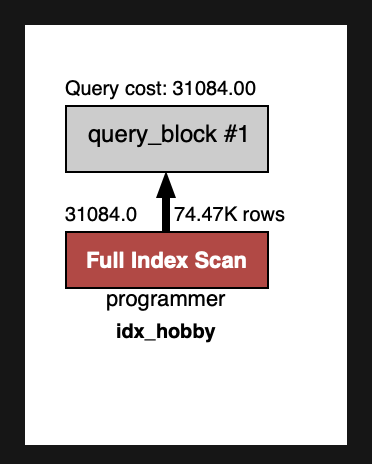
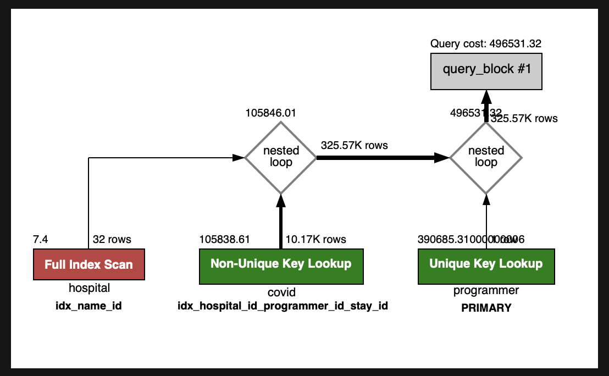
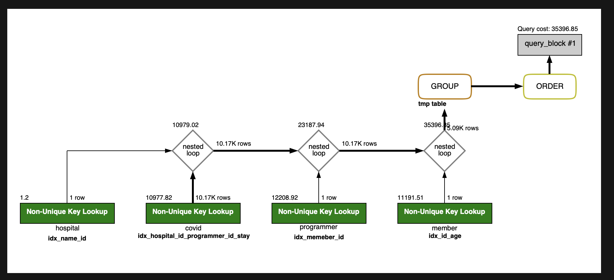

<p align="center">
    
</p>
<p align="center">
  
  
  <a href="https://edu.nextstep.camp/c/R89PYi5H" alt="nextstep atdd">
    
  </a>
  
</p>

<br>

# 인프라공방 샘플 서비스 - 지하철 노선도

<br>

## 🚀 Getting Started

### Install
#### npm 설치
```
cd frontend
npm install
```
> `frontend` 디렉토리에서 수행해야 합니다.

### Usage
#### webpack server 구동
```
npm run dev
```
#### application 구동
```
./gradlew clean build
```
<br>

## 미션

* 미션 진행 후에 아래 질문의 답을 작성하여 PR을 보내주세요.

### 1단계 - 쿼리 최적화

1. 인덱스 설정을 추가하지 않고 아래 요구사항에 대해 1s 이하(M1의 경우 2s)로 반환하도록 쿼리를 작성하세요.

- 활동중인(Active) 부서의 현재 부서관리자 중 연봉 상위 5위안에 드는 사람들이 최근에 각 지역별로 언제 퇴실했는지 조회해보세요. (사원번호, 이름, 연봉, 직급명, 지역, 입출입구분, 입출입시간)

```
SELECT result.사원번호, em.이름, result.연봉, rank.직급명, result.지역, result.입출입구분, result.입출입시간
FROM (
	SELECT top5.사원번호, max(top5.연봉) AS 연봉, his.지역, his.입출입구분, max(his.입출입시간) AS 입출입시간
	FROM (
		SELECT man.사원번호, sal.연봉
		FROM 부서 dep

		INNER JOIN 부서관리자 man
			ON man.부서번호 = dep.부서번호
			AND man.종료일자 > CURRENT_DATE

		INNER JOIN 급여 sal
			ON sal.사원번호 = man.사원번호
			AND sal.종료일자 > CURRENT_DATE

		WHERE dep.비고 = 'active'
		ORDER BY sal.연봉 DESC
		LIMIT 5
	) top5
    
	INNER JOIN 사원출입기록 his
		ON his.사원번호 = top5.사원번호
		AND his.입출입구분 = 'O'
    
    GROUP BY 사원번호, 지역
) result

INNER JOIN 사원 em
	ON em.사원번호 = result.사원번호

INNER JOIN 직급 rank
	ON rank.사원번호 = result.사원번호
	AND rank.종료일자 > CURRENT_DATE;
```

결과 : 1.763s (M1 기준)



---

### 2단계 - 인덱스 설계

##인덱스 적용해보기 실습을 진행해본 과정을 공유해주세요

1. Coding as a Hobby 와 같은 결과를 반환하세요.
#### 쿼리 추가
```sql
SELECT 
	ROUND(COUNT(case when hobby='yes' then 1 end) / COUNT(*) * 100, 1) AS yes,
	ROUND(COUNT(case when hobby='no' then 1 end) / COUNT(*) * 100, 1) AS no
FROM programmer;
```
#### 결과 


2.121 sec / 0.000024 sec 처참한 Duration....

#### Index 추가 계획
해당 쿼리에서 사용하는 조건은 hobby만 독립적으로 사용된다. 따라서 hobby만 단독적으로 추가가 필요해보임

2. 프로그래머별로 해당하는 병원 이름을 반환하세요. (covid.id, hospital.name)

#### 쿼리 추가
```sql
SELECT programmer.id, covid.id, hospital.name

FROM hospital

INNER JOIN covid 
ON covid.hospital_id = hospital.id

INNER JOIN programmer
ON programmer.id = covid.programmer_id; 
```

#### 결과


Error Code: 2013. Lost connection to MySQL server during query 너무 오래걸려 connection이 끊김...

#### Index 추가 계획
covid에 Hospital Id 와 Programmer Id가 같이 복합 Index로 추가하면 좋아보임, Hospital내에 데이터 양이 작긴 하지만 
hospital에 pk를 추가하던지 index를 추가하면 좋을 것 같아보임.

3. 프로그래밍이 취미인 학생 혹은 주니어(0-2년)들이 다닌 병원 이름을 반환하고 user.id 기준으로 정렬하세요. (covid.id, hospital.name, user.Hobby, user.DevType, user.YearsCoding)

#### 쿼리 추가
```sql
SELECT covid.id, hospital.name, programmer.hobby, programmer.dev_type, programmer.years_coding
FROM programmer

INNER JOIN covid
ON covid.programmer_id = programmer.id

INNER JOIN hospital
ON hospital.id = covid.hospital_id

WHERE (programmer.hobby='yes' AND programmer.student like 'Yes%') OR programmer.years_coding = '0-2 years';
```

#### 결과


Error Code: 2013. Lost connection to MySQL server during query 너무 오래걸려 connection이 끊김...

#### Index 추가 계획

covid에 Hospital Id 와 Programmer Id가 같이 복합 Index로 추가하면 좋아보임, Hospital내에 데이터 양이 작긴 하지만
hospital에 pk를 추가하던지 index를 추가하면 좋을 것 같아보임.
Programmer 테이블에는 hobby, student, years_coding을 넣기에는 OR로 연결되어있어 Index를 넣어도 index가 작동안할 확률이 높다
그래서 prgrammer는 id에 Primary Key만 추가해도 충분할 것으로 판단됨.


4. 서울대병원에 다닌 20대 India 환자들을 병원에 머문 기간별로 집계하세요. (covid.Stay)
#### 쿼리 추가
```sql
SELECT covid.stay, COUNT(member.id)
FROM programmer

INNER JOIN member
ON member.id = programmer.member_id
AND member.age >= 20 AND member.age < 30

INNER JOIN covid
ON covid.programmer_id = programmer.id
AND covid.member_id = member.id

INNER JOIN hospital
ON hospital.id = covid.hospital_id
AND hospital.name = '서울대병원'

WHERE programmer.country = 'India'

GROUP BY covid.stay
ORDER BY null;
```

#### 결과


Error Code: 2013. Lost connection to MySQL server during query 너무 오래걸려 connection이 끊김...

#### Index 추가 계획
Hospital에 name과 id 값을 복합으로 index 걸어도 좋아보임.
member은 id와 age가 동시에 조건절에 걸려있으므로 id age 복합키가 좋아보임
Covid는 hospital, programmer id와 stay가 같이 복합키로 연결해도 잘 작동될 것으로 판단됨 추가적으로 ID가 추가되면 더 좋은 성능을 보일 것으로 판단됨
programmer는 member와 covid의 양에 따라 member_id, id 의 복합키가 필요할 것으로 판단됨 

5. 서울대병원에 다닌 30대 환자들을 운동 횟수별로 집계하세요. (user.Exercise)

#### 쿼리 추가
```sql
SELECT programmer.exercise, COUNT(*)
FROM programmer

INNER JOIN member
ON member.id = programmer.member_id
AND member.age >= 30 AND member.age < 40

INNER JOIN covid
ON covid.member_id = member.id

INNER JOIN hospital
ON hospital.id = covid.hospital_id
AND hospital.name = '서울대병원'

GROUP BY programmer.exercise
ORDER BY NULL;
```

#### 결과


Error Code: 2013. Lost connection to MySQL server during query 너무 오래걸려 connection이 끊김...

#### Index 분석
Hospital에 name과 id 값을 복합으로 index 걸어도 좋아보임.
member은 id와 age가 동시에 조건절에 걸려있으므로 id age 복합키가 좋아보임
Covid는 hospital, programmer id와 복합키가 있으면 좋을 것 같음.
programmer는 member와 covid의 양에 따라 member_id, id 의 복합키가 필요할 것으로 판단됨


### INDEX 종합
- 1번을 위해 Programmer에 hobby만 따로 index가 추가 필요
```sql
ALTER TABLE `subway`.`programmer`
    ADD INDEX `idx_hobby` (`hobby`);
```

- Covid에는 Hospital_id, programmer_id, stay, id 복합 index가 추가 필요, 순서가 Hospital_id, programmer_id 가 먼저 나오게되면 한개의 
index로 2,3,4,5 전체가 커버가 가능할 것으로 보여짐
```sql
ALTER TABLE `subway`.`covid`
    ADD INDEX `idx_hospital_id_programmer_id_stay_id` (`hospital_id`, `programmer_id`, `stay`, `id`);
```

- Hospital에는 name, id index 추가 한다. id만 따로 추가해도 되겠지만 아직 양이 작아서 name, id 복합 index를 걸어두면 id만 index는 안탈꺼같다
```sql
ALTER TABLE `subway`.`hospital`
    ADD INDEX `idx_name_id` (`name`, `id`);
```

- Programmer에는 id로 PK를 추가하고, member_id가 index가 걸리게 추가한다
```sql
ALTER TABLE `subway`.`programmer` 
   CHANGE COLUMN `id` `id` BIGINT(20) NOT NULL ,
   ADD PRIMARY KEY (`id`);

ALTER TABLE `subway`.`programmer`
   ADD INDEX `idx_member_id` (`member_id`);
```

1. 결과
0.135 sec / 7.030 sec



2. 결과
0.135 sec / 7.030 sec



3. 결과
0.239 sec / 11.950 sec


4. 결과
0.214 sec / 0.0000088 sec


5. 결과
0.361 sec / 0.000031 sec


---

### 추가 미션

1. 페이징 쿼리를 적용한 API endpoint를 알려주세요
