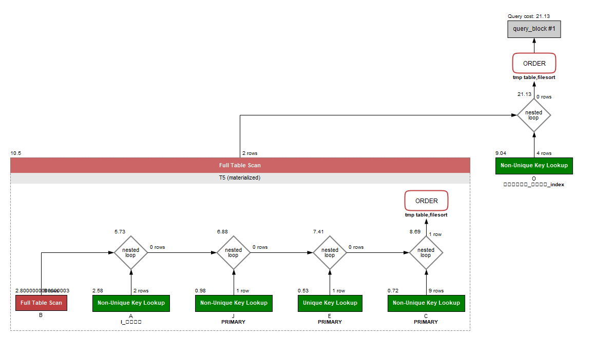
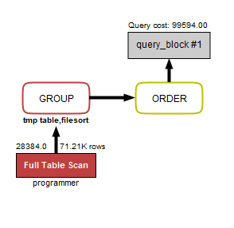
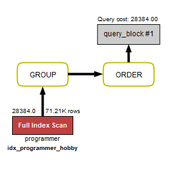
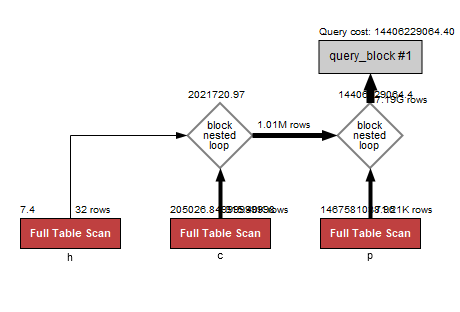
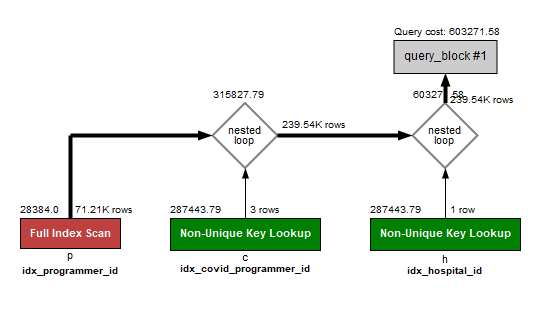
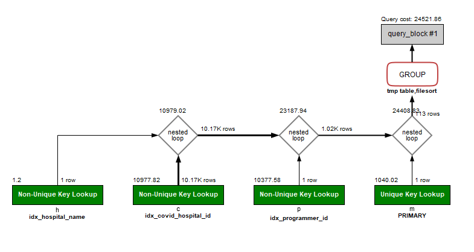
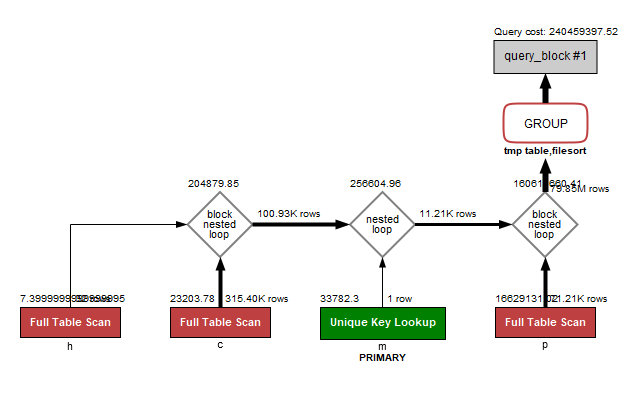
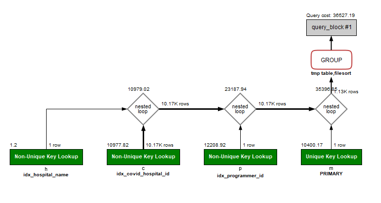

<p align="center">
    
</p>
<p align="center">
  
  
  <a href="https://edu.nextstep.camp/c/R89PYi5H" alt="nextstep atdd">
    
  </a>
  
</p>

<br>

# 인프라공방 샘플 서비스 - 지하철 노선도

<br>

## 🚀 Getting Started

### Install
#### npm 설치
```
cd frontend
npm install
```
> `frontend` 디렉토리에서 수행해야 합니다.

### Usage
#### webpack server 구동
```
npm run dev
```
#### application 구동
```
./gradlew clean build
```
<br>

## 미션

* 미션 진행 후에 아래 질문의 답을 작성하여 PR을 보내주세요.

### 1단계 - 화면 응답 개선하기
1. 성능 개선 결과를 공유해주세요 (Smoke, Load, Stress 테스트 결과)

2. 어떤 부분을 개선해보셨나요? 과정을 설명해주세요
-> 1단계 미션은 제외되었다고 해서 리뷰요청 바로 드렸습니다.
---

### 2단계 - 조회 성능 개선하기
1. 인덱스 적용해보기 실습을 진행해본 과정을 공유해주세요
   * 쿼리 최적화
     - [x] 활동중인(Active) 부서의 현재 부서관리자 중 연봉 상위 5위안에 드는 사람들이 최근에 각 지역별로 언제 퇴실했는지 조회해보세요.
     (사원번호, 이름, 연봉, 직급명, 지역, 입출입구분, 입출입시간)
     ```sql
     **인덱스 생성 전 (0.344 sec)**
      SELECT T5.사원번호, T5.이름, T5.연봉, T5.직급명, O.지역, O.입출입구분, O.입출입시간
        FROM (
                SELECT A.사원번호, E.이름, C.연봉, J.직급명 
                    FROM 부서관리자 A
                    INNER JOIN 부서 B
                        ON A.부서번호 = B.부서번호
                        AND B.비고 = 'active'
                    INNER JOIN 급여 C
                        ON A.사원번호 = C.사원번호
                        AND C.종료일자 > sysdate()
                    INNER JOIN 사원 E
                        ON A.사원번호 = E.사원번호
                    INNER JOIN 직급 J
                        ON A.사원번호 = J.사원번호
                        AND J.종료일자 > sysdate()
                WHERE A.종료일자 > sysdate()
                ORDER BY C.연봉 DESC
                LIMIT 5) AS T5
        INNER JOIN 사원출입기록 O
            ON T5.사원번호 = O.사원번호
            AND O.입출입구분 = 'O'
        ORDER BY T5.연봉 DESC, O.지역;
     ```
     
   
      ```sql
       ** 인덱스 생성 **
       CREATE INDEX idx_사원출입기록_사원번호 ON 사원출입기록 (사원번호);
      ```
      ```
      ** 인덱스 생성 후 0.031 sec **
      ```
      

<br>

   * 인덱스 설계 - 주어진 데이터셋을 활용하여 아래 조회 결과를 100ms 이하로 반환
     - [x] Coding as a Hobby 와 같은 결과를 반환하세요.
       ```sql
       SELECT hobby,
       ROUND(COUNT(hobby) / (SELECT COUNT(hobby) FROM programmer) * 100, 1) as percentage
       FROM programmer
       GROUP BY hobby
       ORDER BY hobby DESC;
       ```
       ```sql
        CREATE INDEX idx_programmer_hobby ON programmer (hobby);
       ```       

       인덱스 생성 전 | 인덱스 생성 후
               ---|---
       0.813 sec | 0.093 sec
     
       **인덱스 생성 전**<br>
       
       <br>
       **인덱스 생성 후**<br>
       
     
     - [x] 프로그래머별로 해당하는 병원 이름을 반환하세요. (covid.id, hospital.name)
        ```sql
        SELECT c.id, h.name FROM programmer p
        INNER JOIN covid c
            ON p.member_id = c.member_id
        INNER JOIN hospital h
            ON c.hospital_id = h.id;
       ```
       ```sql
        CREATE INDEX idx_programmer_id ON programmer (id);
        CREATE INDEX idx_covid_programmer_id ON covid (programmer_id);
        CREATE INDEX idx_hospital_id ON hospital (id);
       ```
       인덱스 생성 전 | 인덱스 생성 후
                      ---|---
       0.531 sec | 0.015 sec

       **인덱스 생성 전**<br>
       
       <br>
       **인덱스 생성 후**<br>
       

     - [x] 프로그래밍이 취미인 학생 혹은 주니어(0-2년)들이 다닌 병원 이름을 반환하고 user.id 기준으로 정렬하세요. (covid.id, hospital.name, user.Hobby, user.DevType, user.YearsCoding)
       ```sql
        SELECT c.id, h.name, p.hobby, p.dev_type, p.years_coding
        FROM programmer p
        INNER JOIN covid c
        ON p.id = c.programmer_id
        INNER JOIN hospital h
        ON c.hospital_id = h.id
        WHERE p.hobby = 'Yes'
        AND p.student LIKE 'Yes%' OR p.years_coding = '0-2 years'
        ORDER BY p.id ;
       ```
       ```sql
        CREATE INDEX idx_programmer_id ON programmer (id);
        CREATE INDEX idx_covid_programmer_id ON covid (programmer_id);
        CREATE INDEX idx_hospital_id ON hospital (id);
       ```
       인덱스 생성 전 | 인덱스 생성 후
        ---|---
       측정불가(뻗음) | 0.031 sec

       **인덱스 생성 전**<br>
       [x]
       <br>
       **인덱스 생성 후**<br>
       

     - [x] 서울대병원에 다닌 20대 India 환자들을 병원에 머문 기간별로 집계하세요. (covid.Stay)
        ```sql
        SELECT c.stay, Count(c.stay) as count
        FROM covid c
        INNER JOIN hospital h
            ON c.hospital_id = h.id
            AND h.name = '서울대병원'
        INNER JOIN programmer p
            ON c.programmer_id = p.id
            AND p.country = 'India'
        INNER JOIN member m
            ON m.id = p.member_id
            AND m.age BETWEEN 20 AND 29
        GROUP BY c.stay;
       ```
       ```sql
        CREATE INDEX idx_programmer_id ON programmer (id);
        CREATE INDEX idx_covid_programmer_id_hospital_id ON covid (programmer_id, hospital_id);
        CREATE INDEX idx_covid_hospital_id ON covid (hospital_id);
        CREATE INDEX idx_hospital_name ON hospital (name);
       ```
       인덱스 생성 전 | 인덱스 생성 후
               ---|---
       조회실패 | 0.062 sec

       **인덱스 생성 전**<br>
       [x]
       <br>
       **인덱스 생성 후**<br>
       
       
     - [x] 서울대병원에 다닌 30대 환자들을 운동 횟수별로 집계하세요. (user.Exercise)
        ```sql
        SELECT p.exercise, count(p.exercise) AS count
        FROM programmer p
        INNER JOIN covid c
        ON c.programmer_id = p.id
        INNER JOIN hospital h
        ON h.id = c.hospital_id
        AND h.name = '서울대병원'
        INNER JOIN member m
        ON c.member_id = m.id
        AND m.age BETWEEN 30 AND 39
        GROUP BY p.exercise;
       ```
       ```sql
        CREATE INDEX idx_programmer_id ON programmer (id);
        CREATE INDEX idx_covid_programmer_id_hospital_id ON covid (programmer_id, hospital_id);
        CREATE INDEX idx_covid_hospital_id ON covid (hospital_id);
        CREATE INDEX idx_hospital_name ON hospital (name);
       ```
       인덱스 생성 전 | 인덱스 생성 후
       ---|---
       8.500 sec | 0.062 sec

       **인덱스 생성 전**<br>
       
       <br>
       **인덱스 생성 후**<br>
       
     
<br>
3. 페이징 쿼리를 적용한 API endpoint를 알려주세요


