<p align="center">
    
</p>
<p align="center">
  
  
  <a href="https://edu.nextstep.camp/c/R89PYi5H" alt="nextstep atdd">
    
  </a>
  
</p>

<br>

# 인프라공방 샘플 서비스 - 지하철 노선도

<br>

## 🚀 Getting Started

### Install
#### npm 설치
```
cd frontend
npm install
```
> `frontend` 디렉토리에서 수행해야 합니다.

### Usage
#### webpack server 구동
```
npm run dev
```
#### application 구동
```
./gradlew clean build
```
<br>

## 미션

* 미션 진행 후에 아래 질문의 답을 작성하여 PR을 보내주세요.


### 1단계 - 화면 응답 개선하기
1. 성능 개선 결과를 공유해주세요 (Smoke, Load, Stress 테스트 결과)

- 성능 테스트 조건 근거
  - https://github.com/seogineer/infra-subway-monitoring/tree/step3

### smoke.js
```javascript
import http from 'k6/http';
import { check, group, sleep, fail } from 'k6';

export let options = {
  vus: 600, // 1 user looping for 1 minute
  duration: '1800s',

  thresholds: {
    http_req_duration: ['p(99)<1500'], // 99% of requests must complete below 1.5s
  },
};

const BASE_URL = 'https://seogineer.kro.kr';
const USERNAME = 'dgseo8981@gmail.com';
const PASSWORD = '1234';

export default function ()  {
  // login
  var payload = JSON.stringify({
    email: USERNAME,
    password: PASSWORD,
  });

  var params = {
    headers: {
      'Content-Type': 'application/json',
    },
  };

  let loginRes = http.post(`${BASE_URL}/login/token`, payload, params);

  check(loginRes, {
    'logged in successfully': (resp) => resp.json('accessToken') !== '',
  });

  let authHeaders = {
    headers: {
      Authorization: `Bearer ${loginRes.json('accessToken')}`,
    },
  };
  let myObjects = http.get(`${BASE_URL}/members/me`, authHeaders).json();
  check(myObjects, { 'retrieved member': (obj) => obj.id != 0 });
  sleep(1);

  // lending page
  let homeUrl = `${BASE_URL}`;
  let lendingPageResponse = http.get(homeUrl);
  check(lendingPageResponse, {
      'lending page running': (response) => response.status === 200
  });
};
```

### load.js
```javascript
import http from 'k6/http';
import { check, group, sleep, fail } from 'k6';

export let options = {
    stages: [
      { duration: '600s', target: 300 },
    ],

    thresholds: {
        http_req_duration: ['p(99)<1500'],
    },
};

const BASE_URL = 'https://seogineer.kro.kr';
const USERNAME = 'dgseo8981@gmail.com';
const PASSWORD = '1234';

export default function () {
    // login
    var payload = JSON.stringify({
        email: USERNAME,
        password: PASSWORD,
    });
    
    var params = {
        headers: {
          'Content-Type': 'application/json',
        },
    };
    
    let loginRes = http.post(`${BASE_URL}/login/token`, payload, params);
    
    check(loginRes, {
        'logged in successfully': (resp) => resp.json('accessToken') !== '',
    });
    
    // myinfo
    let authHeaders = {
        headers: {
            Authorization: `Bearer ${loginRes.json('accessToken')}`,
        },
    };
    let myObjects = http.get(`${BASE_URL}/members/me`, authHeaders).json();
    check(myObjects, {'retrieved member': (obj) => obj.id != 0});

    // create line
    let createLineUrl = `${BASE_URL}/lines`;
    let lineRandomNumber = Math.random().toString().split('.')[1];
    let createLinePayload = JSON.stringify({
        name: `testLine-${lineRandomNumber}`,
        color: "grey darken-4",
        upStationId: 1,
        downStationId: 2,
        distance: 10,
    });
    let createLineParams = {
        headers: {
            'Authorization': `Bearer ${loginRes.json('accessToken')}`,
            'Content-Type': 'application/json',
        },
    };
    let createLinesResponse = http.post(createLineUrl, createLinePayload, createLineParams);
    check(createLinesResponse, {
        'created Line successfully': (response) => response.status === 201,
    });
}
```

### stress.js
```javascript
import http from 'k6/http';
import { check, group, sleep, fail } from 'k6';

export let options = {
    stages: [
      { duration: '300s', target: 100 },
      { duration: '300s', target: 200 },
      { duration: '300s', target: 300 },
      { duration: '300s', target: 400 },
      { duration: '300s', target: 500 },
      { duration: '300s', target: 600 },
    ],
    thresholds: {
        http_req_duration: ['p(99)<1500'],
    },
};

const BASE_URL = 'https://seogineer.kro.kr';
const USERNAME = 'dgseo8981@gmail.com';
const PASSWORD = '1234';

export default function ()  {
  // login
  var payload = JSON.stringify({
    email: USERNAME,
    password: PASSWORD,
  });

  var params = {
    headers: {
      'Content-Type': 'application/json',
    },
  };

  let loginRes = http.post(`${BASE_URL}/login/token`, payload, params);

  check(loginRes, {
    'logged in successfully': (resp) => resp.json('accessToken') !== '',
  });

  // myinfo
  let authHeaders = {
    headers: {
      Authorization: `Bearer ${loginRes.json('accessToken')}`,
    },
  };
  let myObjects = http.get(`${BASE_URL}/members/me`, authHeaders).json();
  check(myObjects, { 'retrieved member': (obj) => obj.id != 0 });

  // create line
  let createLineUrl = `${BASE_URL}/lines`;
  let lineRandomNumber = Math.random().toString().split('.')[1];
  let createLinePayload = JSON.stringify({
      name: `testLine-${lineRandomNumber}`,
      color: "grey darken-4",
      upStationId: 1,
      downStationId: 2,
      distance: 10,
  });
  let createLineParams = {
      headers: {
          'Authorization': `Bearer ${loginRes.json('accessToken')}`,
          'Content-Type': 'application/json',
      },
  };
  let createLinesResponse = http.post(createLineUrl, createLinePayload, createLineParams);
  check(createLinesResponse, {
      'created Line successfully': (response) => response.status === 201,
  });
}
```
### gzip 압축 적용

| Before                                                    | After                                                        |
|-----------------------------------------------------------|--------------------------------------------------------------|
| 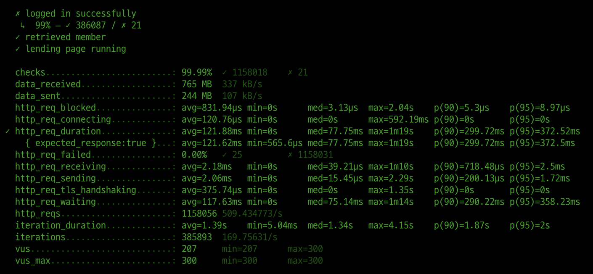   |    |
|      | 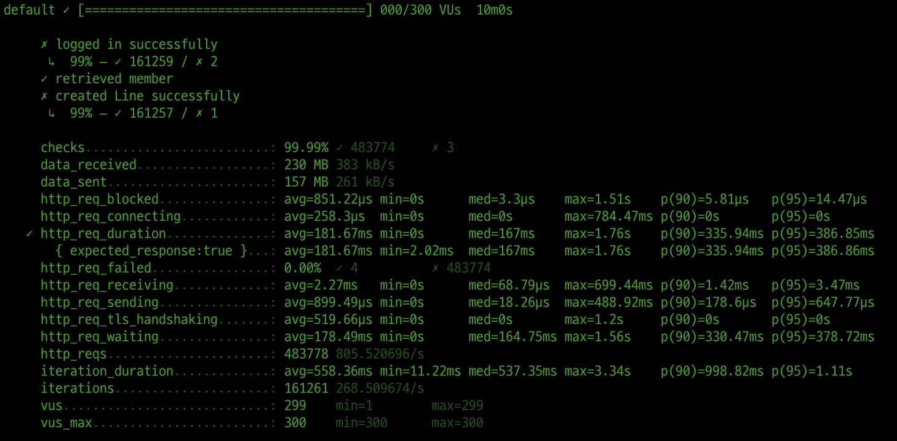     |
| 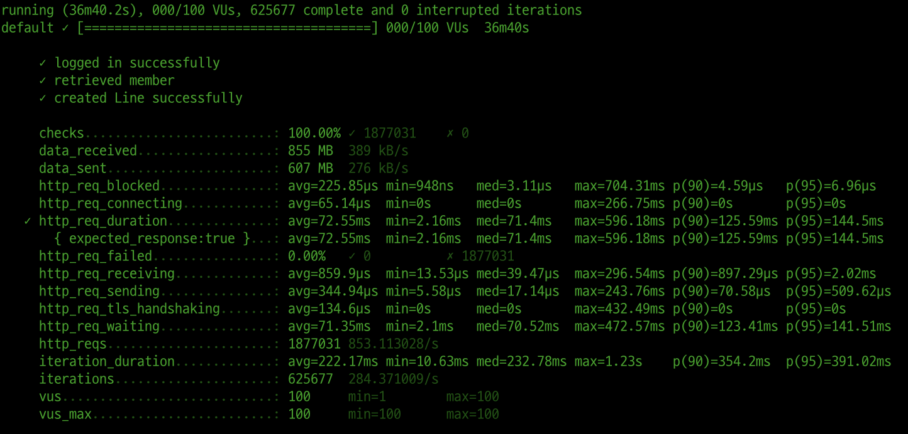 |  |

### gzip 압축 적용 + cache 적용

| Before                                                    | After                                                                |
|-----------------------------------------------------------|----------------------------------------------------------------------|
|    |    |
|      | 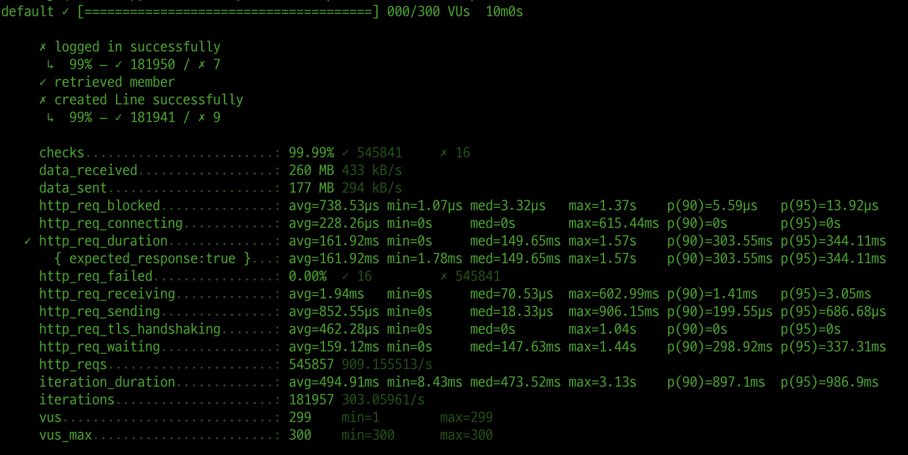     |
|  | 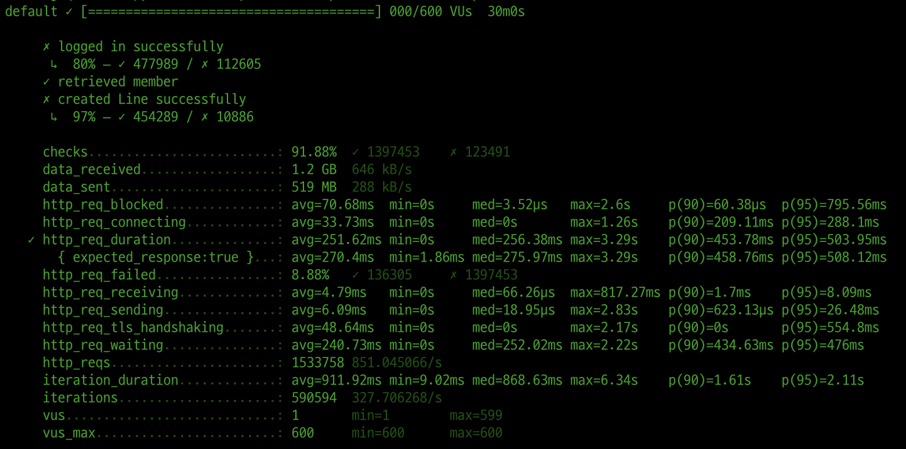 |

### gzip 압축 적용 + cache 적용 + TLS, HTTP/2 설정

| Before                                                    | After                                                                        |
|-----------------------------------------------------------|------------------------------------------------------------------------------|
|    |    |
|      |      |
|  | 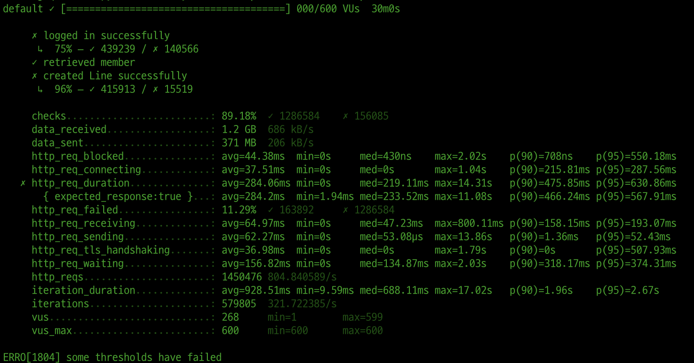 |

### redis

| gzip 압축 적용 + cache 적용                                        | redis 추가                                                      |
|--------------------------------------------------------------|---------------------------------------------------------------|
|  |    |
|  |      |
|  |  |

2. 어떤 부분을 개선해보셨나요? 과정을 설명해주세요

- Reverse Proxy 개선
  - gzip 압축
  - cache
  - TLS, HTTP/2 설정
    - 원인은 모르겠으나 위 설정 후에 부하 테스트 시에 "ERRO[1804] some thresholds have failed"가 보임.
    - 성능을 위해서 제외

- redis
  - http_req_failed 수치가 증가함.
---

### 2단계 - 스케일 아웃

1. Launch Template 링크를 공유해주세요.

https://ap-northeast-2.console.aws.amazon.com/ec2/home?region=ap-northeast-2#LaunchTemplateDetails:launchTemplateId=lt-0a68f3abccc8e0ce5

2. cpu 부하 실행 후 EC2 추가생성 결과를 공유해주세요. (Cloudwatch 캡쳐)

```sh
$ stress -c 2
```
인스턴스 개수가 늘어나는 것은 확인했는데 cloudwatch에서 그래프가 증가하는 것은 확인하지 못 했습니다.

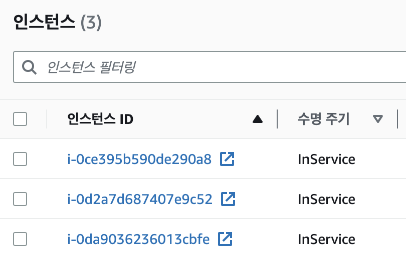
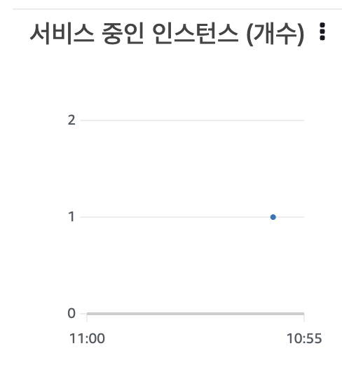


3. 성능 개선 결과를 공유해주세요 (Smoke, Load, Stress 테스트 결과)

### smoke test
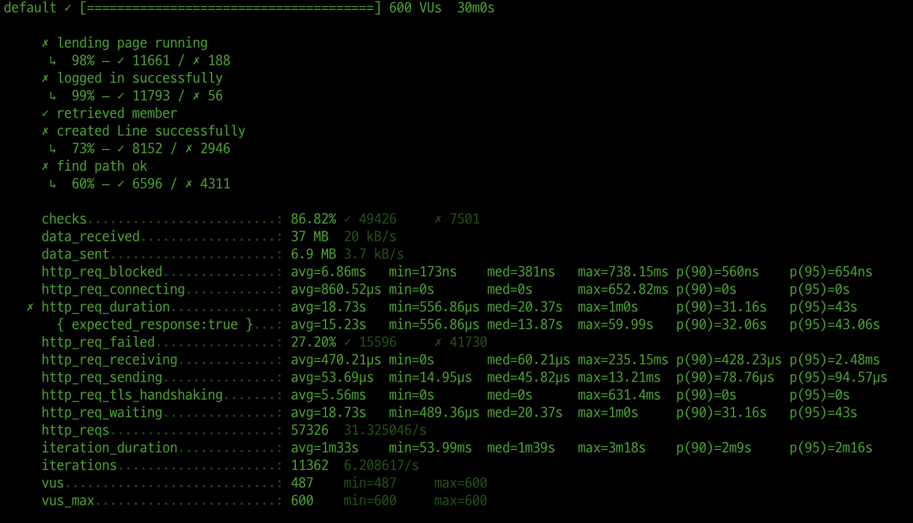

### load test
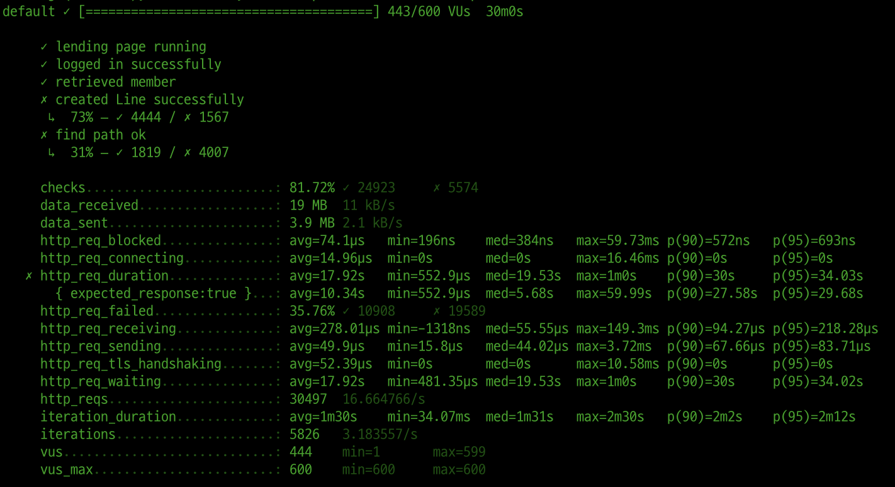

### stress test
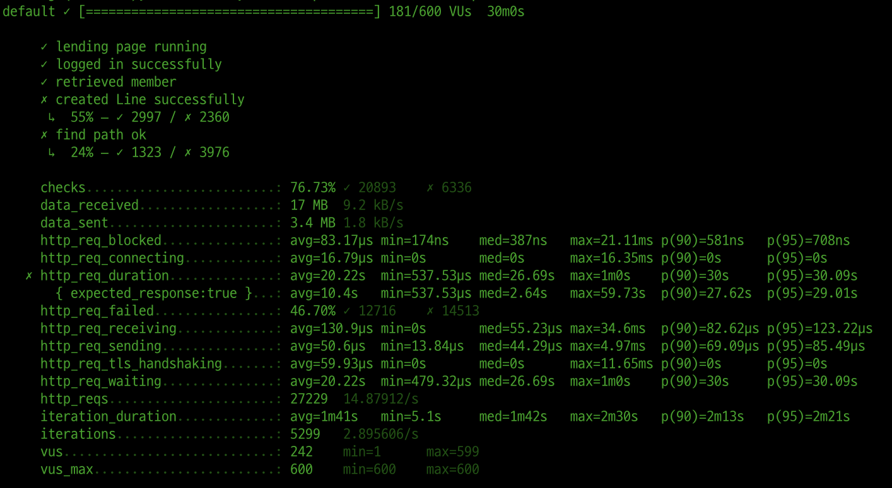

---

### 3단계 - 쿼리 최적화

1. 인덱스 설정을 추가하지 않고 아래 요구사항에 대해 1s 이하(M1의 경우 2s)로 반환하도록 쿼리를 작성하세요.

- 활동중인(Active) 부서의 현재 부서관리자 중 연봉 상위 5위안에 드는 사람들이 최근에 각 지역별로 언제 퇴실했는지 조회해보세요. (사원번호, 이름, 연봉, 직급명, 지역, 입출입구분, 입출입시간)

```mysql
SELECT
    MANAGER_TOP5_SALARY.id AS 사원번호,
    MANAGER_TOP5_SALARY.last_name AS 이름,
    MANAGER_TOP5_SALARY.annual_income AS 연봉,
    MANAGER_TOP5_SALARY.position_name AS 직급명,
    R.time AS 입출입시간,
    R.region AS 지역,
    R.record_symbol AS 입출입구분
FROM (
	SELECT 
            E.id, 
            E.last_name, 
            S.annual_income, 
            P.position_name
	FROM (SELECT id FROM department WHERE note LIKE 'active') AS D
	INNER JOIN (SELECT department_id, employee_id FROM manager WHERE end_date >= now()) AS M
	ON D.id = M.department_id
	INNER JOIN (SELECT id, last_name FROM employee) AS E
	ON M.employee_id = E.id
	INNER JOIN (SELECT id, position_name FROM position WHERE position_name LIKE 'Manager') AS P
	ON E.id = P.id
	INNER JOIN (SELECT id, annual_income FROM salary WHERE end_date >= now()) AS S
	ON E.id = S.id
	LIMIT 5
) AS MANAGER_TOP5_SALARY
INNER JOIN (
    SELECT 
        employee_id,
        time,
        record_symbol,
        region 
    FROM record
    WHERE record_symbol = 'O') AS R
ON MANAGER_TOP5_SALARY.id = R.employee_id
ORDER BY MANAGER_TOP5_SALARY.annual_income DESC
```

PRIMARY 키만 남겨두고 모든 인덱스를 DROP한 후에 시간 측정    
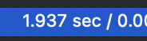

---

### 4단계 - 인덱스 설계

1. 인덱스 적용해보기 실습을 진행해본 과정을 공유해주세요

#### covid index
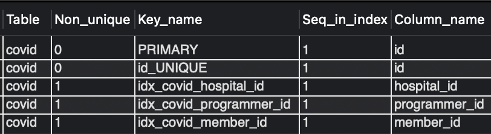

#### hospital index
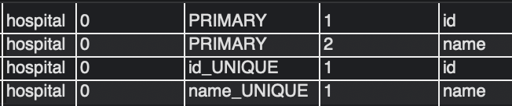

#### member index
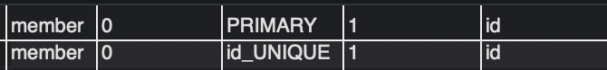

#### programmer index
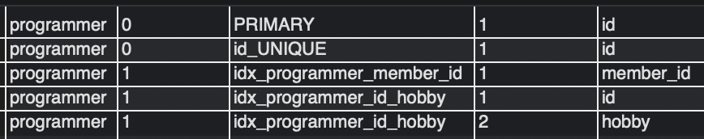

---
#### Coding as a Hobby 와 같은 결과를 반환하세요.
```mysql
SELECT hobby,
       round((count(id) / (SELECT COUNT(id) FROM programmer) * 100), 1) AS rate
FROM programmer
GROUP BY hobby
```
##### 실행 시간
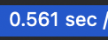

---

#### 프로그래머별로 해당하는 병원 이름을 반환하세요. (covid.id, hospital.name)
```mysql
SELECT covid.id, hospital.name
FROM hospital
       JOIN covid ON covid.hospital_id = hospital.id
       JOIN programmer ON programmer.id = covid.programmer_id
```
##### 실행 시간


---
#### 프로그래밍이 취미인 학생 혹은 주니어(0-2년)들이 다닌 병원 이름을 반환하고 user.id 기준으로 정렬하세요.(covid.id, hospital.name, user.Hobby, user.DevType, user.YearsCoding)
```mysql
SELECT c.id, h.name, p.hobby, p.dev_type, p.years_coding
FROM programmer p
       JOIN covid c ON c.programmer_id = p.id
       JOIN hospital h ON c.hospital_id = h.id
WHERE p.hobby = 'YES'
  AND (p.student LIKE 'Yes%' OR p.years_coding = '0-2%')
```
##### 실행 시간
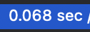

---

#### 서울대병원에 다닌 20대 India 환자들을 병원에 머문 기간별로 집계하세요. (covid.Stay)
```mysql
SELECT c.stay, COUNT(c.member_id)
FROM hospital h
       JOIN covid c ON c.hospital_id = h.id
       JOIN member m ON c.member_id = m.id
       JOIN programmer p ON m.id = p.member_id
WHERE h.name LIKE '서울대병원'
  AND p.country LIKE 'India'
  AND m.age BETWEEN 20 AND 29
GROUP BY c.stay
```
##### 실행 시간
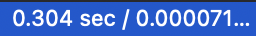

---

#### 서울대병원에 다닌 30대 환자들을 운동 횟수별로 집계하세요. (user.Exercise)
```mysql
SELECT p.exercise, COUNT(c.member_id)
FROM hospital h
       JOIN covid c ON c.hospital_id = h.id
       JOIN member m ON c.member_id = m.id
       JOIN programmer p ON m.id = p.member_id
WHERE h.name LIKE '서울대병원'
  AND m.age BETWEEN 30 AND 39
GROUP BY p.exercise
```

##### 실행 시간


### 추가 미션

1. 페이징 쿼리를 적용한 API endpoint를 알려주세요
   - addition.seogineer.kro.kr/stations/page/{id}
