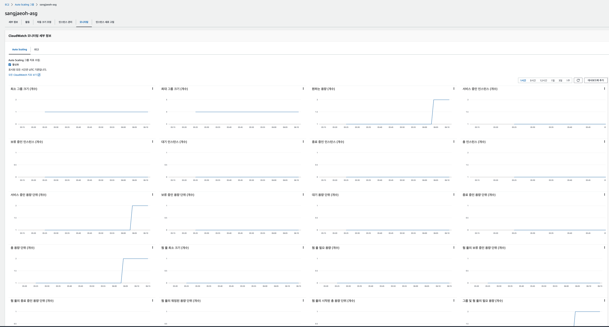
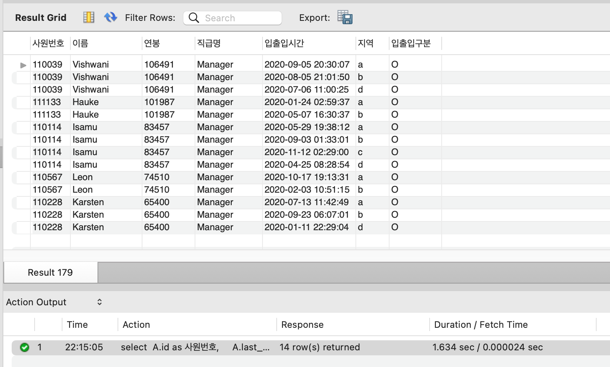
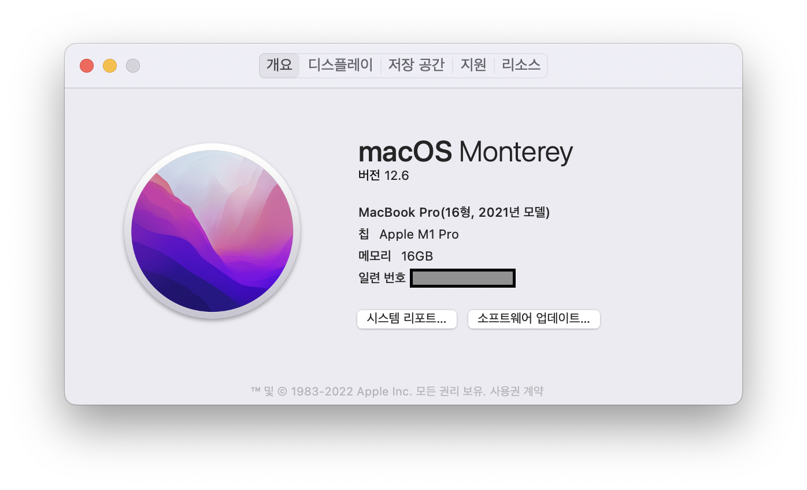

<p align="center">
    
</p>
<p align="center">
  
  
  <a href="https://edu.nextstep.camp/c/R89PYi5H" alt="nextstep atdd">
    
  </a>
  
</p>

<br>

# 인프라공방 샘플 서비스 - 지하철 노선도

<br>

## 🚀 Getting Started

### Install
#### npm 설치
```
cd frontend
npm install
```
> `frontend` 디렉토리에서 수행해야 합니다.

### Usage
#### webpack server 구동
```
npm run dev
```
#### application 구동
```
./gradlew clean build
```
<br>

## 미션

* 미션 진행 후에 아래 질문의 답을 작성하여 PR을 보내주세요.


### 1단계 - 화면 응답 개선하기
1. 성능 개선 결과를 공유해주세요 (Smoke, Load, Stress 테스트 결과)  
전체 결과 경로: /performance  

**http_req_duration**

| 종류     | Before   | Nginx   | Nginx + WAS |
|--------|----------|---------|-------------|
| smoke  | 5.22ms   | 1.44ms  | 5.75ms      |
| load   | 5.72ms   | 1.19ms  | 1.13ms      |
| stress | 100.62ms | 10.25ms | 6.61ms      |

가장 중요한 지표라 생각되는 stress 테스트에서 개선되는 결과를 확인할 수 있었습니다.

<br/>

2. 어떤 부분을 개선해보셨나요? 과정을 설명해주세요

첫 번째 개선
- Nginx 
  - gzip 압축
  - cache 적용
  - TLS, HTTP/2 설정

두 번째 개선
- WAS
  - Spring Data Cache 적용


---

### 2단계 - 스케일 아웃

1. Launch Template 링크를 공유해주세요.  
[템플릿 링크](https://ap-northeast-2.console.aws.amazon.com/ec2/home?region=ap-northeast-2#LaunchTemplateDetails:launchTemplateId=lt-0cf08f503f24c1f8c)


2. cpu 부하 실행 후 EC2 추가생성 결과를 공유해주세요. (Cloudwatch 캡쳐)



```sh
$ stress -c 2
```

3. 성능 개선 결과를 공유해주세요 (Smoke, Load, Stress 테스트 결과)  
   **http_req_duration**

| 종류            | Before   | Nginx   | Nginx + WAS | Auto Scaling |
|---------------|----------|---------|-------------|--------------|
| smoke         | 5.22ms   | 1.44ms  | 5.75ms      | 3.81ms       |
| load          | 5.72ms   | 1.19ms  | 1.13ms      | 3.6ms        |
| stress        | 100.62ms | 10.25ms | 6.61ms      | 5.2ms        |
| stress 600VUs | -        | -       | -           | 7.39ms       |

속도의 개선보다는 VUs를 늘린 stress 테스트에서 Auto Scaling 이 동작해서 부하 분산을 통해
병목 현상 및 서버 다운을 방지하는 모습을 확인했습니다.


---

### 3단계 - 쿼리 최적화

1. 인덱스 설정을 추가하지 않고 아래 요구사항에 대해 1s 이하(M1의 경우 2s)로 반환하도록 쿼리를 작성하세요.

- 활동중인(Active) 부서의 현재 부서관리자 중 연봉 상위 5위안에 드는 사람들이 최근에 각 지역별로 언제 퇴실했는지 조회해보세요. (사원번호, 이름, 연봉, 직급명, 지역, 입출입구분, 입출입시간)

**쿼리**
```sql
select A.id                 as 사원번호,
       A.last_name          as 이름,
       A.annual_income      as 연봉,
       A.position_name      as 직급명,
       record.time          as 입출입시간,
       record.region        as 지역,
       record.record_symbol as 입출입구분
from (select employee.id,
             employee.last_name,
             position.position_name,
             salary.annual_income
      from department
               join manager on department.id = manager.department_id
               join position on position.id = manager.employee_id
               join employee on employee.id = manager.employee_id
               join salary on salary.id = manager.employee_id
      where department.note = 'active'
        and manager.end_date = '9999-01-01'
        and position.end_date = '9999-01-01'
        and salary.end_date = '9999-01-01'
      order by salary.annual_income desc limit 5) as A
         join record on employee_id = A.id
where record.record_symbol = 'O';
```

**조회결과**


**arch**



---

### 4단계 - 인덱스 설계

1. 인덱스 적용해보기 실습을 진행해본 과정을 공유해주세요

---

### 추가 미션

1. 페이징 쿼리를 적용한 API endpoint를 알려주세요
