<p align="center">
    
</p>
<p align="center">
  
  
  <a href="https://edu.nextstep.camp/c/R89PYi5H" alt="nextstep atdd">
    
  </a>
  
</p>

<br>

# 인프라공방 샘플 서비스 - 지하철 노선도

<br>

## 🚀 Getting Started

### Install
#### npm 설치
```
cd frontend
npm install
```
> `frontend` 디렉토리에서 수행해야 합니다.

### Usage
#### webpack server 구동
```
npm run dev
```
#### application 구동
```
./gradlew clean build
```
<br>

## 미션

* 미션 진행 후에 아래 질문의 답을 작성하여 PR을 보내주세요.

## 요구사항 
### 1단계 
- [X] 부하테스트 각 시나리오의 요청시간을 목푯값 이하로 개선
  - 목표 요청시간(http_req_duration) = 0.1s
  - 목표 최대 RPS = 75

### 2단계 
- [X] springboot에 HTTP Cache, gzip 설정하기
- [X] Launch Template 작성하기
- [X] Auto Scaling Group 생성하기
- [X] Smoke, Load, Stress 테스트 후 결과를 기록


### 1단계 - 화면 응답 개선하기
1. 성능 개선 결과를 공유해주세요 (Smoke, Load, Stress 테스트 결과)
#### 개선 이전
  - Smoke
    
  - Load
    
  - Stress
    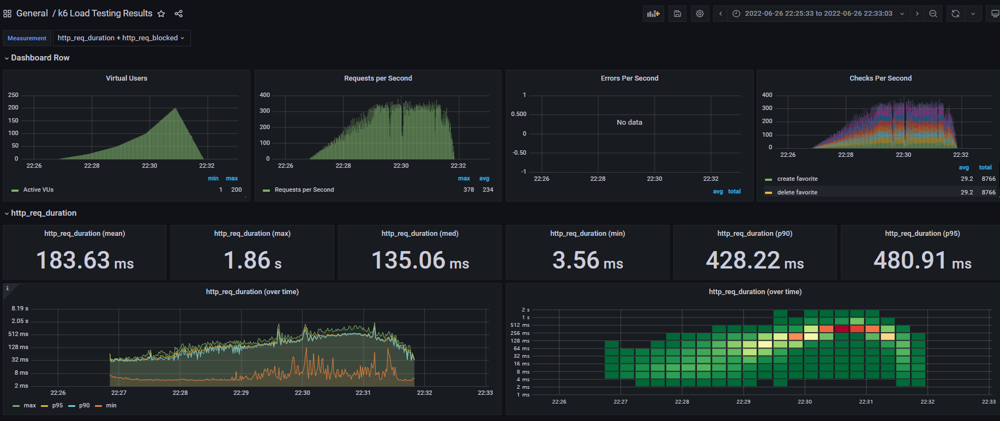

#### 개선 이후
  - Smoke
    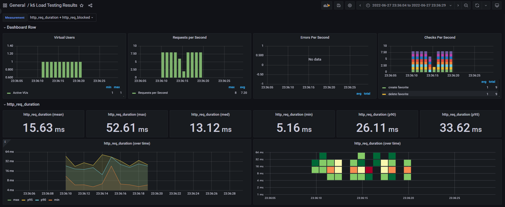
  - Load
    
  - Stress
    

#### 요약 (약 20~30퍼센트 성능개선)
  - Smoke(p95) : 63ms -> 33ms
  - Load(p95) : 65ms -> 40 ms
  - Stress(p95) : 480ms -> 376ms

#### 특이사항
  - Stress 테스트 결과가 성능 개선 시도 전보다 더 악화되어 나온 경우가 있었음
    
    - 테스트 진행 중에 `top` 명령어로 살펴보니 `load(EC2 Instance)`에 있는 `influxDB`의 메모리 사용율이 90퍼센트까지 올라가는걸 발견
    - grafana를 끄고 재시도한 Stress 테스트의 결과는 개선된걸로 나옴
  - redis를 새로 시작한 직후에 시도한 smoke 테스트는 성능 개선 전보다 지표가 좋지 않았음.

---

2. 어떤 부분을 개선해보셨나요? 과정을 설명해주세요
#### 웹서버 
- Gzip을 적용하여 응답메시지 압축
- HSTS를 적용해서 요청 수 최소화
- js, css, image에 대한 캐싱 적용

#### 애플리케이션
- 조회 서비스(역정보, 경로검색 등)에 Radis 캐시를 적용해서 의미없는 DB 접근 최소화

3. http2 적용
   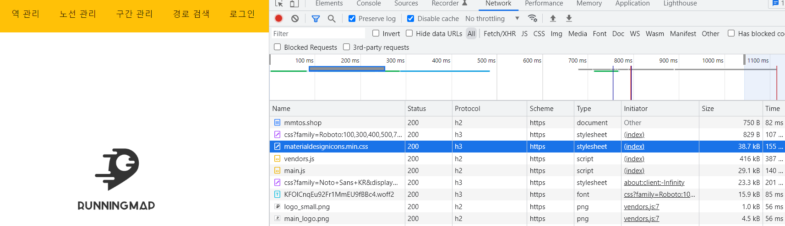
---

### 2단계 - 스케일 아웃
1. springboot에 HTTP Cache, gzip 설정하기 
    - 미션 3에 대한 답변 : no cache와 no store를 동시에 할 수는 없다. 
      - 우선 CacheControl에서 중복 설정이 불가능하다
      - no cache는 항상 ETag로 확인한 후 문제가 없는 경우 저장된 자원을 사용한다.
      - 문제는 no store인 경우 사용할 수 있는 자원이 없다는 것이다. 
      - 따라서 둘 중 하나만 선택해서 써야한다.

2. Launch Template 링크를 공유해주세요.
    - https://ap-northeast-2.console.aws.amazon.com/ec2/home?region=ap-northeast-2#LaunchTemplateDetails:launchTemplateId=lt-0263eacae6f8bcae2

3. cpu 부하 실행 후 EC2 추가생성 결과를 공유해주세요. (Cloudwatch 캡쳐)
    - stress 테스트 진행중 VUser가 200일때 인스턴스가 최대치까지 급격하게 오르는 걸 확인 했습니다. 
    - 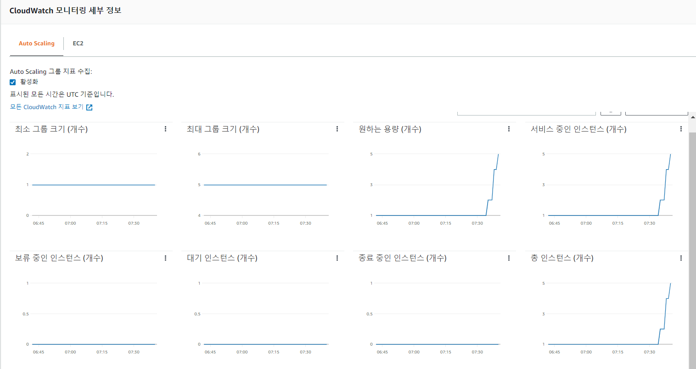

4. 성능 개선 결과를 공유해주세요 (Smoke, Load, Stress 테스트 결과)
```
* 이전단계와의 차이점 
- 부하테스트 서버 자체의 부하가 심해져서 t3-xlarge로 scale-up 한 후 진행하였음
- 인스턴스 warm up 시간을 고려해, 부하테스트시 VUser lamp-up 시간을 늘려 주었음 ( 부하테스트에 소요되는 시간 증가) 
```
#### 개선 내역
    - 정적 리소스에 대한 Cache Control
    - WAS단에서 GZIP응답 
    - 부하테스트용 EC2 인스턴스 스펙 업
    - Auto Scale Group과 Application LoadBalancer를 통한 부하 분산

#### 개선 결과
- Smoke
  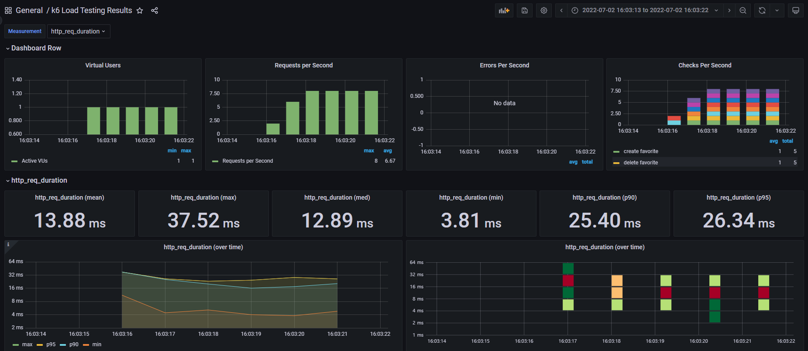
- Load
  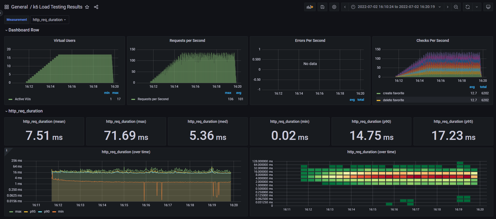
- Stress
  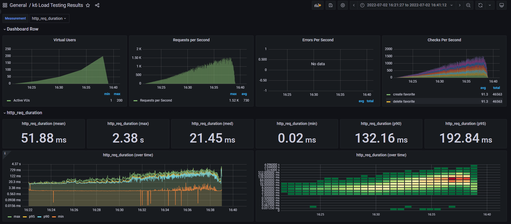

#### 요약
- Smoke(p95) : 33ms -> 26ms (20% 개선)
- Load(p95) : 40 ms -> 17ms (60% 개선)
- Stress(p95) : 376ms -> 192ms (50% 개선)

---

### 3단계 - 쿼리 최적화

1. 인덱스 설정을 추가하지 않고 아래 요구사항에 대해 1s 이하(M1의 경우 2s)로 반환하도록 쿼리를 작성하세요.

- 활동중인(Active) 부서의 현재 부서관리자 중 연봉 상위 5위안에 드는 사람들이 최근에 각 지역별로 언제 퇴실했는지 조회해보세요. (사원번호, 이름, 연봉, 직급명, 지역, 입출입구분, 입출입시간)
#### 답변
- 실행 계획
  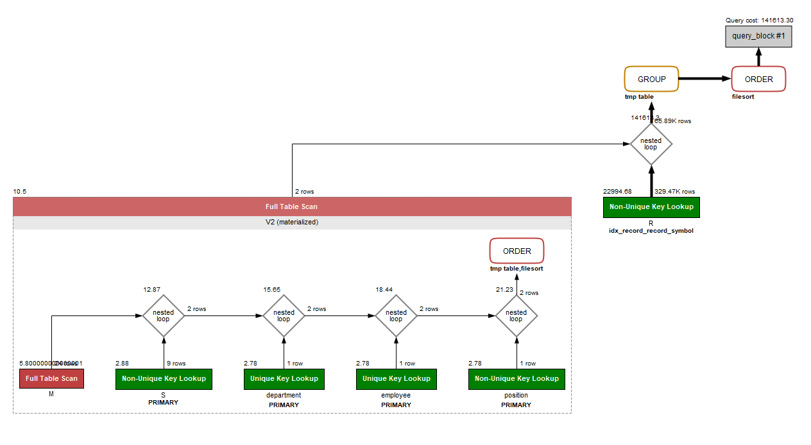
- 쿼리
    ```sql
    SELECT R.employee_id AS '사원번호'
           , V3.last_name AS '이름'
           , V3.annual_income AS '연봉'
           , V3.position_name AS '직급명'
           , MAX(time) AS '입출입시간'
           , region AS '지역'
           , record_symbol AS '입출입구분'
    FROM record R
    JOIN (SELECT id, last_name, annual_income, position_name 
          FROM ( SELECT id, annual_income, last_name, position_name 
                 FROM salary S
                 JOIN  (SELECT employee_id, last_name, position_name FROM manager M 
                          JOIN (SELECT id FROM department WHERE lower(note) = 'active') D 
                            ON M.department_id = D.id AND M.end_date = '9999-01-01'
                          JOIN (SELECT id, last_name FROM employee) E
                            ON M.employee_id = E.id
                          JOIN (SELECT id, position_name FROM position) P
                            ON M.employee_id = P.id AND P.position_name = 'Manager'
                        ) V1
                 ON S.id = V1.employee_id AND S.end_date = '9999-01-01'
                 ORDER BY S.annual_income DESC
                 LIMIT 5 
               ) V2
         ) V3
    ON R.employee_id = V3.id AND R.record_symbol = 'O'
    GROUP BY employee_id, region, record_symbol, V3.last_name, V3.annual_income, V3.position_name 
    ORDER BY V3.annual_income DESC, R.region
    ;
    ```
---

### 4단계 - 인덱스 설계

1. 인덱스 적용해보기 실습을 진행해본 과정을 공유해주세요
#### 실행 결과 
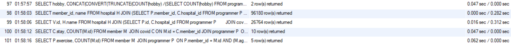

#### 문항 1 : Coding as a Hobby 와 같은 결과를 반환하세요.
```roomsql
-- #1 programmer : INDEX(hobby)
SELECT hobby, CONCAT(CONVERT(TRUNCATE(COUNT(hobby) /(SELECT COUNT(hobby) FROM programmer) * 100, 1), char), '%') AS 'percent'
FROM programmer
GROUP BY hobby
ORDER BY hobby DESC;
```
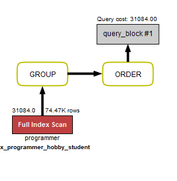

#### 문항 2 :프로그래머별로 해당하는 병원 이름을 반환하세요. (covid.id, hospital.name)
```roomsql
-- #1 programmer : INDEX(hobby)
-- #2 programmer : UNIQ_INDEX(member_id)
-- #2 covid : INDEX(programmer_id, hospital_id)
-- #2 hospital : UNIQ_INDEX(id)
SELECT member_id, name FROM hospital H
JOIN (SELECT P.member_id, C.hospital_id FROM programmer P 
      JOIN covid C 
      ON P.member_id = C.programmer_id
	 ) V
ON H.id = V.hospital_id;
```
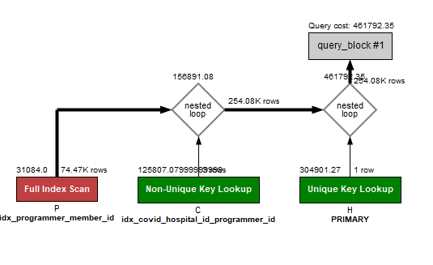


#### 문항 3 : 프로그래밍이 취미인 학생 혹은 주니어(0-2년)들이 다닌 병원 이름을 반환하고 user.id 기준으로 정렬하세요. (covid.id, hospital.name, user.Hobby, user.DevType, user.YearsCoding)
```roomsql
-- #2 programmer : UNIQ_INDEX(member_id)
-- #3 programmer : PRIMARY(id) , INDEX(hobby,student), INDEX(years_coding)
-- #2 covid : INDEX(programmer_id, hospital_id)
-- #2 hospital : UNIQ_INDEX(id)
SELECT V.id, H.name FROM hospital H
JOIN (SELECT P.id, C.hospital_id FROM programmer P 
      JOIN covid C ON P.member_id = C.programmer_id
	  WHERE (hobby = 'Yes' AND student LIKE 'Yes%') OR years_coding LIKE '0-2%'
     ) V
ON H.id = V.hospital_id
ORDER BY V.id;
```
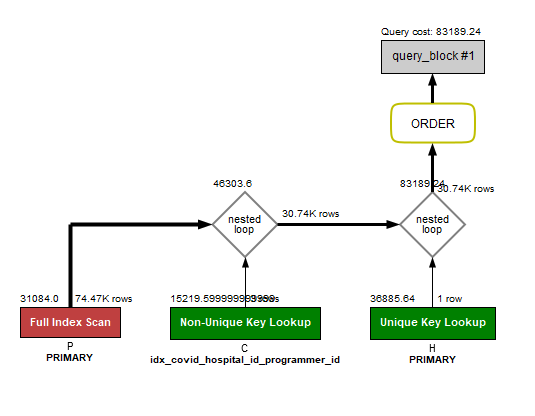

#### 문항 4 : 프로그래밍이 취미인 학생 혹은 주니어(0-2년)들이 다닌 병원 이름을 반환하고 user.id 기준으로 정렬하세요. (covid.id, hospital.name, user.Hobby, user.DevType, user.YearsCoding)
```roomsql
-- #2 programmer : UNIQ_INDEX(member_id)
-- #3 programmer : PRIMARY(id) , INDEX(hobby,student), INDEX(years_coding)
-- #4 programmer : INDEX(country, member_id)
-- #2 covid : INDEX(programmer_id, hospital_id)
-- #4 covid : INDEX(member_id, hospital_id, stay)
-- #2 hospital : UNIQ_INDEX(id)
-- #4 member : PRIMARY(id), INDEX(age)
SELECT C.stay, COUNT(M.id) FROM member M 
JOIN covid C
ON M.id = C.member_id
JOIN programmer P 
ON P.member_id = M.id AND (M.age >= 20 AND M.age < 30 AND P.country = 'India') 
JOIN hospital H
ON H.id = C.hospital_id AND H.name = '서울대병원'
GROUP BY C.stay; 
```
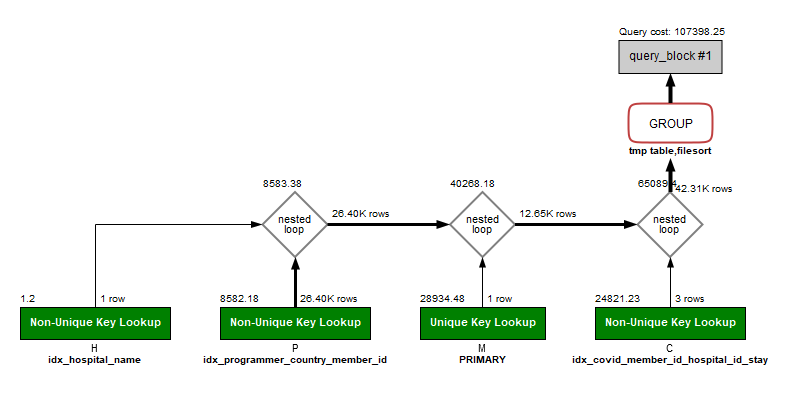

#### 문항 5 : 서울대병원에 다닌 30대 환자들을 운동 횟수별로 집계하세요. (user.Exercise)
```roomsql
-- #2 programmer : UNIQ_INDEX(member_id)
-- #3 programmer : PRIMARY(id) , INDEX(hobby,student), INDEX(years_coding)
-- #4 programmer : INDEX(country, member_id)
-- #2 covid : INDEX(programmer_id, hospital_id)
-- #4 covid : INDEX(member_id, hospital_id, stay)
-- #2 hospital : UNIQ_INDEX(id)
-- #2 hospital : INDEX(name)
-- #4 member : PRIMARY(id), INDEX(age)
SELECT P.exercise, COUNT(M.id) FROM member M 
JOIN programmer P 
ON P.member_id = M.id AND (M.age >= 30 AND M.age < 40) 
JOIN (SELECT member_id, hospital_id, H.id FROM covid C 
	  JOIN hospital H 
      ON H.id = C.hospital_id AND H.name = '서울대병원'
     ) V
ON M.id = V.member_id
GROUP BY P.exercise;
```
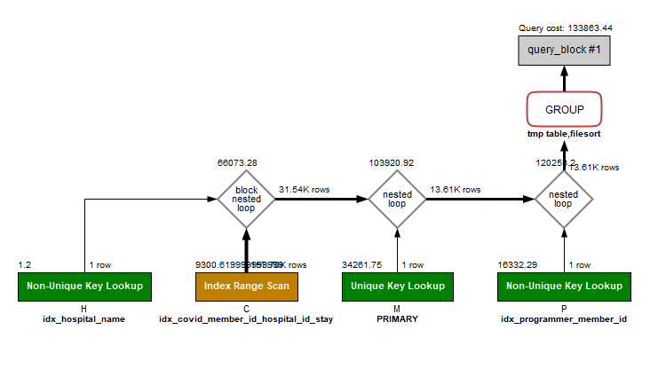

---

### 추가 미션

1. 페이징 쿼리를 적용한 API endpoint를 알려주세요
