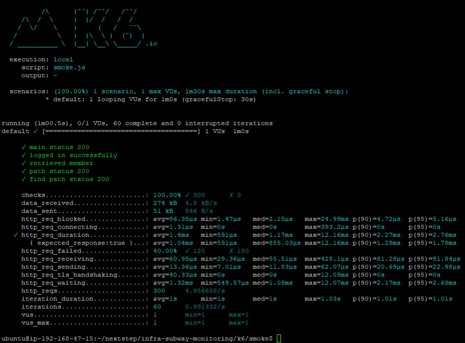
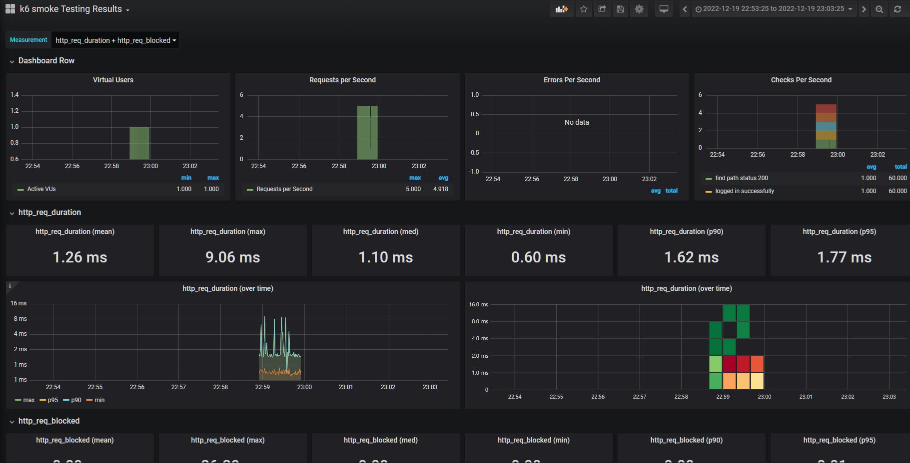
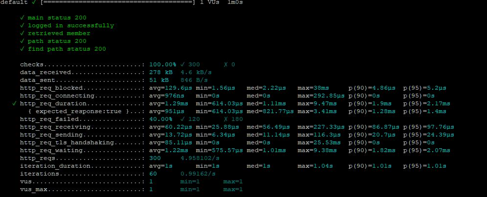
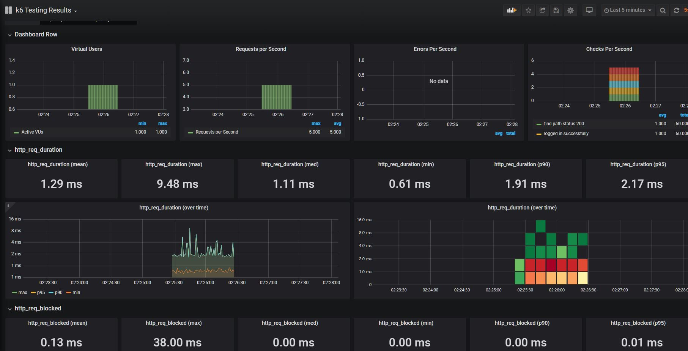
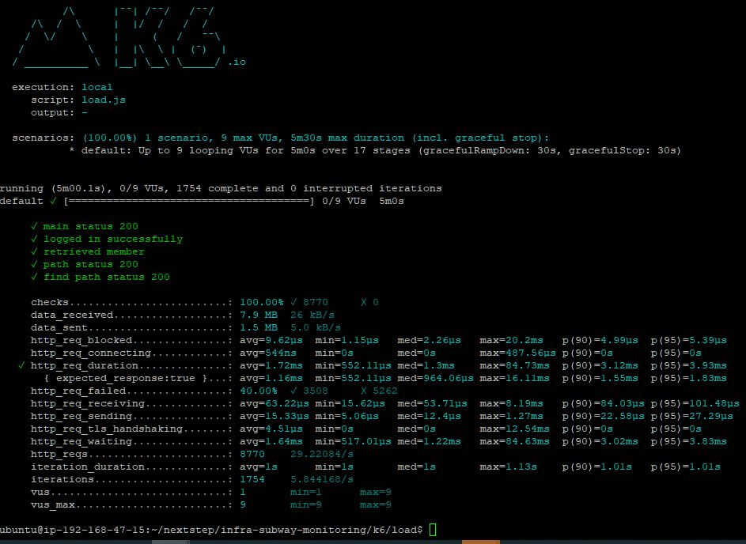
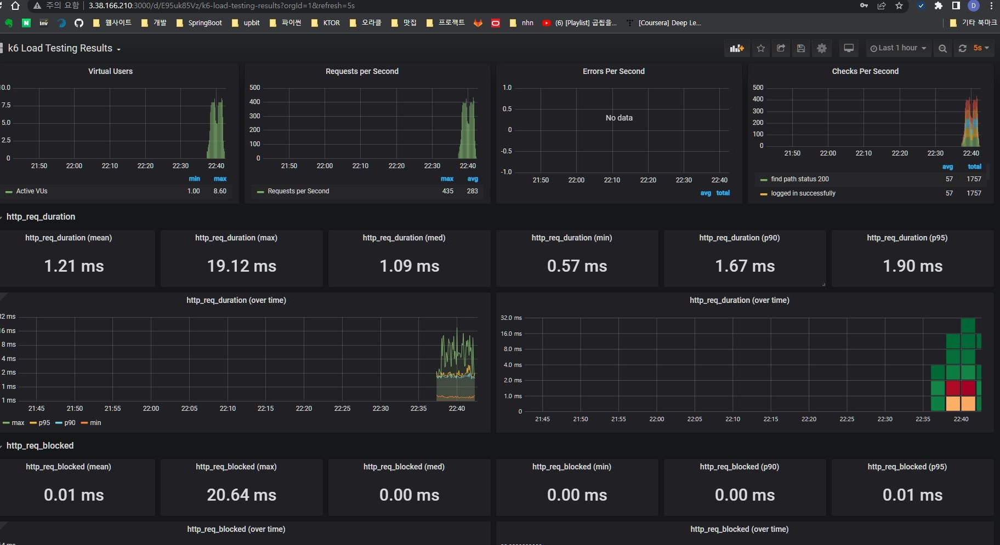
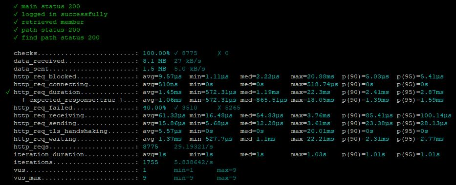
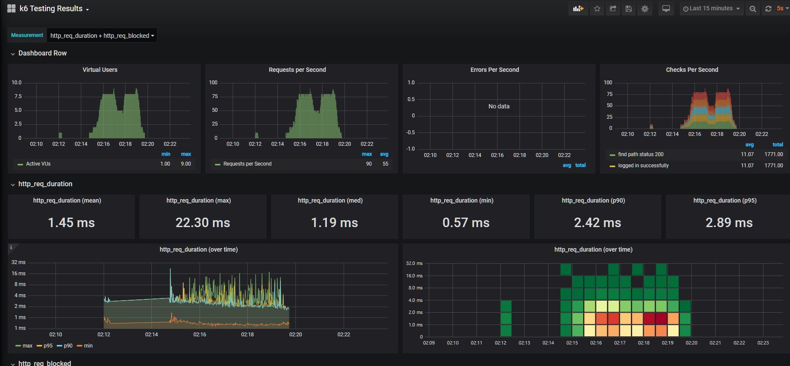
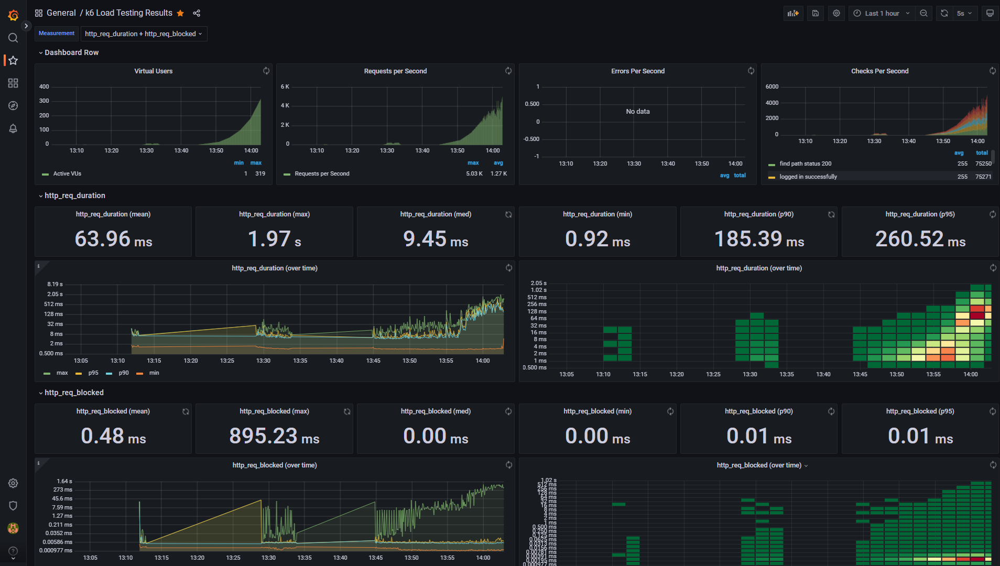
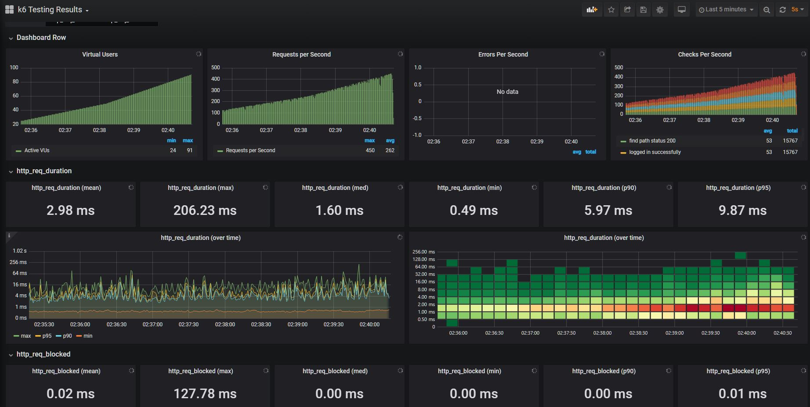

<p align="center">
    
</p>
<p align="center">
  
  
  <a href="https://edu.nextstep.camp/c/R89PYi5H" alt="nextstep atdd">
    
  </a>
  
</p>

<br>

# 인프라공방 샘플 서비스 - 지하철 노선도

<br>

## 🚀 Getting Started

### Install
#### npm 설치
```
cd frontend
npm install
```
> `frontend` 디렉토리에서 수행해야 합니다.

### Usage
#### webpack server 구동
```
npm run dev
```
#### application 구동
```
./gradlew clean build
```
<br>

## 미션

* 미션 진행 후에 아래 질문의 답을 작성하여 PR을 보내주세요.
    - 미션 수행 url: https://www.aws-nextstep-deokmoo.kro.kr/
    
### 1단계 - 화면 응답 개선하기
1. 성능 개선 결과를 공유해주세요 (Smoke, Load, Stress 테스트 결과)
#### 개선전후 측정

---
- Smoke : `k6/smoke/*`
    - 개선 전
      
      
    - 개선 후
            
      
---
- Load : `k6/load/*`
    - 개선 전
      
      
    - 개선 후
            
      
---
- Stress : `k6/stress/*`
    - 개선 전
      
      
    - 개선 후
            
      

---    
2. 어떤 부분을 개선해보셨나요? 과정을 설명해주세요 
    - 개선 전 먼저 측정한다. 
    - 아래 nginx 설정을 통해 Revers Proxy 개선한다.
        - gzip 압축
        - cache 설정
        - TLS, HTTP/2 설정
    - WAS 성능은 `Spring Data Cache`를 이용하여 개선
---

### 2단계 - 스케일 아웃
#### 요구사항

- springboot에 HTTP Cache, gzip 설정하기
    - 모든 정적 자원에 대해 no-cache, private 설정을 하고 테스트 코드를 통해 검증
    - 확장자는 css인 경우는 max-age를 1년, js인 경우는 no-cache, private 설정
    - 모든 정적 자원에 대해 no-cache, no-store 설정이 가능한가?

  ```text
  가능한 것으로 확인 됩니다.
  HTTP의 스펙이 모든 상황을 완벽하게 대응하고 있지 못하기 때문에 
  no-cache 또는 no-store만으로는 캐시 무효화를 만족하지 못하는 상황이 있을 수 있습니다.
  그래서 이러한 옵션들을 같이 설정할 수 있는 것으로 알고 있습니다.
  실제 트래픽이 많이 발생하는 서비스에서 정적 리소스 호출에 대한 response header를 보면,
  no-cache와 no-store 를 같이 사용하는 것을 확인할 수 있습니다.
  ```
- Launch Template 작성하기
- Auto Scaling Group 생성하기
- Smoke, Load, Stress 테스트 후 결과를 기록

1. Launch Template 링크를 공유해주세요.
- [바로가기](https://ap-northeast-2.console.aws.amazon.com/ec2/home?region=ap-northeast-2#LaunchTemplateDetails:launchTemplateId=lt-0a5259d3742fa9297)
2. cpu 부하 실행 후 EC2 추가생성 결과를 공유해주세요. (Cloudwatch 캡쳐)

```sh
$ stress -c 2
```

3. 성능 개선 결과를 공유해주세요 (Smoke, Load, Stress 테스트 결과)

---

### 3단계 - 쿼리 최적화

1. 인덱스 설정을 추가하지 않고 아래 요구사항에 대해 1s 이하(M1의 경우 2s)로 반환하도록 쿼리를 작성하세요.

- 활동중인(Active) 부서의 현재 부서관리자 중 연봉 상위 5위안에 드는 사람들이 최근에 각 지역별로 언제 퇴실했는지 조회해보세요. (사원번호, 이름, 연봉, 직급명, 지역, 입출입구분, 입출입시간)

---

### 4단계 - 인덱스 설계

1. 인덱스 적용해보기 실습을 진행해본 과정을 공유해주세요

---

### 추가 미션

1. 페이징 쿼리를 적용한 API endpoint를 알려주세요
