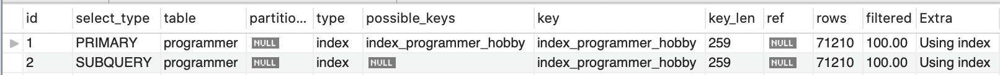
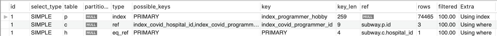

<p align="center">
    
</p>
<p align="center">
  
  
  <a href="https://edu.nextstep.camp/c/R89PYi5H" alt="nextstep atdd">
    
  </a>
  
</p>

<br>

# 인프라공방 샘플 서비스 - 지하철 노선도

<br>

## 🚀 Getting Started

### Install
#### npm 설치
```
cd frontend
npm install
```
> `frontend` 디렉토리에서 수행해야 합니다.

### Usage
#### webpack server 구동
```
npm run dev
```
#### application 구동
```
./gradlew clean build
```
<br>

## 미션

* 미션 진행 후에 아래 질문의 답을 작성하여 PR을 보내주세요.


### 1단계 - 화면 응답 개선하기

#### 요구사항
- 부하테스트 각 시나리오의 요청시간을 목푯값 이하로 개선
  - 개선 전/후를 직접 계측하여 확인
- [X] Reverse Proxy 개선하기
- [X] WAS 성능 개선하기

1. 성능 개선 결과를 공유해주세요 (Smoke, Load, Stress 테스트 결과)
프로젝트 monitoring 폴더에 올려놓았습니다. 
2. 어떤 부분을 개선해보셨나요? 과정을 설명해주세요
- nginx gzip 압축, cache, HTTP/2 설정을 통해 Reverse Proxy를 개선했습니다.
- redis를 이용하여 캐싱을 적용해 WAS 성능을 개선했습니다.
---

### 2단계 - 스케일 아웃

#### 요구사항
- [X] springboot에 HTTP Cache, gzip 설정하기
- [X] Launch Template 작성하기
- [X] Auto Scaling Group 생성하기
- [X] Smoke, Load, Stress 테스트 후 결과를 기록

1. Launch Template 링크를 공유해주세요.
- https://ap-northeast-2.console.aws.amazon.com/ec2/v2/home?region=ap-northeast-2#LaunchTemplateDetails:launchTemplateId=lt-0c73c379d348a403a

2. cpu 부하 실행 후 EC2 추가생성 결과를 공유해주세요. (Cloudwatch 캡쳐)
- /monitoring/asg/cloudwatch/cloudwatch_asg.png

3. 성능 개선 결과를 공유해주세요 (Smoke, Load, Stress 테스트 결과)
- /monitoring/asg/smoke
- /monitoring/asg/load
- /monitoring/asg/stress

4. 모든 정적 자원에 대해 no-cache, no-store 설정 가능한가요?
   - 가능합니다. Controller에서 HttpServletResponse 를 받은 후 직접 `Cache-Controle`을 할당하여 설정할 수도 있고, WebContentInterceptor를 활용할 수 도 있습니다.
   - 로그인용 사용자 이름, 비밀번호 및 기타 민감한 정보들을 보호하기 위해 SSL 을 로그인 페이지나 회원 정보 페이지등은 SSL로 암호화하는 경우가 많습니다.
   SSL 을 사용해서 민감한 정보들을 보호한다고 해도 브라우저에 이 정보가 캐싱되면 문제가 발생할 수 있기 때문에 `Cache-Control: no-cache, no-store, must-revalidate`
    와 같이 사용하면 브라우저 캐싱을 방지할 수 있습니다. 단 캐싱을 하지 않으면 성능 저하가 발생할 수 있으므로 로그인 페이지등에 제한적으로 사용해야 합니다.
   - [참고] https://developer.mozilla.org/en-US/docs/Web/HTTP/Headers/Cache-Control 
   - [참고] https://stackoverflow.com/questions/49547/how-do-we-control-web-page-caching-across-all-browsers
   - [참고] https://www.lesstif.com/software-architect/http-https-browser-caching-http-header-20775788.html

### 3단계 - 쿼리 최적화

1. 인덱스 설정을 추가하지 않고 아래 요구사항에 대해 1s 이하(M1의 경우 2s)로 반환하도록 쿼리를 작성하세요.

- 활동중인(Active) 부서의 현재 부서관리자 중 연봉 상위 5위안에 드는 사람들이 최근에 각 지역별로 언제 퇴실했는지 조회해보세요. (사원번호, 이름, 연봉, 직급명, 지역, 입출입구분, 입출입시간)

```sql
select ranker.employee_id as '사원번호', ranker.last_name as '이름', ranker.annual_income as '연봉', ranker.annual_income as '직급명', r.time as '입출입시간', r.region as '지역', r.record_symbol as '입출입구분'
from (
	select m.employee_id, dep.id, s.annual_income, e.last_name
	from (select d.id from department d where d.note = 'Active') dep
			inner join manager m on m.department_id = dep.id
			inner join salary s on s.id = m.employee_id
			inner join position p on p.position_name = 'Manager' and p.id = m.employee_id
			inner join employee e on e.id = m.employee_id
            where (m.start_date <= now() and m.end_date > now()) and (s.start_date <= now() and s.end_date > now()) and (p.start_date <= now() and p.end_date > now())
			order by s.annual_income desc
	limit 5
) ranker
inner join record r on r.record_symbol = 'O' and r.employee_id = ranker.employee_id 
```
---

### 4단계 - 인덱스 설계

#### 요구사항

1. 인덱스 적용해보기 실습을 진행해본 과정을 공유해주세요


- [X] Coding as a Hobby 와 같은 결과를 반환하세요.
```sql
    create index index_programmer_hobby
    on programmer (hobby);

    select hobby, round(count(*) / (select count(*) from programmer) * 100, 1) as rate
    from programmer
    group by hobby
```


- [X] 프로그래머별로 해당하는 병원 이름을 반환하세요. (covid.id, hospital.name)
```sql
    alter table hospital
    add constraint pk_hospital
    primary key (id);
    
    alter table covid
    add constraint pk_covid
    primary key (id);
    
    alter table programmer
    add constraint pk_programmer
    primary key (id);

    create index index_covid_hospital_id
    on covid (hospital_id);
    
    create index index_covid_programmer_id
    on covid (programmer_id);
    
    select c.id, h.name
    from hospital h
    inner join covid c on c.hospital_id = h.id
    inner join programmer p on p.id = c.programmer_id
```


- [ ] 프로그래밍이 취미인 학생 혹은  주니어(0-2년)들이 다닌 병원 이름을 반환하고 user.id 기준으로 정렬하세요. (covid.id, hospital.name, user.Hobby, user.DevType, user.YearsCoding)
- [ ] 서울대병원에 다닌 20대 India 환자들을 병원에 머문 기간별로 집계하세요. (covid.Stay)
- [ ] 서울대병원에 다닌 30대 환자들을 운동 횟수별로 집계하세요. (user.Exercise)
---

### 추가 미션

1. 페이징 쿼리를 적용한 API endpoint를 알려주세요
