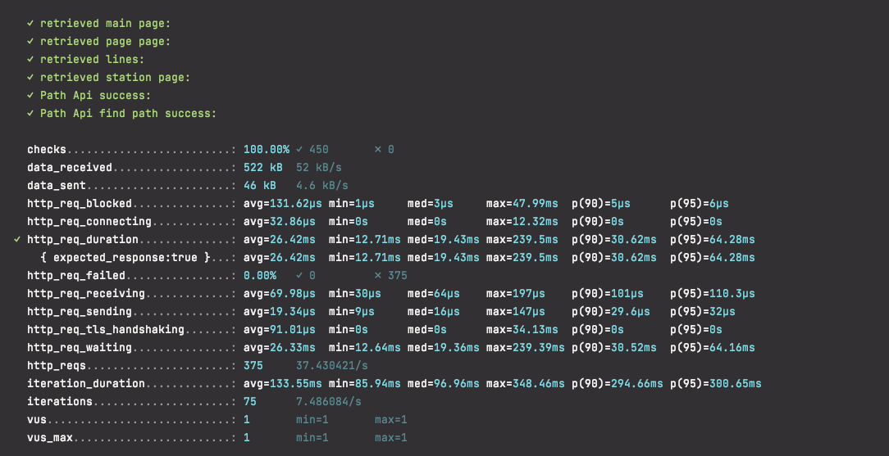
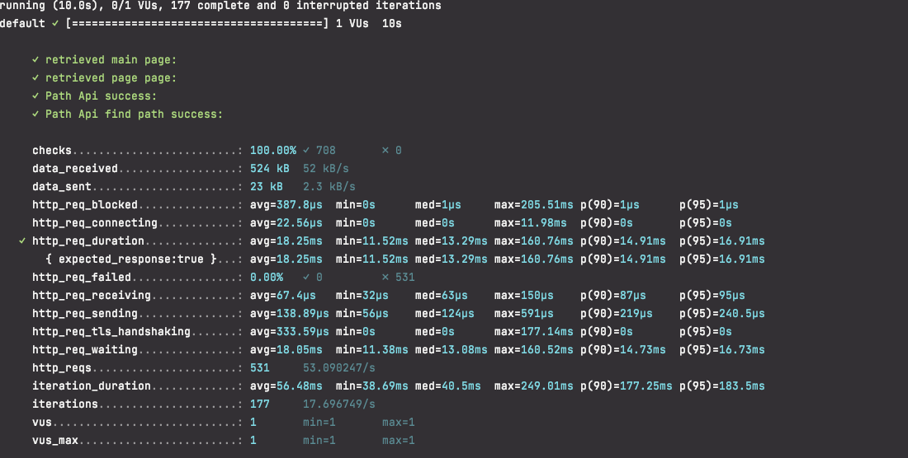
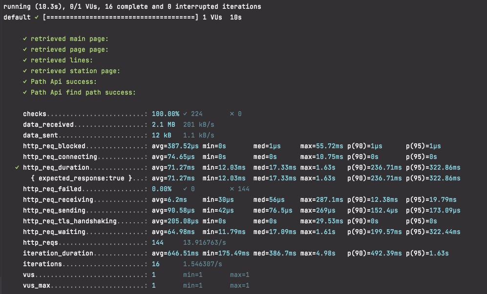
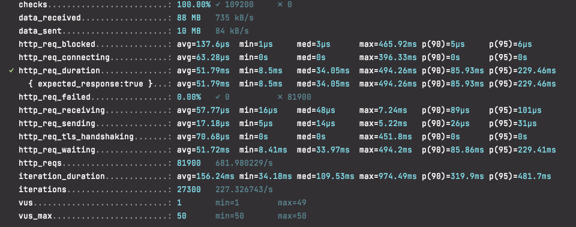
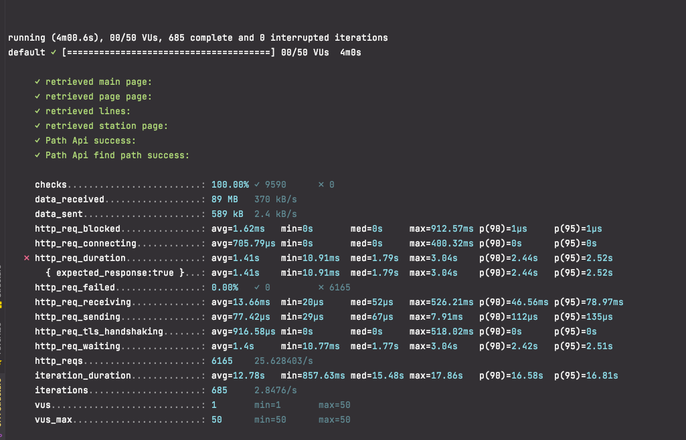
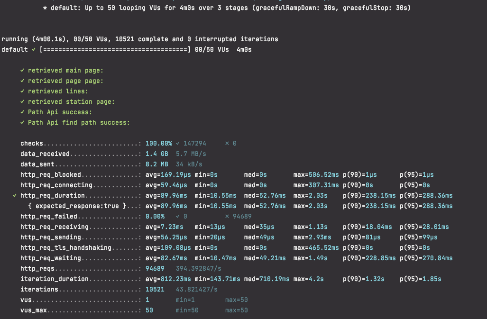
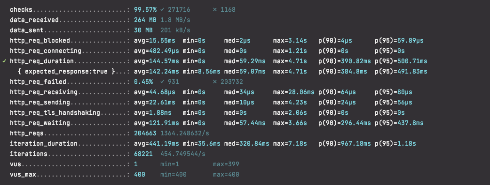
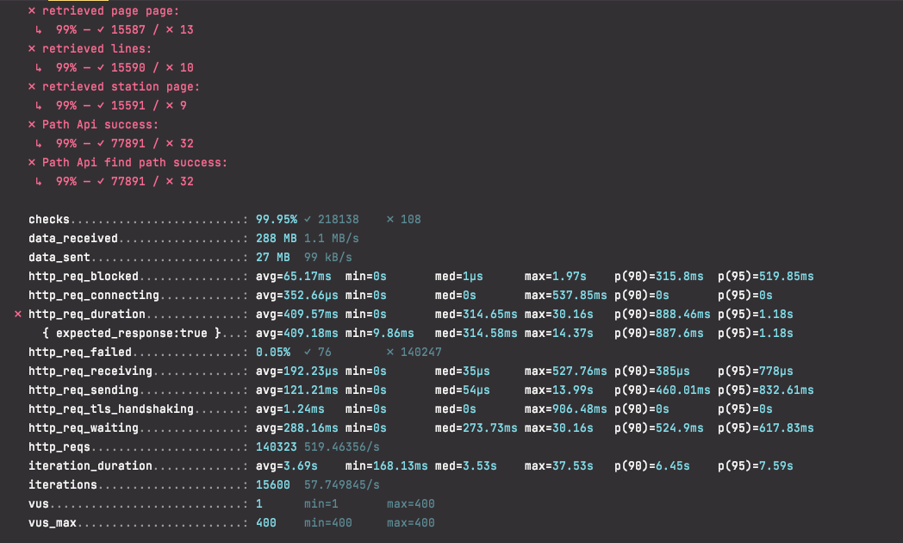
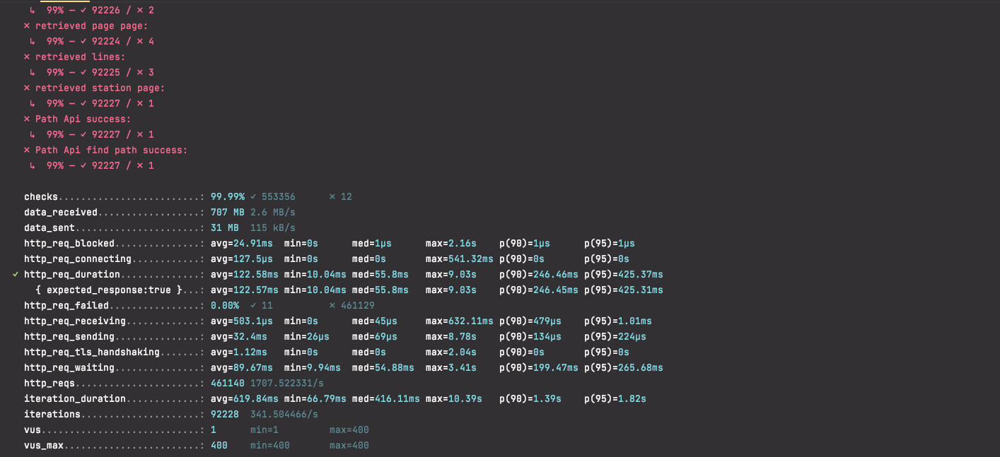

<p align="center">
    
</p>
<p align="center">
  
  
  <a href="https://edu.nextstep.camp/c/R89PYi5H" alt="nextstep atdd">
    
  </a>
  
</p>

<br>

# 인프라공방 샘플 서비스 - 지하철 노선도

<br>

## 🚀 Getting Started

### Install
#### npm 설치
```
cd frontend
npm install
```
> `frontend` 디렉토리에서 수행해야 합니다.

### Usage
#### webpack server 구동
```
npm run dev
```
#### application 구동
```
./gradlew clean build
```
<br>

## 미션

* 미션 진행 후에 아래 질문의 답을 작성하여 PR을 보내주세요.


### 1단계 - 화면 응답 개선하기
  * 1단계 요구사항
    부하테스트 각 시나리오의 요청시간을 목푯값 이하로 개선
    - [X] 개선 전 / 후를 직접 계측하여 확인
    

1. 성능 개선 결과를 공유해주세요 (Smoke, Load, Stress 테스트 결과)
   * ###FCP 
      - 개선전 : 2.6초
      - web 서버 성능 개선 : 1.2초
      - was 개선 : 1.2초
     
   * ###Smoke
     * 개선전 
     
     * web 서버 성능 개선 
     
     * was 서버 성능 개선
     
   * ###Load
     * 개선전
     
     * web 서버 성능 개선
     
     * was 서버 성능 개선
     
   * ###Stress  
     * 개선전 - vus(256)
     
     * web 서버 성능 개선 - vus(270) 
     
     * was 서버 성능 개선 - vus(300)
     
   

3. 어떤 부분을 개선해보셨나요? 과정을 설명해주세요
   1. web 서버 성능 개선 
      - gzip 압축 활성화
      - 웹 cache 설정  
      - http2 설정
   2. was 서버 개선
      - 경로조회 API 부분 Redis Cache 적용
      - spring boot gzip 적용 

   > ~~전반적으로 성능개선을 진행하면서 WEB 서버를 개선했을때 속도 측면에서는 제일 많이
   > 개선 되었습니다.  
   > WAS 레디스와 gizp 설정으로 속도적인 측면에서는 오히려 늘어난감이 있었는데 Stress 테스트시  
   > 더 많은 성공율을 보여주네요~~ 
   > 환경설정을 잘못해서 실제 프로덕션에서는 잘 못 동작 했었네요 
   > 개선하면 개선할수록 더 많은 부하를 버팀을 확인하였습니다.

    

---

### 2단계 - 스케일 아웃

1. Launch Template 링크를 공유해주세요.

2. cpu 부하 실행 후 EC2 추가생성 결과를 공유해주세요. (Cloudwatch 캡쳐)

```sh
$ stress -c 2
```

3. 성능 개선 결과를 공유해주세요 (Smoke, Load, Stress 테스트 결과)

---

### 3단계 - 쿼리 최적화

1. 인덱스 설정을 추가하지 않고 아래 요구사항에 대해 1s 이하(M1의 경우 2s)로 반환하도록 쿼리를 작성하세요.

- 활동중인(Active) 부서의 현재 부서관리자 중 연봉 상위 5위안에 드는 사람들이 최근에 각 지역별로 언제 퇴실했는지 조회해보세요. (사원번호, 이름, 연봉, 직급명, 지역, 입출입구분, 입출입시간)

---

### 4단계 - 인덱스 설계

1. 인덱스 적용해보기 실습을 진행해본 과정을 공유해주세요

---

### 추가 미션

1. 페이징 쿼리를 적용한 API endpoint를 알려주세요
