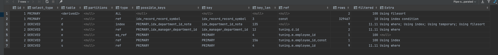
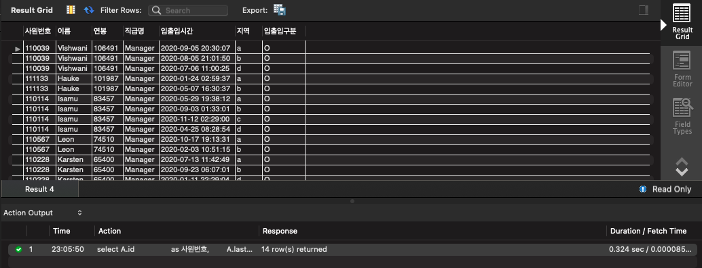

<p align="center">
    
</p>
<p align="center">
  
  
  <a href="https://edu.nextstep.camp/c/R89PYi5H" alt="nextstep atdd">
    
  </a>
  
</p>

<br>

# 인프라공방 샘플 서비스 - 지하철 노선도

<br>

## 🚀 Getting Started

### Install

#### npm 설치

```
cd frontend
npm install
```

> `frontend` 디렉토리에서 수행해야 합니다.

### Usage

#### webpack server 구동

```
npm run dev
```

#### application 구동

```
./gradlew clean build
```

<br>

## 미션

* 미션 진행 후에 아래 질문의 답을 작성하여 PR을 보내주세요.

### 1단계 - 화면 응답 개선하기

1. 성능 개선 결과를 공유해주세요 (Smoke, Load, Stress 테스트 결과)

+ k6 파일 폴더에 넣어뒀습니다 !

#### 성능 개선 전 (http_req_duration 기준 표 작성)

|        | http_req_duration(mean) | http_req_duration(max) | http_req_duration(med) |
|--------|-------------------------|------------------------|------------------------|
| LOAD   | 24.46ms                 | 724.37ms               | 13.52ms                | 
| SMOKE  | 69.74ms                 | 439.84ms               | 50.24ms                | 
| STRESS | 41.42ms                 | 664.61ms               | 19.03ms                | 

#### 성능 개선 후 (http_req_duration 기준 표 작성)

|        | http_req_duration(mean) | http_req_duration(max) | http_req_duration(med) |
|--------|-------------------------|------------------------|------------------------|
| LOAD   | 8.10ms                  | 46.91ms                | 7.78ms                 | 
| SMOKE  | 25.99ms                 | 223.40ms               | 16.69ms                | 
| STRESS | 13.89ms                 | 218.22ms               | 9.70ms                 | 

### API 성능 개선 !


`경로 조회 API` 가 속도 측정에서 가장 느린걸 볼 수 있음 (평균 360ms)

캐싱을 통한 성능 개선 이후


개선이후 평균 160ms의 속도인것을 볼 수 있다.

결과 : 360ms -> 160ms

2. 어떤 부분을 개선해보셨나요? 과정을 설명해주세요

+ web
    + gzip 압축
    + http2
    + cache 설정
+ was
    + redis cache 를 이용한 성능 개선

---

### 2단계 - 스케일 아웃

1. Launch Template 링크를 공유해주세요.

+ https://ap-northeast-2.console.aws.amazon.com/ec2/v2/home?region=ap-northeast-2#LaunchTemplateDetails:launchTemplateId=lt-0e3462b3fe3b4dc51

2. cpu 부하 실행 후 EC2 추가생성 결과를 공유해주세요. (Cloudwatch 캡쳐)

+ step2 폴더에 첨부하였습니다~!

3. 모든 정적 자원에 대해 no-cache, no-store 설정을 한다. 가능한가요?
   가능합니다! HTTP스펙 자체가 모든 상황을 완벽하게 제어하는것은 불가능하기 때문에 가능은 하긴합니다.

추가로 오래된 IE version ,Http1.0 등 캐시 구현하는 방법이 전부 다르기때문에 이를 대처하기 위해 사용 될 수 있습니다.

> https://stackoverflow.com/questions/49547/how-do-we-control-web-page-caching-across-all-browsers

```sh
$ stress -c 2
```

3. 성능 개선 결과를 공유해주세요 (Smoke, Load, Stress 테스트 결과)

---

### 3단계 - 쿼리 최적화

1. 인덱스 설정을 추가하지 않고 아래 요구사항에 대해 1s 이하(M1의 경우 2s)로 반환하도록 쿼리를 작성하세요.

- 활동중인(Active) 부서의 현재 부서관리자 중 연봉 상위 5위안에 드는 사람들이 최근에 각 지역별로 언제 퇴실했는지 조회해보세요. (사원번호, 이름, 연봉, 직급명, 지역, 입출입구분, 입출입시간)

```sql
SELECT TOP_FIVE.사원번호,
       TOP_FIVE.이름,
       TOP_FIVE.연봉,
       TOP_FIVE.직급명,
       r.time          AS 입출입시간,
       r.region        AS 지역,
       r.record_symbol AS 입출입구분
FROM (SELECT m.employee_id   AS 사원번호,
             e.last_name     AS 이름,
             s.annual_income AS 연봉,
             p.position_name AS 직급명
      FROM manager AS m
               INNER JOIN department AS d ON d.id = m.department_id
               INNER JOIN position AS p ON p.id = m.employee_id
               INNER JOIN employee AS e ON e.id = m.employee_id
               INNER JOIN salary AS s ON s.id = e.id
      WHERE d.note = 'active'
        AND p.position_name = 'Manager'
        AND (m.start_date <= now() and m.end_date > now())
        and (s.start_date <= now() and s.end_date > now())
      ORDER BY s.annual_income DESC LIMIT 5) AS TOP_FIVE
         JOIN record AS r ON r.employee_id = TOP_FIVE.사원번호
WHERE r.record_symbol = 'O'
ORDER BY TOP_FIVE.연봉 DESC;
```


+ 

+ 

---

### 4단계 - 인덱스 설계

1. 인덱스 적용해보기 실습을 진행해본 과정을 공유해주세요

---

### 추가 미션

1. 페이징 쿼리를 적용한 API endpoint를 알려주세요
