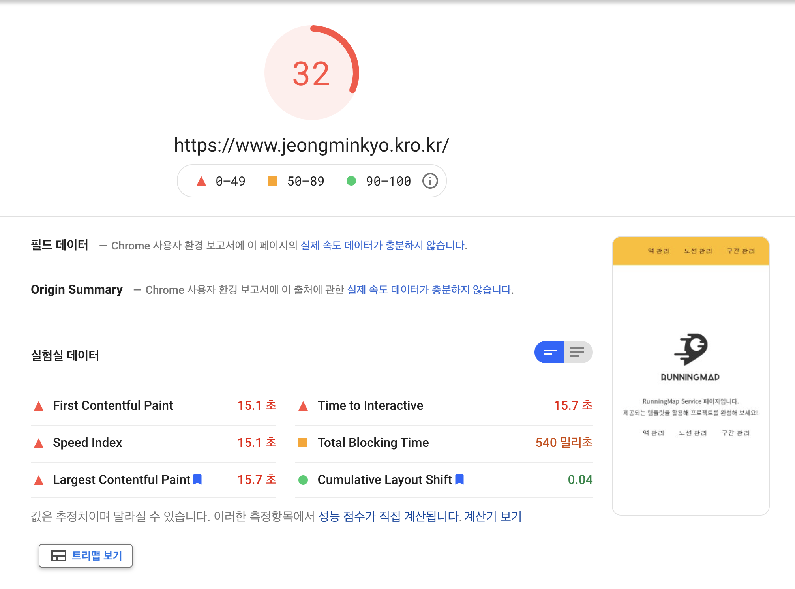
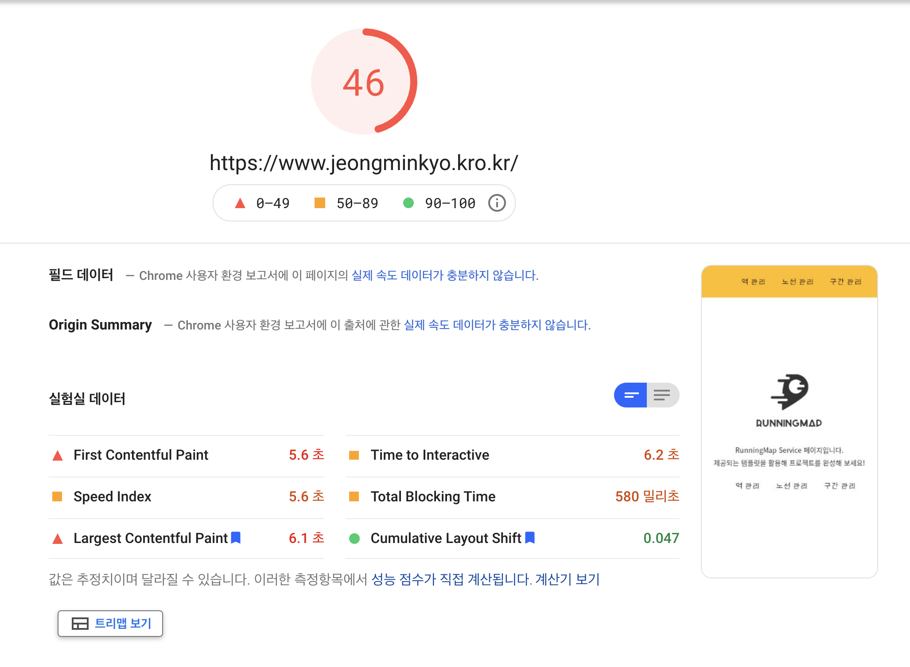

<p align="center">
    
</p>
<p align="center">
  
  
  <a href="https://edu.nextstep.camp/c/R89PYi5H" alt="nextstep atdd">
    
  </a>
  
</p>

<br>

# 인프라공방 샘플 서비스 - 지하철 노선도

<br>

## 🚀 Getting Started

### Install
#### npm 설치
```
cd frontend
npm install
```
> `frontend` 디렉토리에서 수행해야 합니다.

### Usage
#### webpack server 구동
```
npm run dev
```
#### application 구동
```
./gradlew clean build
```
<br>

## 미션

* 미션 진행 후에 아래 질문의 답을 작성하여 PR을 보내주세요.

### 1단계 - 화면 응답 개선하기
1. 성능 개선 결과를 공유해주세요 (Smoke, Load, Stress 테스트 결과)
- nginx 최적화
- 개선전 PageSpeed 결과
  
- 개선후 PageSpeed 결과
  

- Smoke, Load, Stress 테스트 결과 요청시간 50ms 이하로 개선

- 개선전 Smoke 테스트 결과 [바로가기](./k6/result/before_smoke.md)
- 개선전 Load 테스트 결과 [바로가기](./k6/result/before_load.md)
- 개선전 Stress 테스트 결과 [바로가기](./k6/result/before_stress.md)

---

- 개선후 Smoke 테스트 결과 [바로가기](../k6/after/smoke_test_result.md)
- 개선후 Load 테스트 결과 [바로가기](../k6/after/load_test_result.md)
- 개선후 Stress 테스트 결과 [바로가기](../k6/after/stress_test_result.md)


2. 어떤 부분을 개선해보셨나요? 과정을 설명해주세요

1. 웹서버 개선하기
    - nginx 최적화
        - CPU Core에 맞는 적절한 Worker 프로세스를 할당
        - Proxy 캐시
        - 워커 커넥션 10240 설정
        - gzip 압축 설정
        - http2 적용
    - 개선 후 크롬 개발자 도구 같은 환경에서 6.67초로 대략 3배 감소
    2. WAS 개선하기
        - redis 추가
        - 경로 조회 cache 적용
        - ttl 1일 설정
---

### 2단계 - 조회 성능 개선하기
1. 인덱스 적용해보기 실습을 진행해본 과정을 공유해주세요

- Coding as a Hobby 와 같은 결과를 반환하세요.
    ```sql
    CREATE INDEX `idx_programmer_hobby`  ON `subway`.`programmer` (hobby);


    explain
    select hobby, count(hobby)
    from programmer
    group by hobby;
    ```

  | id | select\_type | table | partitions | type | possible\_keys | key | key\_len | ref | rows | filtered | Extra |
  | :--- | :--- | :--- | :--- | :--- | :--- | :--- | :--- | :--- | :--- | :--- | :--- |
  | 1 | SIMPLE | programmer | NULL | index | idx\_programmer\_hobby | idx\_programmer\_hobby | 259 | NULL | 71210 | 100 | Using index |

    **result**
    328ms -> 66ms

- 프로그래머별로 해당하는 병원 이름을 반환하세요. (covid.id, hospital.name)

    ```sql
    CREATE INDEX `idx_covid_hospital`  ON `subway`.`covid` (hospital_id);
    
    EXPLAIN
    SELECT programmer_id, H.name
    FROM covid AS C
    JOIN hospital AS H
    ON C.hospital_id = H.id;

    ```
  
    before

  | id | select\_type | table | partitions | type | possible\_keys | key | key\_len | ref | rows | filtered | Extra |
  | :--- | :--- | :--- | :--- | :--- | :--- | :--- | :--- | :--- | :--- | :--- | :--- |
  | 1 | SIMPLE | H | NULL | ALL | NULL | NULL | NULL | NULL | 32 | 100 | NULL |
  | 1 | SIMPLE | C | NULL | ALL | NULL | NULL | NULL | NULL | 315397 | 10 | Using where; Using join buffer \(Block Nested Loop\) |
  
    after

    | id | select\_type | table | partitions | type | possible\_keys | key | key\_len | ref | rows | filtered | Extra |
    | :--- | :--- | :--- | :--- | :--- | :--- | :--- | :--- | :--- | :--- | :--- | :--- |
    | 1 | SIMPLE | H | NULL | ALL | NULL | NULL | NULL | NULL | 32 | 100 | Using where |
    | 1 | SIMPLE | C | NULL | ref | idx\_covid\_hospital | idx\_covid\_hospital | 9 | subway.H.id | 10174 | 100 | Using index condition |

    result
  
    101ms -> 85ms   
    

- 프로그래밍이 취미인 학생 혹은 주니어(0-2년)들이 다닌 병원 이름을 반환하고 user.id 기준으로 정렬하세요. (covid.id, hospital.name, user.Hobby, user.DevType, user.YearsCoding)

    ```sql
    
    EXPLAIN
    SELECT programmer_id, C.name
    FROM (
    SELECT id
    FROM programmer
    WHERE hobby = "Yes" and (student like "Yes%" Or years_coding = "0-2 years")
    ) AS P
    JOIN (
    SELECT c.programmer_id, h.name
    FROM covid as c
    JOIN hospital as h
    ON c.hospital_id = h.id
    ) AS C
    ON C.programmer_id = P.id;
    ```
  
    before

  | id | select\_type | table | partitions | type | possible\_keys | key | key\_len | ref | rows | filtered | Extra |
  | :--- | :--- | :--- | :--- | :--- | :--- | :--- | :--- | :--- | :--- | :--- | :--- |
  | 1 | SIMPLE | h | NULL | ALL | NULL | NULL | NULL | NULL | 32 | 100 | NULL |
  | 1 | SIMPLE | programmer | NULL | ALL | NULL | NULL | NULL | NULL | 71210 | 2 | Using where; Using join buffer \(Block Nested Loop\) |
  | 1 | SIMPLE | c | NULL | ALL | NULL | NULL | NULL | NULL | 315397 | 1 | Using where; Using join buffer \(Block Nested Loop\) |

    after

  | id | select\_type | table | partitions | type | possible\_keys | key | key\_len | ref | rows | filtered | Extra |
  | :--- | :--- | :--- | :--- | :--- | :--- | :--- | :--- | :--- | :--- | :--- | :--- |
  | 1 | SIMPLE | programmer | NULL | ref | idx\_programmer\_hobby,idx\_programmer\_id | idx\_programmer\_hobby | 259 | const | 35605 | 20 | Using where |
  | 1 | SIMPLE | c | NULL | ref | idx\_covid\_hospital,idx\_covid\_programmer | idx\_covid\_programmer | 9 | subway.programmer.id | 3 | 100 | Using where |
  | 1 | SIMPLE | h | NULL | ref | idx\_hospital\_id | idx\_hospital\_id | 5 | subway.c.hospital\_id | 1 | 100 | Using index condition |

    result
    30s timeout -> 96ms

- 서울대병원에 다닌 20대 India 환자들을 병원에 머문 기간별로 집계하세요. (covid.Stay)

    ```sql
    CREATE INDEX idx_programmer_id ON programmer (id);
    CREATE INDEX `idx_programmer_country`  ON `programmer` (country);
    CREATE INDEX `idx_programmer_member_id`  ON `programmer` (member_id);
    CREATE INDEX `idx_member_age`  ON `subway`.`member` (age);
    CREATE INDEX `idx_hospital_name` ON `hospital` (name);
    CREATE INDEX idx_hospital_id ON hospital (id);
    alter table hospital modify `name`  varchar(255);
    CREATE INDEX `idx_covid_stay`  ON `subway`.`covid` (stay);
    CREATE INDEX `idx_covid_member_id`  ON `subway`.`covid` (member_id);
    CREATE INDEX `idx_covid_hospital`  ON `subway`.`covid` (hospital_id);
  
  EXPLAIN
    SELECT C.stay, count(C.member_id)
    FROM (
        SELECT P.member_id
        FROM (
            SELECT id
            FROM programmer
            where country = "India"
        ) AS P
        JOIN (  
            SELECT id,member_id
            FROM member
            where age between 20 and 29
        ) AS M
        ON P.member_id = M.id
    ) AS P
    JOIN (
        SELECT C.member_id, C.stay
        FROM covid AS C
        JOIN (
            SELECT id
            FROM hospital
            WHERE name = "서울대병원"
        ) AS H
        ON H.id = C.hospital_id
    ) AS C
    ON C.member_id = P.member_id
    GROUP BY C.stay;
    ```
    
    before
  
  | id | select\_type | table | partitions | type | possible\_keys | key | key\_len | ref | rows | filtered | Extra |
  | :--- | :--- | :--- | :--- | :--- | :--- | :--- | :--- | :--- | :--- | :--- | :--- |
  | 1 | SIMPLE | hospital | NULL | ALL | NULL | NULL | NULL | NULL | 32 | 10 | Using where; Using temporary; Using filesort |
  | 1 | SIMPLE | programmer | NULL | ALL | NULL | NULL | NULL | NULL | 71210 | 10 | Using where; Using join buffer \(Block Nested Loop\) |
  | 1 | SIMPLE | member | NULL | eq\_ref | PRIMARY | PRIMARY | 8 | subway.programmer.member\_id | 1 | 11.11 | Using where |
  | 1 | SIMPLE | C | NULL | ALL | NULL | NULL | NULL | NULL | 315397 | 1 | Using where; Using join buffer \(Block Nested Loop\) |

    after

    | id | select\_type | table | partitions | type | possible\_keys | key | key\_len | ref | rows | filtered | Extra |
    | :--- | :--- | :--- | :--- | :--- | :--- | :--- | :--- | :--- | :--- | :--- | :--- |
    | 1 | SIMPLE | hospital | NULL | ref | idx\_hospital\_id,idx\_hospital\_name | idx\_hospital\_name | 1023 | const | 1 | 100 | Using where; Using temporary; Using filesort |
    | 1 | SIMPLE | C | NULL | ref | idx\_covid\_member\_id,idx\_covid\_hospital | idx\_covid\_hospital | 9 | func | 10174 | 100 | Using index condition; Using where |
    | 1 | SIMPLE | member | NULL | eq\_ref | PRIMARY,idx\_member\_age | PRIMARY | 8 | subway.C.member\_id | 1 | 47.92 | Using where |
    | 1 | SIMPLE | programmer | NULL | ref | idx\_programmer\_country,idx\_programmer\_member\_id | idx\_programmer\_member\_id | 9 | subway.C.member\_id | 1 | 35.61 | Using where |

    result

    10s -> 93ms
    
    
- 서울대병원에 다닌 30대 환자들을 운동 횟수별로 집계하세요. (user.Exercise)
```sql

alter table hospital modify `name`  varchar(255);
alter table programmer modify `exercise`  varchar(255);
CREATE INDEX idx_programmer_id ON programmer (id);
CREATE INDEX idx_programmer_exercise ON programmer (exercise);
CREATE INDEX `idx_hospital_name` ON `hospital` (name);
CREATE INDEX idx_hospital_id ON hospital (id);
CREATE INDEX `idx_member_age`  ON `subway`.`member` (age);
CREATE INDEX `idx_covid_hospital`  ON `subway`.`covid` (hospital_id);
CREATE INDEX `idx_programmer_member_id`  ON `subway`.`programmer` (member_id);

EXPLAIN
SELECT P.exercise, count(P.exercise)
FROM (
        SELECT P.member_id, exercise
        FROM (
                SELECT member_id, exercise
                FROM programmer
             ) AS P
        JOIN (  SELECT id
                FROM member
                where age between 30 and 39
             ) AS M
        ON P.member_id = M.id
    ) AS P
JOIN (
    SELECT C.member_id, C.stay
    FROM covid AS C
    JOIN (
            SELECT id
            FROM hospital
            WHERE name = "서울대병원"
        ) AS H
    ON H.id = C.hospital_id
    ) AS C
ON C.member_id = P.member_id
GROUP BY P.exercise
```

before

| id | select\_type | table | partitions | type | possible\_keys | key | key\_len | ref | rows | filtered | Extra |
| :--- | :--- | :--- | :--- | :--- | :--- | :--- | :--- | :--- | :--- | :--- | :--- |
| 1 | SIMPLE | hospital | NULL | ALL | NULL | NULL | NULL | NULL | 32 | 10 | Using where; Using temporary; Using filesort |
| 1 | SIMPLE | C | NULL | ALL | NULL | NULL | NULL | NULL | 315397 | 10 | Using where; Using join buffer \(Block Nested Loop\) |
| 1 | SIMPLE | member | NULL | eq\_ref | PRIMARY | PRIMARY | 8 | subway.C.member\_id | 1 | 11.11 | Using where |
| 1 | SIMPLE | programmer | NULL | ALL | NULL | NULL | NULL | NULL | 71210 | 10 | Using where; Using join buffer \(Block Nested Loop\) |


after

| id | select\_type | table | partitions | type | possible\_keys | key | key\_len | ref | rows | filtered | Extra |
| :--- | :--- | :--- | :--- | :--- | :--- | :--- | :--- | :--- | :--- | :--- | :--- |
| 1 | SIMPLE | hospital | NULL | ref | idx\_hospital\_id,idx\_hospital\_name | idx\_hospital\_name | 1023 | const | 1 | 100 | Using where; Using temporary; Using filesort |
| 1 | SIMPLE | C | NULL | ref | idx\_covid\_hospital | idx\_covid\_hospital | 9 | func | 10174 | 100 | Using index condition; Using where |
| 1 | SIMPLE | member | NULL | eq\_ref | PRIMARY,idx\_member\_age | PRIMARY | 8 | subway.C.member\_id | 1 | 43.16 | Using where |
| 1 | SIMPLE | programmer | NULL | ref | idx\_programmer\_member\_id,idx\_programmer\_exercise | idx\_programmer\_member\_id | 9 | subway.C.member\_id | 1 | 100 | NULL |


result

12s -> 70ms
2. 페이징 쿼리를 적용한 API endpoint를 알려주세요
   
https://www.jeongminkyo.kro.kr/favorites
