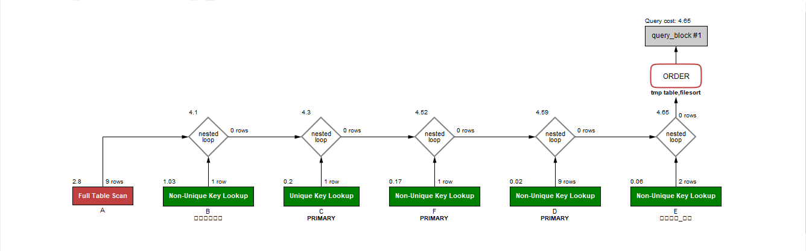
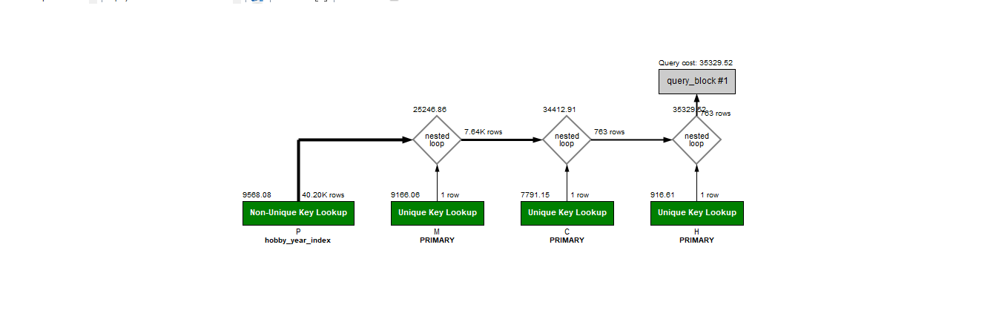
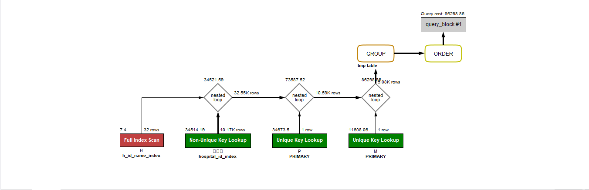

<p align="center">
    
</p>
<p align="center">
  
  
  <a href="https://edu.nextstep.camp/c/R89PYi5H" alt="nextstep atdd">
    
  </a>
  
</p>

<br>

# 인프라공방 샘플 서비스 - 지하철 노선도

<br>

## 🚀 Getting Started

### Install
#### npm 설치
```
cd frontend
npm install
```
> `frontend` 디렉토리에서 수행해야 합니다.

### Usage
#### webpack server 구동
```
npm run dev
```
#### application 구동
```
./gradlew clean build
```
<br>

## 미션

* 미션 진행 후에 아래 질문의 답을 작성하여 PR을 보내주세요.

### 1단계 - 화면 응답 개선하기
1. 성능 개선 결과를 공유해주세요 (Smoke, Load, Stress 테스트 결과)

2. 어떤 부분을 개선해보셨나요? 과정을 설명해주세요

---

### 2단계 - 조회 성능 개선하기
1. 인덱스 적용해보기 실습을 진행해본 과정을 공유해주세요
- 처음 속도가 나오지 않아서 `Excute the explain` 실행을 통해서 실행계획을 살펴보았습니다. 
- join이 되는 부분은  `커버링 index` 처리를 관련된 부분을 서브쿼리 형식으로 진행했습니다.
  - `커버링 index`와 별반 차이가 없는 경우에는 바로 `Join` 하는 방식으로 처리했습니다. 
- 데이터의 조회 경우 가장 작은 건수가 생길 대상을 먼저 join 처리하여 진행했습니다.
  - 현재 쿼리에서 조인 순서를 변경해도 문제되지 않는 경우에는 가독성을 신경써 보았습니다.
- 병원같은 경우는 `이름`까지 index 처리했습니다. 
- `using filesort`인 경우에는 `order by 대상컬럼 null` 처리해서 정렬이 불필요하여 삭제하였습니다.


- [x] 활동중인(Active) 부서의 현재 부서관리자 중 연봉 상위 5위안에 드는 사람들이 최근에 각 지역별로 언제 퇴실했는지 조회해보세요.

   1. 쿼리 작성만으로 1s 이하로 반환한다.
```sql
    SELECT 
           C.사원번호,
           C.이름,
           D.연봉,
           F.직급명,
           E.지역,
           E.입출입구분,
           E.입출입시간
      FROM 부서 A   
      INNER JOIN 부서관리자 B    
         ON A.부서번호 = B.부서번호    
        AND B.종료일자 = '9999-01-01'    
        AND A.비고 = 'ACTIVE'   
      INNER JOIN 사원 C
         ON B.사원번호 = C.사원번호
      INNER JOIN 급여 D
         ON D.사원번호 = C.사원번호
        AND D.종료일자 = '9999-01-01'
      INNER JOIN  사원출입기록 E    
         ON E.사원번호 = C.사원번호
        AND E.입출입구분 = 'O'
      INNER JOIN 직급 F 
         ON F.사원번호 = C.사원번호 
        AND F.시작일자 = C.입사일자
      ORDER BY D.연봉 DESC, E.입출입시간 DESC;
```


2. 인덱스 설정을 추가하여 50 ms 이하로 반환한다.
- 인덱스 추가
  - 플랜을 보면서 실제 풀스캔이 일어나는 부분을 인덱스로 묶어서 처리했습니다.
  - 사원출입기록 테이블에 사원번호, 입출입구분에 묶어서 인덱스 설정 




## 프로그래머별로 해당하는 병원 이름을 반환하세요. (covid.id, hospital.name)


```sql
ALTER TABLE covid ADD INDEX c_programmer_id(programmer_id);
ALTER TABLE covid ADD INDEX c_hospital_id(hospital_id);
    SELECT
        C.id,
        H.name
    FROM hospital H
   INNER JOIN covid C
      ON H.id = C.hospital_id
   INNER JOIN (SELECT P.id FROM programmer P WHERE member_id IS NOT NULL) 프로그래머
      ON C.member_id = 프로그래머.id;
```


## 프로그래밍이 취미인 학생 혹은 주니어(0-2년)들이 다닌 병원 이름을 반환하고 user.id 기준으로 정렬하세요.

```sql

ALTER TABLE programmer ADD INDEX p_hobby_years_coding(hobby,years_coding);
ALTER TABLE programmer ADD INDEX p_hobby_student(hobby,student);
ALTER TABLE programmer ADD INDEX p_member_id(member_id);
ALTER TABLE covid ADD INDEX c_programmer_id(programmer_id);

SELECT 
       T1.id,
       H.name,
       T1.hobby, 
       T1.dev_type, 
       T1.years_coding
FROM (
        SELECT C.id, 
               C.hospital_id,
               P.member_id, 
               P.hobby, 
               P.dev_type, 
               P.years_coding
        FROM covid C
        INNER JOIN programmer P
           ON P.id = C.programmer_id
          AND P.member_id IS NOT NULL
          AND P.member_id = C.id  
        INNER JOIN member M
           ON M.id = P.member_id
        WHERE (P.hobby ='YES' AND P.years_coding = '0-2 years')  
           OR (P.hobby = 'YES' AND P.student ='YES')
     ORDER BY M.id 
    ) AS T1
    
INNER JOIN hospital H
   ON H.id = T1.hospital_id;


```




--------------

## 서울대병원에 다닌 20대 India 환자들을 병원에 머문 기간별로 집계하세요. (covid.Stay)
-- covide 테이블에 `hospital 인덱스` 추가

hospital name도 index를 설정가능하지만 현재는 불필요해 보여서 하지 않았습니다. 
추후 `자료형 변경` 후에 인덱스 추가를 고려해볼 수 있을 것 같습니다.

```sql
ALTER TABLE programmer ADD INDEX p_country_index(country);
ALTER TABLE member ADD INDEX m_age_index(age);
ALTER TABLE covid ADD INDEX c_member_index(member_idx);
ALTER TABLE hospital ADD INDEX h_id_nmae_index(id, name);
ALTER TABLE hospital ADD INDEX h_nmae(name);
SELECT
      stay,
      count(1)
FROM 
       (
         SELECT 회원.id
           FROM (SELECT M.id FROM member M WHERE M.age BETWEEN 20 AND 29) 회원
          INNER JOIN (SELECT P.id FROM programmer P WHERE P.country = 'india') 프로그래머
             ON 회원.id = 프로그래머.id
       ) T1
    INNER JOIN   
        (SELECT
               C.member_id,
               C.stay
        FROM covid C
        INNER JOIN hospital H
           ON H.id = C.hospital_id
        WHERE name = '서울대병원'
        ) T2
ON T1.id = T2.member_id )
GROUP BY stay
ORDER BY null;


```




---
## 서울대병원에 다닌 30대 환자들을 운동 횟수별로 집계하세요. (user.Exercise)

```sql
ALTER TABLE programmer ADD INDEX p_exercise_index(exercise);
SELECT
      exercise,
      count(1)
  FROM 
       (
           SELECT 
                  회원.id,
                  프로그래머.exercise
             FROM (SELECT M.id FROM member M WHERE M.age BETWEEN 30 AND 39) 회원
            INNER JOIN programmer 프로그래머
               ON 프로그래머.member_id = 회원.id
       ) T1
INNER JOIN
       (
           SELECT
                  코비드.member_id
             FROM (SELECT H.id, H.name FROM hospital H WHERE name ='서울대병원') 병원
            INNER JOIN covid 코비드
               ON 병원.id = 코비드.hospital_id
       ) T2
   ON T1.id = T2.member_id
GROUP BY exercise
ORDER BY NULL;
```


2. 페이징 쿼리를 적용한 API endpoint를 알려주세요
/stations   
/lines   