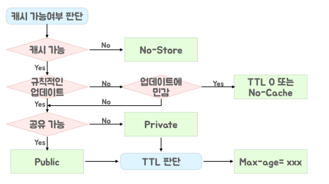

<p align="center">
    
</p>
<p align="center">
  
  
  <a href="https://edu.nextstep.camp/c/R89PYi5H" alt="nextstep atdd">
    
  </a>
  
</p>

<br>

# 인프라공방 샘플 서비스 - 지하철 노선도

<br>

## 🚀 Getting Started

### Install
#### npm 설치
```
cd frontend
npm install
```
> `frontend` 디렉토리에서 수행해야 합니다.

### Usage
#### webpack server 구동
```
npm run dev
```
#### application 구동
```
./gradlew clean build
```
<br>

## 미션

* 미션 진행 후에 아래 질문의 답을 작성하여 PR을 보내주세요.

--- 
### 1단계 - 화면 응답 개선하기
1. 성능 개선 결과를 공유해주세요 (Smoke, Load, Stress 테스트 결과)
- URL : https://yomni-subway.kro.kr/
- 테스트 결과는 monitoring/step1 하위에 모두 모아놓았습니다.
  - smoke / load / stress 각각 before / after 결과
  - Pagespeed 성능 테스트 before / after 결과

- Pagespeed 성능 테스트 결과 요약

|        | FCP      | LCP      | TTI      |
|--------|----------|----------|----------|
| Before | 2.6s     | 2.7s     | 2.7s     |
| After  | **1.2s** | **1.3s** | **1.3s** |
--> 대략 1/2 이하로 성능이 크게 개선되었습니다.

2. 어떤 부분을 개선해보셨나요? 과정을 설명해주세요

#### reverse-proxy 개선
- gzip 압축 : 텍스트 압축
- cache 설정 : nginx 의 cache 적용
- TLS, HTTP/2 설정 : http 1.1의 문제점인 HOL 블로킹 문제를 해결

#### WAS 성능 개선하기
- Spring Data Cache(with Redis)
  - 경로검색 기능에 Cache 적용
- 적절한 Thread pool size 구하기 : 사용 가능한 코어 수의 `1 ~ 2 배` 내로 수렴
  - CPU 모델명 : `Intel(R)Xeon(R) Platinum 8259CL CPU @2.50GHz`
  - CPU 당 물리 코어 수 : `1`
  - 물리 CPU 수 : `1`
  - 리눅스 전체 코어(프로세스) 개수 : `2`
  - AsyncThreadPool 적용

### 1단계 피드백
- [x] 구간별로 나눈 이유에 대한 확인
  - 구간별로 나눈 이유는 stress test 에서 터지는 시점의 데이터를 확인하기 용이하기 때문
  - load test 는 peak 까지 스무스하게 ramping up 하여, 오랜 시간동안 이상이 없는 지 확인하기 위함 
- [x] Async Thread pool은 생성했지만, `@Async`를 사용하는 곳이 없음
  - 아무리 생각해봐도 `@Async`를 적용할 곳이 없어서, 학습차원에서 AsyncThreadPool 만 구현 

---

### 2단계 - 스케일 아웃

1. Launch Template 링크를 공유해주세요.

2. cpu 부하 실행 후 EC2 추가생성 결과를 공유해주세요. (Cloudwatch 캡쳐)

```sh
$ stress -c 2
```

3. 성능 개선 결과를 공유해주세요 (Smoke, Load, Stress 테스트 결과)

### 2단계 미션에 필요한 개념 정리

- 캐싱
  - HTTP 캐시는 불필요한 네트워크 요청을 줄이기 때문에 로드 성능을 향상시키는 효과적인 방법
  - 다만 무분별한 캐시는 변경된 리소스를 갱신하지 못하거나, 브라우저에 캐싱되어 있는 리소스가 민감정보인 경우는 보안상 취약점이 될 수도 있음
  - 이런 문제를 해결하고자 아래와 같은 절차로 캐싱 전략을 전개시켜야 함
    - 사용하기 전에 서버에서 재검증해야하는 리소스의 경우 : `Cache-Control: no-cache`
    - `보안`이나 기타 여러가지 이유로 `캐싱되지 않아야 하는 리소스`의 경우 : `Cache-Control: no-store`
    - 버전 지정된 리소스의 경우 `Cache-Control: max-age=31536000`
- ETag
  - 캐시된 응답에 대한 유효성 검사 수행
  - 서버는 ETag HTTP 헤더를 사용하여 유효성 검사 토큰을 전달함
  - 캐싱을 적절히 사용하며, 캐싱된 리소스에 대한 유효성 검사를 ETag HTTP 헤더를 사용
  - Etag 매커니즘
    1. Client 가 최초로 임의의 리소스를 요청
      - 서버는 이에 ETag 유효성 검사 토큰을 추가하여 리소스를 전달함(`20* 응답`)
      - Client 는 수신한 리소스를 브라우저 내에서 캐싱함
    2. ETag 유효성 토큰과 함께 동일한 리소스를 N 번째 요청
      - 서버에서는 ETag 토큰으로 리소스가 변경되었는 지 확인
      - 변경되지 않았다면 변경되지 않았다고 응답(`304 Not Modified`)

no-cache vs no-store  
- no-cache : 캐시를 저장함. 다만 **_리소스 사용 시점마다 서버에 재검증 요청_** 을 보낸다
- no-store : **_캐시를 절대 저장하지 않음_**, 가장 강력한 Cache-Control

public vs private
- public : 공유 캐시(CDN 등등..)에 저장 가능
- private : 브라우저같은 Client 환경에만 저장 가능

Cache-Control 정책 정의 알고리듬  

- 최대한 많이 / 오래 / 가까이 캐시해야 한다.
- 개인화된 컨텐츠, API 호출 등은 캐시하기 어렵다
- 캐시 주기는 특별한 이유가 없다면 1년 정도로 설정

정적 자원을 캐싱할 때의 문제점과 해결책
- 캐싱을 사용할 때의 문제 상황
  - js, css, image 와 같은 정적 파일은 배포 후에 변경이 발생하지 않음
  - 1년으로 캐싱 주기를 설정 (`max-age = 60 * 60 * 24 * 365`)
  - 다음 배포에서 js, css 일부 파일에 변경이 발생했다.
  - 브라우저에는 이전 버전의 파일이 캐싱되어 있어서 리소스 재요청을 보내지 않고 있다.
  - 어떻게 해결할 것인가?
    1. 배포 시간 / 버전 등을 활용해 리소스 요청의 URL 을 강제로 변경시킨다.
    2. 파일명을 변경하지 않으려면, 캐시 무효화 방식으로 해당 이미지만 업데이트 가능

배포 시간 또는 버전을 사용할 때의 문제 상황
- 서버에서 점진적으로 배포를 진행하고 있다.
- 만약 배포 진행중 as-is 내에 있는 old-main.js 에서 to-be 서버로 요청이 간다면?
- 기능에 따라 심각한 문제를 야기할 수도 있다.

- CDN 적용으로 점진적 배포시 문제 해결
  - CDN : Content Delivery Network ; 여러 노드를 가진 네트워크에 컨텐츠를 저장하여 제공하는 프록시의 일종
  - Client 와 비교적 가까운 곳에 위치하여 캐시된 컨텐츠를 전달하므로, RTT(Round Trip Time)이 줄어 컨텐츠를 빠르게 받을 수 있음
  - CDN 의 Edge 서버가 캐시된 컨텐츠를 전송하므로 원본 서버의 부하를 줄일 수 있다.
  - 인프라를 확충하는데 인력과 경비를 줄일 수 있다
  - CDN 서비스는 Edge 서버들간에 캐시를 공유하고 있다.

### 2단계 기능 목록
- [x] 모든 정적 자원에 대해 no-cache, private 설정을 하고 테스트 코드를 통해 검증한다.
- [x] 확장자가 `.css`인 경우, max-age를 1년, js인 경우는 no-cache, private 설정을 한다
- [x] 모든 정적 자원에 대해 no-cache, no-store 설정을 한다. 가능한가요?
  - **_불가능 합니다_** 그 이유는 아래와 같습니다.
    - no-cache : 캐시를 저장함. 다만 **_리소스 사용 시점마다 서버에 재검증 요청_** 을 보낸다
    - no-store : **_캐시를 절대 저장하지 않음_**, 가장 강력한 Cache-Control
  - 따라서, no-cache, no-store 설정을 같이 한다는 것은 **_주먹을 쥐지 않고 모래를 잡는 방법을 찾아라_** 라고 주문하는 것과 같습니다.
- [ ] SpringBoot 에 HTTP Cache, gzip 설정
- [ ] Launch Template 작성하기
- [ ] Auto Scaling Group 생성
- [ ] Smoke, Load, Stress 테스트 후 결과를 기록

---

### 3단계 - 쿼리 최적화

1. 인덱스 설정을 추가하지 않고 아래 요구사항에 대해 1s 이하(M1의 경우 2s)로 반환하도록 쿼리를 작성하세요.

- 활동중인(Active) 부서의 현재 부서관리자 중 연봉 상위 5위안에 드는 사람들이 최근에 각 지역별로 언제 퇴실했는지 조회해보세요. (사원번호, 이름, 연봉, 직급명, 지역, 입출입구분, 입출입시간)

---

### 4단계 - 인덱스 설계

1. 인덱스 적용해보기 실습을 진행해본 과정을 공유해주세요

---

### 추가 미션

1. 페이징 쿼리를 적용한 API endpoint를 알려주세요
