<p align="center">
    
</p>
<p align="center">
  
  
  <a href="https://edu.nextstep.camp/c/R89PYi5H" alt="nextstep atdd">
    
  </a>
  
</p>

<br>

# 인프라공방 샘플 서비스 - 지하철 노선도

<br>

## 🚀 Getting Started

### Install
#### npm 설치
```
cd frontend
npm install
```
> `frontend` 디렉토리에서 수행해야 합니다.

### Usage
#### webpack server 구동
```
npm run dev
```
#### application 구동
```
./gradlew clean build
```
<br>

## 미션

* 미션 진행 후에 아래 질문의 답을 작성하여 PR을 보내주세요.

### 1단계 - 화면 응답 개선하기
1. 성능 개선 결과를 공유해주세요 (Smoke, Load, Stress 테스트 결과)
- 성능 개선 전 테스트 결과

#### Login Test 
* Smoke Test
    * Test Result : rps 1.94, fail 0 %, http_req_duration 10.94ms
      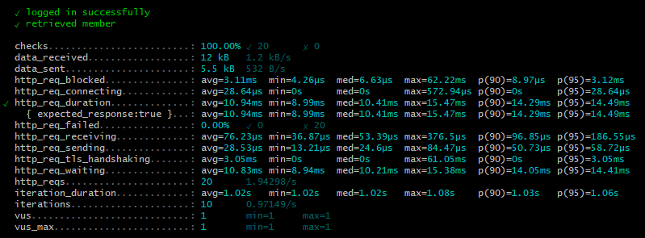

* Load Test
    * Test Result : rps 241.64, fail 0 %, http_req_duration 18.6ms
      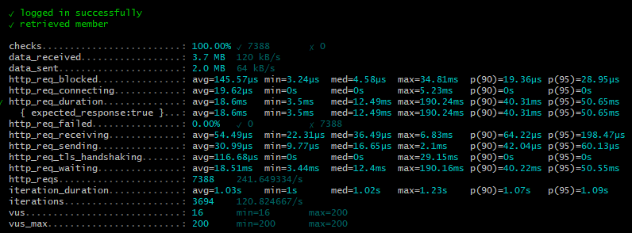

* Stress Test
    * Test Result(Max 400) : rps 429.52, request fail 7.27 %, login fail 13 %, http_req_duration 231.22ms
       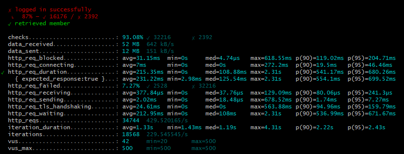


#### Path Test 
* Smoke Test
    * Test Result : rps 0.86, fail 0 %, http_req_duration 145.35ms
      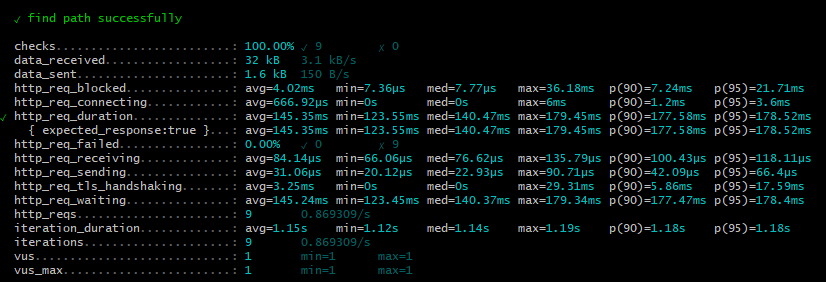

* Load Test
    * Test Result : rps 11.79, fail 0 %, http_req_duration 8.65s
      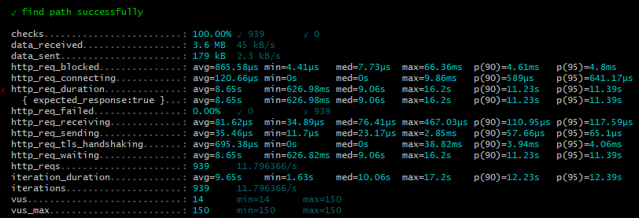

* Stress Test
    1. Test Result : rps 11.86, request fail 0.23 %, http_req_duration 12.14s
       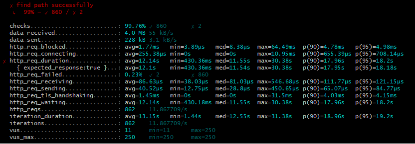

- 성능 개선 후 테스트 결과

#### Login Test
* Smoke Test
    * Test Result : rps 1.94, fail 0 %, http_req_duration 12.4ms
      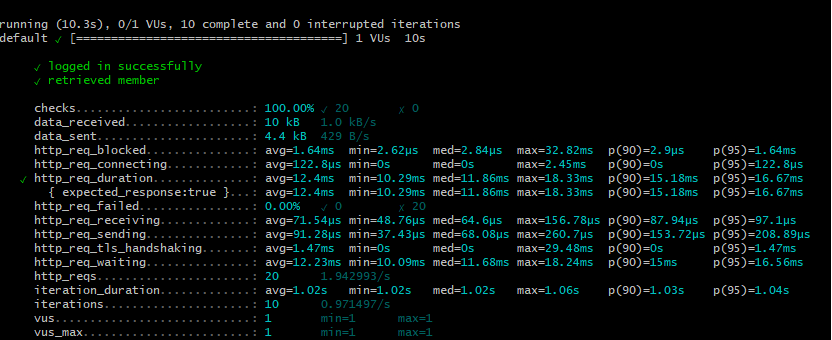

* Load Test
    * Test Result : rps 244.52, fail 0 %, http_req_duration 9.13ms
      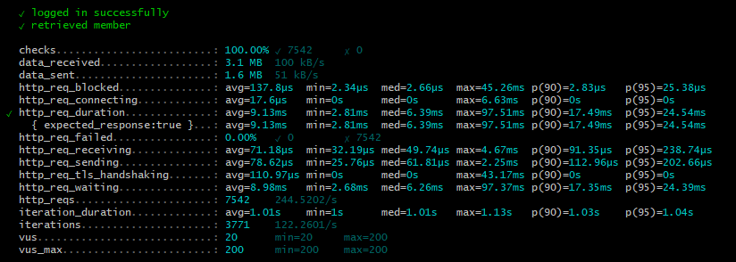

* Stress Test
    * Test Result : rps 523.61, request fail 7.27 %, login fail 13 %, http_req_duration 80.61ms
      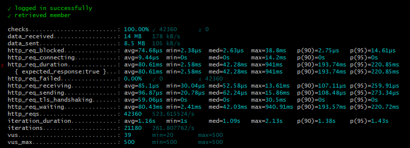


#### Path Test
* Smoke Test
    * Test Result : rps 0.99, fail 0 %, http_req_duration 3.91ms
      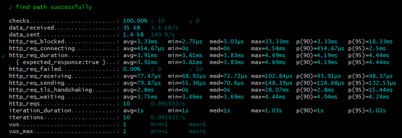

* Load Test
    * Test Result : rps 115.32, fail 0 %, http_req_duration 2.4ms
      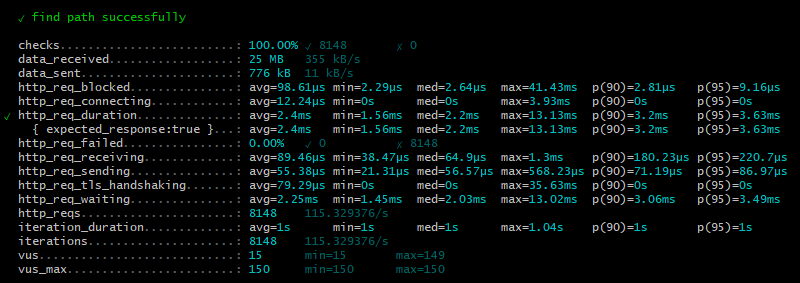

* Stress Test
    1. Test Result : rps 158.28, request fail 0 %, http_req_duration 2.51ms
       

2. 어떤 부분을 개선해보셨나요? 과정을 설명해주세요
* 리버스 프록시 개선을 위하여 gzip 적용, http2 적용 Proxy 캐싱, Enable HSTS 적용 하였습니다.
* Redis를 적용하여 DB 접근 및 쿼리 횟수를 최소화 하였습니다.

##### 테스트 결과 비교
* Redis 캐싱이 없는 로그인의 경우 3배 정도 속도 증가.
* Redis 캐싱을 한 경로 찾기의 경우 평균 12.14s -> 2.51ms 4800배 속도 증가 및 속도 지연에서 오는 에러가 사라졌습니다. 

---

### 2단계 - 조회 성능 개선하기
1. 인덱스 적용해보기 실습을 진행해본 과정을 공유해주세요
    1. Coding as a Hobby
        * 쿼리 작성 후 쿼리 실행 속도 : 300 ~ 320ms
        * programmer table hobby column index 추가 후 90 ~ 100 ms 이하로 결과 조회
    2. 프로그래머별로 해당하는 병원 이름을 반환 (covid.id, hospital.name)
        * 쿼리 작성 후 쿼리 실행 속도 : 130 ~ 150ms
        * covid table programmer_id column index 추가 후 10ms 이내로 결과 조회 - Unique Index Scan
    3. 프로그래밍이 취미인 학생 혹은 주니어(0-2년)들이 다닌 병원 이름을 반환하고 user.id 기준으로 정렬하세요.
        * 쿼리 작성 후 쿼리 실행 속도 : 2초 이상 - hospital, programmer full scan
        * hospital table id index 추가 후 20ms 이하로 실행 - unique index scan
    4. 서울대병원에 다닌 20대 India 환자들을 병원에 머문 기간별로 집계하세요. (covid.Stay)
        * 쿼리 작성 후 쿼리 실행 속도 : 400ms 이상
        * covid table hospital_id, member table age column index 추가 후 100ms 이내로 실행
    5. 서울대병원에 다닌 30대 환자들을 운동 횟수별로 집계하세요. (user.Exercise)
        * 쿼리 작성 후 쿼리 실행 속도 : 4번 실습의 인덱스 결과로 100ms 이내로 실행
        * 추가 작업 없음
    

2. 페이징 쿼리를 적용한 API endpoint를 알려주세요

