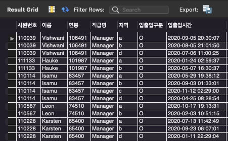
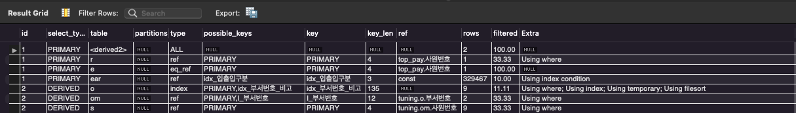
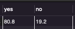

<p align="center">
    
</p>
<p align="center">
  
  
  <a href="https://edu.nextstep.camp/c/R89PYi5H" alt="nextstep atdd">
    
  </a>
  
</p>

<br>

# 인프라공방 샘플 서비스 - 지하철 노선도

<br>

## 🚀 Getting Started

### Install
#### npm 설치
```
cd frontend
npm install
```
> `frontend` 디렉토리에서 수행해야 합니다.

### Usage
#### webpack server 구동
```
npm run dev
```
#### application 구동
```
./gradlew clean build
```
<br>

## 미션

* 미션 진행 후에 아래 질문의 답을 작성하여 PR을 보내주세요.

### 1단계 - 쿼리 최적화

1. 인덱스 설정을 추가하지 않고 아래 요구사항에 대해 1s 이하(M1의 경우 2s)로 반환하도록 쿼리를 작성하세요.
- 활동중인(Active) 부서의 현재 부서관리자 중 연봉 상위 5위안에 드는 사람들이 최근에 각 지역별로 언제 퇴실했는지 조회해보세요. (사원번호, 이름, 연봉, 직급명, 지역, 입출입구분, 입출입시간)

  - 실행 쿼리(실행시간 : 0.287sec)
    ```
    SELECT ear.사원번호, e.이름, top_pay.연봉, r.직급명, ear.지역, ear.입출입구분, ear.입출입시간
    FROM (
       SELECT om.사원번호, s.연봉 
          FROM 부서관리자 om
             JOIN 부서 o ON o.비고 = "active" AND om.부서번호 = o.부서번호
             JOIN 급여 s ON om.사원번호 = s.사원번호 AND s.종료일자 > now()
         WHERE om.종료일자 > now()
         ORDER BY s.연봉 DESC
         LIMIT 5
     ) top_pay
        JOIN 사원 e ON e.사원번호 = top_pay.사원번호
        JOIN 직급 r ON r.사원번호 = top_pay.사원번호 and r.종료일자 > now()
        JOIN 사원출입기록 ear ON ear.사원번호 = top_pay.사원번호 AND ear.입출입구분 = "O"
    ```
  - 쿼리 결과
    
    
  - 실행계획 
    

---

### 2단계 - 인덱스 설계

1. 인덱스 적용해보기 실습을 진행해본 과정을 공유해주세요
- Coding as a Hobby 와 같은 결과를 반환하세요.
  - 쿼리 실행 (0.580sec)
    ```
    select round(yes.count/(yes.count + no.count)* 100, 1) as yes , round(no.count/(yes.count + no.count)*100, 1) as no
    from 
        (select count(*) count from programmer where hobby = "yes") yes, 
        (select count(*) count from programmer where hobby = "no") no
    ```
    
  - index 적용 -> 0.068sec
  ```
  ALTER TABLE `subway`.`programmer` 
  ADD INDEX `I_hobby` (`hobby` ASC);
  ```
  
  

- 프로그래머별로 해당하는 병원 이름을 반환하세요. (covid.id, hospital.name)
  ```
  select p.member_id, c.id, h.name 
  from programmer p
    join covid c on p.member_id = c.member_id
    join hospital h on h.id = c.hospital_id
  ```
    - 인덱스및 PK 설정 없을 경우 -> Lost connection (측정 실패)
    - covid index 설정 후 -> 0.047sec
  ```
  ALTER TABLE `subway`.`covid` 
  ADD INDEX `I_member_id` (`member_id` ASC);
  ```
    - hospital PK 설정 및 NotNull, Unique 설정
  ```
  ALTER TABLE `subway`.`hospital` 
  CHANGE COLUMN `id` `id` INT(11) NOT NULL ,
  ADD PRIMARY KEY (`id`),
  ADD UNIQUE INDEX `id_UNIQUE` (`id` ASC);
  ```


  - 프로그래밍이 취미인 학생 혹은 주니어(0-2년)들이 다닌 병원 이름을 반환하고 user.id 기준으로 정렬하세요. (covid.id, hospital.name, user.Hobby, user.DevType, user.YearsCoding)
    - 쿼리 실행 (0.025sec)
    ```
    SELECT c.id, h.name, p.hobby, p.dev_type, p.years_coding 
    FROM subway.programmer p
        JOIN covid c ON p.member_id = c.member_id
        JOIN hospital h ON c.hospital_id = h.id
    where p.hobby = "yes" and (p.student like "yes%" or p.years_coding = "0-2 years")
    ```
  - 서울대병원에 다닌 20대 India 환자들을 병원에 머문 기간별로 집계하세요. (covid.Stay)
    - 쿼리실행 (22.574sec)
      ```
      select c.stay, count(*) from covid c
          JOIN hospital h ON h.name = "서울대병원"
          JOIN member m ON m.id = c.member_id and m.age >= 20 and m.age < 30
          JOIN programmer p ON p.member_id = m.id and p.country = "india"
      group by c.stay
      ```
    - unique 설정 (15.623sec)
      ```
      ALTER TABLE `subway`.`hospital` 
      ADD UNIQUE INDEX `name_UNQUE` (`name` ASC);
      ```
    - member PK 설정 (0.367sec) 
      ```
      ALTER TABLE `subway`.`member` 
      CHANGE COLUMN `id` `id` BIGINT(20) NOT NULL ,
      ADD PRIMARY KEY (`id`),
      ADD UNIQUE INDEX `id_UNIQUE` (`id` ASC);
      ```
    - programmer PK 설정 (0.326)
      ```
      ALTER TABLE `subway`.`programmer` 
      CHANGE COLUMN `id` `id` BIGINT(20) NOT NULL ,
      ADD PRIMARY KEY (`id`),
      ADD UNIQUE INDEX `id_UNIQUE` (`id` ASC);
      ```
    - programmer index 설정 (0.207)
      ```
      ALTER TABLE `subway`.`programmer` 
      ADD INDEX `I_contry` (`country` ASC);
      ```

  - 서울대병원에 다닌 30대 환자들을 운동 횟수별로 집계하세요. (user.Exercise)
    - 쿼리 실행 (0.480sec)
      ```
      select p.exercise, count(*) from covid c
          JOIN hospital h ON h.name = "서울대병원"
          JOIN member m ON m.id = c.member_id and m.age >= 30 and m.age < 40
          JOIN programmer p ON p.member_id = m.id
      group by p.exercise
      ```
---

### 추가 미션

1. 페이징 쿼리를 적용한 API endpoint를 알려주세요
