<p align="center">
    
</p>
<p align="center">
  
  
  <a href="https://edu.nextstep.camp/c/R89PYi5H" alt="nextstep atdd">
    
  </a>
  
</p>

<br>

# 인프라공방 샘플 서비스 - 지하철 노선도

<br>

## 🚀 Getting Started

### Install
#### npm 설치
```
cd frontend
npm install
```
> `frontend` 디렉토리에서 수행해야 합니다.

### Usage
#### webpack server 구동
```
npm run dev
```
#### application 구동
```
./gradlew clean build
```
<br>

## 미션

* 미션 진행 후에 아래 질문의 답을 작성하여 PR을 보내주세요.


### 1단계 - 화면 응답 개선하기
1. 성능 개선 결과를 공유해주세요 (Smoke, Load, Stress 테스트 결과)

- `Smoke` 개선 전


- `Smoke` 개선 후
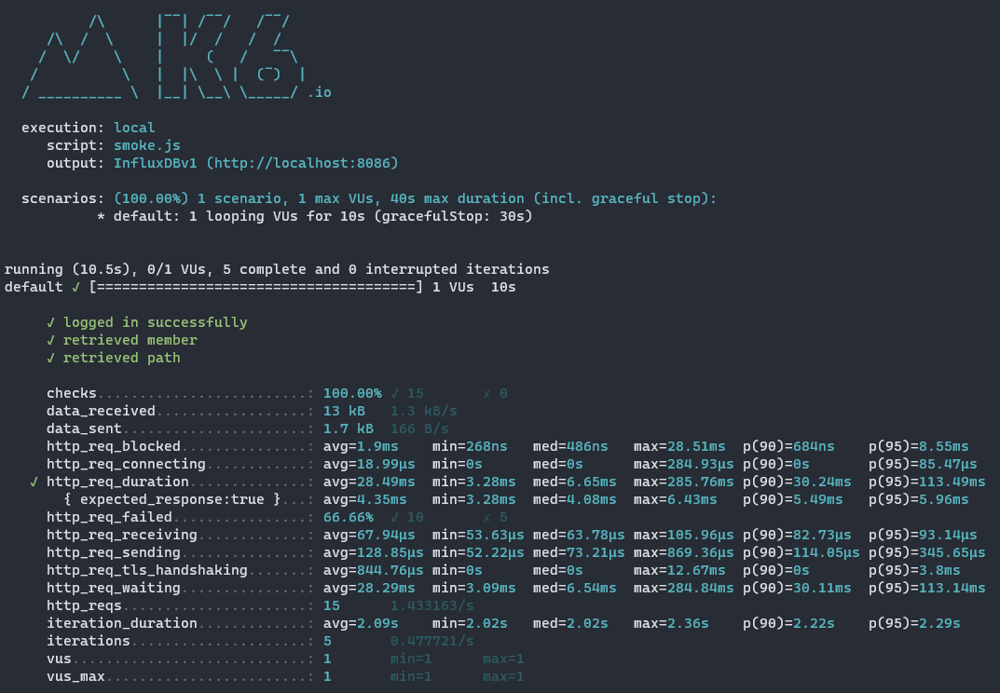

- `Load` 개선 전


- `Load` 개선 후


- `Stress` 개선 전
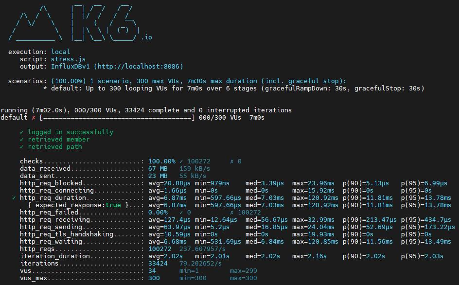

- `Stress` 개선 후
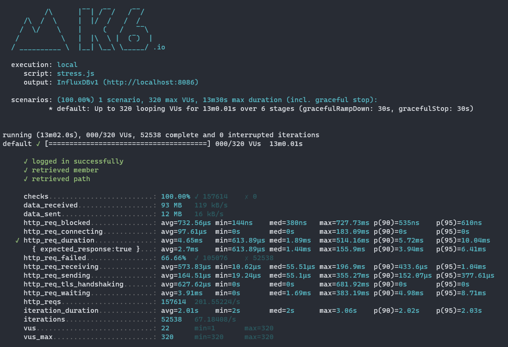

2. 어떤 부분을 개선해보셨나요? 과정을 설명해주세요

- Reverse Proxy 개선하기
  - gzip 압축
  - cache
  - TLS, HTTP/2 설정
- WAS 성능 개선하기 
  - Spring Data Cache

#### 확인
|      | TTI | FCP   | [Speed Index](https://docs.webpagetest.org/metrics/speedindex/) | [LCP](https://www.webpagetest.org/vitals.php?test=220622_BiDc7X_EFY&run=2&cached=0#lcp) | [CLS](https://www.webpagetest.org/vitals.php?test=220622_BiDc7X_EFY&run=2&cached=0#cls) | [TBT](https://www.webpagetest.org/vitals.php?test=220622_BiDc7X_EFY&run=2&cached=0#tbt) | 
|------|----- |-------|-----------------------------------------------------------------|-----------------------------------------------------------------------------------------|-----------------------------------------------------------------------------------------|
| 개선 전 | 2.9 | 9.269 | 9.328 | 9.518 | 0.058  | 0.018  |
| 개선 전 | 1.3 | 1.2   | 1.3   | 1.3   | 0.004  | 0.0003 |

### 2단계 - 스케일 아웃

1. Launch Template 링크를 공유해주세요.
- https://ap-northeast-2.console.aws.amazon.com/ec2/v2/home?region=ap-northeast-2#AutoScalingGroupDetails:id=jiyeonghwang-asg2;view=details
2. cpu 부하 실행 후 EC2 추가생성 결과를 공유해주세요. (Cloudwatch 캡쳐)
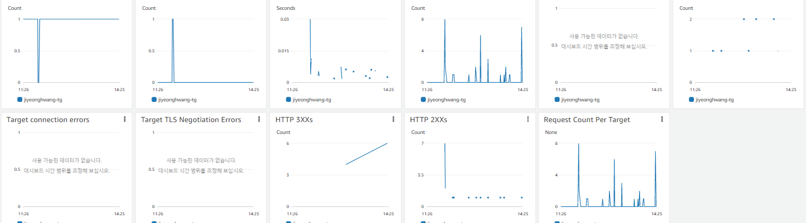

3. 성능 개선 결과를 공유해주세요 (Smoke, Load, Stress 테스트 결과)
- Smoke
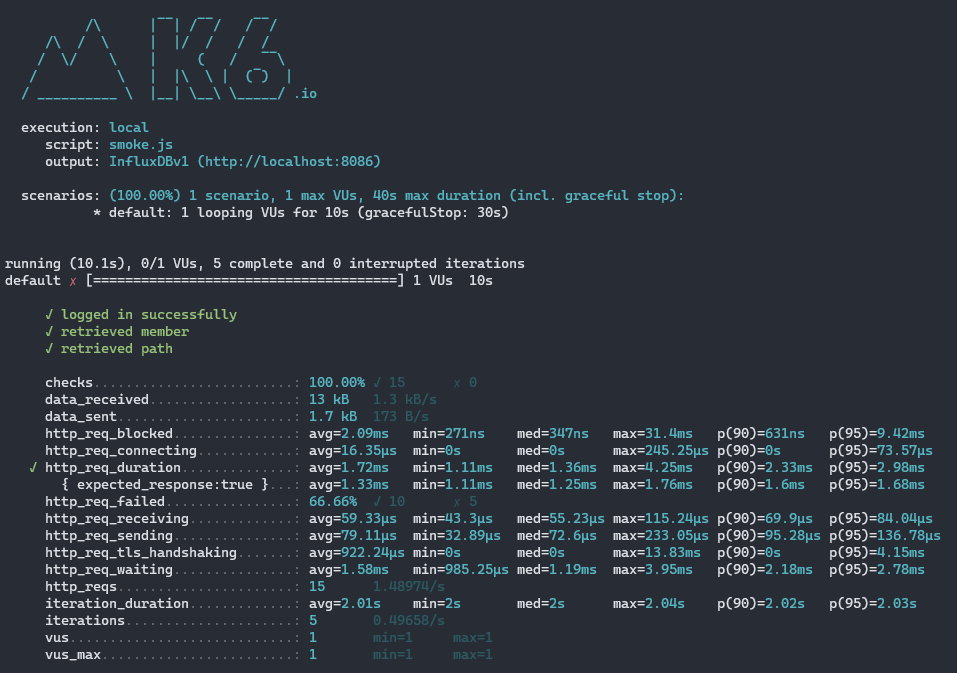
- Load
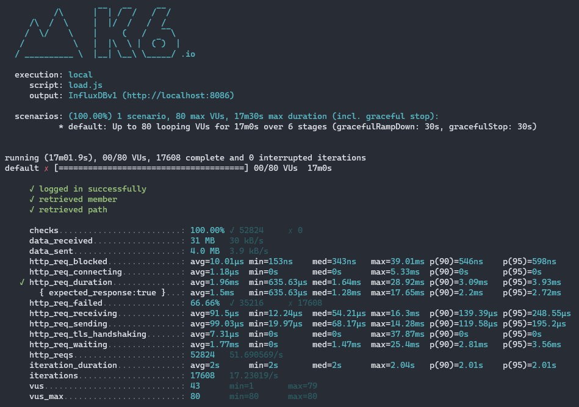
- Stress
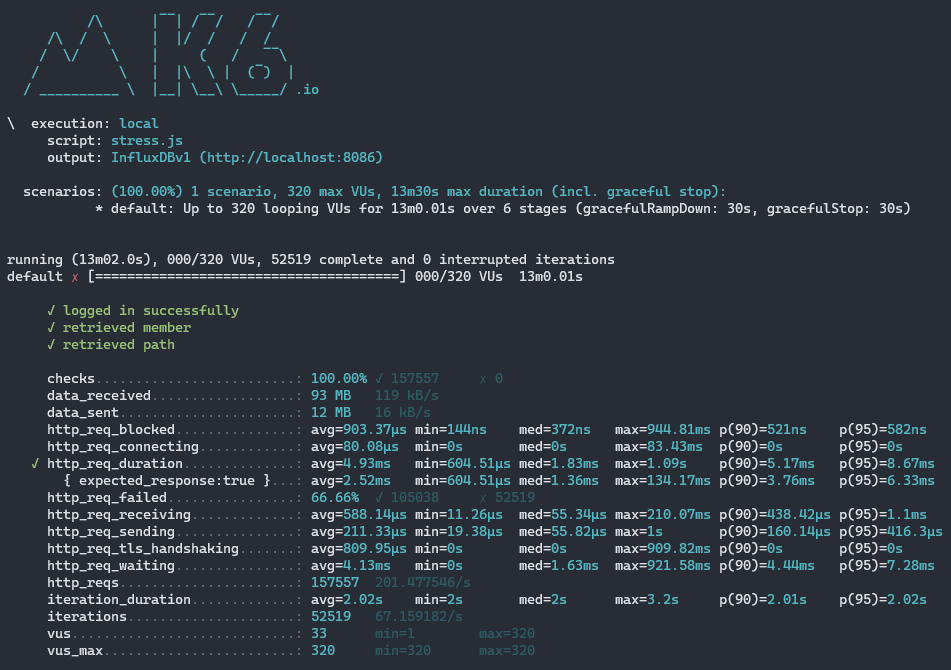

3-1. 모든 정적 자원에 대해 no-cache, no-store 설정을 한다. 가능한가요?

아래처럼 설정 시 가능할 것 같습니다!
다만 효율성 측면에서 특별한 경우가 아니라면 지양해야 한다고 생각됩니다.

```js
spring.resources.cache.cachecontrol.no-store=true
spring.resources.cache.cachecontrol.must-revalidate=true
spring.resources.cache.cachecontrol.no-cache=true
```
### 1단계 - 쿼리 최적화

1. 인덱스 설정을 추가하지 않고 아래 요구사항에 대해 1s 이하(M1의 경우 2s)로 반환하도록 쿼리를 작성하세요.

- 활동중인(Active) 부서의 현재 부서관리자 중 연봉 상위 5위안에 드는 사람들이 최근에 각 지역별로 언제 퇴실했는지 조회해보세요. (사원번호, 이름, 연봉, 직급명, 지역, 입출입구분, 입출입시간)

``` sql
select record.employee_id as '사원번호'
	, salary_rank.employee_name as '이름'
	, salary_rank.annual_income as '연봉'
	, salary_rank.position_name as '직급명'
	, record.region as '지역'
	, record.record_symbol as '입출입구분'
	, record.time as '입출입시간'
from (
	select  e.id
	      , concat(e.last_name, e.first_name) as employee_name
	      , salary.annual_income
	      , p.position_name
	from manager m
	inner join employee e on m.employee_id = e.id
		and m.end_date > now()
	inner join department d on m.department_id = d.id 
		and upper(d.note) = 'ACTIVE'
	inner join position p on m.employee_id = p.id 
		and p.end_date > now()
	inner join salary on m.employee_id = salary.id
		and salary.end_date > now()
	order by salary.annual_income desc
	limit 5
) salary_rank 
inner join record on salary_rank.id = record.employee_id
	and record.record_symbol = 'O';
```


---

### 2단계 - 인덱스 설계

1. 인덱스 적용해보기 실습을 진행해본 과정을 공유해주세요

- [x] [Coding as a Hobby](https://insights.stackoverflow.com/survey/2018#developer-profile-_-coding-as-a-hobby) 와 같은 결과를 반환하세요.
```sql
alter table programmer add primary key(id);
alter table programmer add index idx_programmer_hobby(hobby);

SELECT hobby,
       concat(round(count(id) / (select count(id) from programmer p) * 100, 1), '%') as '비율'
FROM programmer
group by hobby;
```
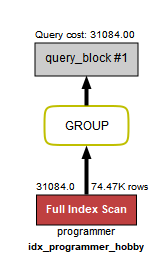
- [x] 프로그래머별로 해당하는 병원 이름을 반환하세요. (covid.id, hospital.name)
```sql
alter table covid add primary key(id);
alter table covid add index idx_covid_hospital(hospital_id);
alter table covid add index idx_covid_programmer(programmer_id);
alter table hospital add primary key(id);

SELECT c.id, h.name
FROM covid c
       inner join programmer p on p.id = c.programmer_id
       inner join hospital h on h.id = c.hospital_id;
```

- [x] 프로그래밍이 취미인 학생 혹은 주니어(0-2년)들이 다닌 병원 이름을 반환하고 user.id 기준으로 정렬하세요. (covid.id, hospital.name, user.Hobby, user.DevType, user.YearsCoding)
```sql
alter table member add primary key(id);
alter table programmer add index idx_programmer(member_id);

SELECT c.id
     , h.name
     , p.hobby
     , p.dev_type
     , p.years_coding
FROM programmer p
	inner join covid c on p.id = c.programmer_id
	inner join hospital h on c.hospital_id = h.id
	inner join member m on p.member_id = m.id
WHERE p.hobby = 'YES'
  and ((p.years_coding = '0-2 years') or (p.student like 'Yes%'))
order by p.id;
```
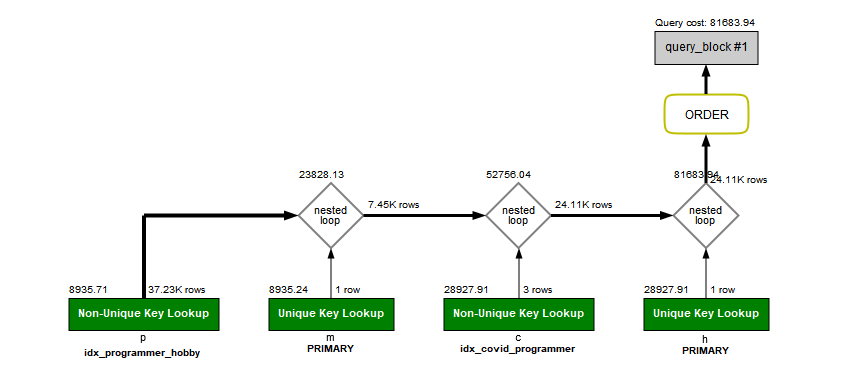
- [x] 서울대병원에 다닌 20대 India 환자들을 병원에 머문 기간별로 집계하세요. (covid.Stay)
```sql
alter table covid add index idx_covid_member(member_id);

SELECT c.stay, count(1)
FROM programmer p
    inner join covid c on c.programmer_id = p.id
    inner join hospital h on c.hospital_id = h.id
    inner join member m on c.member_id = m.id
WHERE h.name = '서울대병원'
  and p.country = 'India'
  and m.age BETWEEN 20 and 29
group by c.stay;
```
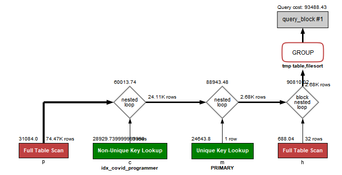
- [x] 서울대병원에 다닌 30대 환자들을 운동 횟수별로 집계하세요. (user.Exercise)
```sql
SELECT p.exercise
	   , count(p.id)
FROM programmer p
	inner join covid c on c.programmer_id = p.id
    inner join hospital h on c.hospital_id = h.id
	inner join member m on c.member_id = m.id
where h.name = '서울대병원'
	and m.age BETWEEN 30 and 39
group by exercise;
```
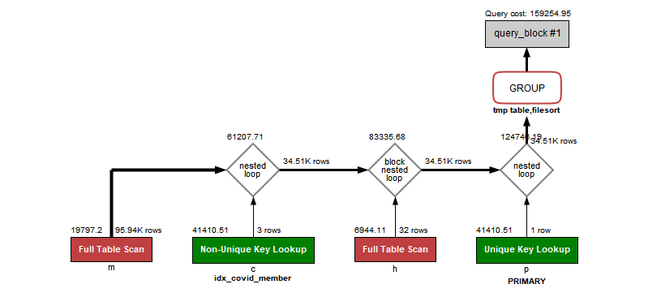

#### 실행 시간


### 추가 미션

1. 페이징 쿼리를 적용한 API endpoint를 알려주세요
