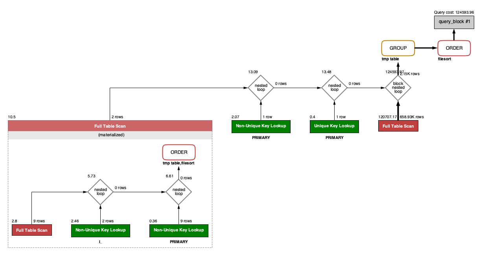
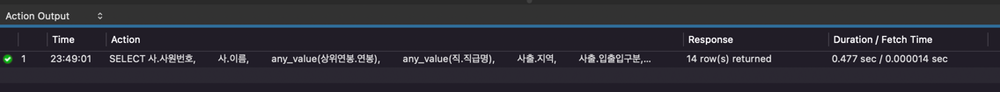
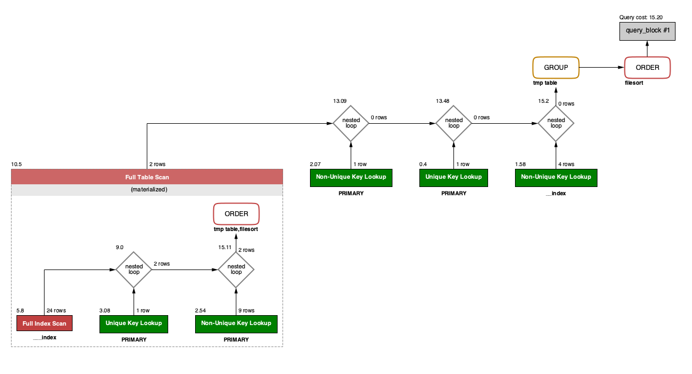
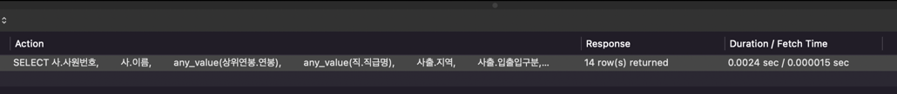

<p align="center">
    
</p>
<p align="center">
  
  
  <a href="https://edu.nextstep.camp/c/R89PYi5H" alt="nextstep atdd">
    
  </a>
  
</p>

<br>

# 인프라공방 샘플 서비스 - 지하철 노선도

<br>

## 🚀 Getting Started

### Install
#### npm 설치
```
cd frontend
npm install
```
> `frontend` 디렉토리에서 수행해야 합니다.

### Usage
#### webpack server 구동
```
npm run dev
```
#### application 구동
```
./gradlew clean build
```
<br>

## 미션

* 미션 진행 후에 아래 질문의 답을 작성하여 PR을 보내주세요.

### 1단계 - 화면 응답 개선하기
1. 성능 개선 결과를 공유해주세요 (Smoke, Load, Stress 테스트 결과)

2. 어떤 부분을 개선해보셨나요? 과정을 설명해주세요

---

### 2단계 - 조회 성능 개선하기

#### 1. 인덱스 적용해보기 실습을 진행해본 과정을 공유해주세요  
   
##### A. 쿼리 최적화

> 활동중인(Active) 부서의 현재 부서관리자 중 연봉 상위 5위안에 드는 사람들이 최근에 각 지역별로 언제 퇴실했는지 조회해보세요.    
(사원번호, 이름, 연봉, 직급명, 지역, 입출입구분, 입출입시간)  
급여 테이블의 사용여부 필드는 사용하지 않습니다. 현재 근무중인지 여부는 종료일자 필드로 판단해주세요.

1. 쿼리 작성만으로 1s 이하로 반환한다.  



  
  
```sql 
  SELECT 사.사원번호,
         사.이름,
         any_value(상위연봉.연봉),
         any_value(직.직급명),
         사출.지역,
         사출.입출입구분,
         max(사출.입출입시간)
  FROM (SELECT 부관.사원번호, 급.연봉
        FROM (SELECT 부서번호 from 부서 WHERE 비고 = 'Active') 부
                 INNER JOIN (SELECT 사원번호, 부서번호 FROM 부서관리자 WHERE now() BETWEEN 시작일자 AND 종료일자) 부관 ON 부.부서번호 = 부관.부서번호
                 INNER JOIN (SELECT 사원번호, 연봉 FROM 급여 where now() BETWEEN 시작일자 AND 종료일자) 급 ON 부관.사원번호 = 급.사원번호
        ORDER BY 급.연봉 DESC
        LIMIT 5) AS 상위연봉
           INNER JOIN (SELECT 사원번호, 이름 FROM 사원) 사 ON 상위연봉.사원번호 = 사.사원번호
           INNER JOIN (SELECT 사원번호, 입출입구분, 지역, 입출입시간 FROM 사원출입기록 WHERE 사원출입기록.입출입구분 = 'O') 사출 ON 상위연봉.사원번호 = 사출.사원번호
           INNER JOIN (SELECT 사원번호, 직급명 FROM 직급 where now() BETWEEN 시작일자 AND 종료일자) 직 ON 상위연봉.사원번호 = 직.사원번호
  GROUP BY 사.사원번호, 사출.지역
  ORDER BY any_value(상위연봉.연봉) DESC;
```

2. 인덱스 설정을 추가하여 50 ms 이하로 반환한다.





  ```sql
    CREATE INDEX 부서_비고_index ON 부서 (비고);
    
    CREATE INDEX 급여_연봉_index ON 급여 (연봉 DESC);
    
    CREATE INDEX 부서관리자_시작일자_종료일자_index ON 부서관리자 (시작일자, 종료일자);
    
    CREATE INDEX 사원출입기록_입출입구분_index ON 사원출입기록 (입출입구분);
    CREATE INDEX 사원출입기록_사원번호_index ON 사원출입기록 (사원번호);
  ```


#### 2. 페이징 쿼리를 적용한 API endpoint를 알려주세요

