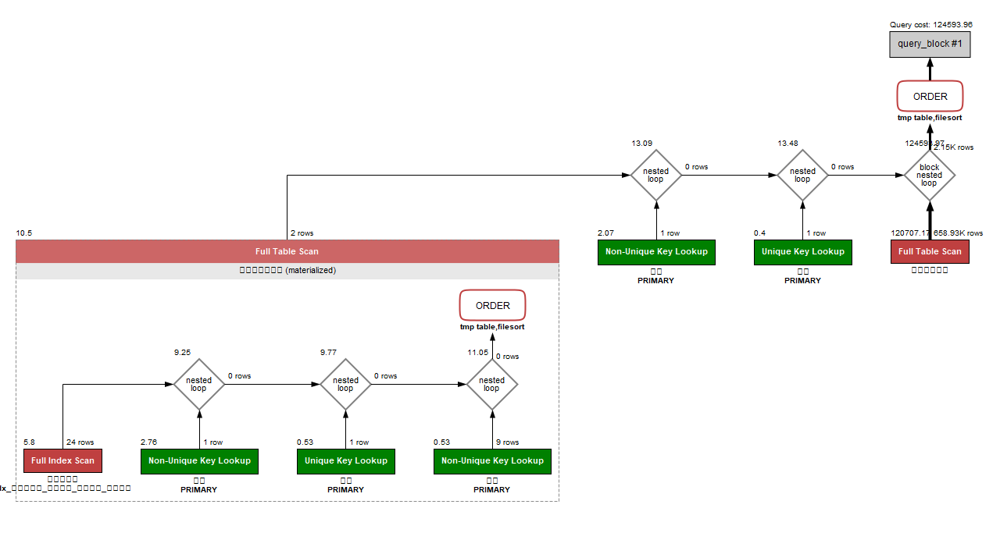
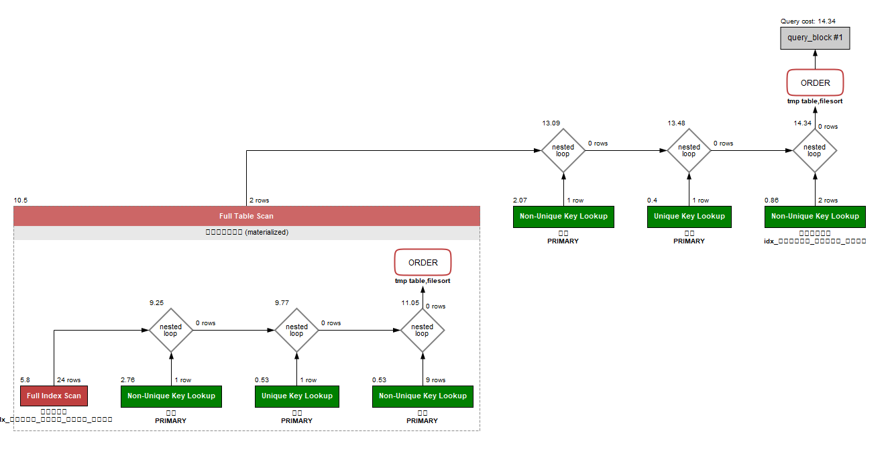
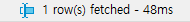

<p align="center">
    
</p>
<p align="center">
  
  
  <a href="https://edu.nextstep.camp/c/R89PYi5H" alt="nextstep atdd">
    
  </a>
  
</p>

<br>

# 인프라공방 샘플 서비스 - 지하철 노선도

<br>

## 🚀 Getting Started

### Install

#### npm 설치

```
cd frontend
npm install
```

> `frontend` 디렉토리에서 수행해야 합니다.

### Usage

#### webpack server 구동

```
npm run dev
```

#### application 구동

```
./gradlew clean build
```

<br>

## 미션

* 미션 진행 후에 아래 질문의 답을 작성하여 PR을 보내주세요.

### 1단계 - 화면 응답 개선하기

1. 성능 개선 결과를 공유해주세요 (Smoke, Load, Stress 테스트 결과)

2. 어떤 부분을 개선해보셨나요? 과정을 설명해주세요

- 1단계 미션은 제외로 공지를 받아 2단계부터 진행하겠습니다

---

### 2단계 - 조회 성능 개선하기

### 1. 인덱스 적용해보기 실습을 진행해본 과정을 공유해주세요

**A. 쿼리최적화**

활동중인(Active) 부서의 현재 부서관리자 중 연봉 상위 5위안에 드는 사람들이 최근에 각 지역별로 언제 퇴실했는지 조회해보세요.
(사원번호, 이름, 연봉, 직급명, 지역, 입출입구분, 입출입시간)

```sql
SELECT 
  상위연봉관리자.사원번호, 사원.이름, 상위연봉관리자.연봉, 직급.직급명, 사원출입기록.지역 , 사원출입기록.입출입구분 , 사원출입기록.입출입시간 
FROM
(
	SELECT 
	급여.사원번호, 급여.연봉
	FROM 급여
	JOIN 직급 ON 직급.사원번호 = 급여.사원번호
	  AND now() BETWEEN 직급.시작일자 AND 직급.종료일자 
	JOIN 부서관리자 ON 부서관리자.사원번호 = 급여.사원번호
	  AND NOW() BETWEEN 부서관리자.시작일자 AND 부서관리자.종료일자 
	JOIN 부서 ON 부서.부서번호 = 부서관리자.부서번호 
	  AND UPPER(부서.비고) = 'ACTIVE'
	WHERE NOW() BETWEEN 급여.시작일자 AND 급여.종료일자 
	ORDER BY 급여.연봉 DESC LIMIT 5
) AS 상위연봉관리자
INNER JOIN 사원출입기록 ON 사원출입기록.사원번호 = 상위연봉관리자.사원번호
  AND 사원출입기록.입출입구분 = UPPER('O')
INNER JOIN 사원 ON 사원.사원번호 = 상위연봉관리자.사원번호
INNER JOIN 직급 ON 직급.사원번호 = 상위연봉관리자.사원번호
  AND now() BETWEEN 직급.시작일자 AND 직급.종료일자
ORDER BY 상위연봉관리자.연봉 DESC, 사원출입기록.지역
```

- 인덱스 설정 이전 (313 ms)
    - 

- 인덱스 설정 이후 (6~7 ms)
    - `CREATE INDEX idx_사원출입기록_입출입구분_사원번호 on 사원출입기록 (입출입구분, 사원번호);`
    - `CREATE INDEX idx_부서관리자_시작일자_종료일자_사원번호 on 부서관리자 (시작일자, 종료일자, 사원번호);`
    - 

**B. 인덱스 설계**

**주어진 데이터셋을 활용하여 아래 조회 결과를 100ms 이하로 반환**

1. Coding as a Hobby 와 같은 결과를 반환하세요.

```mysql
create index idx_programmer_hobby on subway.programmer (hobby);

select 
  ROUND(SUM(if(hobby = 'YES', 1, 0))/COUNT(hobby)*100) AS 'YES',
  ROUND(SUM(if(hobby = 'NO', 1, 0))/count(hobby)*100) AS 'NO'
from programmer p; 
```



2. 프로그래머별로 해당하는 병원 이름을 반환하세요. (covid.id, hospital.name)

```sql
create index idx_covid_member_id on covid (member_id);
create index idx_programmer_member_id on programmer (member_id);

select
c.id, h.name
from programmer p 
join member m on m.id  = p.member_id
join covid c on c.member_id = p.member_id 
join hospital h on h.id = c.hospital_id ;
```


3. 프로그래밍이 취미인 학생 혹은 주니어(0-2년)들이 다닌 병원 이름을 반환하고 user.id 기준으로 정렬하세요. (covid.id, hospital.name, user.Hobby, user.DevType,
   user.YearsCoding)

```sql
create index idx_programmer_member_id on programmer (member_id);
create index idx_hosipital_id on hospital (id);
create index idx_programmer_hobby on programmer (hobby);
create index idx_programmer_years_coding on programmer (years_coding);
create index idx_covid_hospital_id on covid (hospital_id);

select 
 c.id, h.name, p.hobby, p.dev_type, p.years_coding
from programmer p, hospital h, covid c
where (p.student LIKE 'YES%' or p.years_coding = '0-2 years')
AND p.hobby = 'Yes' 
and p.member_id = c.member_id 
and c.hospital_id = h.id 
order by p.member_id asc;
```


4. 서울대병원에 다닌 20대 India 환자들을 병원에 머문 기간별로 집계하세요. (covid.Stay)

```sql
create index idx_member_id on `member` (id);
create index idx_hospital_id on hospital (id);
create index idx_programmer_country on programmer (country);
create index idx_memeber_age on `member` (age);
create index idx_covid_stay on covid (stay);

select 
c.stay , count(m.id)
from `member` m
inner join covid c on c.member_id = m.id
inner join hospital h on h.id  = c.hospital_id 
inner join programmer p on p.member_id = m.id
where m.age >= 20 and m.age <= 29
and h.name = '서울대병원'
and p.country = 'india'
group by c.stay
order by c.stay asc;
```


5. 서울대병원에 다닌 30대 환자들을 운동 횟수별로 집계하세요. (user.Exercise)

```text
create index idx_hospital_id on hospital (id);
create index idx_member_age on `member` (age);

select p.exercise, count(m.id) 
from `member` m
inner join programmer p  on p.member_id = m.id 
inner join covid c on c.member_id = m.id
inner join hospital h on h.id = c.hospital_id 
where m.age >= 30 and m.age <= 39
and h.name = '서울대병원'
group by p.exercise 
order by p.exercise asc
```


### 2. 페이징 쿼리를 적용한 API endpoint를 알려주세요

https://13.125.64.39/stations?page=0&size=100

```shell
curl -k --location --request GET 'https://13.125.64.39/stations?sort=id,asc&page=0&size=100'
```


