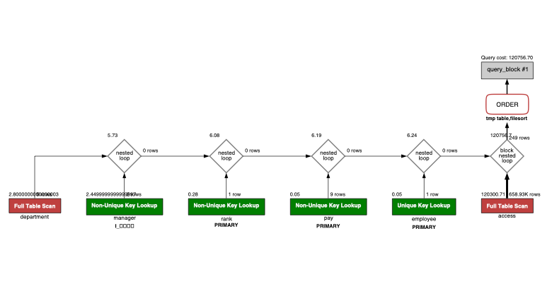
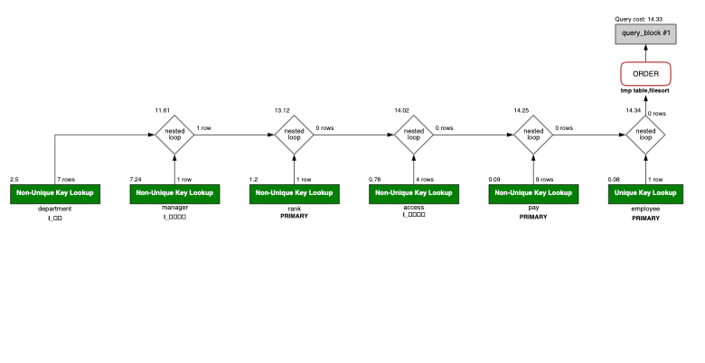
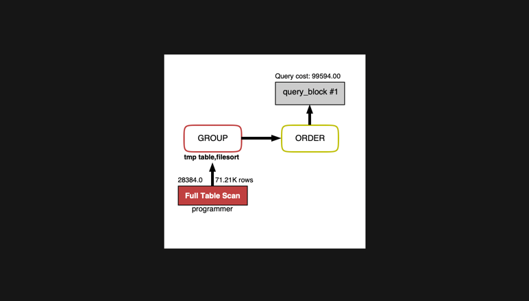
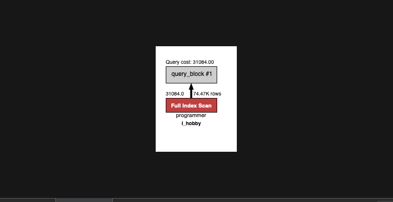
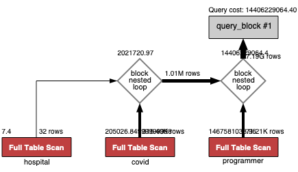
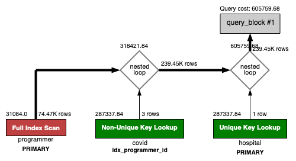
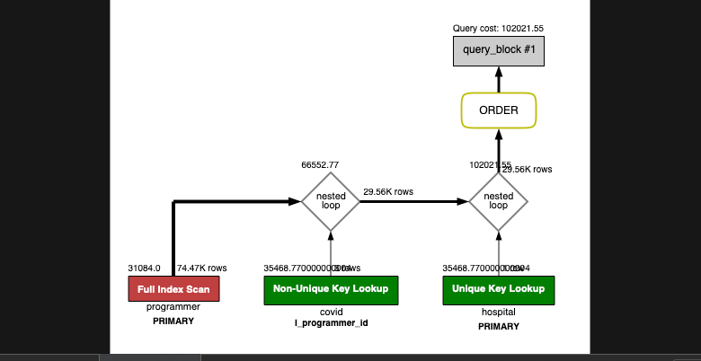
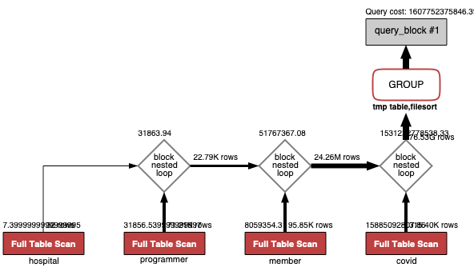
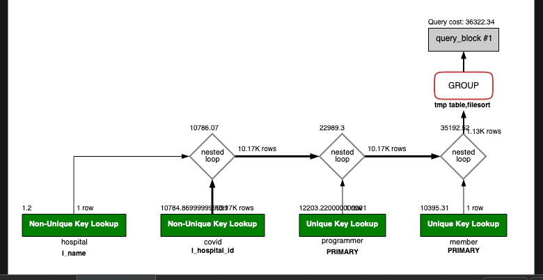

<p align="center">
    
</p>
<p align="center">
  
  
  <a href="https://edu.nextstep.camp/c/R89PYi5H" alt="nextstep atdd">
    
  </a>
  
</p>

<br>

# 인프라공방 샘플 서비스 - 지하철 노선도

<br>

## 🚀 Getting Started

### Install

#### npm 설치

```
cd frontend
npm install
```

> `frontend` 디렉토리에서 수행해야 합니다.

### Usage

#### webpack server 구동

```
npm run dev
```

#### application 구동

```
./gradlew clean build
```

<br>

## 미션

* 미션 진행 후에 아래 질문의 답을 작성하여 PR을 보내주세요.

### 1단계 - 화면 응답 개선하기

1. 성능 개선 결과를 공유해주세요 (Smoke, Load, Stress 테스트 결과)

2. 어떤 부분을 개선해보셨나요? 과정을 설명해주세요

---

### 2단계 - 조회 성능 개선하기

1. 인덱스 적용해보기 실습을 진행해본 과정을 공유해주세요
    1. 쿼리를 작성한다.
    2. 실행 시간을 확인한다.
    3. Visual Explain 으로 병목점을 확인한다.
    4. 인덱스를 추가 & 수정하면서 다시 실행 시간과 Visual Explain 을 확인한다.
    5. 아래 "요구사항"란에 기록해두었으니 참고 부탁드립니다.

2. 페이징 쿼리를 적용한 API endpoint를 알려주세요
    1. http://y2o2u2n-alb-1093980542.ap-northeast-2.elb.amazonaws.com/pageable-stations?page=0&size=2

#### 요구사항

##### A. 쿼리 최적화

###### 쿼리 작성만으로 1s 이하로 반환한다.

> 0.410 sec

```sql
SELECT employee.사원번호,
       employee.이름,
       pay.연봉,
       rank.직급명,
       access.입출입시간,
       access.지역,
       access.입출입구분
FROM 부서 department
         INNER JOIN 부서관리자 manager
                    ON manager.부서번호 = department.부서번호
                        AND department.비고 = 'active'
                        AND manager.종료일자 = '9999-01-01'
         INNER JOIN 사원 employee
                    ON employee.사원번호 = manager.사원번호
         INNER JOIN 급여 pay
                    ON pay.사원번호 = employee.사원번호
                        AND pay.종료일자 = '9999-01-01'
         INNER JOIN 직급 rank
                    ON rank.사원번호 = employee.사원번호
                        AND rank.종료일자 = '9999-01-01'
         INNER JOIN 사원출입기록 access
                    ON access.사원번호 = employee.사원번호
                        AND access.입출입구분 = 'O'
ORDER BY pay.연봉 DESC, access.지역
```

###### 인덱스 설정을 추가하여 50 ms 이하로 반환한다.

**인덱스 생성 전**

> 4.696 sec



**인덱스 생성 후**

> 0.019 sec



```sql
ALTER TABLE `tuning`.`사원출입기록`
    ADD INDEX `I_사원번호` (`사원번호` ASC);
ALTER TABLE `tuning`.`부서`
    ADD INDEX `I_비고` (`비고` ASC);
ALTER TABLE `tuning`.`부서관리자`
    ADD INDEX `I_종료일자` (`종료일자` ASC);
```

##### B. 인덱스 설계

> 주어진 데이터셋을 활용하여 아래 조회 결과를 100ms 이하로 반환

###### Coding as a Hobby 와 같은 결과를 반환하세요.

```sql
SELECT hobby, ROUND(COUNT(*) * 100 / (SELECT COUNT(*) FROM programmer), 1) AS percentage
FROM programmer
GROUP BY hobby
ORDER BY hobby DESC;
```

**인덱스 생성 전**

> 3.326 sec



**인덱스 생성 후**

> 0.282 sec



```sql
ALTER TABLE `subway`.`programmer`
    ADD INDEX `I_hobby` (`hobby` ASC);
```

###### 프로그래머별로 해당하는 병원 이름을 반환하세요. (covid.id, hospital.name)

```sql
SELECT covid.id, hospital.name
FROM covid
         INNER JOIN hospital ON hospital.id = covid.hospital_id
         INNER JOIN programmer ON programmer.id = covid.programmer_id;
```

**인덱스 생성 전**

> 4.169 sec



**인덱스 생성 후**

> 0.036 sec



```sql
ALTER TABLE `subway`.`covid`
    ADD INDEX `I_programmer_id` (`programmer_id` ASC);
ALTER TABLE `subway`.`hospital`
    CHANGE COLUMN `id` `id` INT (11) NOT NULL,
    ADD PRIMARY KEY (`id`);
ALTER TABLE `subway`.`programmer`
    CHANGE COLUMN `id` `id` BIGINT(20) NOT NULL,
    ADD PRIMARY KEY (`id`);
```

###### 프로그래밍이 취미인 학생 혹은 주니어(0-2년)들이 다닌 병원 이름을 반환하고 user.id 기준으로 정렬하세요. (covid.id, hospital.name, user.Hobby, user.DevType, user.YearsCoding)

```sql
SELECT covid.id,
       hospital.name,
       programmer.hobby,
       programmer.dev_type,
       programmer.years_coding
FROM covid
         INNER JOIN hospital
                    ON hospital.id = covid.hospital_id
         INNER JOIN programmer
                    ON programmer.id = covid.programmer_id
                        AND
                       ((programmer.hobby = 'Yes' AND programmer.student IN ('Yes, part-time', 'Yes, full-time')) OR
                        programmer.years_coding = '0-2 years')
ORDER BY programmer.id ASC;
```

**별도의 인덱스 생성이 필요하지 않았음.**

> 0.042 sec



###### 서울대병원에 다닌 20대 India 환자들을 병원에 머문 기간별로 집계하세요. (covid.Stay)

```sql
SELECT covid.stay, COUNT(covid.id)
FROM covid
         INNER JOIN member
                    ON member.id = covid.member_id
                        AND member.age BETWEEN 20 AND 29
         INNER JOIN hospital
                    ON hospital.id = covid.hospital_id
                        AND hospital.name = '서울대병원'
         INNER JOIN programmer
                    ON programmer.id = covid.programmer_id
                        AND programmer.country = 'India'
GROUP BY covid.stay;
```

**인덱스 생성 전**

> 3.257 sec



**인덱스 생성 후**

> 0.333 sec


```sql
ALTER TABLE `subway`.`covid`
   CHANGE COLUMN `id` `id` BIGINT(20) NOT NULL ,
   ADD PRIMARY KEY (`id`);
ALTER TABLE `subway`.`programmer`
   ADD INDEX `I_country` (`country` ASC);
ALTER TABLE `subway`.`hospital`
   CHANGE COLUMN `name` `name` VARCHAR (256) NULL DEFAULT NULL,
   ADD INDEX `I_name` (`name` ASC);
ALTER TABLE `subway`.`covid`
   ADD INDEX `I_hospital_id` (`hospital_id` ASC);
```

###### 서울대병원에 다닌 30대 환자들을 운동 횟수별로 집계하세요. (user.Exercise)

**별도의 인덱스 생성이 필요하지 않았음.**

```sql
SELECT programmer.exercise, count(*)
FROM covid
         INNER JOIN member
                    ON member.id = covid.member_id
                        AND member.age BETWEEN 30 AND 39
         INNER JOIN programmer
                    ON programmer.id = covid.programmer_id
         INNER JOIN hospital
                    ON hospital.id = covid.hospital_id
                        AND hospital.name = '서울대병원'
GROUP BY programmer.exercise;
```

> 0.261 sec



