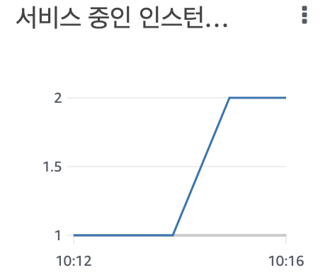

<p align="center">
    
</p>
<p align="center">
  
  
  <a href="https://edu.nextstep.camp/c/R89PYi5H" alt="nextstep atdd">
    
  </a>
  
</p>

<br>

# 인프라공방 샘플 서비스 - 지하철 노선도

<br>

## 🚀 Getting Started

### Install
#### npm 설치
```
cd frontend
npm install
```
> `frontend` 디렉토리에서 수행해야 합니다.

### Usage
#### webpack server 구동
```
npm run dev
```
#### application 구동
```
./gradlew clean build
```
<br>

## 미션

* 미션 진행 후에 아래 질문의 답을 작성하여 PR을 보내주세요.


### 1단계 - 화면 응답 개선하기
1. 성능 개선 결과를 공유해주세요 (Smoke, Load, Stress 테스트 결과)
- 개선 전
  - k6/step1/scenario_smoke.log
  - k6/step1/scenario_load.log
  - k6/step1/scenario_stress.log
- 개선 후
  - k6/step1/scenario_smoke_after.log
  - k6/step1/scenario_load_after.log
  - k6/step1/scenario_stress_after.log

3. 어떤 부분을 개선해보셨나요? 과정을 설명해주세요
- Reverse Proxy 개선
  - gzip 압축
  - 캐싱
  - HTTP2 적용
- Application 개선
  - Spring Redis Cache 적용

---

### 2단계 - 스케일 아웃

Q. 모든 정적 자원에 대해 no-cache, no-store 설정을 한다. 가능한가요?  

A. 가능합니다. 여러 브라우저나 HTTP 1.0 또는 캐시 업체들과의 호환성을 위해 다음과 같은 옵션을 minimum set으로 추가한다고 하네요.
[참고](https://stackoverflow.com/questions/49547/how-do-we-control-web-page-caching-across-all-browsers)

> Cache-Control: no-cache, no-store, must-revalidate  
> Pragma: no-cache  
> Expires: 0

1. Launch Template 링크를 공유해주세요.
- https://ap-northeast-2.console.aws.amazon.com/ec2/v2/home?region=ap-northeast-2#LaunchTemplateDetails:launchTemplateId=lt-0f0adb84a2755ca9c

2. cpu 부하 실행 후 EC2 추가생성 결과를 공유해주세요. (Cloudwatch 캡쳐)

```sh
$ stress -c 2
```

3. 성능 개선 결과를 공유해주세요 (Smoke, Load, Stress 테스트 결과)
- k6/step2/scaleout_smoke.log
- k6/step2/scaleout_load.log
- k6/step2/scaleout_stress.log

---

### 1단계 - 쿼리 최적화

1. 인덱스 설정을 추가하지 않고 아래 요구사항에 대해 1s 이하(M1의 경우 2s)로 반환하도록 쿼리를 작성하세요.

- 활동중인(Active) 부서의 현재 부서관리자 중 연봉 상위 5위안에 드는 사람들이 최근에 각 지역별로 언제 퇴실했는지 조회해보세요. (사원번호, 이름, 연봉, 직급명, 지역, 입출입구분, 입출입시간)

```sql
select
   employee.id,
    employee.last_name,
    employee.first_name,
    salary.annual_income,
    position.position_name,
    out_record.region,
    out_record.record_symbol,
    out_record.recent_time
from employee inner join salary on employee.id = salary.id and salary.end_date = '9999-01-01'
inner join position on employee.id = position.id and position.end_date = '9999-01-01'
inner join (
   select employee_id, record_symbol, region, max(time) as recent_time
   from record
   where record_symbol = 'o'
   and employee_id in (
      select employee_id from (
         select manager.employee_id
         from manager inner join salary on manager.employee_id = salary.id and salary.end_date = '9999-01-01'
         where manager.end_date = '9999-01-01'
         and manager.department_id in (select id from department where note = 'active')
         order by salary.annual_income desc
         limit 5
      ) as top5
   )
   group by employee_id, record_symbol, region
) as out_record
on employee.id = out_record.employee_id
order by employee.id
```

---

### 2단계 - 인덱스 설계

1. 인덱스 적용해보기 실습을 진행해본 과정을 공유해주세요

- [x] Coding as a Hobby 와 같은 결과를 반환하세요.
  - `group by` 시 index full scan

```sql
create index idx_hobby on programmer(hobby);
```

```sql
select
  hobby,
  count(hobby) * 100 / (select count(hobby) from programmer) as rate
from programmer
group by hobby
;
```

- [x] 프로그래머별로 해당하는 병원 이름을 반환하세요. (covid.id, hospital.name)
  - `programmer join covid` 시 index 사용
  - `covid join hospital` 시 index 사용

```sql
alter table programmer add primary key(id);
alter table covid add primary key(id);
alter table hospital add primary key(id);
create index idx_programmer_id on covid(programmer_id);
```

```sql
select
  programmer.id as programmer_id,
  covid.id as covid_id,
  hospital.name as hospital_name
from covid
inner join programmer on covid.programmer_id = programmer.id
inner join hospital on covid.hospital_id = hospital.id
;
```

- [x] 프로그래밍이 취미인 학생 혹은 주니어(0-2년)들이 다닌 병원 이름을 반환하고 user.id 기준으로 정렬하세요. (covid.id, hospital.name, user.Hobby, user.DevType, user.YearsCoding)
  - `programmer join covid` 시 index 사용
  - `covid join hospital` 시 index 사용

```sql
select
  covid.id,
  hospital.name,
  user.Hobby,
  user.DevType,
  user.YearsCoding
from covid
inner join (
  select
    id,
    hobby as Hobby,
    dev_type as DevType,
    years_coding as YearsCoding
  from programmer
  where hobby = 'Yes'
  and (student like 'Yes%' or years_coding = '0-2 years')
) as user on covid.programmer_id = user.id
inner join hospital on covid.hospital_id = hospital.id
;
```

- [x] 서울대병원에 다닌 20대 India 환자들을 병원에 머문 기간별로 집계하세요. (covid.Stay)
  - `programmer join member` 시 index 사용
  - `hospital`을 `name`으로 조회 시 index 사용
  - `hospital join covid` 시 index 사용
  - `covid join programmer` 시 index 사용

```sql
alter table member add primary key(id);
create index idx_name on hospital(name);
create index idx_hospital_id on covid(hospital_id);
```

```sql
select
  covid.Stay
  ,count(user.id) as count
from covid
inner join (
  select programmer.id
  from programmer
  inner join member on programmer.member_id = member.id
  where programmer.country = 'India'
  and member.age between 20 and 29
) as user on covid.programmer_id = user.id
inner join (
  select id
  from hospital
  where name = '서울대병원'
) as seoul_hospital on covid.hospital_id = seoul_hospital.id
group by covid.Stay
;
```

- [x] 서울대병원에 다닌 30대 환자들을 운동 횟수별로 집계하세요. (user.Exercise)
  - `programmer join member` 시 index 사용
  - `hospital`을 `name`으로 조회 시 index 사용
  - `hospital join covid` 시 index 사용
  - `covid join programmer` 시 index 사용

```sql
select
  user.Exercise
  ,count(user.id) as count
from covid
inner join (
  select programmer.id, programmer.exercise
  from programmer
  inner join member on programmer.member_id = member.id
  where member.age between 30 and 39
) as user on covid.programmer_id = user.id
inner join (
  select id
  from hospital
  where name = '서울대병원'
) as seoul_hospital on covid.hospital_id = seoul_hospital.id
group by user.Exercise
;
```

---

### 추가 미션

1. 페이징 쿼리를 적용한 API endpoint를 알려주세요
