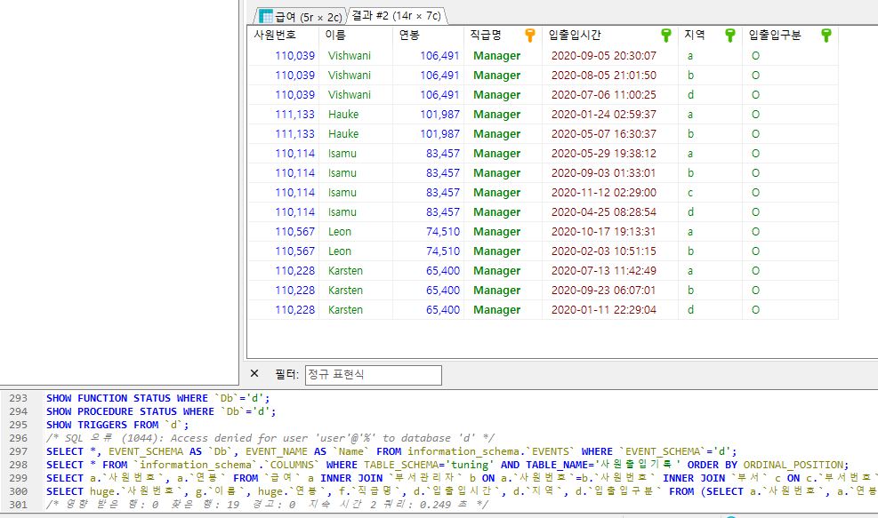
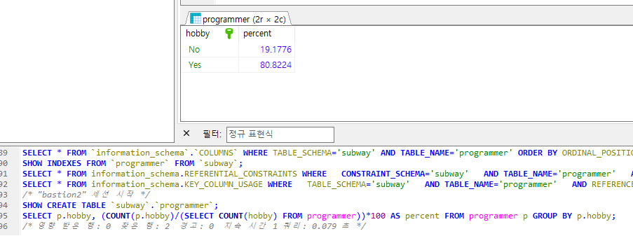
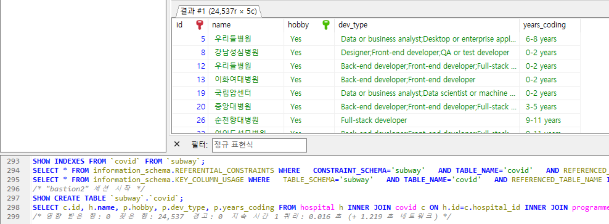
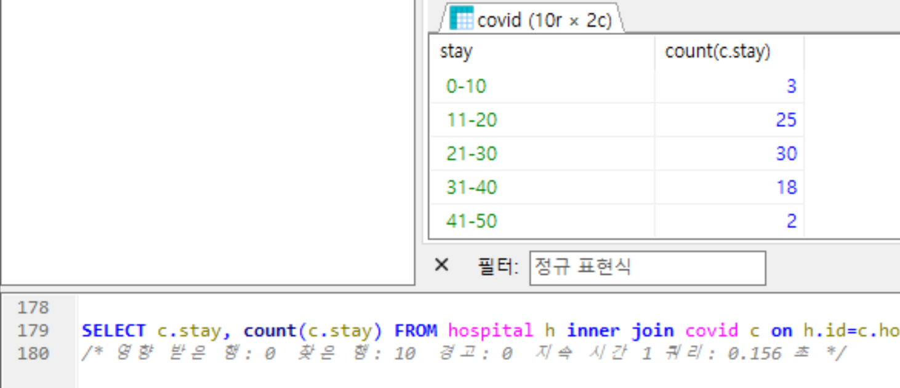
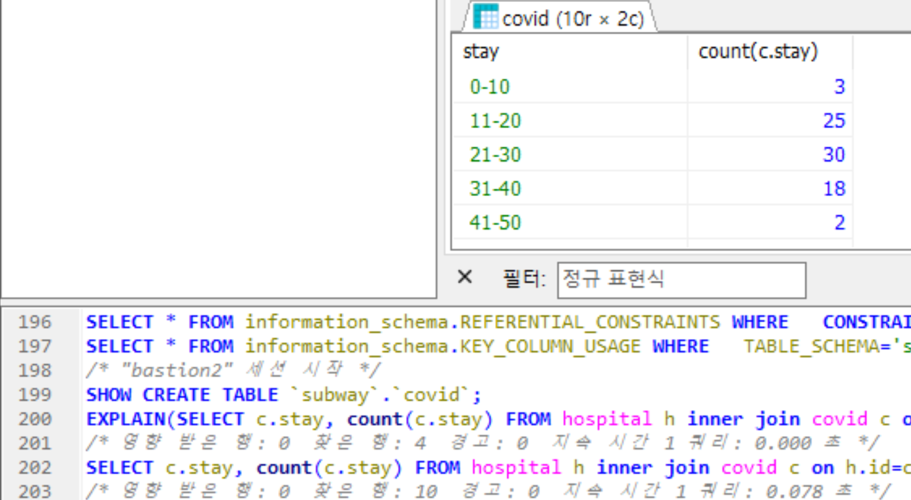
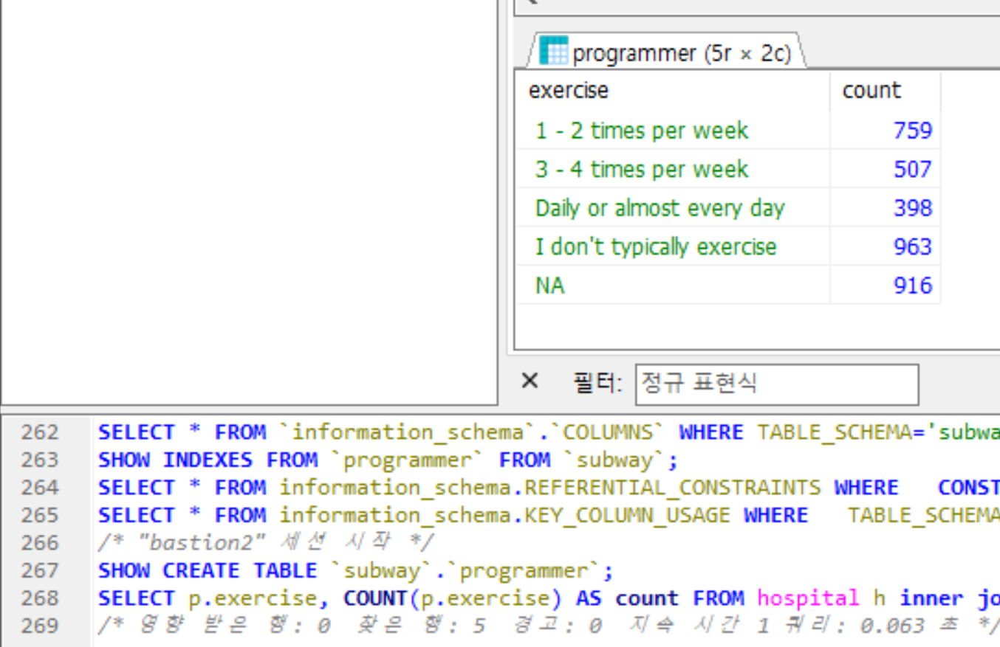

<p align="center">
    
</p>
<p align="center">
  
  
  <a href="https://edu.nextstep.camp/c/R89PYi5H" alt="nextstep atdd">
    
  </a>
  
</p>

<br>

# 인프라공방 샘플 서비스 - 지하철 노선도

<br>

## 🚀 Getting Started

### Install
#### npm 설치
```
cd frontend
npm install
```
> `frontend` 디렉토리에서 수행해야 합니다.

### Usage
#### webpack server 구동
```
npm run dev
```
#### application 구동
```
./gradlew clean build
```
<br>

## 미션

* 미션 진행 후에 아래 질문의 답을 작성하여 PR을 보내주세요.

### 1단계 - 쿼리 최적화

1. 인덱스 설정을 추가하지 않고 아래 요구사항에 대해 1s 이하(M1의 경우 2s)로 반환하도록 쿼리를 작성하세요.

- 활동중인(Active) 부서의 현재 부서관리자 중 연봉 상위 5위안에 드는 사람들이 최근에 각 지역별로 언제 퇴실했는지 조회해보세요. (사원번호, 이름, 연봉, 직급명, 지역, 입출입구분, 입출입시간)
  ```
  SELECT 
    huge.`사원번호`, 
    g.`이름`, 
    huge.`연봉`, 
    f.`직급명`, 
    d.`입출입시간`, 
    d.`지역`, 
    d.`입출입구분` 
  FROM 
    (SELECT 
      a.`사원번호`, 
      a.`연봉`
    FROM 
      `급여` a 
      INNER JOIN `부서관리자` b ON a.`사원번호`=b.`사원번호` 
      INNER JOIN `부서` c ON c.`부서번호`=b.`부서번호` 
    WHERE 
      NOW() 
        BETWEEN a.`시작일자` AND a.`종료일자` 
      AND NOW() 
        BETWEEN b.`시작일자` AND b.`종료일자` 
      AND c.`비고`='active' 
      ORDER by a.`연봉` DESC LIMIT 5) AS huge 
    INNER JOIN `사원출입기록` d ON huge.`사원번호`=d.`사원번호` AND d.`입출입구분`='O' 
    INNER JOIN `직급` f ON huge.`사원번호`=f.`사원번호` AND NOW() BETWEEN f.`시작일자` AND f.`종료일자` 
    INNER JOIN `사원` g ON huge.`사원번호`=g.`사원번호` 
    ORDER BY huge.`연봉` desc;
  ```
  <br>

---

### 2단계 - 인덱스 설계

1. 인덱스 적용해보기 실습을 진행해본 과정을 공유해주세요
   - [ ] 주어진 데이터셋을 활용하여 아래 조회 결과를 100ms 이하로 반환
     - M1의 경우엔 시간 제약사항을 달성하기 어렵습니다. 2배를 기준으로 해보시고 어렵다면, 일단 리뷰요청 부탁드려요
     - [X] Coding as a Hobby 와 같은 결과를 반환하세요.
       - 키 추가
       ```sql
       ALTER TABLE `programmer` 
         ADD INDEX `hobby` (`hobby`);
       ```
       - 결과
       ```sql
       SELECT p.hobby, (COUNT(p.hobby)/(SELECT COUNT(hobby) FROM programmer))*100 AS percent FROM programmer p GROUP BY p.hobby;
       ```
       
     - [X] 프로그래머별로 해당하는 병원 이름을 반환하세요. (covid.id, hospital.name)
     ```sql
     SELECT c.id AS covid_id, h.name FROM hospital h INNER JOIN covid c ON h.id=c.hospital_id WHERE c.programmer_id>=0;
     ```
     
     - [X] 프로그래밍이 취미인 학생 혹은 주니어(0-2년)들이 다닌 병원 이름을 반환하고 user.id 기준으로 정렬하세요. (covid.id, hospital.name, user.Hobby, user.DevType, user.YearsCoding)
       - 키 추가
       ```sql
       ALTER TABLE `programmer`
         ADD INDEX `id_hobby_student_years_coding` (`id`, `hobby`, `student`, `years_coding`),
         ADD UNIQUE INDEX `id` (`id`);
       ALTER TABLE `hospital`
         ADD UNIQUE INDEX `id` (`id`),
         ADD INDEX `id_name` (`id`, `name`);
       ALTER TABLE `covid`
         ADD INDEX `id_hospital_id_programmer_id` (`id`, `hospital_id`, `programmer_id`),
         ADD UNIQUE INDEX `id` (`id`);
       ```
       - 결과
       ```sql
       SELECT 
         c.id, h.name, p.hobby, p.dev_type, p.years_coding 
       FROM 
         hospital h 
           INNER JOIN covid c ON h.id=c.hospital_id 
           INNER JOIN programmer p ON c.programmer_id=p.id 
       WHERE 
         p.id IN (SELECT id FROM programmer WHERE hobby='yes' AND (student LIKE 'yes%' OR years_coding ='0-2 years')) ORDER BY c.id;
       ```
       
     - [X] 서울대병원에 다닌 20대 India 환자들을 병원에 머문 기간별로 집계하세요. (covid.Stay)
       - 키 추가
       ```sql
       ALTER TABLE `member`
         CHANGE COLUMN `id` `id` BIGINT(20) NOT NULL FIRST,
         ADD PRIMARY KEY (`id`),
         ADD INDEX `id_age` (`id`, `age`);
       ALTER TABLE `covid`
         ADD INDEX `id_member_id_stay` (`id`, `member_id`, `stay`);
       ALTER TABLE `hospital`
         CHANGE COLUMN `id` `id` INT(11) NOT NULL DEFAULT NULL FIRST,
         DROP INDEX `id`,
         ADD PRIMARY KEY (`id`);
       ALTER TABLE `covid`
         CHANGE COLUMN `id` `id` BIGINT(20) NOT NULL FIRST,
         DROP INDEX `id`,
         ADD PRIMARY KEY (`id`);
       ALTER TABLE `programmer`
         CHANGE COLUMN `id` `id` BIGINT(20) NOT NULL FIRST,
         DROP INDEX `id`,
         ADD PRIMARY KEY (`id`),
         ADD INDEX `id_country` (`id`, `country`),
         ADD INDEX `country` (`country`);
       ```
       - 결과
       ```sql
       SELECT 
         c.stay, 
         count(c.stay) 
       FROM 
         hospital h inner join covid c on h.id=c.hospital_id and h.name="서울대병원" 
         INNER JOIN programmer p ON p.id=c.programmer_id AND p.country='India' 
         INNER JOIN member m ON m.id=c.member_id AND floor(m.age/10)=2 
       GROUP BY c.stay;
       ```
       
       -> 100ms로 줄지 않아 플랜 조회
       ```sql
       ALTER TABLE `covid`
         ADD INDEX `hospital_id` (`hospital_id`);
       ```
       - 2차 결과
       
     - [X] 서울대병원에 다닌 30대 환자들을 운동 횟수별로 집계하세요. (user.Exercise)
     ```sql
     ALTER TABLE `programmer`
       ADD INDEX `exercise` (`exercise`);

     SELECT 
       p.exercise, 
       COUNT(p.exercise) AS count 
     FROM 
       hospital h 
       inner join covid c on h.id=c.hospital_id and h.name="서울대병원" 
       INNER JOIN programmer p ON p.id=c.programmer_id 
     GROUP BY p.exercise;
     ```
     
---

### 추가 미션

1. 페이징 쿼리를 적용한 API endpoint를 알려주세요
