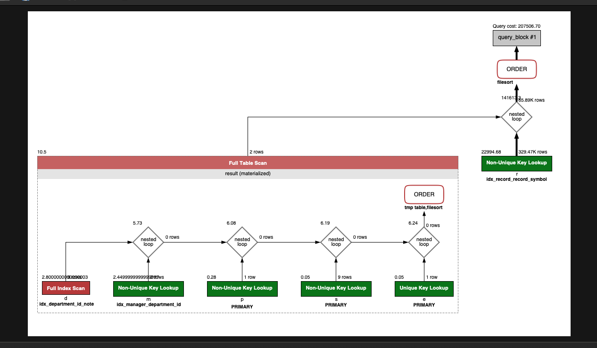

<p align="center">
    
</p>
<p align="center">
  
  
  <a href="https://edu.nextstep.camp/c/R89PYi5H" alt="nextstep atdd">
    
  </a>
  
</p>

<br>

# 인프라공방 샘플 서비스 - 지하철 노선도

<br>

## 🚀 Getting Started

### Install
#### npm 설치
```
cd frontend
npm install
```
> `frontend` 디렉토리에서 수행해야 합니다.

### Usage
#### webpack server 구동
```
npm run dev
```
#### application 구동
```
./gradlew clean build
```
<br>

## 미션

* 미션 진행 후에 아래 질문의 답을 작성하여 PR을 보내주세요.


### 1단계 - 화면 응답 개선하기

1. 성능 개선 결과를 공유해주세요 (Smoke, Load, Stress 테스트 결과)

테스트 결과 이미지 : /performance

**http_req_duration**

| 종류     | Before  | After   |
|--------|---------|---------|
| smoke  | 5.27ms  | 1.67ms  |
| load   | 1.60ms  | 1.64ms  |
| stress | 78.89ms | 32.55ms |


2. 어떤 부분을 개선해보셨나요? 과정을 설명해주세요

- Contents-encoding
- gzip 사용하여 이미지 압축

```text
gzip on; ## http 블록 수준에서 gzip 압축 활성화
gzip_comp_level 9;
gzip_vary on;
gzip_types text/plain text/css application/json application/x-javascript application/javascript text/xml application/xml application/rss+xml text/javascript image/svg+xml application/vnd.ms-fontobject application/x-font-ttf font/opentype;
```

```text
location ~* \.(?:css|js|gif|png|jpg|jpeg)$ {
    proxy_pass http://app;
    
    ## 캐시 설정 적용 및 헤더에 추가
    # 캐시 존을 설정 (캐시 이름)
    proxy_cache mycache;
    # X-Proxy-Cache 헤더에 HIT, MISS, BYPASS와 같은 캐시 적중 상태정보가 설정
    add_header X-Proxy-Cache $upstream_cache_status;
    # 200 302 코드는 20분간 캐싱
    proxy_cache_valid 200 302 10m;
    # 만료기간을 1 달로 설정
    expires 1M;
    # access log 를 찍지 않는다.
    access_log off;
}
```

- cache 적용

```text
  ## Proxy 캐시 파일 경로, 메모리상 점유할 크기, 캐시 유지기간, 전체 캐시의 최대 크기 등 설정
  proxy_cache_path /tmp/nginx levels=1:2 keys_zone=mycache:10m inactive=10m max_size=200M;
```   

- TLS, HTTP/2 설정

- Spring Data Cache 적용
- 사용자가 가장 많이 요청할 것으로 추측되는 요청 `메인 페이지 - 경로 검색 페이지 - 경로 검색 요청` 에 대한 캐시 적용
  - 지하철 호선 목록
  - 다익스트라 알고리즘을 이용해 최단거리 탐색
  - 지하철 역 조회


---

### 2단계 - 스케일 아웃

#### 요구사항

- [X] springboot에 HTTP Cache, gzip 설정하기
- [X] Launch Template 작성하기
- [X] Auto Scaling Group 생성하기
- [X] Smoke, Load, Stress 테스트 후 결과를 기록

#### 인증서 설정하기

```sh
sudo cp /etc/letsencrypt/live/nextstep.o-r.kr/cert.pem cert.pem
sudo cp /etc/letsencrypt/live/nextstep.o-r.kr/chain.pem chain.pem
sudo cp /etc/letsencrypt/live/nextstep.o-r.kr/private.pem private.pem
```

시작 템플릿 스크립트

```text
#!/bin/bash

sudo apt-get update
sudo apt install unzip 
curl "https://awscli.amazonaws.com/awscli-exe-linux-x86_64.zip" -o "awscliv2.zip"
unzip awscliv2.zip
sudo ./aws/install

sudo mkdir -p /home/ubuntu/nextstep/scripts
sudo chown ubuntu.ubuntu -R /home/ubuntu/nextstep
sudo -i -u ubuntu aws s3 cp s3://nextstep-camp-pro/seonghyeoklee-deploy.sh /home/ubuntu/nextstep/scripts

sudo apt update
sudo apt install -y default-jre
sudo apt install -y default-jdk

sudo -i -u ubuntu chmod 755 /home/ubuntu/nextstep/scripts/seonghyeoklee-deploy.sh
sudo -i -u ubuntu /bin/bash /home/ubuntu/nextstep/scripts/seonghyeoklee-deploy.sh step2
```

1. Launch Template 링크를 공유해주세요.

https://ap-northeast-2.console.aws.amazon.com/ec2/home?region=ap-northeast-2#LaunchTemplateDetails:launchTemplateId=lt-041d861683ba4c81f

2. cpu 부하 실행 후 EC2 추가생성 결과를 공유해주세요. (Cloudwatch 캡쳐)

```sh
$ stress -c 2
```

3. 성능 개선 결과를 공유해주세요 (Smoke, Load, Stress 테스트 결과)

아래 디렉토리 이하에 테스트 결과 공유 드립니다.

/autoscaling 


---

### 3단계 - 쿼리 최적화

1. 인덱스 설정을 추가하지 않고 아래 요구사항에 대해 1s 이하(M1의 경우 2s)로 반환하도록 쿼리를 작성하세요.

```sql
-- 가능하면 적은 결과가 반환될 것으로 예상되는 테이블을 드라이빙 테이블로 선정
select m.employee_id, e.last_name
from department d
         inner join manager m
                    on d.id = m.department_id
         inner join employee e
                    on e.id = m.employee_id
where m.end_date = convert('9999-01-01', date)
  and d.note = 'ACTIVE';
```

- 활동중인(Active) 부서의 현재 부서관리자 중 연봉 상위 5위안에 드는 사람들이 최근에 각 지역별로 언제 퇴실했는지 조회해보세요. (사원번호, 이름, 연봉, 직급명, 지역, 입출입구분, 입출입시간)
  - [X] 서브쿼리보단 조인문을 활용
  - [X] 모수 테이블 크기를 줄이기

```sql
select result.employee_id as '사원번호',
        result.last_name as '이름',
        result.annual_income as '연봉',
        result.position_name as '직급명',
        r.region as '지역',
        r.door as '입출입구분',
        r.time as '입출입시간'
from (select m.employee_id,
             e.last_name,
             s.annual_income,
             p.position_name
      from department d
             inner join manager m
                        on d.id = m.department_id
             inner join employee e
                        on e.id = m.employee_id
             inner join position p
                        on p.id = m.employee_id
                          and p.end_date = convert('9999-01-01', date)
             inner join salary s
                        on s.id = m.employee_id
                          and s.end_date = convert('9999-01-01', date)
      where m.end_date = convert('9999-01-01', date)
        and d.note = 'ACTIVE'
      order by annual_income desc
        limit 5) result
       inner join record r
                  on r.employee_id = result.employee_id
where r.record_symbol = 'O'
order by result.annual_income desc;
```



---

### 4단계 - 인덱스 설계

1. 인덱스 적용해보기 실습을 진행해본 과정을 공유해주세요

---

### 추가 미션

1. 페이징 쿼리를 적용한 API endpoint를 알려주세요
