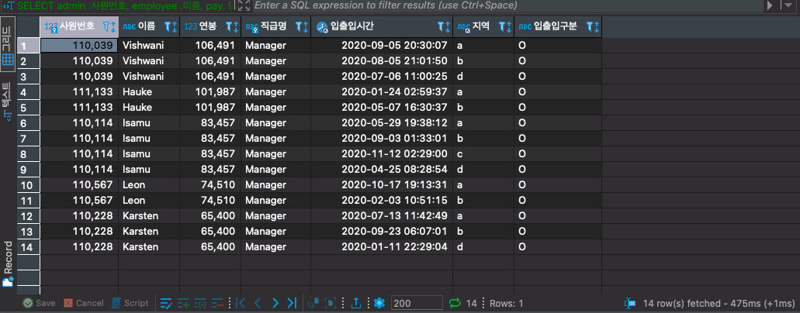
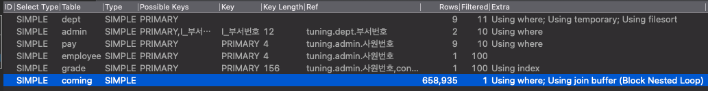
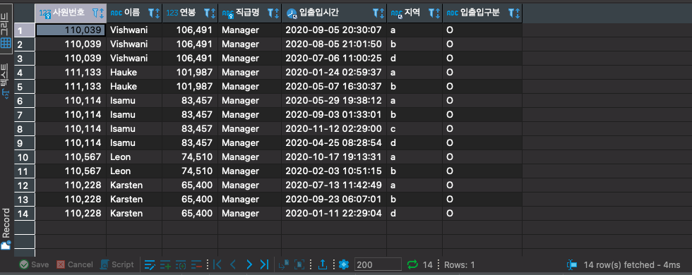
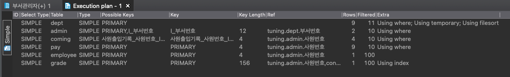

<p align="center">
    
</p>
<p align="center">
  
  
  <a href="https://edu.nextstep.camp/c/R89PYi5H" alt="nextstep atdd">
    
  </a>
  
</p>

<br>

# 인프라공방 샘플 서비스 - 지하철 노선도

<br>

## 🚀 Getting Started

### Install
#### npm 설치
```
cd frontend
npm install
```
> `frontend` 디렉토리에서 수행해야 합니다.

### Usage
#### webpack server 구동
```
npm run dev
```
#### application 구동
```
./gradlew clean build
```
<br>

## 미션

* 미션 진행 후에 아래 질문의 답을 작성하여 PR을 보내주세요.

### 1단계 - 화면 응답 개선하기
1. 성능 개선 결과를 공유해주세요 (Smoke, Load, Stress 테스트 결과)

- 조회 로직이 많이 일어나는 경로찾기를 기준으로 하여 성능 측정 및 개선을 하였음

- 경로 찾기
    - **개선 전**
      - [smoke](./k6/result/before/smoke.md)
        -    ✓ http_req_duration : p(95)=130.28ms
      - [load](./k6/result/before/load.md)
        -    ✓ http_req_duration : p(95)=138.16ms
      - [stress](./k6/result/before/stress.md)
        -    ✓ http_req_duration : p(95)=114.43ms
    - **개선 후**
      ####- Revere Proxy 개선
        - [smoke](./k6/result/nginx/smoke.md)
          -    ✓ http_req_duration : p(95)=152.24ms
        - [load](./k6/result/nginx/load.md)
            -   ✓ http_req_duration :p(95)=100.95ms
        - [stress](./k6/result/nginx/stress.md)
            -    ✓ http_req_duration : p(95)=122.16ms
          
        ####- Redis Cache 추가
        - [smoke](./k6/result/redis/smoke.md)
          -    ✓ http_req_duration :  p(95)=17.06ms
        - [load](./k6/result/redis/load.md)
          -    ✓ http_req_duration :  p(95)=14.08ms
        - [stress](./k6/result/redis/stress.md)
          -    ✓ http_req_duration :  p(95)=14.8ms
         ####- Thread Pool Config 추가
        - [smoke](./k6/result/threadpool/smoke.md)
          -    ✓ http_req_duration :  p(95)=15.3ms
        - [load](./k6/result/threadpool/load.md)
          -    ✓ http_req_duration :  p(95)=14.52ms
        - [stress](./k6/result/threadpool/stress.md)    
          -    ✓ http_req_duration : p(95)=13.78ms


2. 어떤 부분을 개선해보셨나요? 과정을 설명해주세요
    
    -  Reverse Proxy 정적 파일 경량화 및 http2 적용
        -    성능 향상을 기대했으나, 성능 향상이 이루어지지 않고 결과에 따라 성능이 낮아진 결과도 보임
    -   Redis 캐시 적용
        -   DB 커넥션이 발생시키지 않고 메모리에 저장된 캐시를 사용하여, 테스트의 횟수가 늘어날 수록 압도적인 성능 향상을 보여주 었음
    -   Thread Pool 설정 적용
        - 많은 조회가 일어나는 경로 찾기에 비동기로 적용 하였으나, Redis 캐시에 비해 성능 향상면에서 큰 효과는 없었음
    
---

### 2단계 - 조회 성능 개선하기
1. 인덱스 적용해보기 실습을 진행해본 과정을 공유해주세요

- 쿼리 작성만으로 1s 이하로 반환한다.
    - 실행 결과 : 475ms

```sql

                SELECT
                    admin.사원번호
                    , employee.이름
                    , pay.연봉
                    , position.직급명
                    , access.입출입시간
                    , access.지역
                    , access.입출입구분
                FROM 부서 dept
                INNER JOIN 부서관리자 as admin
                    ON admin.부서번호 = dept.부서번호
                    AND admin.종료일자 = '9999-01-01'
                INNER JOIN 사원 as employee 
                    ON employee.사원번호 = admin.사원번호
                INNER JOIN 직급 as position 
                    ON position.사원번호 = admin.사원번호
                    AND position.종료일자 = '9999-01-01'
                INNER JOIN 사원출입기록 as access 
                    ON access.사원번호 = admin.사원번호
                    AND access.입출입구분 = 'O'
                INNER JOIN 급여 as pay 
                    ON pay.사원번호 = admin.사원번호
                    AND pay.종료일자 = '9999-01-01'
                WHERE dept.비고 = 'active'
                ORDER BY pay.연봉 desc, access.지역;

```



- 인덱스 설정을 추가하여 50ms 이하로 반환한다.
    - 실행 결과 : 4ms 



- 출입구분 테이블이 Full Scan 됨
- 사원출입기록의 사원번호에 Index를 설정





2. 페이징 쿼리를 적용한 API endpoint를 알려주세요

