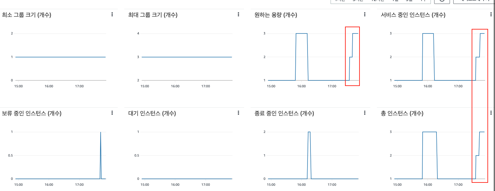

<p align="center">
    
</p>
<p align="center">
  
  
  <a href="https://edu.nextstep.camp/c/R89PYi5H" alt="nextstep atdd">
    
  </a>
  
</p>

<br>

# 인프라공방 샘플 서비스 - 지하철 노선도

<br>

## 🚀 Getting Started

### Install
#### npm 설치
```
cd frontend
npm install
```
> `frontend` 디렉토리에서 수행해야 합니다.

### Usage
#### webpack server 구동
```
npm run dev
```
#### application 구동
```
./gradlew clean build
```
<br>

## 미션

* 미션 진행 후에 아래 질문의 답을 작성하여 PR을 보내주세요.


### 1단계 - 화면 응답 개선하기
1. 성능 개선 결과를 공유해주세요 (Smoke, Load, Stress 테스트 결과)
    * [before](monitoring/check/before)
    * [after](monitoring/check/after)

2. 어떤 부분을 개선해보셨나요? 과정을 설명해주세요
    * 기존 nginx-proxy 에 gzip/cache 설정을 추가하였습니다.
    * redis 를 연동하여 같은 조건으로 데이터 조회 시 캐싱된 데이터로 응답하도록 설정하였습니다.

---

### 2단계 - 스케일 아웃

* [x] springboot 에 HTTP Cache, gzip 설정하기
* [x] Launch Template 작성하기
* [x] Auto Scaling Group 생성하기
* [x] Smoke, Load, Stress 테스트 후 결과를 기록

1. Launch Template 링크를 공유해주세요.

https://ap-northeast-2.console.aws.amazon.com/ec2/v2/home?region=ap-northeast-2#LaunchTemplateDetails:launchTemplateId=lt-04bd43afef15f0baf

2. cpu 부하 실행 후 EC2 추가생성 결과를 공유해주세요. (Cloudwatch 캡쳐)



```sh
$ stress -c 2
```

3. 성능 개선 결과를 공유해주세요 (Smoke, Load, Stress 테스트 결과)

* [load](monitoring/check/scale-out/load)
* [smoke](monitoring/check/scale-out/smoke)
* [stress](monitoring/check/scale-out/stress)

---

### 1단계 - 쿼리 최적화

1. 인덱스 설정을 추가하지 않고 아래 요구사항에 대해 1s 이하(M1의 경우 2s)로 반환하도록 쿼리를 작성하세요.

- 활동중인(Active) 부서의 현재 부서관리자 중 연봉 상위 5위안에 드는 사람들이 최근에 각 지역별로 언제 퇴실했는지 조회해보세요. (사원번호, 이름, 연봉, 직급명, 지역, 입출입구분, 입출입시간)

* [x] 활동중인(Active) 부서의 현재 부서관리자(manager) 중 연봉 상위 5위안에 드는 사람들이 최근에 각 지역별로 언제 퇴실(O)했는지 조회해보세요.
    * (사원번호, 이름, 연봉, 직급명, 지역, 입출입구분, 입출입시간)
* [x] 인덱스 설정을 추가하지 않고 1s 이하로 반환합니다.

```sql
select e.id as '사원번호',
	   e.last_name as '이름',
       t.annual_income as '연봉',
       p.position_name as '직급명',
       r.time as '입출입시간',
       r.region as '지역',
       r.record_symbol as '입출입구분'
from employee e
join (
    select m.employee_id, s.annual_income
    from department d
	join manager m on d.id = m.department_id
    join salary s on m.employee_id = s.id
	where d.note = 'active'
    and m.start_date < now() and m.end_date > now()
    and s.start_date < now() and s.end_date > now()
    order by s.annual_income desc
    limit 5
) t on e.id = t.employee_id
join position p on e.id = p.id
join record r on e.id = r.employee_id
and p.start_date < now() and p.end_date > now()
and r.record_symbol = 'O';
```

---

### 2단계 - 인덱스 설계

1. 인덱스 적용해보기 실습을 진행해본 과정을 공유해주세요

---

### 추가 미션

1. 페이징 쿼리를 적용한 API endpoint를 알려주세요
