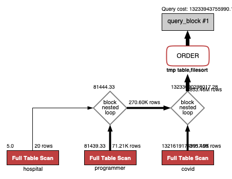
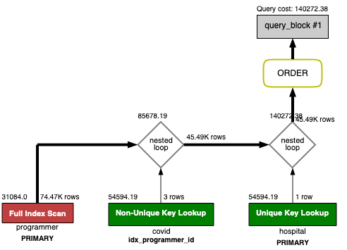
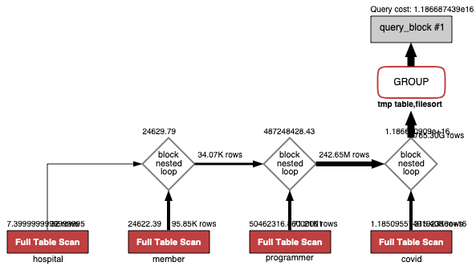
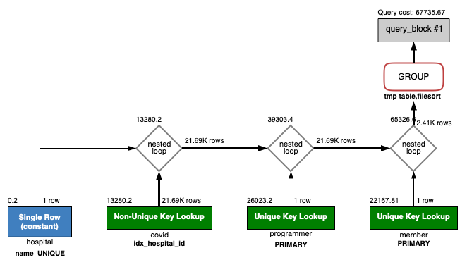

<p align="center">
    
</p>
<p align="center">
  
  
  <a href="https://edu.nextstep.camp/c/R89PYi5H" alt="nextstep atdd">
    
  </a>
  
</p>

<br>

# 인프라공방 샘플 서비스 - 지하철 노선도

<br>

## 🚀 Getting Started

### Install
#### npm 설치
```
cd frontend
npm install
```
> `frontend` 디렉토리에서 수행해야 합니다.

### Usage
#### webpack server 구동
```
npm run dev
```
#### application 구동
```
./gradlew clean build
```
<br>

## 미션

* 미션 진행 후에 아래 질문의 답을 작성하여 PR을 보내주세요.

### 1단계 - 화면 응답 개선하기
1. 성능 개선 결과를 공유해주세요 (Smoke, Load, Stress 테스트 결과)

2. 어떤 부분을 개선해보셨나요? 과정을 설명해주세요

---

### 2단계 - 조회 성능 개선하기
1. 인덱스 적용해보기 실습을 진행해본 과정을 공유해주세요

A. 쿼리 최적화
- 활동중인(Active) 부서의 현재 부서관리자 중 연봉 상위 5위안에 드는 사람들이 최근에 각 지역별로 언제 퇴실했는지 조회해보세요.
  (사원번호, 이름, 연봉, 직급명, 지역, 입출입구분, 입출입시간)
    <details>
      <summary> 조회 쿼리(0.409s) </summary>
  
          select 상위연봉자.사원번호, 상위연봉자.이름, 상위연봉자.연봉, 상위연봉자.직급명, 사원출입기록.입출입시간, 사원출입기록.지역, 사원출입기록.입출입구분
          from 사원출입기록
          join
          (
              select 부서관리자.사원번호, 사원.이름, 급여.연봉, 직급.직급명
              from 부서관리자
                  join 부서 on 부서관리자.부서번호 = 부서.부서번호 and 부서.비고 = 'active'
                  join 급여 on  부서관리자.사원번호 = 급여.사원번호 and 급여.종료일자 = '99990101'
                  join 사원 on 급여.사원번호 = 사원.사원번호
                  join 직급 on 사원.사원번호 = 직급.사원번호 and 직급.종료일자 = '99990101'
              where 부서관리자.종료일자 = '99990101'
              order by 급여.연봉 desc limit 5) as 상위연봉자
          on 상위연봉자.사원번호 = 사원출입기록.사원번호
          where 사원출입기록.입출입구분 = 'O'
          order by 상위연봉자.연봉 desc;

    </details>
    <details>
      <summary> 인덱스 생성 </summary>

        create index idx_사원번호 on tuning.사원출입기록(사원번호)

    </details>
    <details>
        <summary> 인덱스 적용후 조회 (0.003s) </summary>
    <div markdown="1">
  
    
    </div>
    </details>

B. 인덱스 설계
- Coding as a Hobby 와 같은 결과를 반환하세요.
  <details>
    <summary>쿼리</summary>

        select hobby, concat(round(count(hobby) / (select count(id) from programmer) * 100, 1), '%') as percent
        from programmer
        group by hobby
        order by hobby desc;
  </details>
  <details>
        <summary>수정전 (1.280s)</summary>
    <div markdown="1">
  
  
    </div>
  </details>
  <details>
    <summary>인덱스 반영 후 (0.072s)</summary>
  
        alter table programmer modify column id bigint primary key;
        create index idx_hobby on programmer (hobby);
        alter table programmer modify column id bigint primary key;
  <div markdown="1">

  
  </div>
  </details>


- 프로그래머별로 해당하는 병원 이름을 반환하세요. (covid.id, hospital.name)
  <details>
    <summary> 쿼리 </summary>
    
        select covid.id, hospital.name
        from programmer
        inner join covid on programmer.id = covid.programmer_id
        inner join hospital on covid.hospital_id = hospital.id;
    </details>
    <details>
        <summary>수정전 (0.094s) </summary>
    <div markdown="1">

  
    </div>
    </details>
    <details>
      <summary> 인덱스 반영 후 (0.016s) </summary>
      
        alter table programmer modify column id bigint primary key;
        alter table hospital modify column id bigint primary key;
        create index idx_programmer_id on covid (programmer_id);
        create index idx_hospital_id on covid (hospital_id);
      
    <div markdown="1">

  
    </div>
    </details>


- 프로그래밍이 취미인 학생 혹은 주니어(0-2년)들이 다닌 병원 이름을 반환하고 user.id 기준으로 정렬하세요. (covid.id, hospital.name, user.Hobby, user.DevType, user.YearsCoding)
  <details>
    <summary>쿼리</summary>

      select covid.id, hospital.name, programmer.hobby, programmer.dev_type, programmer.years_coding pro
      from programmer
      inner join covid on programmer.id = covid.programmer_id
      inner join hospital on covid.hospital_id = hospital.id
      where hobby = 'yes' or years_coding = '0-2 years'
      order by programmer.id;
  </details>
  <details>
    <summary> 수정전 </summary>
    <div markdown="1">

  
    </div>
  </details>

  <details>
    <summary>인덱스 반영 후(0.0094s)</summary>

      alter table programmer modify column id bigint primary key;
      alter table hospital modify column id bigint primary key;
      create index idx_programmer_id on covid (programmer_id);
      create index idx_hospital_id on covid (hospital_id);
    <div markdown="1">

  
    </div>
  </details>


- 서울대병원에 다닌 20대 India 환자들을 병원에 머문 기간별로 집계하세요. (covid.Stay)
  <details>
    <summary> 쿼리 </summary>
    
      select covid.stay, count(member.id) count
      from programmer
      inner join member on programmer.member_id = member.id
      inner join covid on programmer.id = covid.programmer_id
      inner join hospital on covid.hospital_id = hospital.id
      where country = 'india'
      and member.age >= 20 and member.age <= 29
      and hospital.name = '서울대병원'
      group by covid.stay;
  </details>
  <details>
    <summary>수정전</summary>
    <div markdown="1">
  
  
    </div>
  </details>

  <details>
    <summary>인덱스 반영 후 (0.063s)</summary>

      alter table programmer modify column id bigint primary key;
      alter table hospital modify column id bigint primary key;
      create index idx_programmer_id on covid (programmer_id);
      create index idx_hospital_id on covid (hospital_id);
      create index idx_country_id_member_id on programmer (country, id, member_id);
      ALTER TABLE `subway`.`hospital` ADD UNIQUE INDEX `name_UNIQUE` (`name` ASC);
      ALTER TABLE `subway`.`member` CHANGE COLUMN `id` `id` BIGINT(20) NOT NULL ,ADD PRIMARY KEY (`id`);
    
  <div markdown="1">

  
  </div>
  </details>


- 서울대병원에 다닌 30대 환자들을 운동 횟수별로 집계하세요. (user.Exercise)
  <details>
    <summary>쿼리</summary>

      select programmer.exercise, count(member.id) count
      from programmer
      inner join member on programmer.member_id = member.id
      inner join covid on programmer.id = covid.programmer_id
      inner join hospital on covid.hospital_id = hospital.id
      where hospital.name = '서울대병원'
      and member.age >= 30 and member.age <= 39
      group by programmer.exercise;

  </details>
  <details>
    <summary>수정전</summary>
    <div markdown="1">
  
  
    </div>
  </details>
  <details>
    <summary>인덱스 반영 후 (0.098s)</summary>

      alter table programmer modify column id bigint primary key;
      alter table hospital modify column id bigint primary key;
      create index idx_programmer_id on covid (programmer_id);
      create index idx_member_id on programmer (member_id);
      create index idx_hospital_id on covid (hospital_id);
      create index idx_country_id_member_id on programmer (country, id, member_id);
      create index idx_age on member (age);
      ALTER TABLE `subway`.`hospital` ADD UNIQUE INDEX `name_UNIQUE` (`name` ASC);
      ALTER TABLE `subway`.`member` CHANGE COLUMN `id` `id` BIGINT(20) NOT NULL ,ADD PRIMARY KEY (`id`);

  <div markdown="1">

  
  </div>
  </details>

3. 페이징 쿼리를 적용한 API endpoint를 알려주세요

