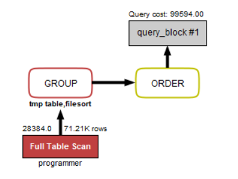
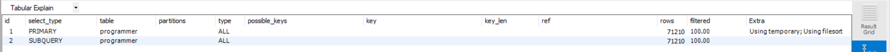
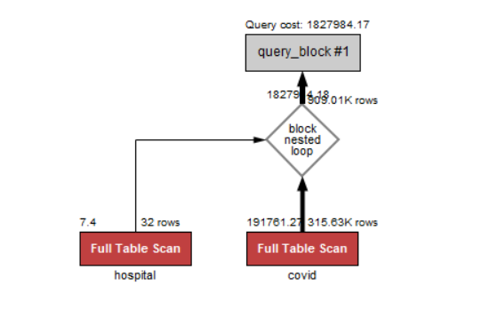
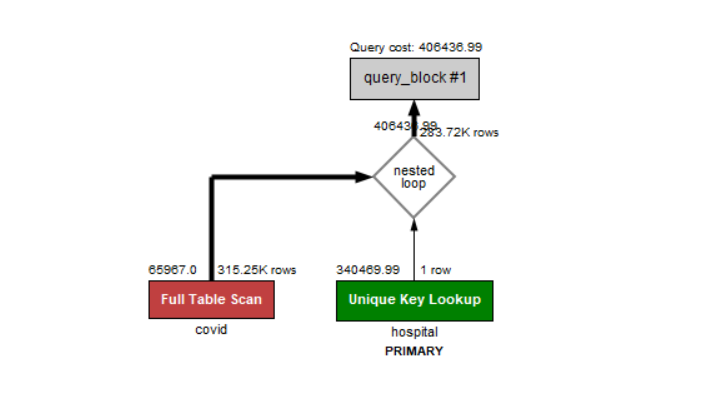
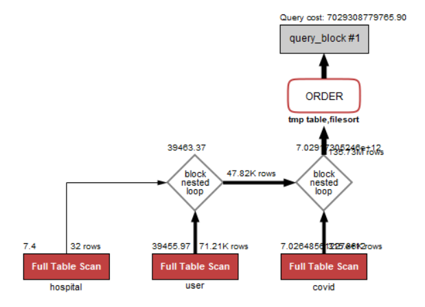
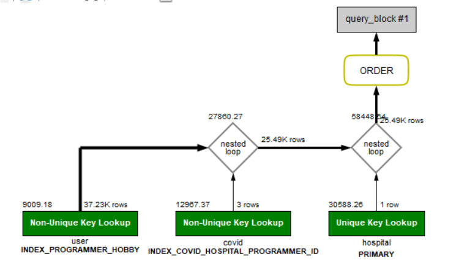
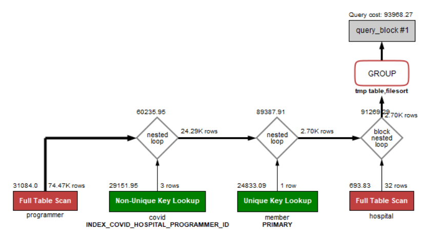
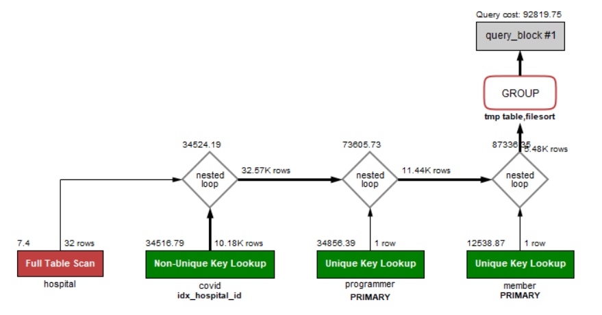
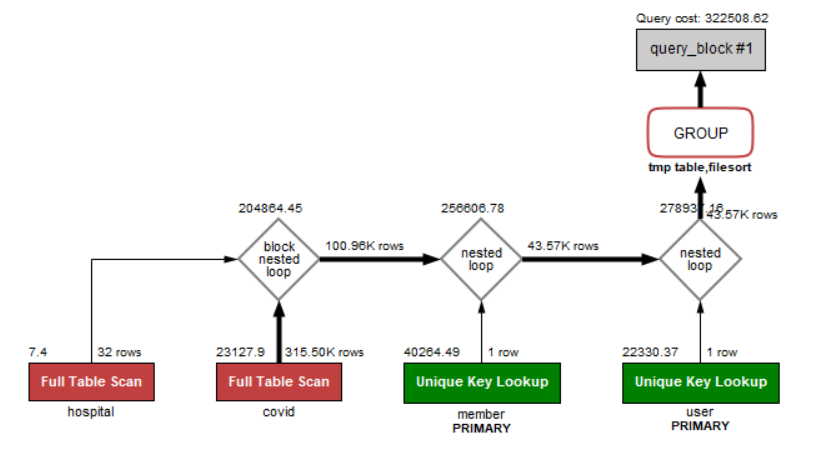
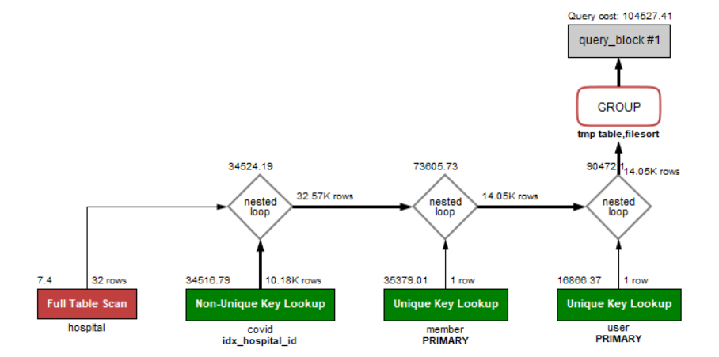

<p align="center">
    
</p>
<p align="center">
  
  
  <a href="https://edu.nextstep.camp/c/R89PYi5H" alt="nextstep atdd">
    
  </a>
  
</p>

<br>

# 인프라공방 샘플 서비스 - 지하철 노선도

<br>

## 🚀 Getting Started

### Install
#### npm 설치
```
cd frontend
npm install
```
> `frontend` 디렉토리에서 수행해야 합니다.

### Usage
#### webpack server 구동
```
npm run dev
```
#### application 구동
```
./gradlew clean build
```
<br>

## 미션

* 미션 진행 후에 아래 질문의 답을 작성하여 PR을 보내주세요.

### 1단계 - 화면 응답 개선하기
1. 성능 개선 결과를 공유해주세요 (Smoke, Load, Stress 테스트 결과)

#### [성능 개선 전] Smoke, Load, Stress 테스트 결과
#### 1. 메인 페이지
<details><summary>smoke test 스크립트 실행 결과 보기</summary>

```bash
          /\      |‾‾| /‾‾/   /‾‾/
     /\  /  \     |  |/  /   /  /
    /  \/    \    |     (   /   ‾‾\
   /          \   |  |\  \ |  (‾)  |
  / __________ \  |__| \__\ \_____/ .io

execution: local
script: smoke.js
output: -

scenarios: (100.00%) 1 scenario, 1 max VUs, 40s max duration (incl. graceful stop):
* default: 1 looping VUs for 10s (gracefulStop: 30s)


running (10.0s), 0/1 VUs, 3248 complete and 0 interrupted iterations
default ✓ [======================================] 1 VUs  10s

     ✓ 메인페이지 응답 결과 ===>

     checks.........................: 100.00% ✓ 3248       ✗ 0
     data_received..................: 4.1 MB  410 kB/s
     data_sent......................: 395 kB  40 kB/s
     http_req_blocked...............: avg=18.05µs min=3.51µs  med=4.28µs  max=30.05ms  p(90)=4.77µs  p(95)=5.3µs
     http_req_connecting............: avg=1µs     min=0s      med=0s      max=1.27ms   p(90)=0s      p(95)=0s
✓ http_req_duration..............: avg=2.94ms  min=1.96ms  med=2.9ms   max=12.86ms  p(90)=3.61ms  p(95)=3.98ms
{ expected_response:true }...: avg=2.94ms  min=1.96ms  med=2.9ms   max=12.86ms  p(90)=3.61ms  p(95)=3.98ms
http_req_failed................: 0.00%   ✓ 0          ✗ 3248
http_req_receiving.............: avg=54.96µs min=31.73µs med=49.75µs max=1.62ms   p(90)=72.36µs p(95)=91.19µs
http_req_sending...............: avg=13.43µs min=9.27µs  med=11.98µs max=378.23µs p(90)=14.93µs p(95)=21.24µs
http_req_tls_handshaking.......: avg=8.71µs  min=0s      med=0s      max=16.98ms  p(90)=0s      p(95)=0s
http_req_waiting...............: avg=2.87ms  min=1.89ms  med=2.83ms  max=12.79ms  p(90)=3.55ms  p(95)=3.91ms
http_reqs......................: 3248    324.754115/s
iteration_duration.............: avg=3.06ms  min=2.07ms  med=3ms     max=37.38ms  p(90)=3.72ms  p(95)=4.09ms
iterations.....................: 3248    324.754115/s
vus............................: 1       min=1        max=1
vus_max........................: 1       min=1        max=1

```
</details>

<details><summary>load test 스크립트 실행 결과 보기</summary>

```bash
          /\      |‾‾| /‾‾/   /‾‾/
     /\  /  \     |  |/  /   /  /
    /  \/    \    |     (   /   ‾‾\
   /          \   |  |\  \ |  (‾)  |
  / __________ \  |__| \__\ \_____/ .io

  execution: local
     script: load.js
     output: -

  scenarios: (100.00%) 1 scenario, 50 max VUs, 1m25s max duration (incl. graceful stop):
           * default: Up to 50 looping VUs for 55s over 5 stages (gracefulRampDown: 30s, gracefulStop: 30s)


running (0m55.0s), 00/50 VUs, 62124 complete and 0 interrupted iterations
default ✓ [======================================] 00/50 VUs  55s

     ✓ 메인페이지 응답 결과 ===>

     checks.........................: 100.00% ✓ 62124       ✗ 0
     data_received..................: 79 MB   1.4 MB/s
     data_sent......................: 7.6 MB  137 kB/s
     http_req_blocked...............: avg=52.3µs   min=2.62µs  med=4.08µs  max=96.95ms  p(90)=5.37µs   p(95)=9.77µs
     http_req_connecting............: avg=4.12µs   min=0s      med=0s      max=19.94ms  p(90)=0s       p(95)=0s
   ✓ http_req_duration..............: avg=15.78ms  min=1.6ms   med=7.38ms  max=106.69ms p(90)=45.39ms  p(95)=55.61ms
       { expected_response:true }...: avg=15.78ms  min=1.6ms   med=7.38ms  max=106.69ms p(90)=45.39ms  p(95)=55.61ms
     http_req_failed................: 0.00%   ✓ 0           ✗ 62124
     http_req_receiving.............: avg=117.56µs min=19.77µs med=38.73µs max=54.52ms  p(90)=101.88µs p(95)=253.12µs
     http_req_sending...............: avg=46.28µs  min=7.43µs  med=12.17µs max=24.4ms   p(90)=29.1µs   p(95)=54.99µs
     http_req_tls_handshaking.......: avg=33.15µs  min=0s      med=0s      max=82.55ms  p(90)=0s       p(95)=0s
     http_req_waiting...............: avg=15.61ms  min=1.55ms  med=7.2ms   max=106.64ms p(90)=45.24ms  p(95)=55.46ms
     http_reqs......................: 62124   1129.423893/s
     iteration_duration.............: avg=16.08ms  min=1.7ms   med=7.71ms  max=180.67ms p(90)=45.71ms  p(95)=55.92ms
     iterations.....................: 62124   1129.423893/s
     vus............................: 1       min=1         max=49
     vus_max........................: 50      min=50        max=50

```
</details>

<details><summary>stress test 스크립트 실행 결과 보기</summary>

```bash
          /\      |‾‾| /‾‾/   /‾‾/
     /\  /  \     |  |/  /   /  /
    /  \/    \    |     (   /   ‾‾\
   /          \   |  |\  \ |  (‾)  |
  / __________ \  |__| \__\ \_____/ .io

  execution: local
     script: stress.js
     output: -

  scenarios: (100.00%) 1 scenario, 50 max VUs, 2m35s max duration (incl. graceful stop):
           * default: Up to 50 looping VUs for 2m5s over 9 stages (gracefulRampDown: 30s, gracefulStop: 30s)


running (2m05.0s), 00/50 VUs, 170643 complete and 0 interrupted iterations
default ✓ [======================================] 00/50 VUs  2m5s

     ✓ 메인페이지 응답 결과 ===>

     checks.........................: 100.00% ✓ 170643      ✗ 0
     data_received..................: 215 MB  1.7 MB/s
     data_sent......................: 21 MB   166 kB/s
     http_req_blocked...............: avg=50.91µs  min=2.42µs  med=4µs     max=141.96ms p(90)=5.46µs   p(95)=14.63µs
     http_req_connecting............: avg=4.69µs   min=0s      med=0s      max=67.22ms  p(90)=0s       p(95)=0s
   ✓ http_req_duration..............: avg=20.61ms  min=1.5ms   med=14.71ms max=151.22ms p(90)=49.49ms  p(95)=60.14ms
       { expected_response:true }...: avg=20.61ms  min=1.5ms   med=14.71ms max=151.22ms p(90)=49.49ms  p(95)=60.14ms
     http_req_failed................: 0.00%   ✓ 0           ✗ 170643
     http_req_receiving.............: avg=129.66µs min=18.74µs med=36.5µs  max=69.94ms  p(90)=117.22µs p(95)=274.15µs
     http_req_sending...............: avg=50.25µs  min=7.11µs  med=12.01µs max=58.05ms  p(90)=34.86µs  p(95)=66.19µs
     http_req_tls_handshaking.......: avg=31.93µs  min=0s      med=0s      max=140.44ms p(90)=0s       p(95)=0s
     http_req_waiting...............: avg=20.43ms  min=1.41ms  med=14.52ms max=142.91ms p(90)=49.24ms  p(95)=59.93ms
     http_reqs......................: 170643  1365.079046/s
     iteration_duration.............: avg=20.92ms  min=1.6ms   med=15.05ms max=224.7ms  p(90)=49.9ms   p(95)=60.55ms
     iterations.....................: 170643  1365.079046/s
     vus............................: 1       min=1         max=50
     vus_max........................: 50      min=50        max=50

```
</details>

#### 2. 회원 정보 수정 - 나이 수정
<details><summary>smoke test 스크립트 실행 결과 보기</summary>

```bash
          /\      |‾‾| /‾‾/   /‾‾/
     /\  /  \     |  |/  /   /  /
    /  \/    \    |     (   /   ‾‾\
   /          \   |  |\  \ |  (‾)  |
  / __________ \  |__| \__\ \_____/ .io

  execution: local
     script: smoke.js
     output: -

  scenarios: (100.00%) 1 scenario, 1 max VUs, 40s max duration (incl. graceful stop):
           * default: 1 looping VUs for 10s (gracefulStop: 30s)


running (10.0s), 0/1 VUs, 651 complete and 0 interrupted iterations
default ↓ [======================================] 1 VUs  10s

     ✓ 메인페이지 응답 결과 ===>
     ✓ 로그인 요청 응답 결과 ===>
     ✓ 로그인 성공
     ✓ 로그인한 유저 나이 변경 요청 응답 결과 ===>

     checks.........................: 100.00% ✓ 2604      ✗ 0
     data_received..................: 1.2 MB  118 kB/s
     data_sent......................: 510 kB  51 kB/s
     http_req_blocked...............: avg=20.25µs min=4.02µs  med=4.54µs  max=25.53ms  p(90)=5.25µs   p(95)=6.18µs
     http_req_connecting............: avg=450ns   min=0s      med=0s      max=445.81µs p(90)=0s       p(95)=0s
   ✓ http_req_duration..............: avg=4.94ms  min=1.59ms  med=5.22ms  max=155.98ms p(90)=7.4ms    p(95)=8.3ms
       { expected_response:true }...: avg=4.94ms  min=1.59ms  med=5.22ms  max=155.98ms p(90)=7.4ms    p(95)=8.3ms
     http_req_failed................: 0.00%   ✓ 0         ✗ 1953
     http_req_receiving.............: avg=61.4µs  min=28.87µs med=49.97µs max=233.69µs p(90)=101.13µs p(95)=114.22µs
     http_req_sending...............: avg=18.92µs min=11.52µs med=16µs    max=2.53ms   p(90)=21.33µs  p(95)=28.66µs
     http_req_tls_handshaking.......: avg=9.91µs  min=0s      med=0s      max=15.63ms  p(90)=0s       p(95)=0s
     http_req_waiting...............: avg=4.85ms  min=1.51ms  med=5.14ms  max=155.84ms p(90)=7.33ms   p(95)=8.23ms
     http_reqs......................: 1953    195.16203/s
     iteration_duration.............: avg=15.35ms min=12.1ms  med=14.44ms max=230.47ms p(90)=17.62ms  p(95)=18.71ms
     iterations.....................: 651     65.05401/s
     vus............................: 1       min=1       max=1
     vus_max........................: 1       min=1       max=1

```
</details>
<details><summary>load test 스크립트 실행 결과 보기</summary>

```bash
          /\      |‾‾| /‾‾/   /‾‾/
     /\  /  \     |  |/  /   /  /
    /  \/    \    |     (   /   ‾‾\
   /          \   |  |\  \ |  (‾)  |
  / __________ \  |__| \__\ \_____/ .io

  execution: local
     script: load.js
     output: -

  scenarios: (100.00%) 1 scenario, 50 max VUs, 1m25s max duration (incl. graceful stop):
           * default: Up to 50 looping VUs for 55s over 5 stages (gracefulRampDown: 30s, gracefulStop: 30s)


running (0m55.0s), 00/50 VUs, 18313 complete and 0 interrupted iterations
default ✓ [======================================] 00/50 VUs  55s

     ✓ 메인페이지 응답 결과 ===>
     ✓ 로그인 요청 응답 결과 ===>
     ✓ 로그인 성공
     ✓ 로그인한 유저 나이 변경 요청 응답 결과 ===>

     checks.........................: 100.00% ✓ 73252      ✗ 0
     data_received..................: 33 MB   604 kB/s
     data_sent......................: 14 MB   261 kB/s
     http_req_blocked...............: avg=39.79µs  min=3.15µs  med=4.36µs  max=84.56ms  p(90)=5.45µs   p(95)=8.66µs
     http_req_connecting............: avg=5.65µs   min=0s      med=0s      max=19.91ms  p(90)=0s       p(95)=0s
   ✓ http_req_duration..............: avg=17.81ms  min=1.51ms  med=12.48ms max=510.95ms p(90)=39.21ms  p(95)=49.73ms
       { expected_response:true }...: avg=17.81ms  min=1.51ms  med=12.48ms max=510.95ms p(90)=39.21ms  p(95)=49.73ms
     http_req_failed................: 0.00%   ✓ 0          ✗ 54939
     http_req_receiving.............: avg=121.84µs min=15.73µs med=37.33µs max=45.88ms  p(90)=92.38µs  p(95)=285.63µs
     http_req_sending...............: avg=69.67µs  min=8.23µs  med=15.41µs max=40.82ms  p(90)=28.06µs  p(95)=78.23µs
     http_req_tls_handshaking.......: avg=17.7µs   min=0s      med=0s      max=64.76ms  p(90)=0s       p(95)=0s
     http_req_waiting...............: avg=17.62ms  min=1.44ms  med=12.3ms  max=510.86ms p(90)=38.88ms  p(95)=49.37ms
     http_reqs......................: 54939   998.800174/s
     iteration_duration.............: avg=54.66ms  min=10.93ms med=43.47ms max=615.79ms p(90)=107.12ms p(95)=127.8ms
     iterations.....................: 18313   332.933391/s
     vus............................: 1       min=1        max=50
     vus_max........................: 50      min=50       max=50

```
</details>

<details><summary>stress test 스크립트 실행 결과 보기</summary>

```bash
          /\      |‾‾| /‾‾/   /‾‾/
     /\  /  \     |  |/  /   /  /
    /  \/    \    |     (   /   ‾‾\
   /          \   |  |\  \ |  (‾)  |
  / __________ \  |__| \__\ \_____/ .io

  execution: local
     script: stress.js
     output: -

  scenarios: (100.00%) 1 scenario, 50 max VUs, 2m35s max duration (incl. graceful stop):
           * default: Up to 50 looping VUs for 2m5s over 9 stages (gracefulRampDown: 30s, gracefulStop: 30s)


running (2m05.0s), 00/50 VUs, 51745 complete and 0 interrupted iterations
default ✓ [======================================] 00/50 VUs  2m5s

     ✓ 메인페이지 응답 결과 ===>
     ✓ 로그인 요청 응답 결과 ===>
     ✓ 로그인 성공
     ✓ 로그인한 유저 나이 변경 요청 응답 결과 ===>

     checks.........................: 100.00% ✓ 206980      ✗ 0
     data_received..................: 94 MB   749 kB/s
     data_sent......................: 41 MB   324 kB/s
     http_req_blocked...............: avg=44.52µs  min=2.66µs  med=4.29µs  max=69.12ms  p(90)=5.72µs   p(95)=17.84µs
     http_req_connecting............: avg=3.99µs   min=0s      med=0s      max=21.63ms  p(90)=0s       p(95)=0s
   ✓ http_req_duration..............: avg=22.55ms  min=1.55ms  med=17.04ms max=156.02ms p(90)=48.28ms  p(95)=58.43ms
       { expected_response:true }...: avg=22.55ms  min=1.55ms  med=17.04ms max=156.02ms p(90)=48.28ms  p(95)=58.43ms
     http_req_failed................: 0.00%   ✓ 0           ✗ 155235
     http_req_receiving.............: avg=136.66µs min=14.96µs med=35.81µs max=48.79ms  p(90)=164.46µs p(95)=435.56µs
     http_req_sending...............: avg=73.44µs  min=8.23µs  med=15.69µs max=43.28ms  p(90)=44.89µs  p(95)=147.19µs
     http_req_tls_handshaking.......: avg=22.16µs  min=0s      med=0s      max=62.87ms  p(90)=0s       p(95)=0s
     http_req_waiting...............: avg=22.34ms  min=1.5ms   med=16.81ms max=155.97ms p(90)=48ms     p(95)=58.17ms
     http_reqs......................: 155235  1241.692094/s
     iteration_duration.............: avg=69.09ms  min=11.91ms med=55.76ms max=286.63ms p(90)=138.94ms p(95)=162.8ms
     iterations.....................: 51745   413.897365/s
     vus............................: 1       min=1         max=50
     vus_max........................: 50      min=50        max=50

```
</details>

#### 3. 경로(Map) 조회
<details><summary>smoke test 스크립트 실행 결과 보기</summary>

```bash
          /\      |‾‾| /‾‾/   /‾‾/
     /\  /  \     |  |/  /   /  /
    /  \/    \    |     (   /   ‾‾\
   /          \   |  |\  \ |  (‾)  |
  / __________ \  |__| \__\ \_____/ .io

  execution: local
     script: smoke.js
     output: -

  scenarios: (100.00%) 1 scenario, 1 max VUs, 40s max duration (incl. graceful stop):
           * default: 1 looping VUs for 10s (gracefulStop: 30s)


running (10.0s), 0/1 VUs, 80 complete and 0 interrupted iterations
default ✓ [======================================] 1 VUs  10s

     ✓ 메인페이지 응답 결과 ===>
     ✓ 최단경로 조회 응답 결과 ===>

     checks.........................: 100.00% ✓ 160       ✗ 0
     data_received..................: 145 kB  15 kB/s
     data_sent......................: 22 kB   2.2 kB/s
     http_req_blocked...............: avg=179.92µs min=4.09µs  med=5.49µs   max=27.9ms   p(90)=6.15µs   p(95)=7.23µs
     http_req_connecting............: avg=8.44µs   min=0s      med=0s       max=1.35ms   p(90)=0s       p(95)=0s
   ✓ http_req_duration..............: avg=62.21ms  min=2.58ms  med=52.8ms   max=427.31ms p(90)=127.57ms p(95)=145.39ms
       { expected_response:true }...: avg=62.21ms  min=2.58ms  med=52.8ms   max=427.31ms p(90)=127.57ms p(95)=145.39ms
     http_req_failed................: 0.00%   ✓ 0         ✗ 160
     http_req_receiving.............: avg=81.89µs  min=48.41µs med=85.91µs  max=208.43µs p(90)=101.7µs  p(95)=105.62µs
     http_req_sending...............: avg=18.34µs  min=11.36µs med=17.08µs  max=57.71µs  p(90)=26.98µs  p(95)=29.04µs
     http_req_tls_handshaking.......: avg=111.22µs min=0s      med=0s       max=17.79ms  p(90)=0s       p(95)=0s
     http_req_waiting...............: avg=62.11ms  min=2.5ms   med=52.7ms   max=427.2ms  p(90)=127.45ms p(95)=145.27ms
     http_reqs......................: 160     15.979655/s
     iteration_duration.............: avg=125.12ms min=105.3ms med=114.86ms max=458.64ms p(90)=148.77ms p(95)=160.4ms
     iterations.....................: 80      7.989827/s
     vus............................: 1       min=1       max=1
     vus_max........................: 1       min=1       max=1

```
</details>
<details><summary>load test 스크립트 실행 결과 보기</summary>

```bash
          /\      |‾‾| /‾‾/   /‾‾/
     /\  /  \     |  |/  /   /  /
    /  \/    \    |     (   /   ‾‾\
   /          \   |  |\  \ |  (‾)  |
  / __________ \  |__| \__\ \_____/ .io

  execution: local
     script: load.js
     output: -

  scenarios: (100.00%) 1 scenario, 50 max VUs, 1m25s max duration (incl. graceful stop):
           * default: Up to 50 looping VUs for 55s over 5 stages (gracefulRampDown: 30s, gracefulStop: 30s)


running (0m55.0s), 00/50 VUs, 1539 complete and 0 interrupted iterations
default ✓ [======================================] 00/50 VUs  55s

     ✓ 메인페이지 응답 결과 ===>
     ✓ 최단경로 조회 응답 결과 ===>

     checks.........................: 100.00% ✓ 3078      ✗ 0
     data_received..................: 2.9 MB  53 kB/s
     data_sent......................: 433 kB  7.9 kB/s
     http_req_blocked...............: avg=96.88µs  min=3.47µs  med=4.65µs   max=19.5ms  p(90)=6.01µs   p(95)=7.65µs
     http_req_connecting............: avg=14.72µs  min=0s      med=0s       max=1.68ms  p(90)=0s       p(95)=0s
   ✗ http_req_duration..............: avg=331.65ms min=1.53ms  med=44.69ms  max=1.71s   p(90)=1.11s    p(95)=1.27s
       { expected_response:true }...: avg=331.65ms min=1.53ms  med=44.69ms  max=1.71s   p(90)=1.11s    p(95)=1.27s
     http_req_failed................: 0.00%   ✓ 0         ✗ 3078
     http_req_receiving.............: avg=72.93µs  min=25.75µs med=61.92µs  max=3.95ms  p(90)=104.56µs p(95)=125.71µs
     http_req_sending...............: avg=18.88µs  min=9.31µs  med=14.26µs  max=4.1ms   p(90)=20.06µs  p(95)=29.12µs
     http_req_tls_handshaking.......: avg=74.93µs  min=0s      med=0s       max=17.36ms p(90)=0s       p(95)=0s
     http_req_waiting...............: avg=331.56ms min=1.48ms  med=44.59ms  max=1.71s   p(90)=1.11s    p(95)=1.27s
     http_reqs......................: 3078    55.920192/s
     iteration_duration.............: avg=663.85ms min=75.09ms med=636.03ms max=1.71s   p(90)=1.27s    p(95)=1.38s
     iterations.....................: 1539    27.960096/s
     vus............................: 1       min=1       max=50
     vus_max........................: 50      min=50      max=50

```
</details>

<details><summary>stress test 스크립트 실행 결과 보기</summary>

```bash
          /\      |‾‾| /‾‾/   /‾‾/
     /\  /  \     |  |/  /   /  /
    /  \/    \    |     (   /   ‾‾\
   /          \   |  |\  \ |  (‾)  |
  / __________ \  |__| \__\ \_____/ .io

  execution: local
     script: stress.js
     output: -

  scenarios: (100.00%) 1 scenario, 150 max VUs, 1m50s max duration (incl. graceful stop):
           * default: Up to 150 looping VUs for 1m20s over 6 stages (gracefulRampDown: 30s, gracefulStop: 30s)


running (1m20.5s), 000/150 VUs, 2649 complete and 0 interrupted iterations
default ✓ [======================================] 000/150 VUs  1m20s

     ✓ 메인페이지 응답 결과 ===>
     ✓ 최단경로 조회 응답 결과 ===>

     checks.........................: 100.00% ✓ 5298      ✗ 0
     data_received..................: 5.3 MB  66 kB/s
     data_sent......................: 771 kB  9.6 kB/s
     http_req_blocked...............: avg=175.78µs min=3.22µs  med=4.56µs  max=37.93ms p(90)=6.04µs  p(95)=9.77µs
     http_req_connecting............: avg=27.71µs  min=0s      med=0s      max=2.86ms  p(90)=0s      p(95)=0s
   ✗ http_req_duration..............: avg=1.34s    min=1.56ms  med=55.72ms max=6.3s    p(90)=3.82s   p(95)=4.32s
       { expected_response:true }...: avg=1.34s    min=1.56ms  med=55.72ms max=6.3s    p(90)=3.82s   p(95)=4.32s
     http_req_failed................: 0.00%   ✓ 0         ✗ 5298
     http_req_receiving.............: avg=73.21µs  min=27.84µs med=60.79µs max=6.05ms  p(90)=105µs   p(95)=124.38µs
     http_req_sending...............: avg=18.46µs  min=9.66µs  med=13.89µs max=1.28ms  p(90)=22.55µs p(95)=34.64µs
     http_req_tls_handshaking.......: avg=139.76µs min=0s      med=0s      max=36.65ms p(90)=0s      p(95)=0s
     http_req_waiting...............: avg=1.34s    min=1.49ms  med=55.63ms max=6.3s    p(90)=3.82s   p(95)=4.32s
     http_reqs......................: 5298    65.775374/s
     iteration_duration.............: avg=2.68s    min=74.58ms med=3.1s    max=6.3s    p(90)=4.32s   p(95)=4.61s
     iterations.....................: 2649    32.887687/s
     vus............................: 15      min=1       max=150
     vus_max........................: 150     min=150     max=150

```
</details>

#### [성능 개선 후] Smoke, Load, Stress 테스트 결과
#### 1. 메인 페이지
<details><summary>smoke test 스크립트 실행 결과 보기</summary>

```bash
          /\      |‾‾| /‾‾/   /‾‾/
     /\  /  \     |  |/  /   /  /
    /  \/    \    |     (   /   ‾‾\
   /          \   |  |\  \ |  (‾)  |
  / __________ \  |__| \__\ \_____/ .io

  execution: local
     script: smoke.js
     output: -

  scenarios: (100.00%) 1 scenario, 1 max VUs, 40s max duration (incl. graceful stop):
           * default: 1 looping VUs for 10s (gracefulStop: 30s)


running (10.0s), 0/1 VUs, 3416 complete and 0 interrupted iterations
default ✓ [======================================] 1 VUs  10s

     ✓ 메인페이지 응답 결과 ===>

     checks.........................: 100.00% ✓ 3416       ✗ 0
     data_received..................: 4.3 MB  431 kB/s
     data_sent......................: 415 kB  42 kB/s
     http_req_blocked...............: avg=22.08µs min=3.75µs  med=4.58µs  max=41.4ms   p(90)=5.35µs  p(95)=6.92µs
     http_req_connecting............: avg=1.01µs  min=0s      med=0s      max=1.23ms   p(90)=0s      p(95)=0s
   ✓ http_req_duration..............: avg=2.77ms  min=1.82ms  med=2.69ms  max=13.13ms  p(90)=3.31ms  p(95)=3.93ms
       { expected_response:true }...: avg=2.77ms  min=1.82ms  med=2.69ms  max=13.13ms  p(90)=3.31ms  p(95)=3.93ms
     http_req_failed................: 0.00%   ✓ 0          ✗ 3416
     http_req_receiving.............: avg=64.03µs min=36.07µs med=56.37µs max=493.05µs p(90)=95.59µs p(95)=112.02µs
     http_req_sending...............: avg=15.29µs min=9.92µs  med=13.02µs max=460.15µs p(90)=22.9µs  p(95)=25.73µs
     http_req_tls_handshaking.......: avg=12.52µs min=0s      med=0s      max=29.34ms  p(90)=0s      p(95)=0s
     http_req_waiting...............: avg=2.69ms  min=1.72ms  med=2.61ms  max=13.01ms  p(90)=3.23ms  p(95)=3.85ms
     http_reqs......................: 3416    341.492815/s
     iteration_duration.............: avg=2.91ms  min=1.92ms  med=2.82ms  max=46ms     p(90)=3.44ms  p(95)=4.08ms
     iterations.....................: 3416    341.492815/s
     vus............................: 1       min=1        max=1
     vus_max........................: 1       min=1        max=1

```
</details>

<details><summary>load test 스크립트 실행 결과 보기</summary>

```bash
          /\      |‾‾| /‾‾/   /‾‾/
     /\  /  \     |  |/  /   /  /
    /  \/    \    |     (   /   ‾‾\
   /          \   |  |\  \ |  (‾)  |
  / __________ \  |__| \__\ \_____/ .io

  execution: local
     script: load.js
     output: -

  scenarios: (100.00%) 1 scenario, 50 max VUs, 1m25s max duration (incl. graceful stop):
           * default: Up to 50 looping VUs for 55s over 5 stages (gracefulRampDown: 30s, gracefulStop: 30s)


running (0m55.0s), 00/50 VUs, 61306 complete and 0 interrupted iterations
default ✓ [======================================] 00/50 VUs  55s

     ✓ 메인페이지 응답 결과 ===>

     checks.........................: 100.00% ✓ 61306      ✗ 0
     data_received..................: 77 MB   1.4 MB/s
     data_sent......................: 7.5 MB  136 kB/s
     http_req_blocked...............: avg=54.54µs  min=3.05µs  med=4.38µs  max=89.97ms  p(90)=5.91µs   p(95)=10.07µs
     http_req_connecting............: avg=4.91µs   min=0s      med=0s      max=19.21ms  p(90)=0s       p(95)=0s
   ✓ http_req_duration..............: avg=15.92ms  min=1.79ms  med=7.37ms  max=110.28ms p(90)=44.93ms  p(95)=53.06ms
       { expected_response:true }...: avg=15.92ms  min=1.79ms  med=7.37ms  max=110.28ms p(90)=44.93ms  p(95)=53.06ms
     http_req_failed................: 0.00%   ✓ 0          ✗ 61306
     http_req_receiving.............: avg=138.54µs min=22.25µs med=43.65µs max=50.26ms  p(90)=125.54µs p(95)=349.85µs
     http_req_sending...............: avg=57.53µs  min=8.11µs  med=12.96µs max=50.19ms  p(90)=27.06µs  p(95)=62.1µs
     http_req_tls_handshaking.......: avg=33.99µs  min=0s      med=0s      max=87.9ms   p(90)=0s       p(95)=0s
     http_req_waiting...............: avg=15.72ms  min=1.68ms  med=7.15ms  max=110.21ms p(90)=44.71ms  p(95)=52.79ms
     http_reqs......................: 61306   1114.57098/s
     iteration_duration.............: avg=16.29ms  min=1.9ms   med=7.76ms  max=139.61ms p(90)=45.28ms  p(95)=53.56ms
     iterations.....................: 61306   1114.57098/s
     vus............................: 1       min=1        max=50
     vus_max........................: 50      min=50       max=50

```
</details>

<details><summary>stress test 스크립트 실행 결과 보기</summary>

```bash
          /\      |‾‾| /‾‾/   /‾‾/
     /\  /  \     |  |/  /   /  /
    /  \/    \    |     (   /   ‾‾\
   /          \   |  |\  \ |  (‾)  |
  / __________ \  |__| \__\ \_____/ .io

  execution: local
     script: stress.js
     output: -

  scenarios: (100.00%) 1 scenario, 50 max VUs, 2m35s max duration (incl. graceful stop):
           * default: Up to 50 looping VUs for 2m5s over 9 stages (gracefulRampDown: 30s, gracefulStop: 30s)


running (2m05.0s), 00/50 VUs, 166541 complete and 0 interrupted iterations
default ✓ [======================================] 00/50 VUs  2m5s

     ✓ 메인페이지 응답 결과 ===>

     checks.........................: 100.00% ✓ 166541      ✗ 0
     data_received..................: 210 MB  1.7 MB/s
     data_sent......................: 20 MB   162 kB/s
     http_req_blocked...............: avg=57.07µs  min=3.02µs  med=4.13µs  max=136.69ms p(90)=5.85µs   p(95)=11.12µs
     http_req_connecting............: avg=5.71µs   min=0s      med=0s      max=61.92ms  p(90)=0s       p(95)=0s
   ✓ http_req_duration..............: avg=21.07ms  min=1.56ms  med=16.37ms max=177.97ms p(90)=43.22ms  p(95)=57.86ms
       { expected_response:true }...: avg=21.07ms  min=1.56ms  med=16.37ms max=177.97ms p(90)=43.22ms  p(95)=57.86ms
     http_req_failed................: 0.00%   ✓ 0           ✗ 166541
     http_req_receiving.............: avg=153.63µs min=20.19µs med=40.72µs max=57.53ms  p(90)=147.73µs p(95)=330.59µs
     http_req_sending...............: avg=56.77µs  min=7.78µs  med=12.77µs max=64.44ms  p(90)=35.79µs  p(95)=76.77µs
     http_req_tls_handshaking.......: avg=36.09µs  min=0s      med=0s      max=123.11ms p(90)=0s       p(95)=0s
     http_req_waiting...............: avg=20.86ms  min=1.47ms  med=16.15ms max=177.92ms p(90)=42.9ms   p(95)=57.51ms
     http_reqs......................: 166541  1332.274677/s
     iteration_duration.............: avg=21.44ms  min=1.67ms  med=16.74ms max=229.05ms p(90)=43.72ms  p(95)=58.51ms
     iterations.....................: 166541  1332.274677/s
     vus............................: 1       min=1         max=50
     vus_max........................: 50      min=50        max=50

```
</details>

#### 2. 회원 정보 수정 - 나이 수정
<details><summary>smoke test 스크립트 실행 결과 보기</summary>

```bash
          /\      |‾‾| /‾‾/   /‾‾/
     /\  /  \     |  |/  /   /  /
    /  \/    \    |     (   /   ‾‾\
   /          \   |  |\  \ |  (‾)  |
  / __________ \  |__| \__\ \_____/ .io

  execution: local
     script: smoke.js
     output: -

  scenarios: (100.00%) 1 scenario, 1 max VUs, 40s max duration (incl. graceful stop):
           * default: 1 looping VUs for 10s (gracefulStop: 30s)


running (10.0s), 0/1 VUs, 347 complete and 0 interrupted iterations
default ✓ [======================================] 1 VUs  10s

     ✓ 메인페이지 응답 결과 ===>
     ✓ 로그인 요청 응답 결과 ===>
     ✓ 로그인 성공
     ✓ 로그인한 유저 나이 변경 요청 응답 결과 ===>

     checks.........................: 100.00% ✓ 1388       ✗ 0
     data_received..................: 631 kB  63 kB/s
     data_sent......................: 272 kB  27 kB/s
     http_req_blocked...............: avg=39.78µs min=4.1µs   med=5.01µs  max=29.42ms  p(90)=6.31µs   p(95)=7.89µs
     http_req_connecting............: avg=1.69µs  min=0s      med=0s      max=1.24ms   p(90)=0s       p(95)=0s
   ✓ http_req_duration..............: avg=9.37ms  min=1.72ms  med=9.62ms  max=425.64ms p(90)=14.68ms  p(95)=15.95ms
       { expected_response:true }...: avg=9.37ms  min=1.72ms  med=9.62ms  max=425.64ms p(90)=14.68ms  p(95)=15.95ms
     http_req_failed................: 0.00%   ✓ 0          ✗ 1041
     http_req_receiving.............: avg=80.97µs min=37.37µs med=68.47µs max=614.86µs p(90)=125.66µs p(95)=141.58µs
     http_req_sending...............: avg=21.77µs min=12.92µs med=19.36µs max=330µs    p(90)=28.67µs  p(95)=33.76µs
     http_req_tls_handshaking.......: avg=31.53µs min=0s      med=0s      max=28.04ms  p(90)=0s       p(95)=0s
     http_req_waiting...............: avg=9.27ms  min=1.66ms  med=9.51ms  max=425.52ms p(90)=14.58ms  p(95)=15.81ms
     http_reqs......................: 1041    103.994877/s
     iteration_duration.............: avg=28.82ms min=21.41ms med=26.64ms max=518.5ms  p(90)=30.85ms  p(95)=32.24ms
     iterations.....................: 347     34.664959/s
     vus............................: 1       min=1        max=1
     vus_max........................: 1       min=1        max=1

```
</details>

<details><summary>load test 스크립트 실행 결과 보기</summary>

```bash
          /\      |‾‾| /‾‾/   /‾‾/
     /\  /  \     |  |/  /   /  /
    /  \/    \    |     (   /   ‾‾\
   /          \   |  |\  \ |  (‾)  |
  / __________ \  |__| \__\ \_____/ .io

  execution: local
     script: load.js
     output: -

  scenarios: (100.00%) 1 scenario, 50 max VUs, 1m25s max duration (incl. graceful stop):
           * default: Up to 50 looping VUs for 55s over 5 stages (gracefulRampDown: 30s, gracefulStop: 30s)


running (0m55.0s), 00/50 VUs, 16650 complete and 0 interrupted iterations
default ✓ [======================================] 00/50 VUs  55s

     ✓ 메인페이지 응답 결과 ===>
     ✓ 로그인 요청 응답 결과 ===>
     ✓ 로그인 성공
     ✓ 로그인한 유저 나이 변경 요청 응답 결과 ===>

     checks.........................: 100.00% ✓ 66600      ✗ 0
     data_received..................: 30 MB   549 kB/s
     data_sent......................: 13 MB   237 kB/s
     http_req_blocked...............: avg=52.67µs  min=3.16µs  med=4.52µs  max=110.49ms p(90)=5.92µs   p(95)=8.08µs
     http_req_connecting............: avg=11.34µs  min=0s      med=0s      max=86.29ms  p(90)=0s       p(95)=0s
   ✓ http_req_duration..............: avg=19.49ms  min=1.7ms   med=14.59ms max=230.8ms  p(90)=40ms     p(95)=51.48ms
       { expected_response:true }...: avg=19.49ms  min=1.7ms   med=14.59ms max=230.8ms  p(90)=40ms     p(95)=51.48ms
     http_req_failed................: 0.00%   ✓ 0          ✗ 49950
     http_req_receiving.............: avg=182.54µs min=18.47µs med=40.3µs  max=63.87ms  p(90)=105.1µs  p(95)=391.02µs
     http_req_sending...............: avg=92.55µs  min=8.81µs  med=16.52µs max=55.84ms  p(90)=29.12µs  p(95)=71.84µs
     http_req_tls_handshaking.......: avg=21.6µs   min=0s      med=0s      max=66.09ms  p(90)=0s       p(95)=0s
     http_req_waiting...............: avg=19.21ms  min=1.6ms   med=14.38ms max=230.73ms p(90)=39.44ms  p(95)=50.92ms
     http_reqs......................: 49950   907.921886/s
     iteration_duration.............: avg=60.12ms  min=12.59ms med=52.09ms max=324.96ms p(90)=110.97ms p(95)=131ms
     iterations.....................: 16650   302.640629/s
     vus............................: 1       min=1        max=49
     vus_max........................: 50      min=50       max=50

```
</details>

<details><summary>stress test 스크립트 실행 결과 보기</summary>

```bash
          /\      |‾‾| /‾‾/   /‾‾/
     /\  /  \     |  |/  /   /  /
    /  \/    \    |     (   /   ‾‾\
   /          \   |  |\  \ |  (‾)  |
  / __________ \  |__| \__\ \_____/ .io

  execution: local
     script: stress.js
     output: -

  scenarios: (100.00%) 1 scenario, 50 max VUs, 2m35s max duration (incl. graceful stop):
           * default: Up to 50 looping VUs for 2m5s over 9 stages (gracefulRampDown: 30s, gracefulStop: 30s)


running (2m05.0s), 00/50 VUs, 45622 complete and 0 interrupted iterations
default ✓ [======================================] 00/50 VUs  2m5s

     ✓ 메인페이지 응답 결과 ===>
     ✓ 로그인 요청 응답 결과 ===>
     ✓ 로그인 성공
     ✓ 로그인한 유저 나이 변경 요청 응답 결과 ===>

     checks.........................: 100.00% ✓ 182488      ✗ 0
     data_received..................: 83 MB   660 kB/s
     data_sent......................: 36 MB   286 kB/s
     http_req_blocked...............: avg=69.1µs   min=3.11µs  med=4.46µs  max=163.98ms p(90)=6.11µs   p(95)=10.75µs
     http_req_connecting............: avg=8.36µs   min=0s      med=0s      max=69.67ms  p(90)=0s       p(95)=0s
   ✓ http_req_duration..............: avg=25.42ms  min=1.58ms  med=19.1ms  max=216.94ms p(90)=53.88ms  p(95)=70.48ms
       { expected_response:true }...: avg=25.42ms  min=1.58ms  med=19.1ms  max=216.94ms p(90)=53.88ms  p(95)=70.48ms
     http_req_failed................: 0.00%   ✓ 0           ✗ 136866
     http_req_receiving.............: avg=229.02µs min=16.68µs med=39.11µs max=81.8ms   p(90)=239.21µs p(95)=706.27µs
     http_req_sending...............: avg=117.02µs min=8.75µs  med=16.87µs max=64.49ms  p(90)=44.22µs  p(95)=182.28µs
     http_req_tls_handshaking.......: avg=32.84µs  min=0s      med=0s      max=161.48ms p(90)=0s       p(95)=0s
     http_req_waiting...............: avg=25.08ms  min=1.52ms  med=18.78ms max=216.9ms  p(90)=53.27ms  p(95)=69.86ms
     http_reqs......................: 136866  1094.774846/s
     iteration_duration.............: avg=78.35ms  min=12.71ms med=62.98ms max=407.75ms p(90)=149.26ms p(95)=198.02ms
     iterations.....................: 45622   364.924949/s
     vus............................: 1       min=1         max=50
     vus_max........................: 50      min=50        max=50

```
</details>

#### 3. 경로(Map) 조회
<details><summary>smoke test 스크립트 실행 결과 보기</summary>

```bash
          /\      |‾‾| /‾‾/   /‾‾/
     /\  /  \     |  |/  /   /  /
    /  \/    \    |     (   /   ‾‾\
   /          \   |  |\  \ |  (‾)  |
  / __________ \  |__| \__\ \_____/ .io

  execution: local
     script: smoke.js
     output: -

  scenarios: (100.00%) 1 scenario, 1 max VUs, 40s max duration (incl. graceful stop):
           * default: 1 looping VUs for 10s (gracefulStop: 30s)


running (10.0s), 0/1 VUs, 1962 complete and 0 interrupted iterations
default ↓ [======================================] 1 VUs  10s

     ✓ 메인페이지 응답 결과 ===>
     ✓ 최단경로 조회 응답 결과 ===>

     checks.........................: 100.00% ✓ 3924       ✗ 0
     data_received..................: 3.5 MB  346 kB/s
     data_sent......................: 529 kB  53 kB/s
     http_req_blocked...............: avg=12.91µs min=3.38µs  med=4.33µs  max=16.35ms  p(90)=4.83µs  p(95)=5.68µs
     http_req_connecting............: avg=880ns   min=0s      med=0s      max=1.21ms   p(90)=0s      p(95)=0s
   ✓ http_req_duration..............: avg=2.41ms  min=1.54ms  med=2.37ms  max=10.68ms  p(90)=3.02ms  p(95)=3.13ms
       { expected_response:true }...: avg=2.41ms  min=1.54ms  med=2.37ms  max=10.68ms  p(90)=3.02ms  p(95)=3.13ms
     http_req_failed................: 0.00%   ✓ 0          ✗ 3924
     http_req_receiving.............: avg=58.07µs min=33.39µs med=52.18µs max=452.63µs p(90)=83.31µs p(95)=95.88µs
     http_req_sending...............: avg=14.08µs min=9.64µs  med=12.08µs max=669.5µs  p(90)=21µs    p(95)=22.93µs
     http_req_tls_handshaking.......: avg=7.15µs  min=0s      med=0s      max=15.23ms  p(90)=0s      p(95)=0s
     http_req_waiting...............: avg=2.33ms  min=1.47ms  med=2.3ms   max=10.63ms  p(90)=2.95ms  p(95)=3.07ms
     http_reqs......................: 3924    392.261285/s
     iteration_duration.............: avg=5.08ms  min=3.7ms   med=5.36ms  max=23.33ms  p(90)=5.96ms  p(95)=6.29ms
     iterations.....................: 1962    196.130642/s
     vus............................: 1       min=1        max=1
     vus_max........................: 1       min=1        max=1

```
</details>

<details><summary>load test 스크립트 실행 결과 보기</summary>

```bash
          /\      |‾‾| /‾‾/   /‾‾/
     /\  /  \     |  |/  /   /  /
    /  \/    \    |     (   /   ‾‾\
   /          \   |  |\  \ |  (‾)  |
  / __________ \  |__| \__\ \_____/ .io

  execution: local
     script: load.js
     output: -

  scenarios: (100.00%) 1 scenario, 50 max VUs, 1m25s max duration (incl. graceful stop):
           * default: Up to 50 looping VUs for 55s over 5 stages (gracefulRampDown: 30s, gracefulStop: 30s)


running (0m55.0s), 00/50 VUs, 46329 complete and 0 interrupted iterations
default ✓ [======================================] 00/50 VUs  55s

     ✓ 메인페이지 응답 결과 ===>
     ✓ 최단경로 조회 응답 결과 ===>

     checks.........................: 100.00% ✓ 92658       ✗ 0
     data_received..................: 82 MB   1.5 MB/s
     data_sent......................: 13 MB   228 kB/s
     http_req_blocked...............: avg=43.87µs  min=2.89µs  med=4.22µs  max=62.4ms   p(90)=5.85µs   p(95)=19.12µs
     http_req_connecting............: avg=6.38µs   min=0s      med=0s      max=21.82ms  p(90)=0s       p(95)=0s
   ✓ http_req_duration..............: avg=10.4ms   min=1.53ms  med=8.41ms  max=95.28ms  p(90)=20.69ms  p(95)=24.95ms
       { expected_response:true }...: avg=10.4ms   min=1.53ms  med=8.41ms  max=95.28ms  p(90)=20.69ms  p(95)=24.95ms
     http_req_failed................: 0.00%   ✓ 0           ✗ 92658
     http_req_receiving.............: avg=144.89µs min=20.26µs med=36.2µs  max=65.23ms  p(90)=159.61µs p(95)=399.16µs
     http_req_sending...............: avg=64.8µs   min=6.49µs  med=12.21µs max=54.16ms  p(90)=34.92µs  p(95)=86.32µs
     http_req_tls_handshaking.......: avg=19.57µs  min=0s      med=0s      max=52.79ms  p(90)=0s       p(95)=0s
     http_req_waiting...............: avg=10.19ms  min=1.48ms  med=8.23ms  max=92.5ms   p(90)=20.36ms  p(95)=24.61ms
     http_reqs......................: 92658   1684.521023/s
     iteration_duration.............: avg=21.56ms  min=3.67ms  med=19.19ms max=125.99ms p(90)=39.48ms  p(95)=46.47ms
     iterations.....................: 46329   842.260512/s
     vus............................: 1       min=1         max=50
     vus_max........................: 50      min=50        max=50

```
</details>

<details><summary>stress test 스크립트 실행 결과 보기</summary>

```bash

          /\      |‾‾| /‾‾/   /‾‾/
     /\  /  \     |  |/  /   /  /
    /  \/    \    |     (   /   ‾‾\
   /          \   |  |\  \ |  (‾)  |
  / __________ \  |__| \__\ \_____/ .io

  execution: local
     script: stress.js
     output: -

  scenarios: (100.00%) 1 scenario, 150 max VUs, 1m50s max duration (incl. graceful stop):
           * default: Up to 150 looping VUs for 1m20s over 6 stages (gracefulRampDown: 30s, gracefulStop: 30s)


running (1m20.0s), 000/150 VUs, 69879 complete and 0 interrupted iterations
default ✗ [======================================] 000/150 VUs  1m20s

     ✓ 메인페이지 응답 결과 ===>
     ✓ 최단경로 조회 응답 결과 ===>

     checks.........................: 100.00% ✓ 139758      ✗ 0
     data_received..................: 124 MB  1.5 MB/s
     data_sent......................: 19 MB   236 kB/s
     http_req_blocked...............: avg=163.86µs min=2.82µs  med=4.09µs  max=365.02ms p(90)=5.34µs   p(95)=8.76µs
     http_req_connecting............: avg=41.76µs  min=0s      med=0s      max=154.36ms p(90)=0s       p(95)=0s
   ✓ http_req_duration..............: avg=48.4ms   min=1.61ms  med=39.96ms max=339.44ms p(90)=98.46ms  p(95)=133.92ms
       { expected_response:true }...: avg=48.4ms   min=1.61ms  med=39.96ms max=339.44ms p(90)=98.46ms  p(95)=133.92ms
     http_req_failed................: 0.00%   ✓ 0           ✗ 139758
     http_req_receiving.............: avg=390µs    min=17.08µs med=34.51µs max=131.72ms p(90)=159.18µs p(95)=698.61µs
     http_req_sending...............: avg=144.69µs min=7.9µs   med=12.1µs  max=175.28ms p(90)=22.86µs  p(95)=84.11µs
     http_req_tls_handshaking.......: avg=95.75µs  min=0s      med=0s      max=318.54ms p(90)=0s       p(95)=0s
     http_req_waiting...............: avg=47.87ms  min=1.54ms  med=39.59ms max=321.98ms p(90)=97.02ms  p(95)=132.87ms
     http_reqs......................: 139758  1746.920475/s
     iteration_duration.............: avg=98.39ms  min=4.15ms  med=85.22ms max=715.21ms p(90)=186.36ms p(95)=257.46ms
     iterations.....................: 69879   873.460237/s
     vus............................: 0       min=0         max=149
     vus_max........................: 150     min=150       max=150

```
</details>

[성능 개선 전/후 비교]
- 경로 조회 stress 테스트 기준으로 비교 함
- 성능 개선 전 최대 6.3초 -> 성능 개선 후 최대 339.44ms 로 개선 됨
- 성능 개선 전 최대 target 150 -> 성능 개선 후 최대 target 약 550 으로 개선 됨
  - 최대 600 기준 응답 결과 : 99% — ✓ 83077 / ✗ 9

2. 어떤 부분을 개선해보셨나요? 과정을 설명해주세요
- WAS 성능 개선하기
  - [X] Redis Cache 적용
    - 성능 이슈가 발생 가능한 Station, Line, Favorite, Map Service 에 캐싱 적용
    - @CachePut 은 사용하지 않았는데, 관련 데이터가 수정되면 캐시 데이터를 수정하기보다 깔끔하게 관련 캐시를 삭제하고 새로운 데이터로 캐싱하는 것이 더 안전하다고 판단함 
  - [X] Thread pool 설정 적용
    - 비동기 처리를 위해 AsyncThreadConfig 를 설정했지만, @Async 를 적용할 부분을 찾지 못하였습니다.
- Nginx 성능 개선 관련 설정 추가
  - [X] gzip 설정 추가 : text/plain, text/css, text/js, text/xml 등 적용
  - [X] Cache-Control 적용 : max-age=31536000 설정
- https://pagespeed.web.dev/ 기준 67점 -> 91점 향상
---

### 2단계 - 조회 성능 개선하기
1. 인덱스 적용해보기 실습을 진행해본 과정을 공유해주세요
#### A. 쿼리 최적화
- A.1 조회 쿼리
  - 쿼리 실행 시간 : 0.547 s
  - 인텍스 추가 전 Plan 
  
  
<details><summary>쿼리 최적화 조회 쿼리</summary>
      
```bash
SELECT 연봉_TOP_5_관리자.사원번호, 연봉_TOP_5_관리자.이름, 연봉_TOP_5_관리자.연봉, 직급.직급명, 출입기록.입출입시간, 출입기록.지역, 출입기록.입출입구분
FROM (
    (
        SELECT 사원.사원번호, 사원.이름, 급여.연봉
        FROM (
            (
                SELECT 부서번호 
                FROM 부서 
                WHERE 비고 LIKE 'active'
            ) AS 부서,
            (
                SELECT 사원번호, 이름 
                FROM 사원
            ) AS 사원,
            (
                SELECT 사원번호, 부서번호
                FROM 부서관리자
                WHERE now() BETWEEN 시작일자 AND 종료일자
            ) AS 부서관리자,
            (
                SELECT 사원번호, 연봉
                FROM 급여
                WHERE now() BETWEEN 시작일자 AND 종료일자
            ) AS 급여,
            (
                SELECT 사원번호, 부서번호
                FROM 부서사원_매핑
                WHERE now() BETWEEN 시작일자 AND 종료일자
            ) AS 부서사원_매핑
        )
        WHERE
            부서.부서번호 = 부서사원_매핑.부서번호
            AND 사원.사원번호 = 부서사원_매핑.사원번호
            AND 사원.사원번호 = 부서관리자.사원번호
            AND 사원.사원번호 = 급여.사원번호
        ORDER BY 급여.연봉 DESC
        LIMIT 5
    ) AS 연봉_TOP_5_관리자,
    (
        SELECT 사원번호, 입출입시간, 지역, 입출입구분
        FROM 사원출입기록
        WHERE 입출입구분 = 'O'
    ) AS 출입기록,
    (
        SELECT 사원번호, 직급명
        FROM 직급
        WHERE now() BETWEEN 시작일자 AND 종료일자
    ) AS 직급
)
WHERE
    연봉_TOP_5_관리자.사원번호 = 출입기록.사원번호
    AND 연봉_TOP_5_관리자.사원번호 = 직급.사원번호
ORDER BY 연봉_TOP_5_관리자.연봉 DESC, 출입기록.지역 ASC
```
</details>

- A.2 인덱스 설정 추가
  - 인덱스 설정 후 쿼리 실행 시간 : 14.80 ms
  - 인덱스 설정 후 Plan
  
<details><summary>인덱스 설정 추가</summary>

```bash
CREATE INDEX INDEX_사원출입기록_사원번호 USING BTREE ON 사원출입기록(사원번호);
```
</details>

#### B. 인덱스 설계
- B.1 Coding as a Hobby 와 같은 결과를 반환하세요.
  - 조회쿼리
    ```bash
    SELECT hobby, ROUND(count(1)*100 / (select count(1) from subway.programmer), 1) as Response
    FROM programmer
    GROUP BY hobby
    ORDER BY hobby DESC;
    ```
  - 인덱스 추가
    ```bash
    CREATE INDEX INDEX_PROGRAMMER_HOBBY USING BTREE ON programmer(hobby);
    ```
  - Before 실행시간 : 0.563s
  - 
  - After 실행시간 : 68ms
  - 
- B.2 프로그래머별로 해당하는 병원 이름을 반환하세요.
  - 조회쿼리 
    ```bash
    SELECT covid.id, hospital.name
    FROM hospital, covid
    WHERE
    hospital.id = covid.hospital_id
    AND covid.programmer_id IS NOT NULL;
    ```
  - PK 추가
    ```bash
    ALTER TABLE covid ADD PRIMARY KEY (id);
    ALTER TABLE hospital ADD PRIMARY KEY (id);
    ```
  - Before 실행시간 : 1ms (Query cost : 1827984.17)
  - 
  - After 실행시간 : 1ms, (Query cost : 406436.99) 
  - 
- B.3 프로그래밍이 취미인 학생 혹은 주니어(0-2년)들이 다닌 병원 이름을 반환하고 user.id 기준으로 정렬하세요.
  - 조회쿼리
    ```bash
    SELECT covid.id, hospital.name, user.hobby, user.dev_type, user.years_coding 
    FROM (
    programmer AS user,
    covid,
    hospital
    )
    WHERE
    (user.student like 'Yes%' OR user.years_coding LIKE '0-2%')
    AND user.hobby = 'Yes'
    AND covid.hospital_id = hospital.id
    AND covid.programmer_id = user.id
    AND covid.programmer_id is not null
    ORDER BY user.id ASC;
    ```
  - PK, 인덱스 추가
    ```bash
    ALTER TABLE programmer ADD PRIMARY KEY (id);
    CREATE INDEX INDEX_COVID_HOSPITAL_PROGRAMMER USING BTREE ON covid(programmer_id, hospital_id);
    CREATE INDEX INDEX_PROGRAMMER USING BTREE ON programmer(hobby, student, years_coding);
    ``` 
  - Before 실행시간 : 20s 이상
  - 
  - After 실행시간 : 100ms
  - 
- B.4 서울대병원에 다닌 20대 India 환자들을 병원에 머문 기간별로 집계하세요.
  - 조회쿼리
    ```bash
    SELECT covid.stay, count(covid.id)
    FROM
      covid,
      member,
      programmer,
      hospital
    WHERE
      covid.member_id = member.id
      AND covid.programmer_id = programmer.id
      AND covid.hospital_id = hospital.id
      AND member.age between 20 and 29
      AND hospital.name = '서울대병원'
      AND programmer.country = 'India'
    GROUP BY covid.stay;
    ```
  - 인덱스 추가
    ```bash
    ALTER TABLE covid ADD PRIMARY KEY (id);
    ALTER TABLE programmer ADD PRIMARY KEY (id);
    CREATE INDEX INDEX_PROGRAMMER_COUNTRY USING BTREE ON programmer(country);
    CREATE INDEX INDEX_COVID_HOSPITAL_PROGRAMMER USING BTREE ON covid(programmer_id, hospital_id);
    ``` 
  - Before 실행시간 : 5.15s
  - 
  - After 실행시간 : 78ms
  - 
- B.5 서울대병원에 다닌 30대 환자들을 운동 횟수별로 집계하세요.
  - 조회쿼리
    ```bash
    SELECT user.Exercise, count(user.Exercise)
    FROM
      covid,
      member,
      programmer AS user,
      hospital
    WHERE
      member.id = covid.member_id
      AND user.id = covid.programmer_id
      AND covid.hospital_id = hospital.id
      AND member.age between 30 and 39
      AND hospital.name = '서울대병원'
    GROUP BY user.Exercise;
    ```
  - 인덱스 추가
    ```bash
    CREATE INDEX INDEX_HOSPITAL_IDBTREE ON covid(programmer_id, hospital_id, member_id);
    CREATE INDEX INDEX_MEMBER USING BTREE ON member(age);
    ```
  - Before 실행시간 : 2.1s
  - 
  - After 실행시간 : 94ms
  - 
---

2. 페이징 쿼리를 적용한 API endpoint를 알려주세요

