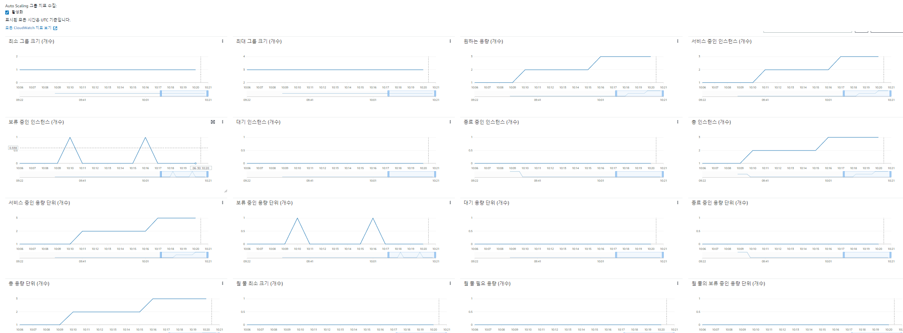
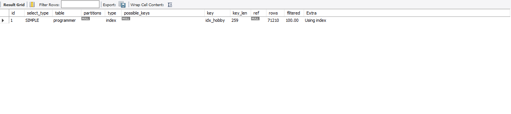
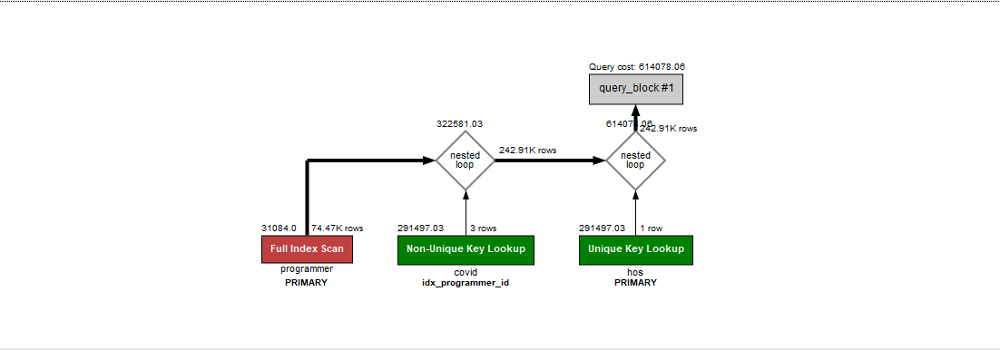
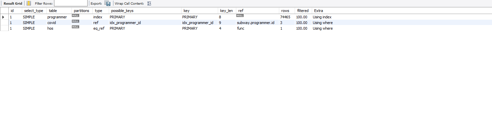
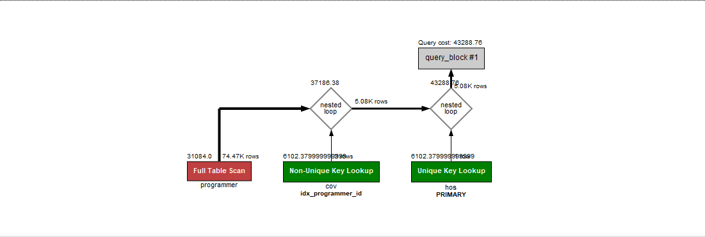
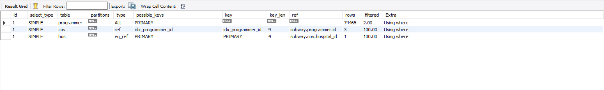
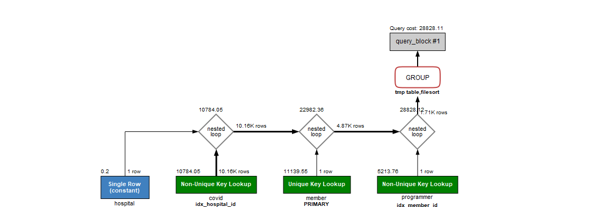
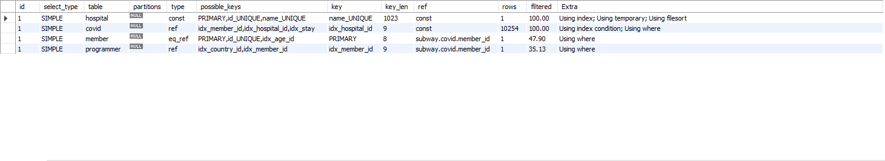
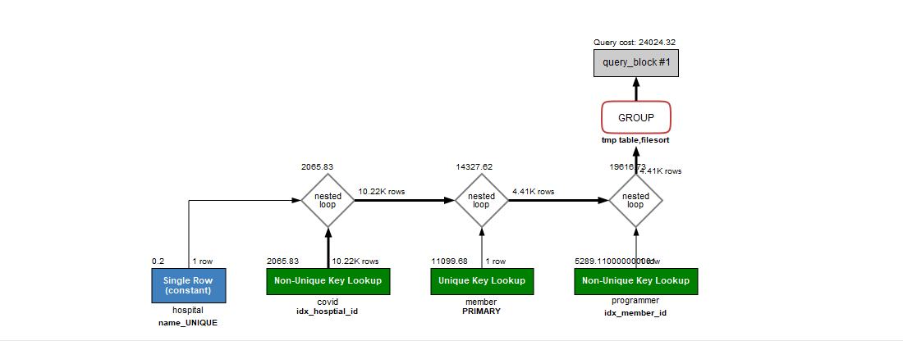
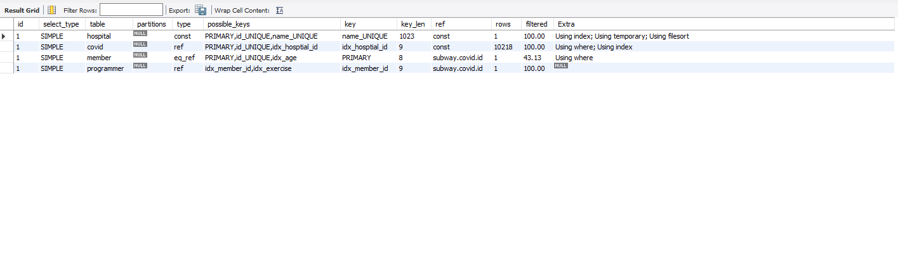

<p align="center">
    
</p>
<p align="center">
  
  
  <a href="https://edu.nextstep.camp/c/R89PYi5H" alt="nextstep atdd">
    
  </a>
  
</p>

<br>

# 인프라공방 샘플 서비스 - 지하철 노선도

<br>

## 🚀 Getting Started

### Install
#### npm 설치
```
cd frontend
npm install
```
> `frontend` 디렉토리에서 수행해야 합니다.

### Usage
#### webpack server 구동
```
npm run dev
```
#### application 구동
```
./gradlew clean build
```
<br>

## 미션

* 미션 진행 후에 아래 질문의 답을 작성하여 PR을 보내주세요.


### 1단계 - 화면 응답 개선하기
1. 성능 개선 결과를 공유해주세요 (Smoke, Load, Stress 테스트 결과)
- Before ([경로](result/before))
    - Http Request Duration 평균
        - Smoke  : 7.1ms
        - Load   : 7.65ms
        - Stress : 138.6ms
    - VUser 263 부터 오류발생
    - LightHouse
         | Desktop  | Lighthouse 성능    | FCP(s) | TTI(s) |
         | :------- | ------------------| ---------- | ----------- |
         | 메인      | 70                | 2.5        | 2.6         |
         | 역관리     | 42                | 2.6       | 3.5         |
         | 노선관리   | 68                | 2.6        | 2.8         |
         | 구간관리   | 65                | 3.0        | 3.2         |
         | 경로검색   | 66                | 2.7        | 2.8        | 
      
- After ([경로](result/after))
    - Http Request Duration 평균
        - Smoke  : 6.42ms (-약 9%)
        - Load   : 6.85ms (-약 10%)
        - Stress : 106.83ms (-약 20% )
    - VUser 258 부터 오류발생
        - LightHouse ()
          | Desktop  | Lighthouse 성능    | FCP(s) | TTI(s) |
          | :------- | ------------------| ---------- | ----------- |
          | 메인      | 97  (+20)         | 0.9        | 1.1         |
          | 역관리    | 70  (+28)          | 1.0        | 2.0         |
          | 노선관리   | 89  (+21)         | 1.0        | 1.5         |
          | 구간관리   | 94  (+29)          | 1.0        | 1.3         |
          | 경로검색   | 95  (+29)          | 1.0        | 1.3        |


2. 어떤 부분을 개선해보셨나요? 과정을 설명해주세요 

- Reverse Proxy 개선 - nginx Gzip encode 설정
    - LightHouse
      | Desktop  | Lighthouse 성능    | FCP(s) | TTI(s) |
      | :------- | ------------------| ---------- | ----------- |
      | 메인      | 93                | 1.2        | 1.3         |
      | 역관리     | 63               | 1.3        | 2.1         |
      | 노선관리   | 87                | 1.3        | 1.6         |
      | 구간관리   | 94                | 1.0        | 1.3         |
      | 경로검색   | 90                | 1.4        | 1.4        |

   - 메인페이지 기준 2.6 MB -> 648 KB 네트워크 전송 감소
   - Http Request Duration 평균 :  138 -> 130 ms (stress 기준)
    
- Reverse Proxy 개선 - cache & http2 설정
    - LightHouse
      | Desktop  | Lighthouse 성능    | FCP(s) | TTI(s) |
      | :------- | ------------------| ---------- | ----------- |
      | 메인      | 97                | 0.9        | 1.1         |
      | 역관리     | 70               | 1.0        | 2.0         |
      | 노선관리   | 95                | 1.0        | 1.3         |
      | 구간관리   | 94                | 1.0        | 1.3         |
      | 경로검색   | 95                | 1.0        | 1.3        |

  - Http Request Duration 평균 :  130 -> 116 ms (stress 기준)
    
- WAS 성능 개선하기 - Redis Cache 설정
    - 지하철, 노선, 즐겨찾기 목록 조회 및 구간 조회 Cache 설정
    - LightHouse
      | Desktop  | Lighthouse 성능    | FCP(s) | TTI(s) |
      | :------- | ------------------| ---------- | ----------- |
      | 메인      | 97                | 0.9        | 1.1         |
      | 역관리     | 70               | 1.0        | 2.0         |
      | 노선관리   | 89 (- 6)          | 1.0        | 1.5         |
      | 구간관리   | 94                | 1.0        | 1.3         |
      | 경로검색   | 95                | 1.0        | 1.3        | 

   - Http Request Duration 평균 :  116 -> 106 ms (stress 기준)
    
- 번외 
    - hikari connection-timeout 30 -> 10초, maximum-pool-size 20 -> 10 설정
    - Http Request Duration 평균 :  ~~106 -> 113 ms (stress 기준) 오히려 증가~~
      -> 재시도 1차 107ms, 2차 108ms 차이없는 것으로 정정
      -> Redis Cache를 사용하고 있어 DB Connection이 많지 않아 성능 차이 없는 것으로 확인
---

### 2단계 - 스케일 아웃

1. Launch Template 링크를 공유해주세요.
 - https://ap-northeast-2.console.aws.amazon.com/ec2/v2/home?region=ap-northeast-2#LaunchTemplateDetails:launchTemplateId=lt-07e9e261e1e67b04d

2. cpu 부하 실행 후 EC2 추가생성 결과를 공유해주세요. (Cloudwatch 캡쳐)
   
    
   
```sh
$ stress -c 2
```

3. 성능 개선 결과를 공유해주세요 (Smoke, Load, Stress 테스트 결과)
    - 결과 이미지(k6, grafana)([경로](step/3))
    - Http Request Duration 평균
        - Smoke  : 6.38ms
        - Load   : 5.93ms 
        - Stress : 7.32ms (auto scaling EC2 3대 기준)
    
0. 모든 정적 자원에 대해 no-cache, no-store 설정을 한다. 가능한가요?
   - 실제 사용은 가능하지만 CacheControl 클래스 특성상 no-cache, no-store 새로운 객체 반환하므로 설정 할 수 없다. 
     - no-cache : 캐시는 사용하나 사용할 때 마다 서버에 재검증이 필요
     - no-store : 캐시 사용하지 않음

---

### 1단계 - 쿼리 최적화

1. 인덱스 설정을 추가하지 않고 아래 요구사항에 대해 1s 이하(M1의 경우 2s)로 반환하도록 쿼리를 작성하세요.

- 활동중인(Active) 부서의 현재 부서관리자 중 연봉 상위 5위안에 드는 사람들이 최근에 각 지역별로 언제 퇴실했는지 조회해보세요. (사원번호, 이름, 연봉, 직급명, 지역, 입출입구분, 입출입시간)

```
    select top5.employee_id as 사원번호
           , top5.last_name as 이름
           , top5.annual_income as 연봉
           , top5.position_name as 직급명
           , rec.time as 입출입시간
           , rec.region as 지역
           , rec.record_symbol as 입출입구분 
    from (                
            select straight_join mgr.employee_id
            , emp.last_name
            , sal.annual_income
            , pos.position_name 
            from (select employee_id, department_id from manager where end_date > now()) mgr
                inner join (select id from department where upper(note) = 'ACTIVE') dep 
                    on mgr.department_id = dep.id
                inner join (select id, last_name from employee) emp 
                    on mgr.employee_id = emp.id 
                inner join (select id, position_name from position where end_date > now()) pos 
                    on mgr.employee_id = pos.id
                inner join (select id, annual_income from salary where end_date > now()) sal 
                    on mgr.employee_id = sal.id
            order by sal.annual_income desc limit 5
    ) top5 
        inner join record rec 
            on top5.employee_id = rec.employee_id
    where
        record_symbol = 'O';
```
- 피드백 쿼리 (query cost : 23132 )
```  
select e.id, 
		e.last_name, 
        high_salary.annual_income, 
        p.position_name, 
        r.time, 
        r.region, 
        r.record_symbol
from employee e
inner join (
			select 	s.id as employee_id,
					s.annual_income 
			from salary s
			where id in (
				select employee_id 
                from manager 
				where department_id in (SELECT id 
										FROM tuning.department 
										where note = 'Active')
				and start_date <= now()
				and end_date >= now()
			)
			and start_date <= now()
			and end_date >= now()
			order by s.annual_income desc limit 5
			) high_salary
	on high_salary.employee_id = e.id
inner join position p
	on p.id = e.id
	and p.start_date <= now()
	and p.end_date >= now()
inner join record r
	on r.employee_id = e.id
	and r.record_symbol = 'O';
```
- 비교, 분석
    - start_date 에 대한 조건 추가 : cost 354018 -> 141613  감소
    - from 절에 모든 inner join 처리하는 드라이빙 테이블의 position 테이블을 외부로 변경 : cost 14613 -> 23132
        - 드라이빙 테이블에서 처리하지 않아도 되는 부분을 바깥쪽 join 으로 분리시켜서 cost 감소시킬 수 있었음

---

### 2단계 - 인덱스 설계

1. 인덱스 적용해보기 실습을 진행해본 과정을 공유해주세요


#### Coding as a Hobby 와 같은 결과를 반환하세요.
 - 인덱스 설정 ( duration 0.172 sec -> 0.047 sec, cost : 28384 )

```
    ALTER TABLE `subway`.`programmer` ADD INDEX `idx_hobby` (`hobby` ASC);
    
    explain select 
      round(count(case when hobby = 'YES' then 1 end) / count(hobby)*100,1) as YES
    , round(count(case when hobby = 'NO' then 1 end) / count(hobby)*100,1) as NO
     from programmer;
     
```





#### 프로그래머별로 해당하는 병원 이름을 반환하세요. (covid.id, hospital.name)
- 인덱스 설정 ( duration 0.360 sec -> 0.016 sec, cost : 610143 )

```
    ALTER TABLE `subway`.`covid` CHANGE COLUMN `id` `id` BIGINT(20) NOT NULL, ADD PRIMARY KEY (`id`);
    ALTER TABLE `subway`.`programmer` CHANGE COLUMN `id` `id` BIGINT(20) NOT NULL, ADD PRIMARY KEY (`id`);
    ALTER TABLE `subway`.`hospital` CHANGE COLUMN `id` `id` INT(11) NOT NULL , ADD PRIMARY KEY (`id`);
    
    
    ALTER TABLE `subway`.`covid` ADD INDEX `idx_programmer_id` (`programmer_id` ASC);
    
    select cov.id, hos.name 
    from ( select id from programmer ) pro
     inner join ( select id, hospital_id, programmer_id from covid ) cov 
        on cov.programmer_id = pro.id
     inner join hospital hos
        on hos.id = cov.hospital_id;
```






#### 프로그래밍이 취미인 학생 혹은 주니어(0-2년)들이 다닌 병원 이름을 반환하고 user.id 기준으로 정렬하세요.  (covid.id, hospital.name, user.Hobby, user.DevType, user.YearsCoding)
- 인덱스 설정 ( duration 107 sec ->  0.016 sec, cost : 432880 )

```
    ALTER TABLE `subway`.`covid` CHANGE COLUMN `id` `id` BIGINT(20) NOT NULL, ADD PRIMARY KEY (`id`);
    ALTER TABLE `subway`.`programmer` CHANGE COLUMN `id` `id` BIGINT(20) NOT NULL, ADD PRIMARY KEY (`id`);
    ALTER TABLE `subway`.`hospital` CHANGE COLUMN `id` `id` INT(11) NOT NULL , ADD PRIMARY KEY (`id`);
    
    
    ALTER TABLE `subway`.`covid` ADD INDEX `idx_programmer_id` (`programmer_id` ASC);
    
    select cov.id, hos.name, user.hobby, user.dev_type, user.years_coding  
     from ( 
             select id, hobby, dev_type, years_coding from programmer
             where 1=1
             and hobby = 'Yes'
             and (student like 'Yes%' OR years_coding = '0-2 years')
     ) user
     inner join covid cov 
        on cov.programmer_id = user.id 
     inner join hospital hos 
        on hos.id = cov.hospital_id;
```






#### 서울대병원에 다닌 20대 India 환자들을 병원에 머문 기간별로 집계하세요. (covid.Stay)
- 인덱스 설정 ( duration 17 sec ->  0.031 sec, cost : 28844  )

```
    ALTER TABLE `subway`.`member` CHANGE COLUMN `id` `id` BIGINT(20) NOT NULL, ADD PRIMARY KEY (`id`), ADD UNIQUE INDEX `id_UNIQUE` (`id` ASC);
    ALTER TABLE `subway`.`programmer` CHANGE COLUMN `id` `id` BIGINT(20) NOT NULL , ADD PRIMARY KEY (`id`), ADD UNIQUE INDEX `id_UNIQUE` (`id` ASC);
    ALTER TABLE `subway`.`covid` CHANGE COLUMN `id` `id` BIGINT(20) NOT NULL , ADD PRIMARY KEY (`id`), ADD UNIQUE INDEX `id_UNIQUE` (`id` ASC);
    ALTER TABLE `subway`.`hospital` CHANGE COLUMN `id` `id` INT(11) NOT NULL , ADD PRIMARY KEY (`id`), ADD UNIQUE INDEX `id_UNIQUE` (`id` ASC);
    
    
    ALTER TABLE `subway`.`member` ADD INDEX `idx_age_id` (`age` ASC, `id` ASC);
    
    ALTER TABLE `subway`.`programmer` ADD INDEX `idx_country_id` (`country` ASC, `id` ASC);
    ALTER TABLE `subway`.`programmer` ADD INDEX `idx_member_id` (`member_id` ASC);
    
    ALTER TABLE `subway`.`covid` ADD INDEX `idx_member_id` (`member_id` ASC);
    ALTER TABLE `subway`.`covid` ADD INDEX `idx_hospital_id` (`hospital_id` ASC);
    ALTER TABLE `subway`.`covid` ADD INDEX `idx_stay` (`stay` ASC);
    
    ALTER TABLE `subway`.`hospital` ADD UNIQUE INDEX `name_UNIQUE` (`name` ASC);
    
    select cov.stay, count(cov.stay) 
    from ( select member_id, hospital_id, stay from covid ) cov
    inner join ( select id from member where age >= 20 and age <= 29 ) mem
        on mem.id = cov.member_id
    inner join ( select member_id from programmer where country = 'India' ) pro
        on pro.member_id = cov.member_id
    inner join ( select id from hospital where name = '서울대병원' ) hos
        on  hos.id = cov.hospital_id
    group by cov.stay;

``` 






#### 서울대병원에 다닌 30대 환자들을 운동 횟수별로 집계하세요. (user.Exercise)
- 인덱스 설정 ( duration 300 sec 이상 -> 0.031 sec, cost : 24024 )

```
    ALTER TABLE `subway`.`member` CHANGE COLUMN `id` `id` BIGINT(20) NOT NULL, ADD PRIMARY KEY (`id`), ADD UNIQUE INDEX `id_UNIQUE` (`id` ASC);
    ALTER TABLE `subway`.`programmer` CHANGE COLUMN `id` `id` BIGINT(20) NOT NULL , ADD PRIMARY KEY (`id`), ADD UNIQUE INDEX `id_UNIQUE` (`id` ASC);
    ALTER TABLE `subway`.`covid` CHANGE COLUMN `id` `id` BIGINT(20) NOT NULL , ADD PRIMARY KEY (`id`), ADD UNIQUE INDEX `id_UNIQUE` (`id` ASC);
    ALTER TABLE `subway`.`hospital` CHANGE COLUMN `id` `id` INT(11) NOT NULL , ADD PRIMARY KEY (`id`), ADD UNIQUE INDEX `id_UNIQUE` (`id` ASC);
    
    ALTER TABLE `subway`.`member` ADD INDEX `idx_age` (`age` ASC);
    
    ALTER TABLE `subway`.`programmer` ADD INDEX `idx_member_id` (`member_id` ASC);
    ALTER TABLE `subway`.`programmer` ADD INDEX `idx_exercise` (`exercise` ASC);
    
    ALTER TABLE `subway`.`covid` ADD INDEX `idx_hosptial_id` (`hospital_id` ASC);
    ALTER TABLE `subway`.`covid` ADD INDEX `idx_member_id` (`member_id` ASC);
    
    ALTER TABLE `subway`.`hospital` ADD UNIQUE INDEX `name_UNIQUE` (`name` ASC);
    
     select exercise, count(exercise)
     from (select id from member where age >= 30 AND age <= 39) mem
     inner join (select id, hospital_id from covid) cov
        on cov.id = mem.id
     inner join (select member_id, exercise from programmer) pro
        on pro.member_id = mem.id 
     inner join (select id from hospital where name = '서울대병원') hos
        on hos.id = cov.hospital_id
    group by exercise;

```






### 추가 미션

1. 페이징 쿼리를 적용한 API endpoint를 알려주세요
