<p align="center">
    
</p>
<p align="center">
  
  
  <a href="https://edu.nextstep.camp/c/R89PYi5H" alt="nextstep atdd">
    
  </a>
  
</p>

<br>

# 인프라공방 샘플 서비스 - 지하철 노선도

<br>

## 🚀 Getting Started

### Install
#### npm 설치
```
cd frontend
npm install
```
> `frontend` 디렉토리에서 수행해야 합니다.

### Usage
#### webpack server 구동
```
npm run dev
```
#### application 구동
```
./gradlew clean build
```
<br>

## 미션

* 미션 진행 후에 아래 질문의 답을 작성하여 PR을 보내주세요.


### 1단계 - 화면 응답 개선하기
1. 성능 개선 결과를 공유해주세요 (Smoke, Load, Stress 테스트 결과)
   * 아래의 내용 참고 부탁드립니다!
      - /docs/step1/performance_test : 테스트 결과 캡쳐
      - /docs/step1/step1.md : 개선 전 후 측정결과 비교


2. 어떤 부분을 개선해보셨나요? 과정을 설명해주세요
   * Reverse Proxy Server (nginx) 개선 항목
      1. gzip 압축
      2. chashing
      3. 프로토콜 개선 (HTTP 2.0)

   * WAS 개선 항목
      1. Redis 적용 (Spring Date chaching)


---

### 2단계 - 스케일 아웃

1. Launch Template 링크를 공유해주세요.
   - https://ap-northeast-2.console.aws.amazon.com/ec2/v2/home?region=ap-northeast-2#LaunchTemplateDetails:launchTemplateId=lt-01657876b79c51e31

2. cpu 부하 실행 후 EC2 추가생성 결과를 공유해주세요. (Cloudwatch 캡쳐)
   - /docs/step2/cloudwatch 디렉토리에 결과 넣어두었습니다!

3. 성능 개선 결과를 공유해주세요 (Smoke, Load, Stress 테스트 결과)
    - /docs/step2/performance_test2 디렉토리에 결과 넣어두었습니다!

---

### 3단계 - 쿼리 최적화

1. 인덱스 설정을 추가하지 않고 아래 요구사항에 대해 1s 이하(M1의 경우 2s)로 반환하도록 쿼리를 작성하세요.

- 활동중인(Active) 부서의 현재 부서관리자 중 연봉 상위 5위안에 드는 사람들이 최근에 각 지역별로 언제 퇴실했는지 조회해보세요.
  <br>(사원번호, 이름, 연봉, 직급명, 지역, 입출입구분, 입출입시간)
  <br>
  <br>
  - 조회 소요 시간 : 약 1.8s (M1 사용)
  - 작성 쿼리
    ```sql
      select
          te.id as '사원번호',
          concat(te.first_name,' ',te.last_name) as '이름',
          te.annual_income as '연봉',
          rcd.position_name as '직급명',
          rcd.region as '지역',
          rcd.time as '입출입구분'
      from
      (   select
              p.id,
              p.position_name,
              r.region,
              r.time
          from (select id, position_name from position where end_date >= now() or end_date is null) p
          inner join (select employee_id, region, time from record where record_symbol = 'O') r
          where p.id = r.employee_id
      ) rcd
      inner join
      (   select
              m.employee_id,
              s.annual_income,
              e.id,
              e.first_name,
              e.last_name
          from manager m
          inner join employee_department d
          inner join salary s
          inner join employee e
          where m.end_date >= now()
              and d.start_date <= now() and d.end_date >= now()
              and s.end_date >= now()
              and m.employee_id = d.employee_id
              and m.employee_id = s.id
              and m.employee_id = e.id
          order by s.annual_income desc
          limit 5
      ) te
      where rcd.id = te.employee_id
      order by te.id, region
      ;
    ```

  <br>
  
  - 최종적으로 아래의 2가지 쿼리를 두고 실행계획 비교해보고 2번째 쿼리를 선택했습니다
    - 현재는 두 쿼리가 소요시간에 큰 차이를 보이지는 않고 있으나
      <br>두번째 쿼리를 선택 이유는 첫번째 경우에 사원정보 테이블과 조인하면서 16.75ms가 추가되었으나
      <br>두번째 경우는 사원정보를 결과개수가 적은 5명을 구한 결과와 먼저 조인함으로써 (더 작은 드라이빙 테이블)
      <br>사원정보 조인에 걸리는 소요시간이 거의 추가되지 않아 더 나은 실행계획을 보였기 때문입니다
      <br>
      <br>

      1. 연봉순 5명 구한 결과 & 최종출력에 맞게 사원정보 조합했을 때
      
      <br>
      <br>

      2. 연봉순 5명 구한 후 employee 테이블과 조인한 결과 & 최종출력에 맞게 사원정보 조합했을 때
      


---

### 4단계 - 인덱스 설계

1. 인덱스 적용해보기 실습을 진행해본 과정을 공유해주세요
   <br><br>
   * 요구사항
   - [x] 주어진 데이터셋을 활용하여 아래 조회 결과를 100ms 이하로 반환
     - [x] M1의 경우엔 시간 제약사항을 달성하기 어렵습니다. 2배를 기준으로 해보시고 어렵다면, 일단 리뷰요청 부탁드려요
       - M1 mac 사용!
     - [x] Coding as a Hobby 와 같은 결과를 반환하세요.
       + 실행 쿼리
       ```sql
         select
           round(count(case when hobby='yes' then 1 end)/count(*)*100, 1) as 'yes',
           round(count(case when hobby='no' then 1 end)/count(*)*100, 1) as 'no'
         from programmer
       ```
       + 인덱싱
         ```
         programmer 테이블 : hobby
         ```
         - 진행 과정 및 결과
           + 인덱싱 전 실행계획
             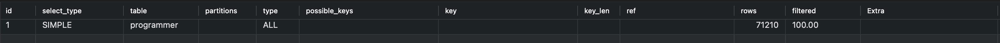
           + 인덱싱
             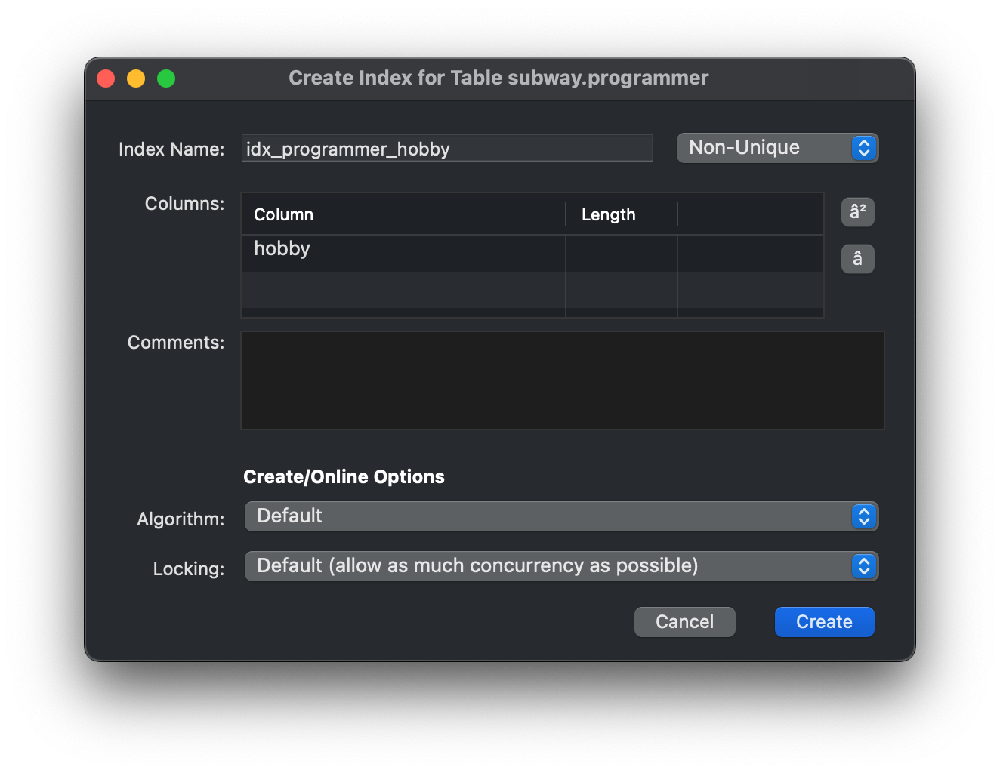
           + 인덱싱 후 실행계획
             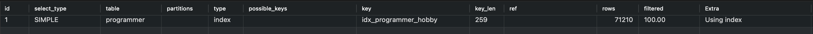
           + 인덱싱 전/후 조회 시간 비교
             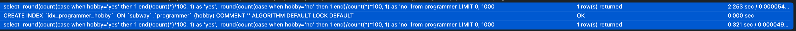
           > 조회 type이 All -> index 로 바뀐 것을 볼 수 있으며,
           <br> 조회 시간 2.228s -> 0.307s로 개선 되었습니다.

           <br><br><br>
     - [x] 프로그래머별로 해당하는 병원 이름을 반환하세요.
       <br>(covid.id, hospital.name)
       + 실행 쿼리
       ```sql
         select
           covid.id, hospital.name
         from programmer
         inner join covid
         inner join hospital
         where covid.programmer_id = programmer.id
           and covid.hospital_id = hospital.id
       ```
       + 인덱싱
         ```
         covid 테이블 : hospital_id & programmer_id
         programmer 테이블 : id
         ```
         - 진행 과정 및 결과
           + 인덱싱 전 실행계획
             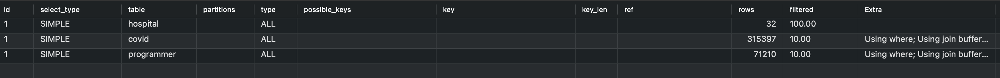
           + covid : hospital_id, programmer_id 인덱싱
             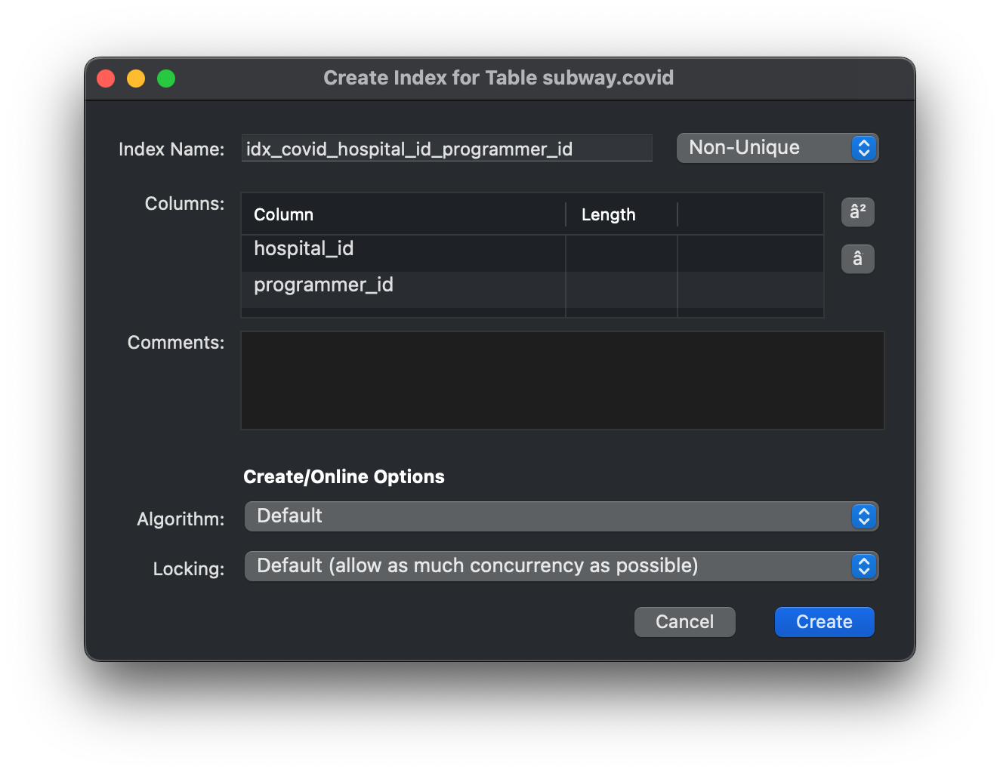
           + 인덱싱 후 실행계획
             
           + hospital : id 인덱싱
             - 처음에 전체를 조회해야하기 때문에 인덱싱이 효과 없을 것으로 예상
             
           + 인덱싱 후 실행계획
             - possible_keys에 id index가 표시되지만 사용되지 않는 것을 확인
             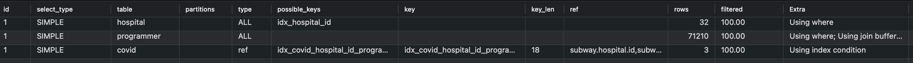
           + programmer : id 인덱싱
             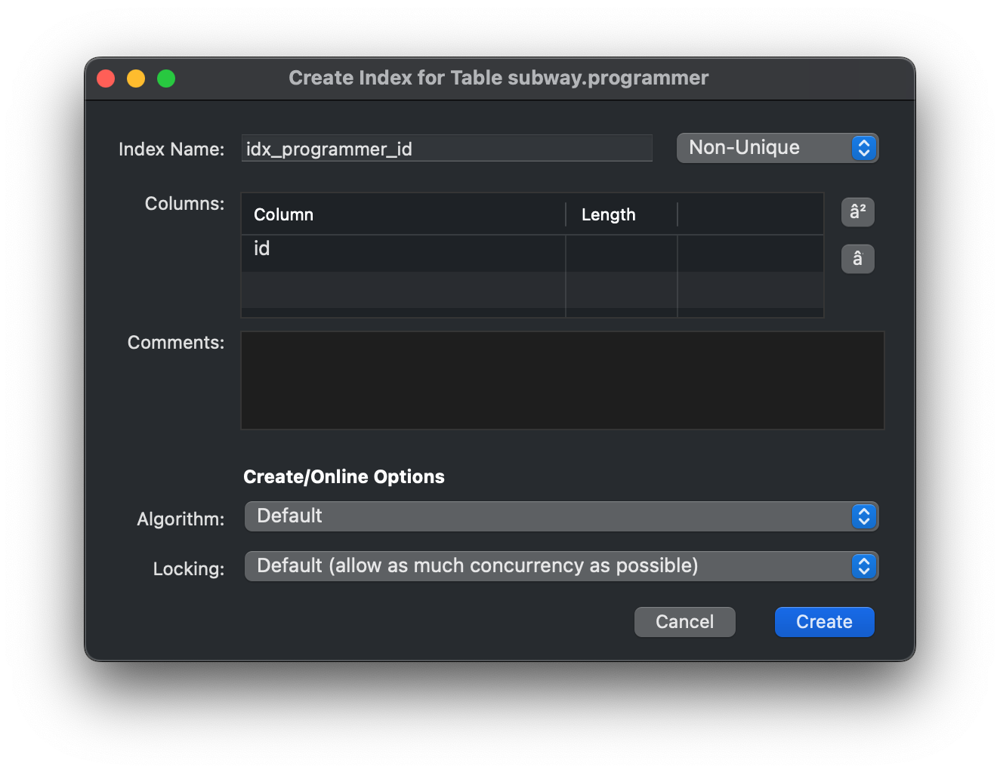
           + 인덱싱 후 실행계획
             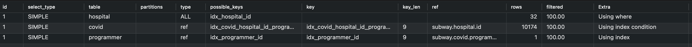
           + hospital : id 인덱스 drop 후 실행계획
             - 불필요한 인덱스 drop 후 실행계획 확인 (변화없음)
             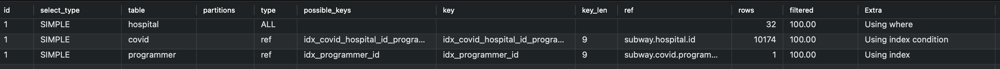
           + 인덱싱 전/후 조회 시간 비교
             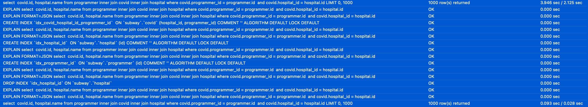
           > covid와 programmer 테이블 조회 type이 All -> ref 로 바뀐 것을 볼 수 있으며,
           <br> 조회 시간 3.946s -> 0.093s로 개선 되었습니다.

           <br><br><br>
     - [x] 프로그래밍이 취미인 학생 혹은 주니어(0-2년)들이 다닌 병원 이름을 반환하고 user.id 기준으로 정렬하세요.
       <br>(covid.id, hospital.name, user.Hobby, user.DevType, user.YearsCoding)
       + 실행 쿼리
       ```sql
         select
         p.id, hospital.name, p.Hobby, p.dev_type, p.years_coding
         from (select id, hobby, dev_type, years_coding from programmer
               where hobby='yes' and (student != 'no' or years_coding = '0-2 years')
               ) p
         inner join covid
         inner join hospital
         where covid.programmer_id = p.id
           and covid.hospital_id = hospital.id
         order by p.id
       ```
       + 인덱싱
         ```
         covid 테이블 : hospital_id & programmer_id
         programmer 테이블 : id (unique), hobby & student
         ```
         - 진행 과정 및 결과
           + 인덱싱 전 실행계획
             - 대기시간 초과로 쿼리 조회 시간 측정 실패
             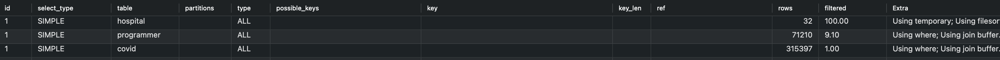
           + 인덱싱 후 실행계획
             - possible_keys에 id index가 표시되지만 사용되지 않는 것을 확인
             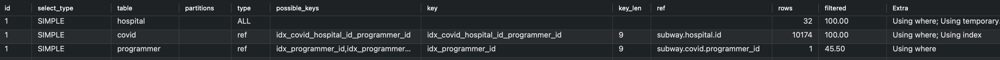
           + 인덱싱 후 조회 시간
             
           > covid와 programmer 테이블 조회 type이 All -> ref 로 바뀐 것을 볼 수 있으며,
           <br> 대기시간 초과로 인한 연결 끊김 -> 11.473s로 개선 되었습니다.
           <br> 이 부분은 여러 방법으로 쿼리 수정도 해보고 인덱스도 다르게 설정해보았으나
           <br> 더 이상 개선이 안되어 조회되지 않던 상태에서 조회됨에 의의를 두고자 합니다!

       <br><br><br>
     - [x] 서울대병원에 다닌 20대 India 환자들을 병원에 머문 기간별로 집계하세요. (covid.Stay)
       + 실행 쿼리
       ```sql
         select
           c.stay as '머문 기간',
           count(*) as '환자 수'
         from (select id from hospital where name = '서울대병원') h
         inner join (select id from programmer where country = 'India') p
         inner join (select id from member where age between 20 and 29) m
         inner join covid c
         on h.id = c.hospital_id
           and c.member_id = m.id
           and c.programmer_id = p.id
         group by c.stay
       ```
       + 인덱싱
         ```
         covid 테이블 : hospital_id & programmer_id
         programmer 테이블 : id
         hospital 테이블 : id (unique)
         programmer 테이블 : country
         member 테이블 : id (unique), id & age (unique)
         ```
         - 진행 과정 및 결과
           + 인덱싱 전 실행계획
             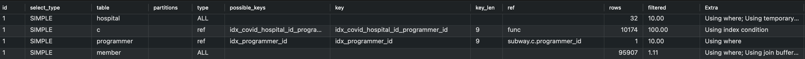
           + 인덱싱 후 실행계획
             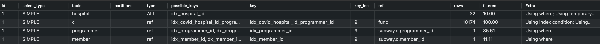
           + 인덱싱 전/후 조회 시간 비교
             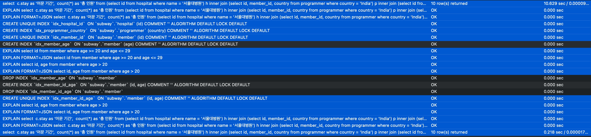
           > member 테이블 조회 type이 All -> ref 로 바뀐 것을 볼 수 있으며,
           <br> 조회 시간 10.629s -> 0.218s로 개선 되었습니다.

           <br><br><br>

     - [x] 서울대병원에 다닌 30대 환자들을 운동 횟수별로 집계하세요. (user.Exercise)
       + 실행 쿼리
       ```sql
         select
           p.exercise as '운동횟수',
           count(*) as '환자 수'
         from (select id from hospital where name = '서울대병원') h
         inner join programmer p
         inner join (select id from member where age between 30 and 39) m
         inner join covid c
         on h.id = c.hospital_id
           and c.member_id = m.id
           and p.member_id = m.id
           and c.programmer_id = p.id
         group by c.member_id, p.exercise
       ```
       + 인덱싱
         ```
         covid 테이블 : hospital_id & programmer_id & member_id
         programmer 테이블 : id (unique)
         member 테이블 : id (unique), id & age (unique)
         ```
         - 진행 과정 및 결과
           + 인덱싱 전 실행계획
             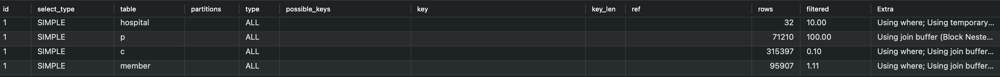
           + 인덱싱 후 실행계획
             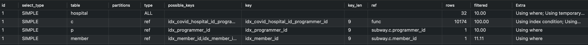
           + 인덱싱 후 조회 시간
             - 인덱싱 전에는 너무 오래걸려서 연결이 끊어짐
             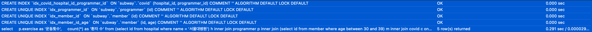
           + 추가 인덱싱 후 실행계획
             - 이전 단계에서 적용하던 것과 같이 hospital_id & programmer_id 조합으로 인덱스 생성했으나
             <br>member테이블과도 조인이 추가로 이루어지고 있는 상황이므로 hospital_id & programmer_id & member_id 인덱스 추가
             - 실행계획에서 새로 만든 인덱스 사용되는 것 확인 가능
               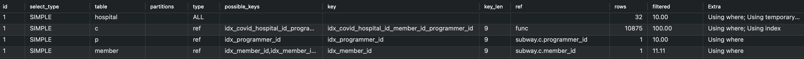
           + 추가 인덱싱 후 조회 시간
             
           > Programmer, member, covid 테이블 조회 type이 All -> ref 로 바뀐 것을 볼 수 있으며,
           <br> 대기시간 초과로 인한 연결 끊김 -> 0.291s -> 0.200s로 개선 되었습니다.
   
   <br><br>

---

### 추가 미션

1. 페이징 쿼리를 적용한 API endpoint를 알려주세요
