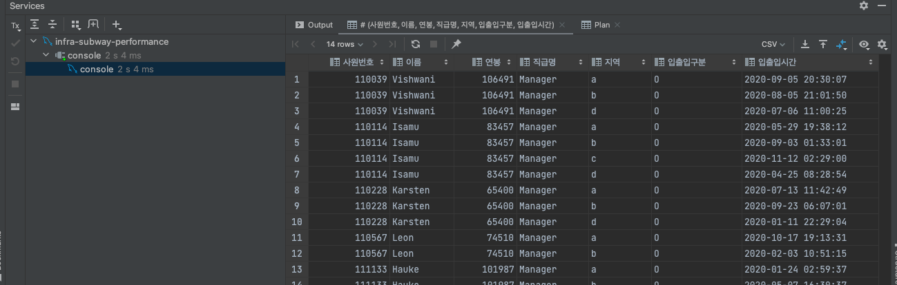
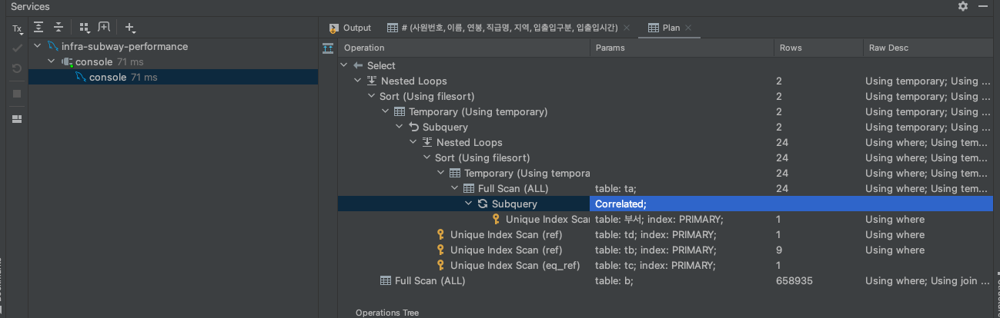
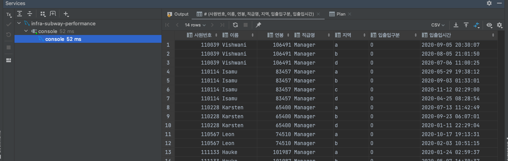
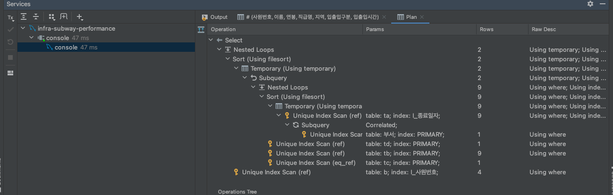

<p align="center">
    
</p>
<p align="center">
  
  
  <a href="https://edu.nextstep.camp/c/R89PYi5H" alt="nextstep atdd">
    
  </a>
  
</p>

<br>

# 인프라공방 샘플 서비스 - 지하철 노선도

<br>

## 🚀 Getting Started

### Install

#### npm 설치

```
cd frontend
npm install
```

> `frontend` 디렉토리에서 수행해야 합니다.

### Usage

#### webpack server 구동

```
npm run dev
```

#### application 구동

```
./gradlew clean build
```

<br>

## 미션

* 미션 진행 후에 아래 질문의 답을 작성하여 PR을 보내주세요.

### 1단계 - 화면 응답 개선하기

1. 성능 개선 결과를 공유해주세요 (Smoke, Load, Stress 테스트 결과)

2. 어떤 부분을 개선해보셨나요? 과정을 설명해주세요

---

### 2단계 - 조회 성능 개선하기

- 환경
    - m1 맥
    - docker
        - mysql 5.7.32

1. 인덱스 적용해보기 실습을 진행해본 과정을 공유해주세요

#### A. 쿼리 최적화

- 쿼리 작성만으로 1s 이하로 반환한다.

```sql
select a.사원번호, a.이름, a.연봉, a.직급명, b.지역, b.입출입구분, max(b.입출입시간) as 입출입시간
from (
         select ta.사원번호, tb.연봉, tc.이름, td.직급명
         from 부서관리자 ta
                  join 급여 tb
                       on ta.사원번호 = tb.사원번호
                  inner join 사원 tc
                             on ta.사원번호 = tc.사원번호
                  inner join 직급 td
                             on ta.사원번호 = td.사원번호
                                 and td.종료일자 = '9999-01-01'
         where ta.종료일자 = '9999-01-01'
           and tb.종료일자 = '9999-01-01'
           and exists(select 1
                      from 부서
                      where 비고 = 'ACTIVE'
                        and ta.부서번호
                          = 부서.부서번호)
         order by tb.연봉 desc limit 5) a
         inner join 사원출입기록 b
                    on a.사원번호 = b.사원번호
where 입출입구분 = 'O'
group by a.사원번호, a.이름, a.연봉, a.직급명, b.지역, b.입출입구분;
```





- 인덱스 설정을 추가하여 50 ms 이하로 반환한다.
    - I_사원번호 index 사원출입기록 (사원번호 ASC)
    - I_비고 index 부서 (비고 ASC)





#### B. 인덱스 설계

- Coding as a Hobby 와 같은 결과를 반환하세요.

```sql
create index I_hobby
    on programmer (hobby);

alter table programmer
    add constraint programmer_pk
        primary key (id);

select sum(IF(hobby = 'Yes', 1, 0)) / count(hobby) * 100 as yes_rate
     , sum(IF(hobby = 'No', 1, 0)) / count(hobby) * 100  as no_rate
from programmer;
```

- 프로그래머별로 해당하는 병원 이름을 반환하세요. (covid.id, hospital.name)

```sql
alter table covid
    add constraint covid_pk
        primary key (id);

alter table hospital
    add constraint hospital_pk
        primary key (id);

create index I_hospital
    on covid (hospital_id);

create index I_programmer
    on covid (programmer_id);

select p.id, h.name
from programmer p
         left join covid c on p.id = c.programmer_id
         left join hospital h on h.id = c.hospital_id
where c.id is not null
```

- 프로그래밍이 취미인 학생 혹은 주니어(0-2년)들이 다닌 병원 이름을 반환하고 user.id 기준으로 정렬하세요. (covid.id, hospital.name, user.Hobby, user.DevType,
  user.YearsCoding)

```sql
select p.id, h.name, p.hobby, p.dev_type, p.years_coding
from programmer p
         left outer join covid c on p.id = c.programmer_id
         left outer join hospital h on c.hospital_id = h.id
where (hobby = 'Yes' and dev_type = 'Student')
   or years_coding = '0-2 years'
order by p.id
```

- 서울대병원에 다닌 20대 India 환자들을 병원에 머문 기간별로 집계하세요. (covid.Stay)

```sql
alter table hospital
    modify name VARCHAR (100) null;

create index I_name
    on hospital (name);

create index I_age
    on member (age);

create index I_country
    on programmer (country);

select c.stay, count(m.id) as 'count'
from hospital h
         left outer join covid c on h.id = c.hospital_id
         left outer join programmer p on c.programmer_id = p.id
         left outer join member m on m.id = c.member_id
where h.name = '서울대병원'
  and p.country = 'India'
  and m.age between 20 and 29
group by c.stay
```

- 서울대병원에 다닌 30대 환자들을 운동 횟수별로 집계하세요. (user.Exercise)

```sql
alter table programmer
    modify exercise varchar (200) null;

create index I_exercise
    on programmer (exercise);

select p.exercise, count(p.id) as 'count'
from hospital h
         left outer join covid c on h.id = c.hospital_id
         left outer join programmer p on c.programmer_id = p.id
         left outer join member m on m.id = c.member_id
where h.name = '서울대병원'
  and m.age between 30 and 39
group by p.exercise;
```

2. 페이징 쿼리를 적용한 API endpoint를 알려주세요

- https://devsigner9920.n-e.kr/stations

```http request
GET /stations HTTP/1.1
Host: devsigner9920.n-e.kr
```

```json
{
  "content": [
    {
      "id": 26,
      "name": "강남역",
      "createdDate": "2021-12-29T07:40:40.04",
      "modifiedDate": "2021-12-29T07:40:40.04"
    },
    {
      "id": 25,
      "name": "testStation13",
      "createdDate": "2021-12-29T07:40:07.113",
      "modifiedDate": "2021-12-29T07:40:07.113"
    },
    {
      "id": 24,
      "name": "testStation12",
      "createdDate": "2021-12-29T07:40:06.285",
      "modifiedDate": "2021-12-29T07:40:06.285"
    },
    {
      "id": 23,
      "name": "testStation11",
      "createdDate": "2021-12-29T07:40:05.067",
      "modifiedDate": "2021-12-29T07:40:05.067"
    },
    {
      "id": 22,
      "name": "testStation10",
      "createdDate": "2021-12-29T07:40:03.798",
      "modifiedDate": "2021-12-29T07:40:03.798"
    }
  ],
  "pageable": {
    "sort": {
      "unsorted": false,
      "sorted": true,
      "empty": false
    },
    "pageNumber": 0,
    "pageSize": 5,
    "offset": 0,
    "paged": true,
    "unpaged": false
  },
  "totalElements": 26,
  "totalPages": 6,
  "last": false,
  "sort": {
    "unsorted": false,
    "sorted": true,
    "empty": false
  },
  "numberOfElements": 5,
  "first": true,
  "size": 5,
  "number": 0,
  "empty": false
}
```

```http request
GET /stations?page=5 HTTP/1.1
Host: devsigner9920.n-e.kr
```

```json
{
  "content": [
    {
      "id": 1,
      "name": "1",
      "createdDate": "2021-12-29T07:39:38.258",
      "modifiedDate": "2021-12-29T07:39:38.258"
    }
  ],
  "pageable": {
    "sort": {
      "unsorted": false,
      "sorted": true,
      "empty": false
    },
    "pageNumber": 5,
    "pageSize": 5,
    "offset": 25,
    "paged": true,
    "unpaged": false
  },
  "totalElements": 26,
  "totalPages": 6,
  "last": true,
  "sort": {
    "unsorted": false,
    "sorted": true,
    "empty": false
  },
  "numberOfElements": 1,
  "first": false,
  "size": 5,
  "number": 5,
  "empty": false
}
```
