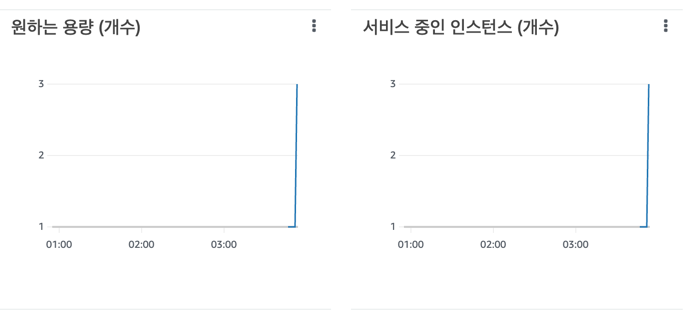
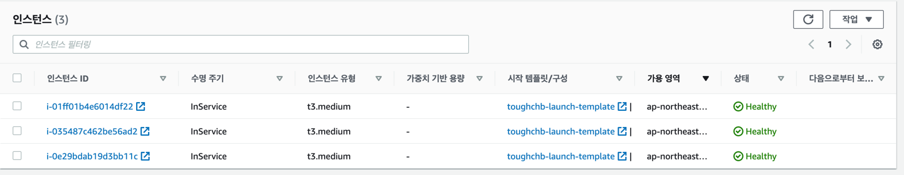
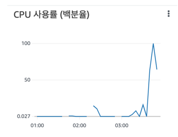
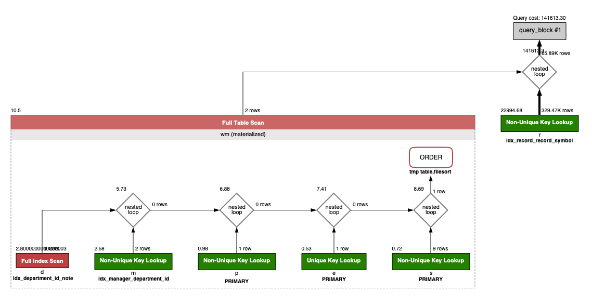
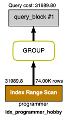
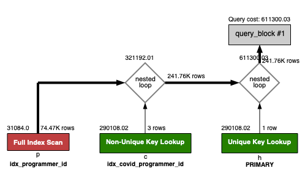
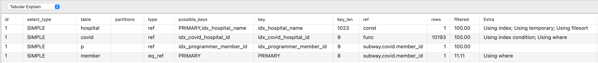

<p align="center">
    
</p>
<p align="center">
  
  
  <a href="https://edu.nextstep.camp/c/R89PYi5H" alt="nextstep atdd">
    
  </a>
  
</p>

<br>

# 인프라공방 샘플 서비스 - 지하철 노선도

<br>

## 🚀 Getting Started

### Install

#### npm 설치

```
cd frontend
npm install
```

> `frontend` 디렉토리에서 수행해야 합니다.

### Usage

#### webpack server 구동

```
npm run dev
```

#### application 구동

```
./gradlew clean build
```

<br>

## 미션

* 미션 진행 후에 아래 질문의 답을 작성하여 PR을 보내주세요.

### 1단계 - 화면 응답 개선하기

1. 성능 개선 결과를 공유해주세요 (Smoke, Load, Stress 테스트 결과)

- http_req_duration 기준

* Smoke Test
    - before : max=26.8ms
    - after : max=5.39ms
    - **약 79.8% 향상**

* Load Test
    - before : max=410.86ms
    - after :max=31.53ms
    - **약 92.3% 향상**

* stress
    - before : max=1.83s
    - after : max=1.03s
    - **43.7% 향상**

2. 어떤 부분을 개선해보셨나요? 과정을 설명해주세요

- nginx 설정
    - gzip 압축
    - cache 설정
    - http2 설정

- Was 성능 개선
    - redis 캐시 적용

---

### 2단계 - 스케일 아웃

#### 미션 요구사항

- [x] 모든 정적 자원에 대해 no-cache, private 설정을 하고 테스트 코드를 통해 검증합니다.
- [x] 확장자는 css인 경우는 max-age를 1년, js인 경우는 no-cache, private 설정을 합니다.
- 모든 정적 자원에 대해 no-cache, no-store 설정을 한다. 가능한가요?
  만약 원하는 동작이 브라우저에게 캐시를 확실히 무효화 시키고 싶을때는 아래와 같이 사용 가능 합니다.
- Cache-Control: no-cache, no-store, must-revalidate
    - 확실한 캐시 무효화 응답

- Cache-Control: no-cache
    - 데이터는 캐시해도 되지만, 항상 원 서버에 검증하고 사용
- Cache-Control: no-store
    - 데이터에 민감한 정보가 있으므로 저장하면 안됨
- Cache-Control: must-revalidate
    - 캐시 만료후 최초 조회시 원 서버에 검증해야함
    - 원 서버 접근 실패시 반드시 오류가 발생해야함 - 504(Gateway Timeout)
    - must-revalidate는 캐시 유효 시간이라면 캐시를 사용함

- [x] springboot에 HTTP Cache, gzip 설정하기
- [x] Launch Template 작성하기
- [x] Auto Scaling Group 생성하기
- [x] Smoke, Load, Stress 테스트 후 결과를 기록

1. Launch Template 링크를 공유해주세요.
   https://ap-northeast-2.console.aws.amazon.com/ec2/v2/home?region=ap-northeast-2#LaunchTemplateDetails:launchTemplateId=lt-0dff23b666dae89f6

2. cpu 부하 실행 후 EC2 추가생성 결과를 공유해주세요. (Cloudwatch 캡쳐)
   
   
   

```sh
$ stress -c 2
```

3. 성능 개선 결과를 공유해주세요 (Smoke, Load, Stress 테스트 결과)
    - [smoke rsult](testresult/asg_result/smoke_result.txt)
    - [load rsult](testresult/asg_result/load_result.txt)
    - [stress rsult](testresult/asg_result/stress_result.txt)

---

### 1단계 - 쿼리 최적화

1. 인덱스 설정을 추가하지 않고 아래 요구사항에 대해 1s 이하(M1의 경우 2s)로 반환하도록 쿼리를 작성하세요.

- 활동중인(Active) 부서의 현재 부서관리자 중 연봉 상위 5위안에 드는 사람들이 최근에 각 지역별로 언제 퇴실했는지 조회해보세요. (사원번호, 이름, 연봉, 직급명, 지역, 입출입구분, 입출입시간)

```sql
select wm.id            as 사원번호,
       wm.name          as 이름,
       wm.income        as 연봉,
       wm.position_name as 직급명,
       r.time           as 입출입시간,
       r.region         as 지역,
       r.record_symbol  as 입출입구분
from record r
         inner join(select e.id            as id,
                           e.last_name     as name,
                           p.position_name as position_name,
                           s.annual_income as income
                    from manager m
                             inner join salary s on m.employee_id = s.id and s.end_date > now()
                             inner join department d on m.department_id = d.id and d.note = 'active'
                             inner join employee e on m.employee_id = e.id and m.end_date > now()
                             inner join position p
                                        on m.employee_id = p.id and p.end_date > now() and p.position_name = 'Manager'
                    order by s.annual_income desc limit 5) wm
                   on r.employee_id = wm.id and r.record_symbol = 'O';

```

**Duration/Fetch Time**
0.334 sec / 0.000012 sec

실행계획


---

### 2단계 - 인덱스 설계

1. 인덱스 적용해보기 실습을 진행해본 과정을 공유해주세요

### 1. Coding as a Hobby 와 같은 결과를 반환하세요.

```mysql
select hobby as '취미', round(count(*) / (select count(*) from programmer) * 100, 1) as 'percent'
from programmer where hobby = 'Yes' or hobby = 'No'
group by hobby;
```

#### 개선전  
Duration/Fetch Time : 0.477 sec / 0.000021 sec

#### 개선 작업
```mysql
CREATE INDEX `idx_programmer_hobby` ON `subway`.`programmer` (hobby);
```

#### 개선 후 : 0.062 sec / 0.000022 sec


### 2. 프로그래머별로 해당하는 병원 이름을 반환하세요. (covid.id, hospital.name)

#### 실행 쿼리
```mysql
select c.id, h.name
from hospital h
         inner join covid c on h.id = c.hospital_id
         inner join programmer p on p.id = c.programmer_id;
```

#### 개선전
Duration/Fetch Time : 0.712 sec / 0.378 sec
#### 개선 작업
```mysql
alter table `covid` add primary key(id);
alter table `programmer` add primary key (id);
alter table `hospital` add primary key (id);
CREATE INDEX `idx_covid_hospital_id`  ON `subway`.`covid` (hospital_id) ;
CREATE INDEX `idx_covid_programmer_id`  ON `subway`.`covid` (programmer_id) ;
```

#### 개선후
Duration/Fetch Time : 0.011 sec / 0.00045 sec


### 3. 프로그래밍이 취미인 학생 혹은 주니어(0-2년)들이 다닌 병원 이름을 반환하고 user.id 기준으로 정렬하세요.
  (covid.id, hospital.name, user.Hobby, user.DevType, user.YearsCoding)

#### 실행 쿼리
```mysql
select c.id, h.name
from (select p.id as id
      from programmer p
      where (hobby = 'Yes' and student like 'Yes%')
         or years_coding = '0-2 years') user
inner join covid c
on c.programmer_id = user.id
    inner join hospital h on h.id = c.hospital_id
order by user.id;
```

#### 개선 작업
```mysql
alter table `covid` add primary key(id);
alter table `programmer` add primary key (id);
alter table `hospital` add primary key (id);
CREATE INDEX `idx_covid_hospital_id`  ON `subway`.`covid` (hospital_id) ;
CREATE INDEX `idx_covid_programmer_id`  ON `subway`.`covid` (programmer_id) ;
CREATE INDEX `idx_programmer_hobby_student_years_coding`  ON `subway`.`programmer` (hobby, student, years_coding) ;
```
개선 후
0.011 sec / 0.0053 sec


### 4. 서울대병원에 다닌 20대 India 환자들을 병원에 머문 기간별로 집계하세요. (covid.Stay)

#### 실행 쿼리
```mysql
select c.stay, count(c.stay)
from covid c
         inner join
         (select id from `member` where age between 20 and 29) m
         on c.member_id = m.id
         inner join programmer p on c.programmer_id = p.id and p.country = 'India'
         inner join hospital h on c.hospital_id = h.id and h.name = '서울대병원'
group by c.stay;
```

#### 개선 작업
```mysql
alter table `covid` add primary key(id);
alter table `programmer` add primary key (id);
alter table `hospital` add primary key (id);
alter table `member` add primary key(id);
CREATE INDEX `idx_covid_hospital_id`  ON `subway`.`covid` (`hospital_id`) ;
CREATE INDEX `idx_covid_programmer_id`  ON `subway`.`covid` (`programmer_id`) ;
CREATE INDEX `idx_member_age`  ON `subway`.`member` (`age`) ;
CREATE INDEX `idx_hospital_name`  ON `subway`.`hospital` (`name`) ;
CREATE INDEX `idx_programmer_country`  ON `subway`.`programmer` (`country`) ;
```
#### 개선 후
0.056 sec / 0.000023 sec


### 5. 서울대병원에 다닌 30대 환자들을 운동 횟수별로 집계하세요. (user.Exercise)

#### 실행 쿼리
```mysql
select p.exercise as '운동 횟수', count(p.exercise) as '집계'
from (select id, age from member where age between 30 and 39) m
         inner join
         (select id, hospital_id, member_id from covid) c
         on c.member_id = m.id
         inner join
         (select id from hospital where name = '서울대병원') h
         on c.hospital_id = h.id
         inner join programmer p on p.member_id = m.id
group by p.exercise;
```
#### 개선 작업

```mysql
alter table `covid` add primary key(`id`);
alter table `programmer` add primary key (`id`);
alter table `hospital` add primary key (`id`);
alter table `member` add primary key(`id`);
CREATE INDEX `idx_covid_hospital_id`  ON `subway`.`covid` (`hospital_id`) ;
CREATE INDEX `idx_hospital_name`  ON `subway`.`hospital` (`name`) ;
CREATE INDEX `idx_programmer_member_id`  ON `subway`.`programmer` (`member_id`) ;
```
#### 개선 후
0.062 sec / 0.000015 sec


---

### 추가 미션

1. 페이징 쿼리를 적용한 API endpoint를 알려주세요
